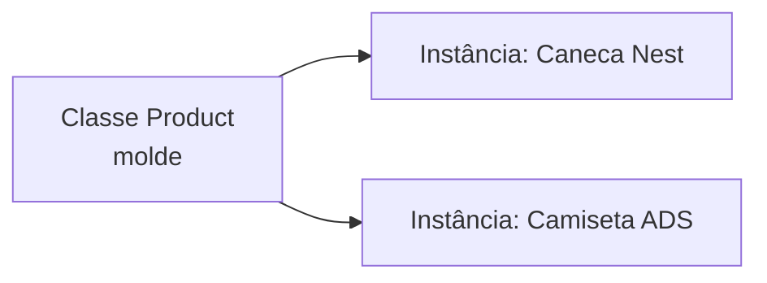

# TypeScript para NestJS

> *Episódio zero: os óculos para ler o `loja-api`.*

## Objetivo deste material

Ao terminar, você deve conseguir **abrir um arquivo NestJS** (controller, service, DTO) e **explicar o que cada construção TypeScript está fazendo** — tipagem, classes, decorators, `async`/`Promise`, `Partial`, etc.

Este texto **não** é um curso completo de TypeScript. É o vocabulário mínimo para ler o restante do material em `backend/nest/` com segurança.

**Pré-requisito:** JavaScript básico (funções, objetos literais `{ ... }`, `async`/`await`, módulos `import`/`export`). **Não** é necessário já ter cursado orientação a objetos — a seção 4 introduz classes do zero.

**Base geral de TypeScript (opcional):** [Tutorial sobre TypeScript](../typescript.md) — fundamentação, setup e catálogo mais amplo de recursos.

**Próximo passo:** [Introdução ao NestJS](1.introducao_nestjs.md).

------

## 1. O mapa: o que o NestJS é em TypeScript

No Nest, quase tudo se resume a três ideias:

1. **Classes** organizam o código (controller, service, module) — se a ideia for nova, vá direto à [seção 4](#4-o-que-é-uma-classe-sem-precisar-de-oo-antes).
2. **Decorators** (`@Algo`) anotam classes, métodos e parâmetros — o framework lê essas anotações.
3. **Tipos** documentam e checam contratos (corpo da requisição, retorno do service, etc.).

Olhe este trecho (estilo Nest — no `loja-api` será o módulo de **produtos**). Não precisa decorar de cor ainda — só reconheça as peças:

```typescript
import { Controller, Get, Post, Body, Param } from '@nestjs/common';
import { ProductsService } from './products.service';
import { CreateProductDto } from './dto/create-product.dto';

@Controller('products')
export class ProductsController {
  constructor(private readonly productsService: ProductsService) {}

  @Get(':id')
  findOne(@Param('id') id: string): Promise<Product | null> {
    return this.productsService.findById(id);
  }

  @Post()
  create(@Body() dto: CreateProductDto): Promise<Product> {
    return this.productsService.create(dto);
  }
}
```

| Trecho | O que é (TypeScript / Nest) |
|--------|-----------------------------|
| `import { ... } from '...'` | Módulo ES: traz símbolos de outro arquivo/pacote |
| `@Controller('products')` | Decorator de **classe** (Nest: marca a classe como controller) |
| `export class ProductsController` | Classe exportada para outros arquivos usarem |
| `constructor(private readonly productsService: ProductsService)` | Parameter property + tipo da dependência |
| `@Get(':id')` | Decorator de **método** (Nest: rota HTTP GET) |
| `@Param('id') id: string` | Decorator de **parâmetro** + tipo do valor |
| `Promise<Product \| null>` | Retorno assíncrono tipado |
| `CreateProductDto` | Tipo/classe que descreve o corpo da requisição |

**Checkpoint:** sem olhar a tabela, diga em uma frase o que significa `private readonly productsService: ProductsService` no construtor. (Resposta na seção 5.)

> No restante deste capítulo, o domínio âncora é **Product** (como no `loja-api`). No cap. 6 o mesmo padrão de TypeScript aparece em auth (`AuthController`, etc.).

------

## 2. Tipagem do dia a dia

TypeScript adiciona **tipos em tempo de compilação**. O código que roda no Node continua sendo JavaScript; o compilador (e a IDE) avisam erros **antes** de executar.

### Tipos primitivos e funções

```typescript
let idade: number = 25;
let ativo: boolean = true;
let nome: string = 'Maria';

function somar(a: number, b: number): number {
  return a + b;
}

// idade = 'vinte'; // erro de tipo na compilação
```

Se o tipo for óbvio, o TypeScript **infere**:

```typescript
const total = somar(2, 3); // total é number
```

### Objetos, opcional (`?`) e união (`|`)

```typescript
type Usuario = {
  id: number;
  nome: string;
  email?: string; // pode existir ou não
};

function buscar(id: number): Usuario | null {
  // ... consulta
  return null; // explícito: às vezes não acha
}
```

- `email?` → propriedade opcional.
- `Usuario | null` → o valor é um ou o outro (muito comum em buscas).
- `?.` (optional chaining) evita erro se o valor for `undefined`/`null`:

```typescript
const config = { tema: 'escuro' };
console.log(config.notificacoes?.toString()); // undefined, sem crash
```

### Por que isso importa no Nest

Nos controllers você verá assinaturas como:

```typescript
findById(id: string): Promise<Product | null>
```

Isso diz: “é assíncrono; o resultado pode ser um `Product` ou `null`”. Você sabe que precisa tratar o caso “não encontrado”.

**Checkpoint:** o que a assinatura `criar(dados: { nome: string; idade?: number }): string` garante e o que ela **não** garante em tempo de execução HTTP? (Tipos TypeScript não validam o JSON da requisição sozinhos — no Nest isso costuma ser feito com pipes/validators em cima de DTOs.)

------

## 3. Interfaces, types e DTOs

### `interface` e `type`

Ambos descrevem a **forma** de um dado. Para leitura de Nest, trate-os como contratos:

```typescript
interface CreateProductDto {
  name: string;
  price: number;
  stock?: number;
}

// equivalente com type:
type CreateProductDtoAlt = {
  name: string;
  price: number;
  stock?: number;
};
```

```typescript
function createProduct(dto: CreateProductDto): void {
  console.log(dto.name, dto.price);
}
```

### No Nest, DTO costuma ser **classe**

Interfaces somem em tempo de execução. O Nest (com `class-validator` / `ValidationPipe`) precisa de uma **classe** para validar o corpo da requisição.

> Se a palavra **classe** ainda for nova para você, leia a **seção 4** e depois volte aqui.

```typescript
export class CreateProductDto {
  name: string;
  price: number;
  stock?: number;
}
```

Uso típico:

```typescript
@Post()
create(@Body() dto: CreateProductDto) {
  return this.productsService.create(dto);
}
```

> No cap. 6 o mesmo padrão aparece em DTOs de auth (`LoginDto`, etc.).

- `@Body()` → Nest injeta o corpo da requisição nesse parâmetro.
- `CreateProductDto` → o tipo (e, com validação configurada, a classe validável).

**Regra prática:** use `interface`/`type` para contratos internos; em entrada HTTP do Nest, espere **classes DTO**.

**Aprofundamento (depois dos controllers):** [DTOs e validação de entrada](2.1.dtos-e-validacao.md) — `class-validator`, `class-transformer`, mensagens e exemplos por verbo HTTP.

------

## 4. O que é uma classe (sem precisar de OO antes)

No Nest (e no TypeScript em geral) você vai ver `class` o tempo todo. Esta seção explica a ideia com o mínimo de jargão. **Não** é um curso de orientação a objetos — é o suficiente para **ler** o código.

### Analogia rápida

Pense em uma **ficha de produto** impressa em branco (com campos nome, preço, estoque) e nas **fichas preenchidas** da Caneca Nest e da Camiseta ADS.

| Ideia do dia a dia | No código |
|--------------------|-----------|
| Modelo da ficha (o formulário em branco) | A **classe** |
| Uma ficha preenchida (Caneca Nest, …) | Uma **instância** (também chamada de **objeto**) |
| Campos da ficha (nome, preço) | **Propriedades** |
| Ações (“baixar estoque”, “rotular”) | **Métodos** (funções dentro da classe) |

A classe descreve **o que todo produto tem / pode fazer**. Cada instância é **um produto concreto**, com seus próprios valores.



### Objeto literal vs classe

Em JavaScript você já cria objetos assim:

```typescript
const caneca = {
  name: 'Caneca Nest',
  price: 39.9,
};
```

Isso funciona para um caso. Quando você precisa de **vários** produtos com as **mesmas regras** (validar preço, formatar rótulo…), repetir objeto por objeto vira bagunça. A **classe** centraliza o molde e o comportamento:

```typescript
class Product {
  name: string;
  price: number;

  constructor(name: string, price: number) {
    this.name = name;
    this.price = price;
  }

  label(): string {
    return `${this.name} — R$ ${this.price}`;
  }
}

const caneca = new Product('Caneca Nest', 39.9);
const camiseta = new Product('Camiseta ADS', 59.9);

console.log(caneca.label());    // Caneca Nest — R$ 39.9
console.log(camiseta.label());  // Camiseta ADS — R$ 59.9
```

Leitura linha a linha:

| Trecho | Significado |
|--------|-------------|
| `class Product { ... }` | Define o molde chamado `Product` |
| `name: string` | Toda instância terá uma propriedade `name` do tipo texto |
| `constructor(...)` | Função especial chamada **quando** você cria a instância |
| `new Product(...)` | **Cria** uma instância e roda o `constructor` |
| `this.name` | `this` = “**esta** instância” (a caneca, não a camiseta) |
| `label()` | Método: usa os dados **desta** instância |

> **`this` em uma frase:** dentro de um método, `this` aponta para o objeto em que o método foi chamado. Em `caneca.label()`, `this` é a caneca.

### Classe não é a mesma coisa que `type` / `interface`

- `type` / `interface` → descrevem a **forma** do dado para o compilador (somem em tempo de execução).
- `class` → vira algo **real** em tempo de execução: você pode dar `new`, guardar estado, ter métodos.

Por isso o Nest prefere **classe** em DTOs quando quer validar o body: em runtime ainda existe uma “coisa” associada a `CreateProductDto`.

### Mini exercício (2 minutos)

Sem rodar nada, diga o que cada linha faz:

```typescript
const p = new Product('Caneca Nest', 39.9);
console.log(p.name);
console.log(p.label());
```

(Respostas: cria instância do produto; lê a propriedade `name`; chama o método que monta o rótulo.)

**Checkpoint:** complete a frase — “A classe é o _____; `new Product(...)` cria uma _____.”

------

## 5. Classes no padrão Nest

Você não precisa dominar herança. Precisa ler o padrão que o Nest usa o tempo todo — agora que a seção 4 já cobriu `class`, `new`, `this` e `constructor`.

### Classe + método + construtor

```typescript
class ProductsService {
  private products: { id: number; name: string }[] = [];

  add(name: string): void {
    this.products.push({ id: Date.now(), name });
  }

  findAll(): { id: number; name: string }[] {
    return this.products;
  }
}
```

Aqui o Nest (ou o seu teste) costuma criar **uma** instância do service e reutilizá-la: o array `products` fica na memória **dessa** instância.

### Parameter properties (atalho do construtor)

Estas duas formas são equivalentes:

```typescript
class ProductsController {
  private readonly productsService: ProductsService;

  constructor(productsService: ProductsService) {
    this.productsService = productsService;
  }
}
```

```typescript
class ProductsController {
  constructor(private readonly productsService: ProductsService) {}
}
```

A segunda é o **padrão Nest**:

- `private` → vira propriedade da classe, só acessível dentro dela.
- `readonly` → não deve ser reatribuída depois do construtor (`this.productsService = ...` seria erro).
- `: ProductsService` → tipo da dependência (ajuda a IDE e o compilador).

Quem **cria** e **passa** o `ProductsService` é o container de injeção de dependência do Nest — isso é conceito Nest (ver [Services](3.services.md)). Em TypeScript, você só precisa reconhecer: “esta classe recebe essa dependência tipada no construtor” (como se o `new` viesse com o serviço já “plugado”).

> No cap. 6 o mesmo padrão vira `AuthController` + `AuthService`.

### Modificadores (o suficiente)

| Modificador | Significado |
|-------------|-------------|
| `public` (padrão) | Acessível de fora |
| `private` | Só dentro da classe |
| `protected` | Classe + subclasses |
| `readonly` | Não reatribuir a referência |

**Checkpoint (resposta da seção 1):** `private readonly productsService: ProductsService` no construtor declara e inicializa uma propriedade privada, somente leitura, tipada como `ProductsService`, preenchida pelo Nest via DI.

------

## 6. Decorators: anotações que o framework lê

Um **decorator** é uma função especial usada com `@`. No Nest, você **quase nunca escreve** decorators do zero no início — você **lê** os que o framework oferece.

Três lugares onde aparecem:

```typescript
@Controller('products')                    // 1) na classe
export class ProductsController {
  @Get(':id')                              // 2) no método
  findOne(@Param('id') id: string) {       // 3) no parâmetro
    return id;
  }
}
```

Interpretação de leitor:

1. `@Controller('products')` → esta classe trata rotas sob `/products`.
2. `@Get(':id')` → este método responde a `GET /products/:id`.
3. `@Param('id')` → este argumento vem do parâmetro de rota `id`.

Outros que você verá cedo:

| Decorator | Onde | Ideia |
|-----------|------|--------|
| `@Injectable()` | classe de service | pode ser injetada pelo Nest |
| `@Module({ ... })` | classe de módulo | registra controllers/providers |
| `@Body()` | parâmetro | corpo da requisição |
| `@Query()` | parâmetro | query string |
| `@Post()`, `@Put()`, `@Delete()` | método | verbo HTTP |

**Importante:** decorator é recurso TypeScript (com metadata). O **significado** de `@Get` / `@Injectable` é do Nest, não da linguagem.

Não comece implementando decorators customizados. Foque em **ler** onde estão e o que anunciam.

------

## 7. Assíncrono tipado: `async` e `Promise<T>`

Operações de banco, HTTP e I/O no Nest são assíncronas. TypeScript tipa o que a Promise “carrega”:

```typescript
async function findById(id: string): Promise<Product | null> {
  // await alguma consulta...
  return null;
}
```

- `async` implica retorno `Promise<...>`.
- `Promise<Product>` → resolve para um `Product`.
- `Promise<void>` → resolve sem valor útil (ex.: delete).
- `Promise<Product[]>` → lista de produtos.

No controller, é comum **retornar a Promise** e deixar o Nest aguardar:

```typescript
@Get()
findAll(): Promise<Product[]> {
  return this.productsService.findAll();
}
```

Ou usar `async`/`await` dentro do método — o tipo de retorno continua sendo uma Promise.

**Checkpoint:** leia `update(id: number, data: Partial<Product>): Promise<Product>` e diga: (1) o que entra, (2) o que sai, (3) se a operação é síncrona ou não.

------

## 8. Utility types e generics (nível leitor)

### `Partial<T>`

Torna todas as propriedades de `T` opcionais — típico em **update**:

```typescript
type Product = { id: number; name: string; price: number };

type ProductUpdate = Partial<Product>;
// { id?: number; name?: string; price?: number }

function update(id: number, data: Partial<Product>): void {
  // só os campos enviados precisam existir em data
}
```

No Nest/TypeORM você verá exatamente isso:

```typescript
create(data: Partial<Product>): Promise<Product>
update(id: number, data: Partial<Product>): Promise<Product>
```

### Generics na leitura

Generics são “tipo parâmetro”. Você não precisa criar bibliotecas genéricas; precisa **ler**:

```typescript
// ideia: repositório de Product
repository: Repository<Product>

// função genérica simples
function identidade<T>(valor: T): T {
  return valor;
}
```

`Repository<Product>` = “repositório cuja entidade é `Product`”. O `T` é preenchido pelo tipo entre `<>`.

Outros nomes que aparecem: `Pick<T, K>`, `Omit<T, K>` — mesma ideia de transformar um tipo existente.

------

## 9. Laboratório de leitura (controller + service)

Decodifique o exemplo abaixo **linha a linha**. É o mesmo padrão do material Nest ([Services](3.services.md)).

```typescript
import { Injectable } from '@nestjs/common';

@Injectable()
export class ProductsService {
  private products: { id: number; name: string }[] = [];

  create(name: string): { id: number; name: string } {
    const product = { id: Date.now(), name };
    this.products.push(product);
    return product;
  }

  findAll(): { id: number; name: string }[] {
    return this.products;
  }
}
```

```typescript
import { Controller, Post, Get, Body } from '@nestjs/common';
import { ProductsService } from './products.service';

@Controller('products')
export class ProductsController {
  constructor(private readonly productsService: ProductsService) {}

  @Post()
  create(@Body('name') name: string) {
    return this.productsService.create(name);
  }

  @Get()
  findAll() {
    return this.productsService.findAll();
  }
}
```

### Roteiro de leitura (faça em voz alta)

1. Quais símbolos vêm de `@nestjs/common` e quais do seu projeto?
2. O que `@Injectable()` e `@Controller('products')` anunciam?
3. Quem “ganha” a propriedade `productsService` e com qual modificador?
4. Em `create`, de onde vem `name`? Qual o tipo? O método é sync ou async?
5. O controller **contém** regra de negócio ou **delega**? Onde está a lista `products`?

Se respondeu com confiança, você já tem o TypeScript necessário para seguir controllers e services no Nest.

**Versão com persistência** (aparecerá nos capítulos de TypeORM):

```typescript
@InjectRepository(Product)
private readonly productsRepository: Repository<Product>

async findByName(name: string): Promise<Product | null> {
  return this.productsRepository.findOne({ where: { name } });
}
```

Aqui entram juntos: decorator de parâmetro/propriedade, generic `Repository<Product>` e `Promise<Product | null>`.

------

## 10. Checklist antes do Nest

Marque o que você já reconhece ao ler código:

- [ ] Tipos de parâmetros e retorno (`name: string`, `: Promise<Product>`)
- [ ] Opcional e união (`stock?`, `Product | null`)
- [ ] Classe vs instância; `new`, `constructor`, `this`
- [ ] `interface` / `type` / classe DTO (`CreateProductDto`)
- [ ] `constructor(private readonly dep: Dep)`
- [ ] Decorators em classe, método e parâmetro
- [ ] `async` / `Promise<T>`
- [ ] `Partial<T>` e a leitura de `Algo<T>`

Se algum item falhar, volte à seção correspondente — não avance só “lendo por cima” o Nest.

> **O que a loja ganhou hoje:** a loja ainda não existe — você só ganhou o **óculos** para ler o Nest (e o `loja-api` que vem a seguir).

------

## Apêndice: o que este material propositalmente não aprofunda

Úteis depois, mas **não** bloqueiam a leitura inicial do Nest:

- Herança elaborada e classes abstratas
- Getters/setters avançados
- Enums (aparecem em roles; dá para aprender no capítulo de autorização)
- Criar decorators customizados
- Tipos condicionais e mapped types avançados
- Setup manual com `tsc` (o Nest CLI já configura TypeScript)

Para aprofundar a linguagem em geral, use o [Tutorial sobre TypeScript](../typescript.md) e a [documentação oficial](https://www.typescriptlang.org/docs/handbook/intro.html).

------

## Referências

1. [TypeScript Handbook](https://www.typescriptlang.org/docs/handbook/intro.html) — referência oficial.
2. [Decorators (TypeScript)](https://www.typescriptlang.org/docs/handbook/decorators.html) — base da sintaxe `@`.
3. [Utility Types](https://www.typescriptlang.org/docs/handbook/utility-types.html) — `Partial`, `Pick`, `Omit`, etc.
4. [NestJS Documentation](https://docs.nestjs.com/) — significado dos decorators do framework.
5. Material da disciplina: [Controllers](2.controllers.md), [Services](3.services.md).
6. Base geral: [Tutorial sobre TypeScript](../typescript.md).
------

**Contrato HTTP:** [MAPA — Cap. 0](MAPA-LINHAS-P-A.md) — em conflito, o mapa prevalece.
