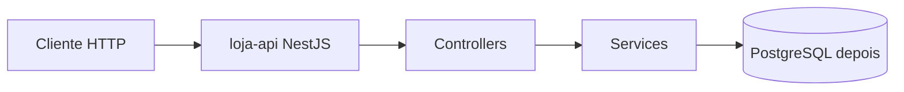
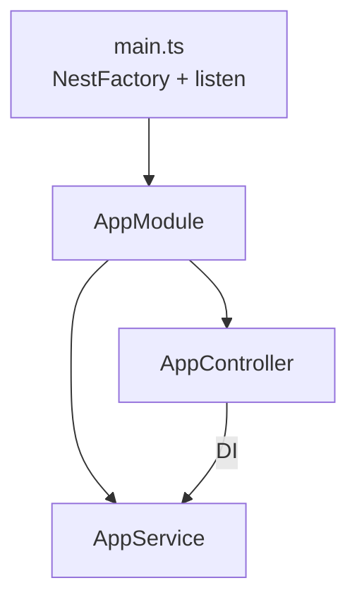
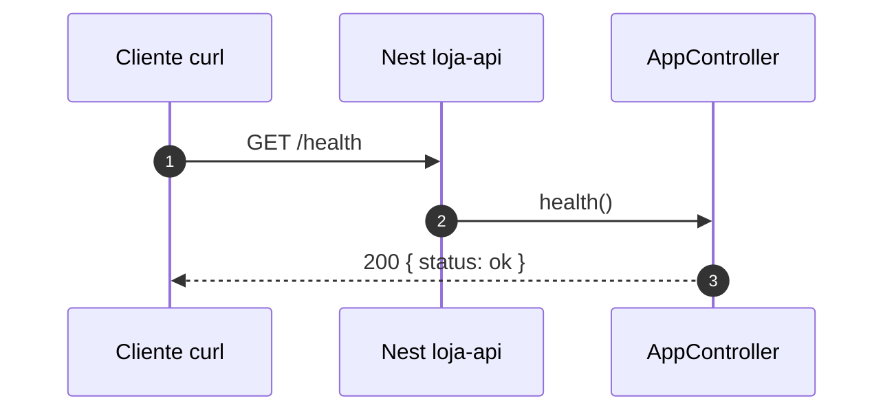

# Introdução ao NestJS — criando o `loja-api`

> *Episódio: a loja sobe — `/health` responde “estou viva”.*

## Objetivo deste material

Ao terminar, você deve conseguir:

1. Explicar **o que é** o NestJS e **quando** faz sentido usá-lo.
2. Criar o projeto **`loja-api`** com a CLI.
3. Expor `GET /health` → `200 { "status": "ok" }` (linha P do [mapa — Cap. 1](MAPA-LINHAS-P-A.md)).

**Pré-requisito:** [TypeScript para NestJS](0.typescript-para-nestjs.md).  
**Próximo passo:** [Controllers — produtos](2.controllers.md).

> **Ana** vai abrir a loja neste capítulo: primeiro o projeto sobe e responde “estou viva” em `/health`. O catálogo vem no cap. 2.

------

## 1. O que é o NestJS?

O **NestJS** é um framework **Node.js** em **TypeScript** para APIs e backends. Ele é **opinativo**: já sugere como organizar o código (módulos, controllers, services) em vez de deixar cada time inventar uma estrutura do zero.

Inspira-se em ideias do Angular (módulos, DI), mas o alvo é **servidor** (HTTP, WebSockets, microserviços), não o browser.



> **Conceito: framework opinativo**  
> Você ganha organização e padrões prontos (bom em turma e em time). O custo é aprender as peças do Nest (`@Module`, `@Injectable`, …) — por isso o cap. 0 existe.

------

## 2. Por que Nest nesta disciplina?

| Sem estrutura (só Express “solto”) | Com Nest |
|------------------------------------|----------|
| Rotas e regras misturadas | Controller × service |
| Difícil crescer o projeto | Módulos por domínio (`products`, `orders`, `auth`) |
| DI caseira | Container de DI nativo |
| TypeScript opcional / frouxo | TypeScript de primeira classe |

**Quando Nest pode ser excessivo:** script único, protótipo de uma tarde, equipe sem TS.

**Quando Nest brilha:** API que vai crescer (nossa `loja-api` do cap. 1 ao 10).

------

## 3. Pré-requisitos de máquina

- **Node.js** 18+ (recomendado LTS 20)
- **npm**
- Editor (VS Code / Cursor)

```bash
node -v
npm -v
```

------

## 4. Instalar a CLI e criar o projeto

**Cwd canônico da trilha:** crie o projeto **dentro** de `backend/nest/` (ao lado do `docker-compose.postgres.yml` e da pasta `seed/`).

```bash
cd backend/nest          # pasta deste material
# NestJS 10 (CLI atual no npm costuma ser 11 — pin explícito)
npx -y @nestjs/cli@10 new loja-api
```

Escolha **npm** se perguntarem o gerenciador.

> Nos capítulos seguintes, use **`npx nest g …`** dentro de `loja-api/` (CLI local — não precisa instalar `@nestjs/cli` globalmente).

```bash
cd loja-api
npm run start:dev
```

| Você está em… | Compose | Seed |
|---------------|---------|------|
| `backend/nest/` | `docker compose -f docker-compose.postgres.yml up -d` | `seed/seed-catalog.sql` (cap. 5) ou `seed/seed.sql` (cap. 6+) |
| `backend/nest/loja-api/` | `docker compose -f ../docker-compose.postgres.yml up -d` | `../seed/...` |

Abra `http://localhost:3000` — a mensagem padrão do scaffold deve aparecer. Deixe o modo watch ligado enquanto edita.

> **Conceito: um projeto para a trilha inteira**  
> Do cap. 1 ao 10 você **evolui** este mesmo `loja-api`. Não rode `nest new` de novo a cada capítulo.

------

## 5. O que a CLI gerou (mapa rápido)

```text
loja-api/
  src/
    main.ts           # sobe a aplicação
    app.module.ts     # módulo raiz
    app.controller.ts
    app.service.ts
  package.json
```



| Arquivo | Ideia |
|---------|--------|
| `main.ts` | `NestFactory.create(AppModule)` + `listen(3000)` |
| `app.module.ts` | registra controllers/providers iniciais |
| `app.controller.ts` | rotas HTTP do “app” |

No cap. 2 você cria o módulo `products`. Por enquanto usamos o `AppController` para o health.

------

## 6. Linha P — `GET /health`

Edite `src/app.controller.ts` (pode remover a rota Hello padrão ou mantê-la):

```typescript
import { Controller, Get } from '@nestjs/common';

@Controller()
export class AppController {
  @Get('health')
  health() {
    return { status: 'ok' };
  }
}
```

Se ainda existir `AppService` só para o hello, pode deixar; o health não precisa dele.

Teste:

```bash
curl -s http://localhost:3000/health
```



Esperado:

```json
{ "status": "ok" }
```

> **Conceito: health check**  
> Rota leve para saber se o processo está no ar (Docker, load balancer, monitoramento). Ainda não verifica o Postgres — isso pode evoluir depois.

------

## 7. Desafio (Linha A)

Dispensável para o cap. 2. Contrato no [mapa](MAPA-LINHAS-P-A.md):

`GET /health/version` → `{ "name": "loja-api", "version": "0.1.0" }`

(lendo `package.json` ou constante).

------

## 8. Checkpoint

1. O que significa dizer que o Nest é “opinativo”?  
2. Qual arquivo você alteraria para mudar a porta de `3000` para `3001`?  
3. Por que a trilha pede **um** `loja-api` em vez de um projeto novo por capítulo?

> **O que a loja ganhou hoje:** nasceu o projeto **`loja-api`** com um pulso (`/health`) — a vitrine ainda vai aparecer no próximo capítulo.

------

## Referências

- [Documentação NestJS](https://docs.nestjs.com/)  
- [Migration Guide](https://docs.nestjs.com/migration-guide)  
- Próximo: [2.controllers.md](2.controllers.md)
------

**Contrato HTTP:** [MAPA — Cap. 1](MAPA-LINHAS-P-A.md) — em conflito, o mapa prevalece.
