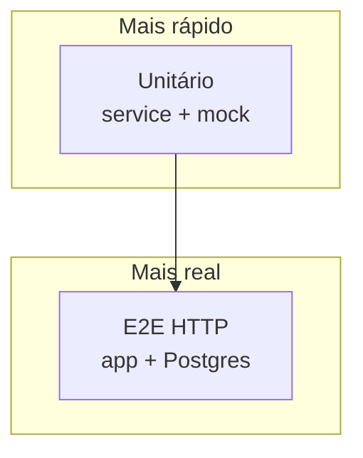
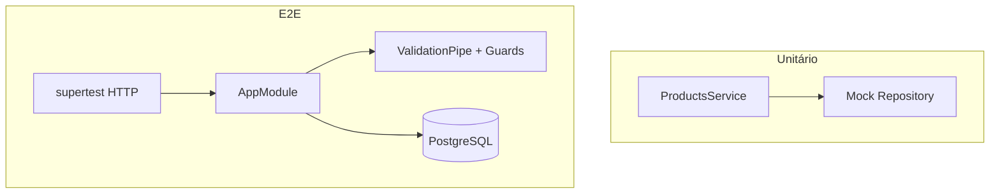
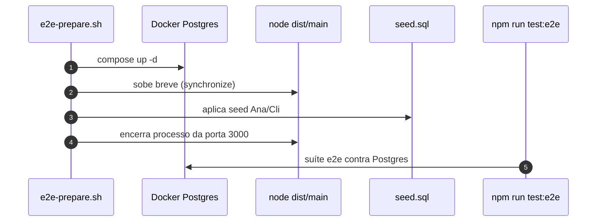

# Testes de software no `loja-api`

> *Episódio: rede de segurança — o curl da Ana vira suíte.*

## Objetivo deste material

Ao terminar, você deve conseguir:

1. Explicar, em uma frase cada, teste **unitário**, **integração** e **e2e**.
2. Escrever teste unitário do `ProductsService` com **mock** do `Repository`.
3. Escrever e2e HTTP: produto válido/inválido, `404`, e auth (`401` sem token / sucesso com Bearer da **Ana**).
4. Rodar a **suíte P** do [mapa — Cap. 10](MAPA-LINHAS-P-A.md) contra PostgreSQL.

**Pré-requisito:** trilha P (produtos + auth; upload ajuda, mas não bloqueia).  
**Próximo passo:** [Capstone](exercicio-1.md).  
**Contrato HTTP:** [MAPA — Cap. 10](MAPA-LINHAS-P-A.md) — em conflito, o mapa prevalece.  
**Seed:** [seed/](seed/) — `ana` / `cli` / `secret123`. Curls manuais: [CURLS-P.md](CURLS-P.md).

------

## 1. Por que testar nesta trilha?

Sem testes, cada mudança vira “torcer para o curl da Ana ainda funcionar”.

> **Conceito: teste mostra presença de defeitos**  
> Passar nos testes **aumenta confiança**; não prova perfeição. Priorize o contrato P.





| Nível | O que valida | Dependências |
|-------|--------------|--------------|
| Unitário | regra no service | mock do repository |
| E2E | contrato HTTP | Nest + Postgres + pipes/guards |

------

## 2. Técnicas rápidas

| Técnica | Exemplo |
|---------|---------|
| Particionamento | `price > 0` vs `price ≤ 0` |
| Limite | `stock = 0` ok; `-1` → 400 |
| Decisão | sem token → 401; Cli cria produto → 403; Ana → 201 |

------

## 3. Ambiente

```bash
# a partir de backend/nest/
docker compose -f docker-compose.postgres.yml up -d
cd loja-api && npm run start:dev
# espere a API criar tabelas (synchronize), depois em outro terminal:
docker exec -i loja-postgres psql -U loja -d loja < ../seed/seed.sql
bash ../seed/verify-seed.sh
# (shell em backend/nest/: seed/seed.sql + bash seed/verify-seed.sh)

npm test
npm run test:e2e
```

> Sem o seed, o login da Ana no e2e falha. Use o prepare abaixo ou rode o seed **antes** da suíte.

### Prepare automático (recomendado)

**Script pronto no material** — a partir de `backend/nest/` (sobe Postgres, **sincroniza schema** se `users` ainda não existir, aplica seed):

```bash
bash scripts/e2e-prepare.sh
```

**Ou em `loja-api/scripts/e2e-prepare.sh`** — delegue ao script do material (evita path errado):

```bash
#!/usr/bin/env bash
set -euo pipefail
exec bash "$(cd "$(dirname "$0")/../.." && pwd)/scripts/e2e-prepare.sh"
```

No `package.json` do `loja-api`:

```json
"scripts": {
  "test:e2e:prepare": "bash scripts/e2e-prepare.sh"
}
```

**Ou `globalSetup` do Jest** — `test/global-setup.ts` (delega ao mesmo prepare; paths assumem `loja-api` dentro de `backend/nest/`):

```typescript
import { execSync } from 'child_process';
import { resolve } from 'path';

export default function globalSetup() {
  const nestRoot = resolve(__dirname, '../..');
  execSync('bash scripts/e2e-prepare.sh', { cwd: nestRoot, stdio: 'inherit' });
}
```

Em `test/jest-e2e.json`:

```json
{
  "moduleFileExtensions": ["js", "json", "ts"],
  "rootDir": ".",
  "testEnvironment": "node",
  "testRegex": ".e2e-spec.ts$",
  "transform": { "^.+\\.(t|j)s$": "ts-jest" },
  "globalSetup": "<rootDir>/global-setup.ts"
}
```

> **Primeira vez:** o prepare precisa do `loja-api` com caps. 5–6 implementados (TypeORM + `User`) para criar tabelas automaticamente. Se falhar, suba `npm run start:dev` uma vez, pare, e rode o prepare de novo.

> **Porta 3000:** pare `npm run start:dev` antes do prepare — o script sobe `node dist/main.js` na mesma porta para sincronizar o schema.



Depois: `npm run test:e2e` (com Docker no ar).

------

## 4. Linha P — unitário (`ProductsService`)

```typescript
import { NotFoundException } from '@nestjs/common';
import { Test } from '@nestjs/testing';
import { getRepositoryToken } from '@nestjs/typeorm';
import { Repository } from 'typeorm';
import { Product } from './product.entity';
import { ProductsService } from './products.service';

describe('ProductsService (unit)', () => {
  let service: ProductsService;
  let repo: jest.Mocked<Pick<Repository<Product>, 'findOne' | 'create' | 'save' | 'delete'>>;

  beforeEach(async () => {
    repo = {
      findOne: jest.fn(),
      create: jest.fn(),
      save: jest.fn(),
      delete: jest.fn(),
    };
    const moduleRef = await Test.createTestingModule({
      providers: [
        ProductsService,
        { provide: getRepositoryToken(Product), useValue: repo },
      ],
    }).compile();
    service = moduleRef.get(ProductsService);
  });

  it('create deve salvar produto', async () => {
    const dto = { name: 'Caneca', price: 10, stock: 2 };
    repo.create.mockReturnValue(dto as Product);
    repo.save.mockResolvedValue({ id: 1, ...dto } as Product);
    await expect(service.create(dto)).resolves.toMatchObject({ id: 1, name: 'Caneca' });
  });

  it('findOne inexistente → NotFoundException', async () => {
    repo.findOne.mockResolvedValue(null);
    await expect(service.findOne(99)).rejects.toBeInstanceOf(NotFoundException);
  });
});
```

> **Conceito: mock** — o unitário não fala com o Postgres.

------

## 5. Linha P — e2e (login determinístico da Ana)

**Pré-requisito:** rode o `seed.sql` do §3 (ou `globalSetup` / `npm run test:e2e:prepare`) **antes** desta suíte. O exemplo abaixo **só faz login** — assume Ana já no Postgres.

```typescript
import { INestApplication, ValidationPipe } from '@nestjs/common';
import { Test } from '@nestjs/testing';
import * as request from 'supertest';
import { AppModule } from '../src/app.module';

describe('Products e2e (P)', () => {
  let app: INestApplication;
  let tokenAna: string;

  beforeAll(async () => {
    const moduleRef = await Test.createTestingModule({
      imports: [AppModule],
    }).compile();

    app = moduleRef.createNestApplication();
    app.useGlobalPipes(
      new ValidationPipe({
        whitelist: true,
        forbidNonWhitelisted: true,
        transform: true,
        transformOptions: { enableImplicitConversion: true },
      }),
    );
    await app.init();

    const login = await request(app.getHttpServer())
      .post('/auth/login')
      .send({ username: 'ana', password: 'secret123' })
      .expect(200);
    tokenAna = login.body.access_token;
  });

  afterAll(async () => {
    await app.close();
  });

  it('POST /products válido (Ana) → 201', async () => {
    await request(app.getHttpServer())
      .post('/products')
      .set('Authorization', `Bearer ${tokenAna}`)
      .send({ name: 'Caneca', price: 39.9, stock: 5 })
      .expect(201);
  });

  it('POST /products inválido → 400', async () => {
    await request(app.getHttpServer())
      .post('/products')
      .set('Authorization', `Bearer ${tokenAna}`)
      .send({ name: 'X', price: -1, stock: 0 })
      .expect(400);
  });

  it('GET /products/:id inexistente → 404', async () => {
    await request(app.getHttpServer()).get('/products/999999').expect(404);
  });

  it('POST /products sem token → 401', async () => {
    await request(app.getHttpServer())
      .post('/products')
      .send({ name: 'Caneca', price: 10, stock: 1 })
      .expect(401);
  });
});
```

O `globalSetup` / `test:e2e:prepare` do §3 substituem o passo manual do seed antes desta suíte.

------

## 6. Checklist P

- [ ] Unitário: create + not found (+ stock se aplicável)  
- [ ] E2E: 201 / 400 / 404 / 401 (suíte exemplo — **não** cobre 403 nem `/orders`; amplie se quiser)  
- [ ] Login da **Ana** determinístico (seed ou `test:e2e:prepare`)

------

## 7. Desafio (Linha A)

Specs das features A — `test/desafios/` ou `*.a.spec.ts`. Dispensável para a suíte P.

------

## Arquivos que você editou neste capítulo

- `src/products/products.service.spec.ts` (unitário) · `test/*.e2e-spec.ts` · `test/jest-e2e.json` · `test/global-setup.ts` ou script `test:e2e:prepare` (opcional) · `package.json` (`test:e2e:prepare`)

------

## Checkpoint

1. Por que mockar o repository no unitário e não no e2e?  
2. E2e sem `ValidationPipe` no `createNestApplication` testa a mesma API?  
3. 401 vs 403 — qual é qual?

> **O que a loja ganhou hoje:** rede de segurança — regressão do catálogo/auth aparece no CI da aula, não só na demo.

------

## Referências

- [Testing (Nest)](https://docs.nestjs.com/fundamentals/testing)  
- Próximo: [exercicio-1.md](exercicio-1.md)

------

**Contrato HTTP:** [MAPA — Cap. 10](MAPA-LINHAS-P-A.md) — em conflito, o mapa prevalece.
