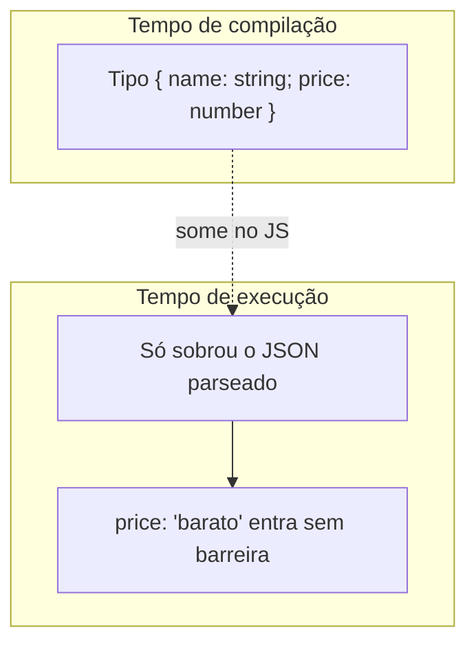
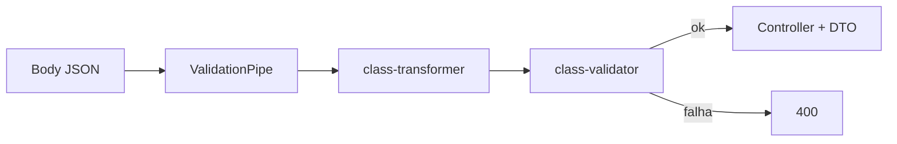
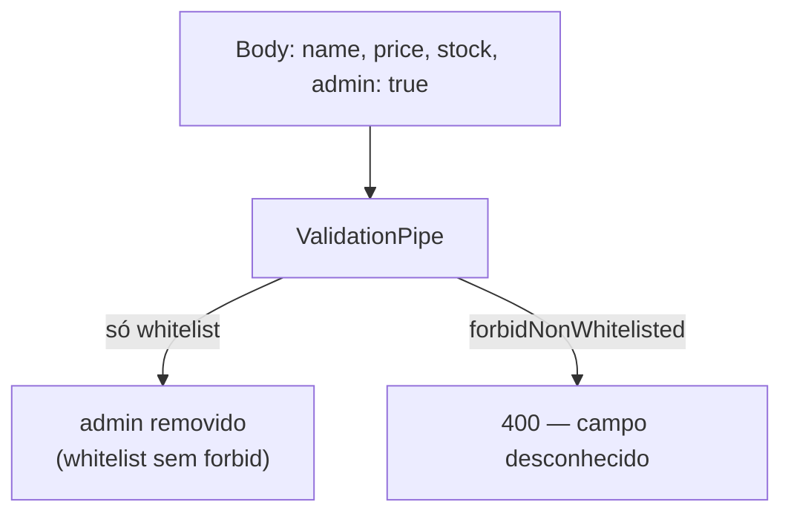

# DTOs, `@Body` e validação de entrada

> *Episódio: a porta da frente — JSON inválido não entra no catálogo.*

## Objetivo deste material

Ao terminar, você deve conseguir:

1. Explicar o que `@Body()` entrega (e o que **não** garante sozinho).
2. Modelar o corpo da requisição com **DTOs** (classes).
3. Validar entrada com **`class-validator`**, transformar tipos com **`class-transformer`** e ativar isso via **`ValidationPipe`**.
4. Customizar mensagens e escolher os decorators certos para cada campo.
5. Aplicar o mesmo padrão em **POST, PUT, PATCH, GET (query)** e combinações com `@Param`.

**Pré-requisito:** [Controllers](2.controllers.md) (CRUD `/products` em memória no `loja-api`). Se a ideia de classe/DTO ainda estiver frouxa, revise [TypeScript para NestJS](0.typescript-para-nestjs.md).

**Próximo passo:** [Services](3.services.md).  
**Contrato:** [MAPA — Cap. 2.1](MAPA-LINHAS-P-A.md).

> **Nesta aula da loja:** proteger `POST`/`PUT` `/products` — Ana não pode cadastrar Caneca Nest com `price: "barato"` ou campos extras. **§1–4** = prática; **§5–7** (apêndice abaixo) = consulta de decorators; **§8+** = exemplos HTTP. Domínio âncora: **Product** (o mesmo padrão vale para User no cap. 6).  
> **Já leu §1–3?** Vá direto para [§4.1 — plugar DTOs no controller agora](#41-linha-p--plugar-dtos-no-controller-agora).

------

## 1. O problema: tipagem TypeScript ≠ validação HTTP

No controller, isto parece seguro:

```typescript
@Post()
create(@Body() body: { name: string; price: number; stock: number }) {
  return body;
}
```

Em tempo de **compilação**, o TypeScript confia no tipo. Em tempo de **execução**, o Nest só injeta o JSON parseado. O cliente pode enviar:

```json
{ "name": 123, "price": "barato", "stock": -1, "admin": true }
```

e o método ainda roda — com dados errados ou campos extras. **Tipos de TypeScript somem no JavaScript gerado**; eles não protegem a API sozinhos.



Por isso o Nest combina:

| Peça | Papel |
|------|--------|
| `@Body()` | Extrai o corpo da requisição e injeta no parâmetro |
| **DTO (classe)** | Contrato tipado + alvo de metadata de validação |
| `class-validator` | Regras (`@IsEmail()`, `@MinLength()`, …) |
| `class-transformer` | Converte plain object → instância da classe (e tipos, se configurado) |
| `ValidationPipe` | Roda a validação **antes** do método do controller |



------

## 2. `@Body()` em profundidade

### O que faz

`@Body()` lê o **body** da requisição HTTP (em APIs REST, quase sempre JSON) e passa esse valor ao parâmetro do método.

```typescript
@Post()
create(@Body() createProductDto: CreateProductDto) {
  // createProductDto = conteúdo do body (idealmente já validado/transformado)
}
```

### Variantes úteis

```typescript
// Corpo inteiro tipado pelo DTO
@Post()
create(@Body() dto: CreateProductDto) { ... }

// Um único campo do body (útil em demos; em API real, prefira DTO)
@Post()
register(@Body('email') email: string) { ... }
```

`@Body('email')` extrai só a propriedade `email`. Continua **sem validação automática** até você configurar o `ValidationPipe` (e, no caso de campo isolado, a validação de DTO completo é o caminho mais claro).

### Onde o body aparece (e onde não)

| Método HTTP | Body costuma existir? | Uso típico |
|-------------|----------------------|------------|
| **POST** | Sim | Criar recurso |
| **PUT** | Sim | Substituir recurso |
| **PATCH** | Sim | Atualização parcial |
| **GET** | Raro / evite | Filtros → `@Query()` |
| **DELETE** | Às vezes | Preferir `@Param` / `@Query`; body só se o domínio exigir |

Validação com DTO **não** se limita ao body: o mesmo padrão serve para query e, com pipes, para params.

------

## 3. DTO: Data Transfer Object

**DTO** é uma classe que descreve o formato dos dados que entram (ou saem) da API. No Nest, usamos **classe** (não só `interface`) quando queremos validar: interfaces **não existem em runtime**; classes + decorators geram metadata que o `ValidationPipe` lê.

```typescript
// create-product.dto.ts
import { IsInt, IsNumber, IsString, Min, MinLength } from 'class-validator';

export class CreateProductDto {
  @IsString()
  @MinLength(2)
  name: string;

  @IsNumber({ maxDecimalPlaces: 2 })
  @Min(0.01)
  price: number;

  @IsInt()
  @Min(0)
  stock: number;
}
```

Organização comum no `loja-api` (linha P):

```
src/products/
  dto/
    create-product.dto.ts
    update-product.dto.ts   # reexport do create (PUT completo)
  products.controller.ts
```

(`products.service.ts` entra no cap. 3; `list-products-query.dto.ts` é desafio A.)

> No cap. 6 o mesmo padrão aparece em `auth/dto` (`LoginDto`, etc.).

------

## 4. Instalação e ativação do `ValidationPipe`

### Pacotes

```bash
npm install class-validator class-transformer
```

### Ativar globalmente (recomendado)

Em `main.ts`:

```typescript
import { NestFactory } from '@nestjs/core';
import { ValidationPipe } from '@nestjs/common';
import { AppModule } from './app.module';

async function bootstrap() {
  const app = await NestFactory.create(AppModule);

  app.useGlobalPipes(
    new ValidationPipe({
      whitelist: true,              // remove propriedades sem decorator no DTO
      forbidNonWhitelisted: true,   // 400 se o client enviar campo desconhecido
      transform: true,              // plain object → instância da classe (+ conversões)
      transformOptions: {
        enableImplicitConversion: true, // "42" (string) → 42 (number) quando o tipo pede
      },
    }),
  );

  await app.listen(3000);
}
bootstrap();
```

| Opção | Efeito |
|-------|--------|
| `whitelist: true` | Descarta campos que não estão no DTO |
| `forbidNonWhitelisted: true` | Em vez de só descartar, **rejeita** a requisição |
| `transform: true` | Necessário para `class-transformer` e tipagem correta no método |
| `enableImplicitConversion` | Ajuda especialmente em `@Query()` / `@Param()`, onde tudo chega como string |



Na linha P da loja usamos **as duas** opções: campo extra → **400**, não silêncio.

Também é possível aplicar o pipe só em um método (`@UsePipes(new ValidationPipe())`) ou em um controller — o global costuma ser o padrão de projeto.

------

## 4.1. Linha P — plugar DTOs no controller **agora**

Sem isto, o `ValidationPipe` **não valida** (o metatype precisa ser a **classe** DTO, não `{ name: string; … }`).

1. Crie `src/products/dto/create-product.dto.ts` com o DTO da seção 3 / §8 (campos `name`, `price`, `stock`).  
2. Crie `src/products/dto/update-product.dto.ts` para o **PUT** (mesmo contrato completo do create):

```typescript
// update-product.dto.ts — linha P (PUT substitui o recurso inteiro)
export { CreateProductDto as UpdateProductDto } from './create-product.dto';
```

3. No `ProductsController` do cap. 2, **troque** os parâmetros tipados inline:

```typescript
// antes (cap. 2 — não valida em runtime)
create(@Body() body: { name: string; price: number; stock: number }) { ... }

// agora (linha P)
create(@Body() dto: CreateProductDto) {
  // use dto.name, dto.price, dto.stock
}

@Put(':id')
update(
  @Param('id') id: string,
  @Body() dto: UpdateProductDto,
) {
  // PUT completo — mesmos campos do create
}
```

4. Rode o curl `400` da evidência rápida abaixo. Se ainda passar JSON inválido, o pipe não está vendo a classe DTO.

> `PartialType` / `PATCH` ficam no **Desafio A** — não use `PartialType` no PUT da linha P.

**Evidência rápida (Caneca Nest inválida)** — com pipe + `CreateProductDto` ativos:

```bash
curl -s -o /dev/null -w '%{http_code}\n' -X POST http://localhost:3000/products \
  -H 'Content-Type: application/json' \
  -d '{"name":"Caneca Nest","price":"barato","stock":-1}'
# esperado: 400
```

------

## Apêndice — consulta rápida (seções 5–7)

> As seções abaixo aprofundam *por quê* e *quais* decorators existem. Na aula, foque em ligar o pipe + `CreateProductDto` e o curl `400` acima; volte aqui quando precisar de um decorator específico.

## 5. Vantagens de usar × desvantagens de não usar

### Vantagens de usar DTO + `class-validator` + `ValidationPipe`

1. **Contrato explícito** — o DTO documenta o que a API aceita (e combina bem com Swagger depois).
2. **Falha cedo** — dados inválidos geram `400 Bad Request` **antes** do service/banco.
3. **Menos código defensivo** — o service assume dados já sanitizados/validados.
4. **Mensagens padronizadas** — resposta de erro consistente para o frontend.
5. **Segurança básica** — `whitelist` / `forbidNonWhitelisted` reduzem mass assignment (ex.: cliente enviando `role: "admin"`).
6. **Reuso** — mesmo DTO (ou `PartialType`) em create/update; regras centralizadas na classe.

### Desvantagens (riscos) de não usar

1. **Tipos mentem** — `price: number` no TypeScript não impede `"barato"` no JSON.
2. **Bugs no domínio** — service e banco lidam com `null`, tipos errados e campos extras.
3. **Superfície de ataque maior** — propriedades extras podem sobrescrever o que não deveriam.
4. **Validação espalhada** — `if (!email)` em todo controller/service, fácil esquecer um caso.
5. **DX pior** — frontend e testes não têm um “contrato” único e testável.
6. **Erros opacos** — falhas estouram mais tarde (constraint do banco, `undefined` em runtime).

**Regra prática:** se o dado veio da rede (`@Body`, `@Query`, `@Param`), trate como não confiável até passar pelo pipe + DTO.

------

## 6. Principais decorators do `class-validator` (consulta)

**Os 10 da linha P (catálogo):** `@IsString`, `@MinLength`, `@IsNumber`, `@IsInt`, `@Min`, `@Max`, `@IsOptional`, `@IsArray`, `@ValidateNested`, `@Type` (transformer).

Abaixo, tabela ampliada para consulta. Todos aceitam opções; muitos aceitam `{ message: '...' }` para customizar o texto.

### Tipos e presença

| Decorator | Garante |
|-----------|---------|
| `@IsDefined()` | Valor foi enviado (pode ser `null`) |
| `@IsOptional()` | Campo pode faltar; se vier, as outras regras valem |
| `@IsNotEmpty()` | Não é vazio (`''`, `null`, `undefined`) |
| `@IsEmpty()` | É vazio |
| `@ValidateIf(o => ...)` | Aplica regras só se a condição for verdadeira |

### Strings

| Decorator | Garante |
|-----------|---------|
| `@IsString()` | É string |
| `@MinLength(n)` / `@MaxLength(n)` | Tamanho |
| `@Length(min, max)` | Tamanho entre min e max |
| `@Matches(/regex/)` | Casa com a expressão |
| `@IsEmail()` | E-mail |
| `@IsUrl()` | URL |
| `@IsUUID()` | UUID |
| `@IsAlpha()` / `@IsAlphanumeric()` | Só letras / letras+números |
| `@Contains('x')` | Contém trecho |
| `@IsLowerCase()` / `@IsUpperCase()` | Caixa |

### Números

| Decorator | Garante |
|-----------|---------|
| `@IsNumber()` / `@IsInt()` | Número / inteiro |
| `@IsPositive()` / `@IsNegative()` | Sinal |
| `@Min(n)` / `@Max(n)` | Intervalo |
| `@IsDivisibleBy(n)` | Divisível por n |

### Boolean, data, enum, objeto

| Decorator | Garante |
|-----------|---------|
| `@IsBoolean()` | Boolean |
| `@IsDate()` / `@IsDateString()` | Date / string ISO de data |
| `@IsEnum(MeuEnum)` | Valor do enum |
| `@IsObject()` | Objeto |
| `@IsArray()` | Array |
| `@ArrayMinSize(n)` / `@ArrayMaxSize(n)` | Tamanho do array |
| `@ArrayNotEmpty()` | Array não vazio |
| `@ValidateNested()` | Valida objeto/array aninhado (com `@Type()` do `class-transformer`) |
| `@IsIn([...])` / `@IsNotIn([...])` | Lista permitida / proibida |

### Exemplo compacto (catálogo P)

```typescript
import {
  IsInt,
  IsNumber,
  IsOptional,
  IsString,
  MaxLength,
  Min,
  MinLength,
} from 'class-validator';

export class CreateProductDto {
  @IsString({ message: 'name deve ser texto' })
  @MinLength(2, { message: 'name deve ter no mínimo 2 caracteres' })
  @MaxLength(120)
  name: string;

  @IsNumber({ maxDecimalPlaces: 2 }, { message: 'price inválido' })
  @Min(0.01, { message: 'price deve ser positivo' })
  price: number;

  @IsInt({ message: 'stock deve ser inteiro' })
  @Min(0, { message: 'stock não pode ser negativo' })
  stock: number;

  @IsOptional()
  @IsString()
  @MaxLength(40)
  sku?: string; // exemplo de campo opcional; na linha P mínima pode omitir
}
```

> Preview do cap. 6: enums (`@IsEnum`) e e-mail (`@IsEmail`) entram forte no auth — mesma ideia de decorator.

> Documentação completa: [class-validator](https://github.com/typestack/class-validator#validation-decorators).

------

## 7. Customizar mensagens de validação

### Por decorator (mais comum em aula/projeto)

```typescript
@IsString({ message: 'O nome precisa ser uma string' })
@MinLength(3, { message: 'O nome precisa ter pelo menos 3 caracteres' })
name: string;
```

### Mensagem com o valor / propriedade

```typescript
@IsNumber({ maxDecimalPlaces: 2 }, {
  message: 'price mínimo implícito via @Min; recebido: $value',
})
@Min(0.01)
price: number;
```

Placeholders úteis: `$property`, `$value`, `$constraint1`, `$constraint2`, …

### Função (mensagem dinâmica)

```typescript
@MinLength(2, {
  message: (args) =>
    `${args.property} precisa de ao menos ${args.constraints[0]} caracteres (recebido: ${args.value})`,
})
name: string;
```

### Objeto aninhado

Padrão da loja (itens do pedido — mesmo espírito do cap. 5.1):

```typescript
import { Type } from 'class-transformer';
import {
  ArrayMinSize,
  IsArray,
  IsInt,
  Min,
  ValidateNested,
} from 'class-validator';

class OrderItemInput {
  @IsInt()
  @Min(1)
  productId: number;

  @IsInt()
  @Min(1)
  quantity: number;
}

export class CreateOrderDto {
  @IsArray()
  @ArrayMinSize(1)
  @ValidateNested({ each: true })
  @Type(() => OrderItemInput) // class-transformer: instancia cada item
  items: OrderItemInput[];
}
```

Sem `@Type()`, `@ValidateNested()` muitas vezes **não** valida o objeto interno corretamente.

### Resposta típica do Nest (`400`)

```json
{
  "statusCode": 400,
  "message": [
    "name deve ter no mínimo 2 caracteres",
    "price deve ser maior que zero",
    "stock não pode ser negativo"
  ],
  "error": "Bad Request"
}
```

(Com `exceptionFactory` customizado no `ValidationPipe`, dá para mudar o formato — útil depois, não obrigatório no primeiro contato.)

------

## 8. Exemplos por método HTTP

### POST — criar (body completo)

```typescript
// create-product.dto.ts
import { IsInt, IsNumber, IsString, Min, MinLength } from 'class-validator';

export class CreateProductDto {
  @IsString()
  @MinLength(2, { message: 'Informe um nome com pelo menos 2 caracteres' })
  name: string;

  @IsNumber({ maxDecimalPlaces: 2 })
  @Min(0.01, { message: 'price deve ser maior que zero' })
  price: number;

  @IsInt()
  @Min(0, { message: 'stock não pode ser negativo' })
  stock: number;
}
```

```typescript
@Post()
create(@Body() dto: CreateProductDto) {
  return this.productsService.create(dto);
}
```

**Body válido:**

```json
{ "name": "Caneca Nest", "price": 39.9, "stock": 10 }
```

**Body inválido** (`price` string / `stock` negativo) → `400` (mesmo curl da evidência rápida no início do apêndice).

------

### PUT — substituir recurso (param + body)

Na **linha P**, o PUT usa o mesmo contrato do create (`UpdateProductDto` = reexport de `CreateProductDto`, seção 4.1).

```typescript
@Put(':id')
replace(
  @Param('id') id: string,
  @Body() dto: UpdateProductDto,
) {
  return this.productsService.update(Number(id), dto);
}
```

PUT exige **todos** os campos obrigatórios. Se o cliente omitir `name`, a validação falha — comportamento desejável.

------

### PATCH — atualização parcial (**Desafio A**)

**Não** sobrescreva `update-product.dto.ts` da linha P. Crie um arquivo **novo**:

```typescript
// patch-product.dto.ts — só linha A (PATCH parcial)
import { PartialType } from '@nestjs/mapped-types';
import { CreateProductDto } from './create-product.dto';

export class PatchProductDto extends PartialType(CreateProductDto) {}
```

```typescript
@Patch(':id')
patch(
  @Param('id') id: string,
  @Body() dto: PatchProductDto,
) {
  return this.productsService.patch(Number(id), dto);
}
```

**Body válido (parcial):**

```json
{ "price": 149.9 }
```

Campos omitidos não são exigidos; se `price` vier, ainda precisa ser número ≥ 0.01.

> Se o projeto já usa `@nestjs/swagger`, prefira `PartialType` de `@nestjs/swagger` para o OpenAPI refletir o DTO parcial.

------

### GET — validar query string

Query params chegam como **string**. Com `transform: true` (+ conversão implícita), o DTO tipado funciona bem:

```typescript
import { Type } from 'class-transformer';
import { IsInt, IsOptional, IsString, Max, Min } from 'class-validator';

export class ListProductsQueryDto {
  @IsOptional()
  @IsString()
  category?: string;

  @IsOptional()
  @Type(() => Number)
  @IsInt()
  @Min(1)
  page?: number = 1;

  @IsOptional()
  @Type(() => Number)
  @IsInt()
  @Min(1)
  @Max(100)
  limit?: number = 20;
}
```

```typescript
@Get()
findAll(@Query() query: ListProductsQueryDto) {
  return this.productsService.findAll(query);
}
```

Exemplo: `GET /products?category=tech&page=1&limit=10`  
Exemplo inválido: `limit=999` → `400` (`limit` máximo 100).

------

### DELETE — em geral sem body; validar o id

Na `loja-api` os ids são numéricos (`ParseIntPipe` também resolve). Se preferir DTO de param:

```typescript
import { IsInt, Min } from 'class-validator';
import { Type } from 'class-transformer';

export class IdParamDto {
  @Type(() => Number)
  @IsInt({ message: 'id deve ser inteiro' })
  @Min(1)
  id: number;
}
```

```typescript
@Delete(':id')
remove(@Param() params: IdParamDto) {
  return this.productsService.remove(params.id);
}
```

Assim a validação de formato do `id` fica no DTO, não espalhada em `if` no método.

------

### Combinando body + query + param

```typescript
@Put(':id')
replace(
  @Param() params: IdParamDto,
  @Query() query: ListProductsQueryDto,
  @Body() dto: CreateProductDto,
) {
  return this.productsService.replace(params.id, dto, query);
}
```

Cada fonte de dados pode ter seu DTO; o `ValidationPipe` valida **todos** os que forem classes com decorators.

------

## 9. Papel do `class-transformer`

Sem `transform: true`, o Nest entrega um **objeto literal**. Com transformação:

1. O plain object vira **instância** de `CreateProductDto`.
2. Conversões (`"10"` → `10`, aninhamento com `@Type()`) passam a funcionar.
3. Defaults de propriedade no DTO podem ser aplicados conforme a configuração.

Decorators frequentes do `class-transformer`:

| Decorator | Uso |
|-----------|-----|
| `@Type(() => Number)` / `(() => OrderItemInput)` | Converte / instancia tipo |
| `@Expose()` / `@Exclude()` | Controla o que entra/sai em transformações explícitas |
| `@Transform(({ value }) => ...)` | Conversão customizada (trim, lowercase, etc.) |

Exemplo de normalização (login da loja — cap. 6 usa **username**):

```typescript
import { Transform } from 'class-transformer';
import { IsString, MinLength } from 'class-validator';

export class LoginDto {
  @Transform(({ value }) =>
    typeof value === 'string' ? value.trim().toLowerCase() : value,
  )
  @IsString()
  @MinLength(2)
  username: string;
}
```

------

## 10. Mini checklist na prática

1. Criar a classe DTO com decorators do `class-validator`.
2. Usar a classe em `@Body()`, `@Query()` ou `@Param()`.
3. Garantir `ValidationPipe` global com `whitelist`, `transform` (e, de preferência, `forbidNonWhitelisted`).
4. Testar propositalmente: campo faltando, tipo errado, campo extra, mensagem customizada.
5. Manter o controller fino: validou → chama o service.

------

## 11. Desafio (Linha A)

Dispensável para o cap. 3. Contrato no [mapa — Cap. 2.1](MAPA-LINHAS-P-A.md):

- `PatchProductDto` via `PartialType` no `PATCH` (se fez A do cap. 2) — **não** renomeie/sobrescreva o `UpdateProductDto` do PUT P
- `ListProductsQueryDto` com `q?`, `minPrice?`, `maxPrice?`
- Mensagens `message` customizadas nos decorators

------

## Arquivos que você editou neste capítulo

- `src/main.ts` (`ValidationPipe` global) · `src/products/dto/create-product.dto.ts` · `src/products/dto/update-product.dto.ts` · `src/products/products.controller.ts` (trocar `@Body()` inline por DTOs)

------

## 12. Checkpoint

1. Por que `interface` sozinha não valida o JSON da requisição?  
2. O que `whitelist: true` remove do body?  
3. No `loja-api`, qual DTO entra no `POST /products`?

> **O que a loja ganhou hoje:** a porta da frente deixa de aceitar “qualquer JSON” — o catálogo só entra com contrato válido.

------

## 13. Resumo

1. **`@Body()`** só injeta o corpo; **não valida**.
2. **DTO em classe** + **`class-validator`** + **`ValidationPipe`** formam a validação de entrada do Nest.
3. **`class-transformer`** (via `transform: true`) instancia o DTO e ajuda a converter tipos.
4. Use validação em **POST/PUT/PATCH**, **GET (query)** e **params** quando o formato importar.
5. Customizar `message` melhora o feedback sem `if` manual.

**Próximo passo:** [Services](3.services.md).

------

**Contrato HTTP:** [MAPA — Cap. 2.1](MAPA-LINHAS-P-A.md) — em conflito, o mapa prevalece.
