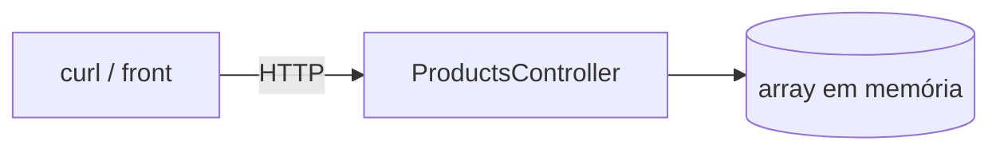
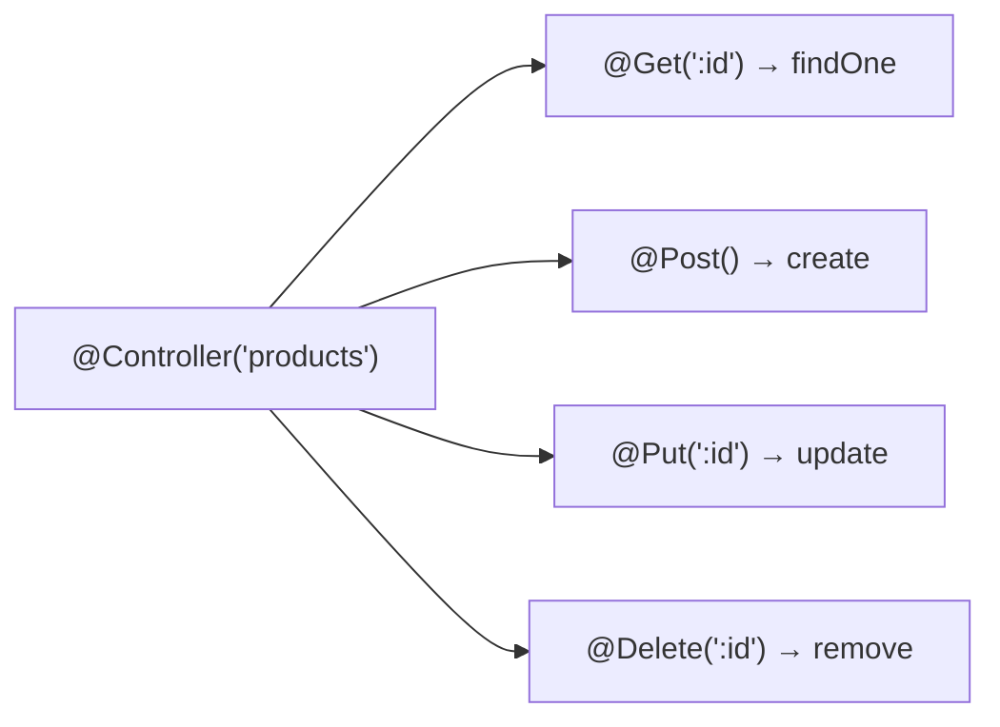
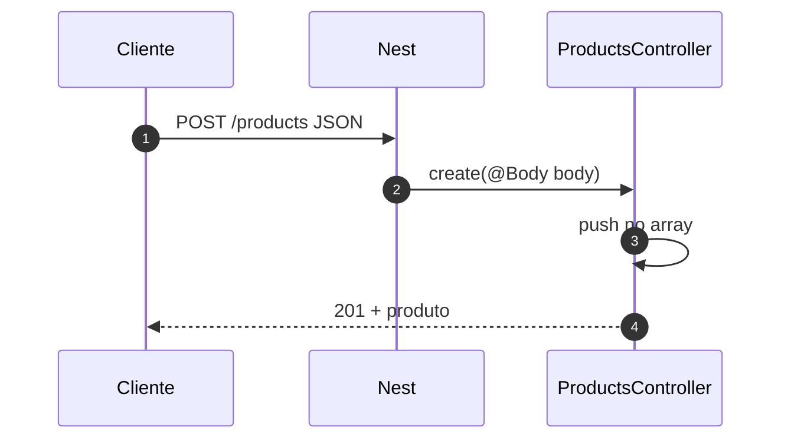

# Controllers — catálogo de produtos em memória

> *Episódio: a vitrine abre — Ana cadastra a Caneca Nest (ainda na RAM).*

## Objetivo deste material

Ao terminar, você deve conseguir:

1. Explicar o papel do **controller** na borda HTTP do Nest.
2. Usar decorators `@Controller`, `@Get`, `@Post`, `@Put`, `@Delete`, `@Param`, `@Body`.
3. Implementar o CRUD **P** de `/products` no `loja-api` com dados em **array na memória**.
4. Devolver status HTTP adequados (`200`, `201`, `204`, `404`).

**Pré-requisito:** [Introdução ao NestJS](1.introducao_nestjs.md) — projeto `loja-api` com `GET /health`.  
**Próximo passo:** [DTOs e validação](2.1.dtos-e-validacao.md).  
**Contrato HTTP:** [MAPA — Cap. 2](MAPA-LINHAS-P-A.md).

> Neste capítulo o “banco” é a **RAM**. No cap. 3 a lógica sai do controller; no cap. 5 vai para o PostgreSQL. As **URLs não mudam**.

------

## 1. Contexto da loja

**Ana** (dona da loja) precisa cadastrar a **Caneca Nest** no catálogo: listar, ver um item, criar, substituir e apagar produtos. Ainda sem login — o “balcão” HTTP abre primeiro.



| Método | Rota | Resposta P |
|--------|------|------------|
| `GET` | `/products` | `200` lista |
| `GET` | `/products/:id` | `200` ou `404` |
| `POST` | `/products` | `201` produto |
| `PUT` | `/products/:id` | `200` ou `404` |
| `DELETE` | `/products/:id` | `204` ou `404` |

Body de criação/atualização (ainda sem validação forte — isso é o 2.1):

```json
{ "name": "Caneca Nest", "price": 39.9, "stock": 10 }
```

------

## 2. O que é um controller?

> **Conceito: controller**  
> Peça que **recebe** a requisição HTTP, lê params/body/query e **devolve** uma resposta. A regra de negócio “de verdade” deveria viver no service (cap. 3). Aqui, de propósito, o array fica no controller para você ver a borda HTTP sem DI ainda.

No Nest, um controller é uma **classe** marcada com `@Controller('rota-base')`. Cada método vira um endpoint com `@Get()`, `@Post()`, etc.



Revise [classes](0.typescript-para-nestjs.md#4-o-que-é-uma-classe-sem-precisar-de-oo-antes) se `class` / `this` ainda forem novos.

------

## 3. Gerar o módulo de produtos

No `loja-api`:

```bash
cd loja-api
npx nest g module products
npx nest g controller products --no-spec
```

Estrutura esperada:

```text
src/products/
  products.module.ts
  products.controller.ts
```

Importe `ProductsModule` no `AppModule` (o CLI costuma fazer isso).

------

## 4. Implementação P — `ProductsController`

Edite `src/products/products.controller.ts`:

```typescript
import {
  Body,
  Controller,
  Delete,
  Get,
  NotFoundException,
  Param,
  Post,
  Put,
  HttpCode,
} from '@nestjs/common';

type Product = {
  id: number;
  name: string;
  price: number;
  stock: number;
};

@Controller('products')
export class ProductsController {
  private products: Product[] = [];
  private nextId = 1;

  @Get()
  findAll(): Product[] {
    return this.products;
  }

  @Get(':id')
  findOne(@Param('id') id: string): Product {
    const product = this.products.find((p) => p.id === Number(id));
    if (!product) {
      throw new NotFoundException(`Produto ${id} não encontrado`);
    }
    return product;
  }

  @Post()
  create(@Body() body: { name: string; price: number; stock: number }): Product {
    const product: Product = {
      id: this.nextId++,
      name: body.name,
      price: body.price,
      stock: body.stock,
    };
    this.products.push(product);
    return product;
  }

  @Put(':id')
  update(
    @Param('id') id: string,
    @Body() body: { name: string; price: number; stock: number },
  ): Product {
    const product = this.findOne(id);
    product.name = body.name;
    product.price = body.price;
    product.stock = body.stock;
    return product;
  }

  @Delete(':id')
  @HttpCode(204)
  remove(@Param('id') id: string): void {
    const index = this.products.findIndex((p) => p.id === Number(id));
    if (index < 0) {
      throw new NotFoundException(`Produto ${id} não encontrado`);
    }
    this.products.splice(index, 1);
  }
}
```

Para o Nest devolver **201** no `POST`, você pode usar `@HttpCode(201)` no método `create` (opcional; o padrão de `@Post()` já é 201 em muitas versões — confira com `curl -w '%{http_code}'`).

### Leitura dos decorators

| Decorator | Onde | Ideia |
|-----------|------|--------|
| `@Controller('products')` | classe | prefixo `/products` |
| `@Get()`, `@Post()`, … | método | verbo HTTP |
| `@Param('id')` | parâmetro | pedaço da URL (`/products/3` → `"3"`) |
| `@Body()` | parâmetro | JSON do corpo |
| `@HttpCode(204)` | método | status sem corpo (DELETE) |
| `NotFoundException` | código | Nest responde `404` com JSON padrão |

> **Conceito: `@Param` devolve string**  
> Na URL tudo é texto. Por isso `Number(id)`. No cap. 2.1 o `ValidationPipe` + `ParseIntPipe` deixam isso mais limpo.

> **Conceito: array no controller é didático, não definitivo**  
> Reiniciar `npm run start:dev` **apaga** o catálogo. Isso motiva persistência depois — não é bug do Nest.

------

## 5. `ProductsModule`

```typescript
import { Module } from '@nestjs/common';
import { ProductsController } from './products.controller';

@Module({
  controllers: [ProductsController],
})
export class ProductsModule {}
```

------

## 6. Linha P — curls

```bash
npm run start:dev
```

```bash
curl -s http://localhost:3000/health

curl -s -X POST http://localhost:3000/products \
  -H 'Content-Type: application/json' \
  -d '{"name":"Caneca Nest","price":39.9,"stock":10}'

curl -s http://localhost:3000/products
curl -s http://localhost:3000/products/1

curl -s -X PUT http://localhost:3000/products/1 \
  -H 'Content-Type: application/json' \
  -d '{"name":"Caneca Nest","price":29.9,"stock":8}'

curl -s -o /dev/null -w '%{http_code}\n' -X DELETE http://localhost:3000/products/1
# esperado: 204

curl -s http://localhost:3000/products/99
# esperado: 404
```

**Experimento:** crie 2 produtos, reinicie o servidor, liste de novo. A lista deve vir **vazia**. Anote: *onde* os dados deveriam viver numa loja real?

------

## 7. Desafio (Linha A)

Dispensável para o cap. 2.1. Contrato no [mapa](MAPA-LINHAS-P-A.md):

| Rota | Ideia |
|------|--------|
| `GET /products?q=` | filtrar por substring no `name` (`@Query('q')`) |
| `PATCH /products/:id` | atualizar só os campos enviados |

Se fizer o `PATCH`, no 2.1 você amarra com `PatchProductDto` (`PartialType`) — sem sobrescrever o DTO do PUT.

------

## 8. Mapa mental do request



------

## Arquivos que você editou neste capítulo

- `src/app.controller.ts` (health) · `src/products/products.module.ts` · `src/products/products.controller.ts` · `src/app.module.ts`

------

## Checkpoint

1. Qual a diferença entre `@Param('id')` e `@Body()`?  
2. Por que `findOne` lança `NotFoundException` em vez de devolver `null`?  
3. O que o cap. 3 deve tirar **de dentro** deste controller?

> **O que a loja ganhou hoje:** o **catálogo** existe (ainda só na RAM) — listar, criar, editar e apagar produtos.

------

## Referência rápida

- [Controllers (docs Nest)](https://docs.nestjs.com/controllers)  
- Próximo: validar o body de verdade → [2.1 DTOs](2.1.dtos-e-validacao.md)
------

**Contrato HTTP:** [MAPA — Cap. 2](MAPA-LINHAS-P-A.md) — em conflito, o mapa prevalece.
