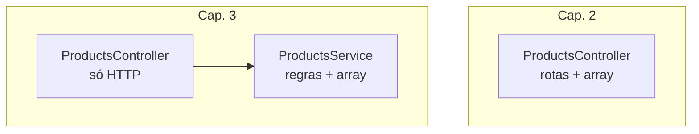
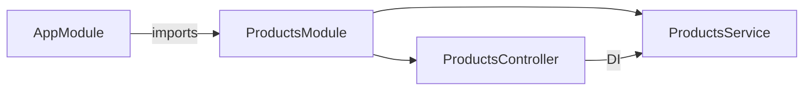

# Services, módulos e injeção de dependência

> *Episódio: o estoque lógico — a regra sai do balcão (controller).*

## Objetivo deste material

Ao terminar, você deve conseguir:

1. Explicar a diferença entre **controller** e **service**.
2. Mover o array de produtos para um **`ProductsService`**.
3. Registrar o service no **`ProductsModule`** (`providers`) e injetá-lo no controller.
4. Manter as **mesmas rotas P** do cap. 2 ([mapa — Cap. 3](MAPA-LINHAS-P-A.md)).

**Pré-requisito:** [DTOs e validação](2.1.dtos-e-validacao.md) — CRUD `/products` validado.  
**Próximo passo:** [Persistência (conceitos)](4.introducao_nestjs_persistencia.md).

> As URLs **não mudam**. Só a organização interna do `loja-api`.

------

## 1. O problema que o cap. 2 deixou

**Ana** já cadastra a Caneca Nest pelo HTTP, mas a regra do catálogo vive **dentro** do `ProductsController`. Isso funciona na aula, mas:

- misture **HTTP** com **regra de negócio**
- dificulta testar a lógica sem subir o servidor
- no cap. 5 você trocaria o miolo (array → TypeORM) sem querer reescrever todas as rotas



> **Conceito: service**  
> Classe com a **lógica de negócio** (criar produto, buscar, validar existência…). O controller só traduz HTTP ↔ chamadas ao service.

> **Conceito: injeção de dependência (DI)**  
> Em vez de `new ProductsService()` no controller, o Nest **cria** o service e **passa** no construtor. Você declara a necessidade; o framework resolve.

------

## 2. Gerar o service

No `loja-api`:

```bash
cd loja-api
npx nest g service products --no-spec
```

Fica algo como:

```text
src/products/
  products.module.ts
  products.controller.ts
  products.service.ts
  dto/ ...
```

------

## 3. `ProductsService` (linha P)

Mova o array e as operações para o service. Os DTOs do 2.1 continuam na borda do controller.

```typescript
import { Injectable, NotFoundException } from '@nestjs/common';
import { CreateProductDto } from './dto/create-product.dto';
import { UpdateProductDto } from './dto/update-product.dto';

export type Product = {
  id: number;
  name: string;
  price: number;
  stock: number;
};

@Injectable()
export class ProductsService {
  private products: Product[] = [];
  private nextId = 1;

  findAll(): Product[] {
    return this.products;
  }

  findOne(id: number): Product {
    const product = this.products.find((p) => p.id === id);
    if (!product) {
      throw new NotFoundException(`Produto ${id} não encontrado`);
    }
    return product;
  }

  create(dto: CreateProductDto): Product {
    const product: Product = {
      id: this.nextId++,
      name: dto.name,
      price: dto.price,
      stock: dto.stock,
    };
    this.products.push(product);
    return product;
  }

  update(id: number, dto: UpdateProductDto): Product {
    const product = this.findOne(id);
    product.name = dto.name;
    product.price = dto.price;
    product.stock = dto.stock;
    return product;
  }

  remove(id: number): void {
    const index = this.products.findIndex((p) => p.id === id);
    if (index < 0) {
      throw new NotFoundException(`Produto ${id} não encontrado`);
    }
    this.products.splice(index, 1);
  }
}
```

> **Conceito: `@Injectable()`**  
> Marca a classe para o **container de DI** do Nest. Sem isso, em geral o framework não injeta o service corretamente.

------

## 4. Controller magro

O controller **delega** — não guarda mais o array:

```typescript
import {
  Body,
  Controller,
  Delete,
  Get,
  HttpCode,
  Param,
  ParseIntPipe,
  Post,
  Put,
} from '@nestjs/common';
import { CreateProductDto } from './dto/create-product.dto';
import { UpdateProductDto } from './dto/update-product.dto';
import { ProductsService } from './products.service';

@Controller('products')
export class ProductsController {
  constructor(private readonly productsService: ProductsService) {}

  @Get()
  findAll() {
    return this.productsService.findAll();
  }

  @Get(':id')
  findOne(@Param('id', ParseIntPipe) id: number) {
    return this.productsService.findOne(id);
  }

  @Post()
  create(@Body() dto: CreateProductDto) {
    return this.productsService.create(dto);
  }

  @Put(':id')
  update(
    @Param('id', ParseIntPipe) id: number,
    @Body() dto: UpdateProductDto,
  ) {
    return this.productsService.update(id, dto);
  }

  @Delete(':id')
  @HttpCode(204)
  remove(@Param('id', ParseIntPipe) id: number) {
    this.productsService.remove(id);
  }
}
```

> **Conceito: `constructor(private readonly productsService: ProductsService)`**  
> Atalho TypeScript (parameter property): cria a propriedade e recebe a instância que o Nest injeta. Revisar [seção 5 do cap. 0](0.typescript-para-nestjs.md) se precisar.

------

## 5. `ProductsModule`

```typescript
import { Module } from '@nestjs/common';
import { ProductsController } from './products.controller';
import { ProductsService } from './products.service';

@Module({
  controllers: [ProductsController],
  providers: [ProductsService],
  exports: [ProductsService], // necessário se outro módulo (ex.: CatalogService no Desafio A) injetar o service
})
export class ProductsModule {}
```

| Campo do `@Module` | Papel |
|--------------------|--------|
| `controllers` | classes HTTP deste módulo |
| `providers` | services (e outros) que o Nest pode injetar **aqui** |
| `exports` | o que **outros módulos** podem injetar se importarem este (ex.: Desafio A / `CatalogService`) |

`AppModule` deve `imports: [ProductsModule, …]`.



------

## 6. Linha P — verificar

As mesmas curls do cap. 2/2.1 devem passar:

```bash
curl -s -X POST http://localhost:3000/products \
  -H 'Content-Type: application/json' \
  -d '{"name":"Caneca Nest","price":39.9,"stock":10}'

curl -s http://localhost:3000/products
```

Nada mudou para o cliente HTTP. Mudou a **arquitetura interna** — preparo para o TypeORM no cap. 5 (você trocará o miolo do **service**, não o contrato das rotas).

------

## 7. Desafio (Linha A) — `CatalogService`

Dispensável para o cap. 4/5. Contrato no [mapa](MAPA-LINHAS-P-A.md):

`GET /catalog/summary` → `{ "totalProducts", "totalStockUnits" }`

Ideia:

1. `npx nest g module catalog` + `npx nest g service catalog` + controller  
2. `CatalogModule` **imports** `ProductsModule`  
3. `CatalogService` injeta `ProductsService` e calcula os totais  

Isso demonstra **DI entre services** sem o controller do catálogo conhecer o array.

------

## Arquivos que você editou neste capítulo

- `src/products/products.service.ts` · `src/products/products.module.ts` · `src/products/products.controller.ts` (controller magro)

------

## Checkpoint

1. Quem deve lançar `NotFoundException` — controller ou service? Por quê?  
2. O que acontece se você esquecer `ProductsService` em `providers`?  
3. Por que o Desafio A (`CatalogService` noutro módulo) precisa de `exports: [ProductsService]` — e por que o cap. 5.1 **não** depende disso (usa `Product` + `EntityManager` na transação)?

> **O que a loja ganhou hoje:** organização — a regra do catálogo saiu do “balcão” (controller) para o “estoque lógico” (service).

------

## Referências

- [Providers / DI (Nest)](https://docs.nestjs.com/providers)  
- [Modules](https://docs.nestjs.com/modules)  
- Próximo: [4.introducao_nestjs_persistencia.md](4.introducao_nestjs_persistencia.md)
------

**Contrato HTTP:** [MAPA — Cap. 3](MAPA-LINHAS-P-A.md) — em conflito, o mapa prevalece.
