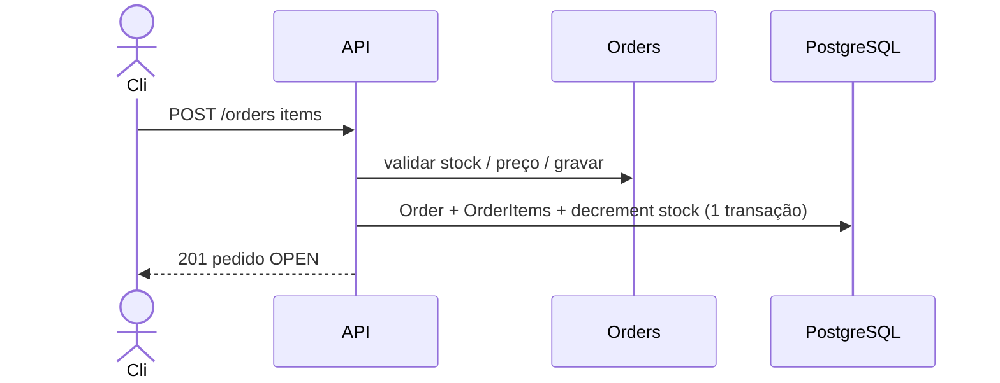

# Pedidos (`/orders`) — checkout em escala de aula

> *Episódio: Cli compra — a loja deixa de ser só vitrine.*

## Objetivo deste material

Ao terminar, você deve conseguir:

1. Modelar `Order` e `OrderItem` no TypeORM (PostgreSQL).
2. Criar pedido a partir de `{ items: [{ productId, quantity }] }`, com **snapshot** de preço e **baixa de estoque**.
3. Listar / buscar / cancelar pedidos (contrato P do mapa).
4. Entender que no cap. de autenticação essas rotas passam a exigir JWT e `userId` do token.

**Pré-requisito:** [CRUD produtos + PostgreSQL](5.crud_nest_bd.md).  
**Próximo passo:** [Autenticação JWT](6.autenticacao.md).  
**Contrato HTTP:** [MAPA — Cap. 5.1](MAPA-LINHAS-P-A.md) — em conflito, o mapa prevalece.

**Personagens da loja:** **Cli** compra; **Ana** (dona) ainda não precisa de login neste capítulo.

------

## 1. Contexto

**Até aqui:** catálogo no PostgreSQL (Caneca Nest sobrevive ao restart). Sem pedido, a loja só tem vitrine. Cli quer levar 2 canecas:



Neste capítulo as rotas ficam **públicas**. No cap. de auth você **endurece** o mesmo contrato com JWT.

------

## 2. Gerar o módulo

```bash
npx nest g module orders
npx nest g controller orders --no-spec
npx nest g service orders --no-spec
```

Estrutura:

```text
src/orders/
  orders.module.ts
  orders.controller.ts
  orders.service.ts
  order.entity.ts
  order-item.entity.ts
  dto/create-order.dto.ts
```

Garanta que a entidade `Product` exista (cap. 5). O `OrdersService` usa `TypeOrmModule.forFeature` com `Product` na mesma transação — **não** precisa injetar `ProductsService`.

------

## 3. Entidades

### `order.entity.ts`

```typescript
import {
  Column,
  CreateDateColumn,
  Entity,
  OneToMany,
  PrimaryGeneratedColumn,
} from 'typeorm';
import { OrderItem } from './order-item.entity';

export type OrderStatus = 'OPEN' | 'PAID' | 'CANCELLED';

@Entity('orders')
export class Order {
  @PrimaryGeneratedColumn()
  id: number;

  /** null neste capítulo; no auth vira o sub do JWT */
  @Column({ type: 'int', nullable: true })
  userId: number | null;

  @Column({ type: 'varchar', length: 20, default: 'OPEN' })
  status: OrderStatus;

  @CreateDateColumn()
  createdAt: Date;

  @OneToMany(() => OrderItem, (item) => item.order, { cascade: true, eager: true })
  items: OrderItem[];
}
```

### `order-item.entity.ts`

```typescript
import { Column, Entity, ManyToOne, PrimaryGeneratedColumn } from 'typeorm';
import { Order } from './order.entity';

@Entity('order_items')
export class OrderItem {
  @PrimaryGeneratedColumn()
  id: number;

  @Column()
  productId: number;

  @Column({ type: 'int' })
  quantity: number;

  /** preço no momento da compra */
  @Column({ type: 'numeric', precision: 10, scale: 2 })
  unitPrice: number;

  @ManyToOne(() => Order, (order) => order.items, { onDelete: 'CASCADE' })
  order: Order;
}
```

> **Conceito: snapshot de preço**  
> `unitPrice` congela o preço da venda. Se Ana mudar o preço da caneca amanhã, o pedido do Cli não muda.

------

## 4. DTO

```typescript
import { Type } from 'class-transformer';
import {
  ArrayMinSize,
  IsArray,
  IsInt,
  Min,
  ValidateNested,
} from 'class-validator';

class OrderItemInput {
  @IsInt()
  @Min(1)
  productId: number;

  @IsInt()
  @Min(1)
  quantity: number;
}

export class CreateOrderDto {
  @IsArray()
  @ArrayMinSize(1)
  @ValidateNested({ each: true })
  @Type(() => OrderItemInput)
  items: OrderItemInput[];
}
```

------

## 5. `OrdersService`

```typescript
import {
  BadRequestException,
  Injectable,
  NotFoundException,
} from '@nestjs/common';
import { InjectRepository } from '@nestjs/typeorm';
import { DataSource, Repository } from 'typeorm';
import { CreateOrderDto } from './dto/create-order.dto';
import { Order } from './order.entity';
import { OrderItem } from './order-item.entity';
import { Product } from '../products/product.entity';

@Injectable()
export class OrdersService {
  constructor(
    @InjectRepository(Order)
    private readonly ordersRepository: Repository<Order>,
    private readonly dataSource: DataSource,
  ) {}

  findAll(): Promise<Order[]> {
    return this.ordersRepository.find({ order: { id: 'DESC' } });
  }

  // No cap. 6 (JWT): use findAllForUser(userId) em vez de listar tudo

  async findOne(id: number): Promise<Order> {
    const order = await this.ordersRepository.findOne({ where: { id } });
    if (!order) {
      throw new NotFoundException(`Pedido ${id} não encontrado`);
    }
    return order;
  }

  async create(dto: CreateOrderDto, userId: number | null = null): Promise<Order> {
    return this.dataSource.transaction(async (manager) => {
      const order = manager.create(Order, {
        userId,
        status: 'OPEN',
        items: [],
      });

      for (const line of dto.items) {
        // Sempre leia/grave estoque pelo manager da transação (evita entidade detached).
        const product = await manager.findOne(Product, {
          where: { id: line.productId },
        });
        if (!product) {
          throw new NotFoundException(`Produto ${line.productId} não encontrado`);
        }
        if (line.quantity > product.stock) {
          throw new BadRequestException(
            `estoque insuficiente para produto ${product.id} (stock=${product.stock})`,
          );
        }

        await manager.decrement(
          Product,
          { id: product.id },
          'stock',
          line.quantity,
        );

        const item = manager.create(OrderItem, {
          productId: product.id,
          quantity: line.quantity,
          unitPrice: product.price,
        });
        order.items.push(item);
      }

      return manager.save(order);
    });
  }

  async cancel(id: number): Promise<Order> {
    return this.dataSource.transaction(async (manager) => {
      const order = await manager.findOne(Order, {
        where: { id },
        relations: ['items'],
      });
      if (!order) {
        throw new NotFoundException(`Pedido ${id} não encontrado`);
      }
      if (order.status !== 'OPEN') {
        throw new BadRequestException('só pedidos OPEN podem ser cancelados');
      }

      for (const item of order.items) {
        await manager.increment(
          Product,
          { id: item.productId },
          'stock',
          item.quantity,
        );
      }

      order.status = 'CANCELLED';
      return manager.save(order);
    });
  }
}
```

> **Conceito: transação**  
> Ou grava pedido **e** baixa estoque, ou não grava nada. Evita pedido sem baixa (ou o contrário).

Importe `Product` no service. **Não** misture `productsService.findOne` + `manager.save(product)` — a entidade vem de outro contexto e o TypeORM pode reclamar de *detached entity*. Padrão canônico da aula: `manager.findOne` / `decrement` / `increment` **dentro** da transação.

------

## 6. Controller e module

```typescript
import {
  Body,
  Controller,
  Get,
  Param,
  ParseIntPipe,
  Post,
} from '@nestjs/common';
import { CreateOrderDto } from './dto/create-order.dto';
import { OrdersService } from './orders.service';

@Controller('orders')
export class OrdersController {
  constructor(private readonly ordersService: OrdersService) {}

  @Post()
  create(@Body() dto: CreateOrderDto) {
    return this.ordersService.create(dto, null);
  }

  @Get()
  findAll() {
    return this.ordersService.findAll();
  }

  @Get(':id')
  findOne(@Param('id', ParseIntPipe) id: number) {
    return this.ordersService.findOne(id);
  }

  @Post(':id/cancel')
  cancel(@Param('id', ParseIntPipe) id: number) {
    return this.ordersService.cancel(id);
  }
}
```

```typescript
import { Module } from '@nestjs/common';
import { TypeOrmModule } from '@nestjs/typeorm';
import { Product } from '../products/product.entity';
import { Order } from './order.entity';
import { OrderItem } from './order-item.entity';
import { OrdersController } from './orders.controller';
import { OrdersService } from './orders.service';

@Module({
  imports: [TypeOrmModule.forFeature([Order, OrderItem, Product])],
  controllers: [OrdersController],
  providers: [OrdersService],
  exports: [OrdersService],
})
export class OrdersModule {}
```

Importe `OrdersModule` no `AppModule`.

------

## 7. Linha P — curls (Cli compra)

```bash
# Ana (ainda sem auth) cadastra produto — ou use o seed
curl -s -X POST http://localhost:3000/products \
  -H 'Content-Type: application/json' \
  -d '{"name":"Caneca Nest","price":39.9,"stock":10}'

# Cli faz pedido de 2 unidades
curl -s -X POST http://localhost:3000/orders \
  -H 'Content-Type: application/json' \
  -d '{"items":[{"productId":1,"quantity":2}]}'

curl -s http://localhost:3000/products/1
# stock deve ser 8

# estoque insuficiente → 400
curl -s -X POST http://localhost:3000/orders \
  -H 'Content-Type: application/json' \
  -d '{"items":[{"productId":1,"quantity":999}]}'

curl -s -X POST http://localhost:3000/orders/1/cancel
curl -s http://localhost:3000/products/1
# stock de volta a 10
```

------

## 8. Desafio (Linha A)

Máquina `OPEN`→`PAID`, impedir cancelar `PAID`, mensagens de domínio mais claras — ver [mapa](MAPA-LINHAS-P-A.md).

Dispensável para o cap. de autenticação.

------

## 9. Ligação com autenticação e roles

| Agora (5.1) | Cap. 6 (auth) | Cap. 7 (roles) |
|-------------|---------------|----------------|
| Sem JWT | `Authorization: Bearer …` | Mesmo JWT + papel |
| `userId` null | `userId` = `sub` do token | — |
| Lista todos | Lista autenticada | Cli: próprios; Ana (ADMIN): todos |

------

## Arquivos que você editou neste capítulo

- `src/orders/order.entity.ts` · `order-item.entity.ts` · `dto/create-order.dto.ts` · `orders.service.ts` · `orders.controller.ts` · `orders.module.ts` · `src/app.module.ts`

------

## Checkpoint

1. Por que gravar `unitPrice` no item?  
2. O que acontece com o `stock` ao cancelar um `OPEN`?  
3. Por que pedidos públicos agora e JWT só depois?

> **O que a loja ganhou hoje:** deixa de ser só vitrine — passa a registrar **venda** e a mexer no estoque.

------

**Contrato HTTP:** [MAPA — Cap. 5.1](MAPA-LINHAS-P-A.md) — em conflito, o mapa prevalece.
