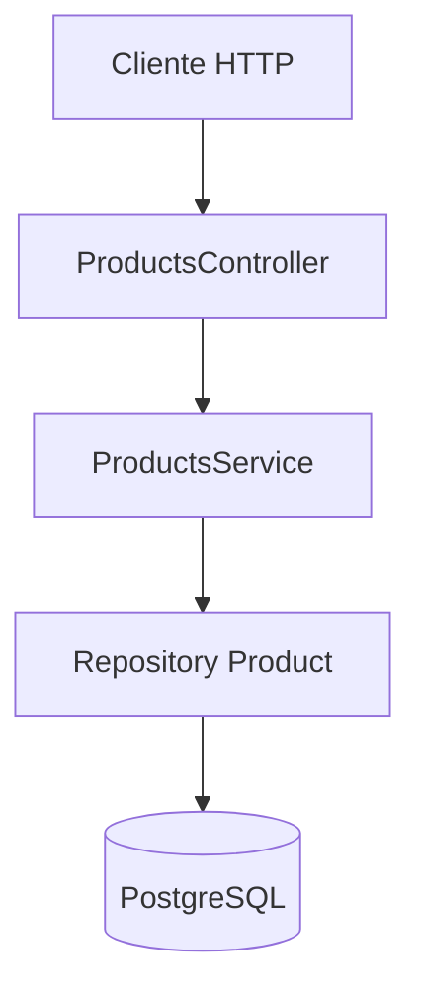
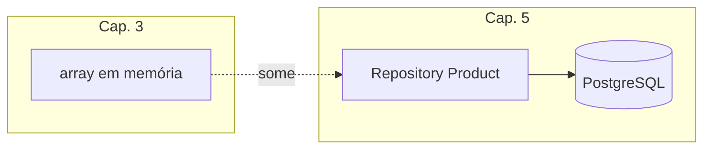
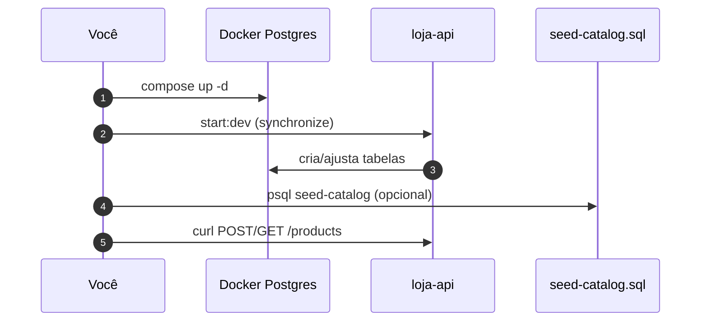

# CRUD de produtos com TypeORM e PostgreSQL

> *Episódio: a Caneca Nest sobrevive ao restart.*

## Objetivo deste material

Ao terminar, você deve conseguir:

1. Subir o **PostgreSQL** do lab e conectar o `loja-api` via TypeORM.
2. Persistir a entidade **`Product`** (mesmas rotas P do cap. 2).
3. Trocar o array em memória por `Repository<Product>` no `ProductsService`.
4. Validar com curls: criar, listar, buscar, atualizar, remover — dados sobrevivem ao `npm run start:dev` restart.

**Pré-requisito:** [Persistência (conceitos)](4.introducao_nestjs_persistencia.md) + DTOs do [2.1](2.1.dtos-e-validacao.md).  
**Próximo passo:** [Pedidos](5.1.pedidos.md).  
**Contrato HTTP:** [MAPA — Cap. 5](MAPA-LINHAS-P-A.md).

**Projeto:** continue o `loja-api` (não rode `nest new` de novo).

------

## 1. Contexto

**Ana** precisa que a Caneca Nest continue no Postgres depois do restart. As URLs **não mudam** (`/products`); o que muda é o **porão**: de array para PostgreSQL.





------

## 2. Subir o PostgreSQL

A partir de `backend/nest/` (ou copie o Compose para a raiz do `loja-api`):

```bash
docker compose -f docker-compose.postgres.yml up -d
docker compose -f docker-compose.postgres.yml ps
```

Espere o healthcheck. Credenciais: `loja` / `loja` / db `loja` / porta `5432`.



------

## 3. Dependências

No `loja-api`:

```bash
npm install @nestjs/typeorm typeorm pg
npm install @nestjs/config   # útil agora para .env; reaparece no cap. 6 (JWT)
```

> **Conceito: driver `pg`**  
> Biblioteca Node que fala o protocolo do PostgreSQL. Nesta trilha o TypeORM usa `type: 'postgres'` + `pg` (não MySQL).

------

## 4. Variáveis de ambiente

Crie `.env` na raiz do `loja-api`:

```properties
DB_HOST=localhost
DB_PORT=5432
DB_USERNAME=loja
DB_PASSWORD=loja
DB_DATABASE=loja
```

Garanta `.env` no `.gitignore`.

------

## 5. Conectar no `AppModule`

```typescript
import { Module } from '@nestjs/common';
import { ConfigModule, ConfigService } from '@nestjs/config';
import { TypeOrmModule } from '@nestjs/typeorm';
import { ProductsModule } from './products/products.module';

@Module({
  imports: [
    ConfigModule.forRoot({ isGlobal: true }),
    TypeOrmModule.forRootAsync({
      inject: [ConfigService],
      useFactory: (config: ConfigService) => ({
        type: 'postgres',
        host: config.get('DB_HOST'),
        port: Number(config.get('DB_PORT')),
        username: config.get('DB_USERNAME'),
        password: config.get('DB_PASSWORD'),
        database: config.get('DB_DATABASE'),
        autoLoadEntities: true,
        synchronize: true, // apenas desenvolvimento / aula
      }),
    }),
    ProductsModule,
  ],
})
export class AppModule {}
```

Se ainda não usa `@nestjs/config`, pode passar os valores literalmente como no [cap. 4](4.introducao_nestjs_persistencia.md) — o importante é `type: 'postgres'` e a porta `5432`.

------

## 6. Entidade `Product`

`src/products/product.entity.ts`:

```typescript
import { Column, Entity, PrimaryGeneratedColumn } from 'typeorm';

@Entity('products')
export class Product {
  @PrimaryGeneratedColumn()
  id: number;

  @Column({ length: 120 })
  name: string;

  @Column({ type: 'numeric', precision: 10, scale: 2 })
  price: number;

  @Column({ type: 'int' })
  stock: number;
}
```

> **Conceito: `@Entity` / `@Column`**  
> Decorators do TypeORM (não do Nest HTTP). Dizem ao ORM como montar a tabela `products`.

> **Nota lab:** colunas `numeric` no Postgres podem aparecer como **string** no JSON (`"39.90"`). Isso é normal; o TypeScript da entidade continua tipando `price: number`.

------

## 7. Registrar no `ProductsModule`

```typescript
import { Module } from '@nestjs/common';
import { TypeOrmModule } from '@nestjs/typeorm';
import { Product } from './product.entity';
import { ProductsService } from './products.service';
import { ProductsController } from './products.controller';

@Module({
  imports: [TypeOrmModule.forFeature([Product])],
  controllers: [ProductsController],
  providers: [ProductsService],
  exports: [ProductsService], // opcional — Desafio A / CatalogService; pedidos (5.1) usam Product no forFeature da transação
})
export class ProductsModule {}
```

------

## 8. Service com repositório

Substitua o array em memória:

```typescript
import { Injectable, NotFoundException } from '@nestjs/common';
import { InjectRepository } from '@nestjs/typeorm';
import { Repository } from 'typeorm';
import { Product } from './product.entity';
import { CreateProductDto } from './dto/create-product.dto';
import { UpdateProductDto } from './dto/update-product.dto';

@Injectable()
export class ProductsService {
  constructor(
    @InjectRepository(Product)
    private readonly productsRepository: Repository<Product>,
  ) {}

  findAll(): Promise<Product[]> {
    return this.productsRepository.find();
  }

  async findOne(id: number): Promise<Product> {
    const product = await this.productsRepository.findOne({ where: { id } });
    if (!product) {
      throw new NotFoundException(`Produto ${id} não encontrado`);
    }
    return product;
  }

  create(dto: CreateProductDto): Promise<Product> {
    const product = this.productsRepository.create(dto);
    return this.productsRepository.save(product);
  }

  async update(id: number, dto: UpdateProductDto): Promise<Product> {
    const product = await this.findOne(id);
    Object.assign(product, dto);
    return this.productsRepository.save(product);
  }

  async remove(id: number): Promise<void> {
    const result = await this.productsRepository.delete(id);
    if (!result.affected) {
      throw new NotFoundException(`Produto ${id} não encontrado`);
    }
  }
}
```

O **controller** permanece o do cap. 2/2.1 (mesmas rotas e DTOs). Só o service muda por baixo.

> **Conceito: mesma borda HTTP, outro miolo**  
> Clientes (front, curls, Swagger depois) não precisam saber se o dado veio de RAM ou do Postgres — desde que o contrato do [mapa](MAPA-LINHAS-P-A.md) se mantenha.

------

## 9. Linha P — testes manuais

```bash
npm run start:dev
```

```bash
curl -s -X POST http://localhost:3000/products \
  -H 'Content-Type: application/json' \
  -d '{"name":"Caneca Nest","price":39.9,"stock":10}'

curl -s http://localhost:3000/products
curl -s http://localhost:3000/products/1

curl -s -X PUT http://localhost:3000/products/1 \
  -H 'Content-Type: application/json' \
  -d '{"name":"Caneca Nest","price":29.9,"stock":8}'

curl -s -o /dev/null -w '%{http_code}\n' -X DELETE http://localhost:3000/products/1
```

Reinicie a API, crie de novo, liste: os dados **permanecem** (estão no volume do Postgres).

### Seed de catálogo (opcional, mas útil)

Com a API já tendo subido uma vez (`synchronize: true` criou `products`), a partir de `backend/nest/`:

```bash
docker exec -i loja-postgres psql -U loja -d loja < seed/seed-catalog.sql
curl -s http://localhost:3000/products
```

> Use `seed/seed.sql` (completo, com Ana/Cli) **só depois** dos caps. 5.1 + 6 — ele apaga `orders` / `users` e falha se as tabelas ainda não existirem.

Confira no banco:

```bash
docker exec -it loja-postgres psql -U loja -d loja -c 'SELECT * FROM products;'
```

------

## 10. Desafio (Linha A) — categorias

Opcional. Contrato: [MAPA — Cap. 5 A](MAPA-LINHAS-P-A.md).

- Entidade `Category` + CRUD `/categories`
- `Product.categoryId` (FK) + `PATCH /products/:id/category`
- `GET /categories/:id/products`

**Não importe** o módulo de categorias no código mínimo da linha P de pedidos se quiser manter o núcleo simples — ou isole bem. Dispensável para o cap. 5.1.

------

## Arquivos que você editou neste capítulo

- `loja-api/.env` · `src/app.module.ts` · `src/products/product.entity.ts` · `src/products/products.service.ts` · `src/products/products.module.ts`

------

## Checkpoint

1. O que acontece com `synchronize: true` se você renomear uma coluna na entidade?  
2. Por que `NotFoundException` no service é melhor do que devolver `null` silencioso no controller?  
3. Qual arquivo você mudaria se amanhã a loja fosse para um Postgres na nuvem (só host/senha)?

> **O que a loja ganhou hoje:** o catálogo **sobrevive ao restart** — a Caneca Nest continua no banco.

------

**Contrato HTTP:** [MAPA — Cap. 5](MAPA-LINHAS-P-A.md) — em conflito, o mapa prevalece.
