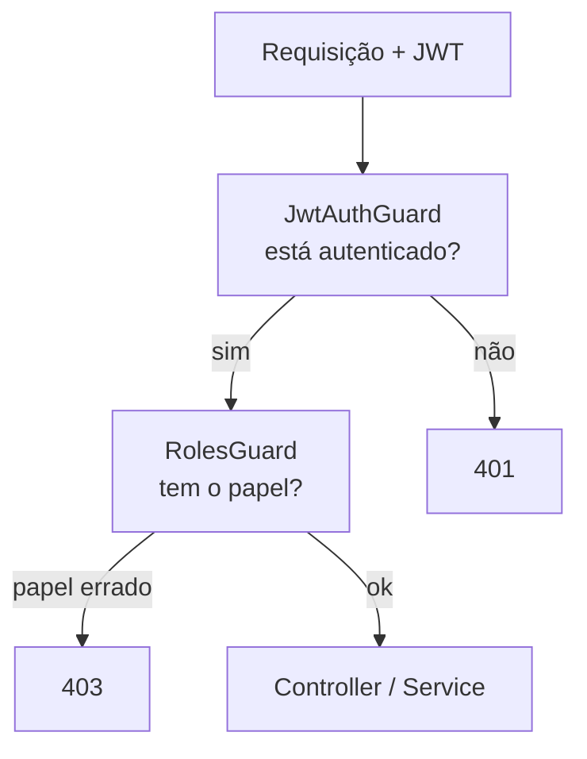

# Autorização por papéis (roles)

> *Episódio: o mesmo token não abre todas as portas — Ana administra, Cli compra.*

## Objetivo deste material

Ao terminar, você deve conseguir:

1. Distinguir **401 Unauthorized** de **403 Forbidden**.
2. Carregar `role` no JWT (`ADMIN` | `CLIENT`) e em `request.user`.
3. Criar `@Roles(...)` + `RolesGuard` e aplicar a matriz P do [mapa — Cap. 7](MAPA-LINHAS-P-A.md).
4. Garantir: só **Ana (ADMIN)** cria/edita/apaga produto; **Cli (CLIENT)** faz pedidos nos próprios recursos.

**Pré-requisito:** [Autenticação JWT](6.autenticacao.md).  
**Próximo passo:** [Swagger](8.documentacao_api.md).  
**Contrato HTTP:** [MAPA — Cap. 7](MAPA-LINHAS-P-A.md) — em conflito, o mapa prevalece.  
**Seed:** [seed/](seed/) — `ana` / `cli` / `secret123`.

------

## 1. Contexto

**Até aqui:** catálogo + pedidos + JWT (identidade). No cap. de autenticação, *estar logado* bastava para mutar o catálogo. Na loja, **Cli** compra; **Ana** mexe no estoque/catálogo.



> **Conceito: autenticação × autorização**  
> - **401:** não sabemos quem você é (sem token / token inválido).  
> - **403:** sabemos quem é, mas **não pode** executar essa ação.

------

## 2. Confirmar `role` no usuário e no token

Se seguiu o cap. 6, `User.role` já existe (`default: 'CLIENT'`) e o login já coloca `role` no payload.

Checklist:

| Peça | Deve expor `role` |
|------|-------------------|
| Coluna / campo `User.role` | sim |
| Payload JWT no `login` | `sub`, `username`, `role` |
| `JwtStrategy.validate` | `{ userId, username, role }` |

Seed de Ana e Cli (lab):

```bash
# a partir de backend/nest/
docker exec -i loja-postgres psql -U loja -d loja < seed/seed.sql
# se o shell estiver em loja-api/: use ../seed/seed.sql
```

> **Lembrete P:** register **nunca** aceita `role` no body. ADMIN vem do [seed](seed/README.md).

------

## 3. Decorator `@Roles`

`src/auth/roles.decorator.ts`:

```typescript
import { SetMetadata } from '@nestjs/common';

export const ROLES_KEY = 'roles';
export const Roles = (...roles: string[]) => SetMetadata(ROLES_KEY, roles);
```

> **Conceito: metadata**  
> `@Roles('ADMIN')` não bloqueia sozinho: só **anota** a rota. Quem lê a anotação e decide é o **guard**.

------

## 4. `RolesGuard`

`src/auth/roles.guard.ts`:

```typescript
import {
  CanActivate,
  ExecutionContext,
  ForbiddenException,
  Injectable,
} from '@nestjs/common';
import { Reflector } from '@nestjs/core';
import { ROLES_KEY } from './roles.decorator';

@Injectable()
export class RolesGuard implements CanActivate {
  constructor(private readonly reflector: Reflector) {}

  canActivate(context: ExecutionContext): boolean {
    const requiredRoles = this.reflector.getAllAndOverride<string[]>(ROLES_KEY, [
      context.getHandler(),
      context.getClass(),
    ]);

    // Rota sem @Roles → não restringe por papel (ainda pode ter JwtAuthGuard)
    if (!requiredRoles || requiredRoles.length === 0) {
      return true;
    }

    const { user } = context.switchToHttp().getRequest();
    if (!user?.role || !requiredRoles.includes(user.role)) {
      throw new ForbiddenException('papel insuficiente para esta operação');
    }
    return true;
  }
}
```

Ordem típica nos handlers:

```typescript
@UseGuards(JwtAuthGuard, RolesGuard)
@Roles('ADMIN')
```

Primeiro autentica; depois autoriza.

------

## 5. Matriz P — aplicar nas rotas

### Produtos

| Rota | Guards / roles |
|------|----------------|
| `GET /products`, `GET /products/:id` | público (sem JWT) |
| `POST`, `PUT`, `DELETE` | `JwtAuthGuard` + `RolesGuard` + `@Roles('ADMIN')` |

Substitua as mutações do `ProductsController` (cap. 6 só tinha `JwtAuthGuard`) por:

```typescript
import {
  Body,
  Controller,
  Delete,
  Get,
  HttpCode,
  Param,
  ParseIntPipe,
  Post,
  Put,
  UseGuards,
} from '@nestjs/common';
import { JwtAuthGuard } from '../auth/jwt-auth.guard';
import { Roles } from '../auth/roles.decorator';
import { RolesGuard } from '../auth/roles.guard';
import { CreateProductDto } from './dto/create-product.dto';
import { UpdateProductDto } from './dto/update-product.dto';
import { ProductsService } from './products.service';

// GET findAll / findOne — públicos (sem guard), como no cap. 6

@Post()
@UseGuards(JwtAuthGuard, RolesGuard)
@Roles('ADMIN')
create(@Body() dto: CreateProductDto) {
  return this.productsService.create(dto);
}

@Put(':id')
@UseGuards(JwtAuthGuard, RolesGuard)
@Roles('ADMIN')
update(
  @Param('id', ParseIntPipe) id: number,
  @Body() dto: UpdateProductDto,
) {
  return this.productsService.update(id, dto);
}

@Delete(':id')
@UseGuards(JwtAuthGuard, RolesGuard)
@Roles('ADMIN')
@HttpCode(204)
remove(@Param('id', ParseIntPipe) id: number) {
  return this.productsService.remove(id);
}
```

> **Cli** em `PUT`/`DELETE` `/products` → **403**, não 401 (está autenticado, mas sem papel ADMIN).

### Pedidos

| Rota | Comportamento P |
|------|-----------------|
| `POST /orders` | JWT (CLIENT ou ADMIN) — `userId` do token |
| `GET /orders` | JWT — CLIENT só os próprios; ADMIN pode ver todos |
| `GET /orders/:id` | JWT — dono ou ADMIN |
| `POST /orders/:id/cancel` | JWT — dono (ou ADMIN, se quiser) |

No controller, passe `userId` **e** `role` do token. No service (evolua o cap. 6):

```typescript
findAllForActor(userId: number, role: string): Promise<Order[]> {
  if (role === 'ADMIN') {
    return this.findAll();
  }
  return this.findAllForUser(userId);
}

async findOneForActor(id: number, userId: number, role: string): Promise<Order> {
  const order = await this.findOne(id);
  if (role !== 'ADMIN' && order.userId !== userId) {
    throw new NotFoundException(`Pedido ${id} não encontrado`);
  }
  return order;
}

async cancelForActor(id: number, userId: number, role: string): Promise<Order> {
  await this.findOneForActor(id, userId, role);
  return this.cancel(id);
}
```

Substitua no `OrdersController` os métodos do cap. 6 (`findAllForUser` / `findOneForUser` / `cancelForUser`) por esta versão **completa**:

```typescript
import { Body, Controller, Get, Param, ParseIntPipe, Post, Req, UseGuards } from '@nestjs/common';
import { JwtAuthGuard } from '../auth/jwt-auth.guard';
import { CreateOrderDto } from './dto/create-order.dto';
import { OrdersService } from './orders.service';

@Controller('orders')
export class OrdersController {
  constructor(private readonly ordersService: OrdersService) {}

  @Post()
  @UseGuards(JwtAuthGuard)
  create(
    @Req() req: { user: { userId: number } },
    @Body() dto: CreateOrderDto,
  ) {
    return this.ordersService.create(dto, req.user.userId);
  }

  @Get()
  @UseGuards(JwtAuthGuard)
  findAll(@Req() req: { user: { userId: number; role: string } }) {
    return this.ordersService.findAllForActor(req.user.userId, req.user.role);
  }

  @Get(':id')
  @UseGuards(JwtAuthGuard)
  findOne(
    @Req() req: { user: { userId: number; role: string } },
    @Param('id', ParseIntPipe) id: number,
  ) {
    return this.ordersService.findOneForActor(id, req.user.userId, req.user.role);
  }

  @Post(':id/cancel')
  @UseGuards(JwtAuthGuard)
  cancel(
    @Req() req: { user: { userId: number; role: string } },
    @Param('id', ParseIntPipe) id: number,
  ) {
    return this.ordersService.cancelForActor(id, req.user.userId, req.user.role);
  }
}
```

> **Cli** vê só os próprios pedidos; **Ana (ADMIN)** lista e abre qualquer pedido via `findAllForActor` / `findOneForActor`.

### Rotas didáticas (opcional, mapa)

```typescript
@Get('demo/admin')
@UseGuards(JwtAuthGuard, RolesGuard)
@Roles('ADMIN')
demoAdmin() {
  return { ok: true, area: 'admin' };
}

@Get('demo/client')
@UseGuards(JwtAuthGuard, RolesGuard)
@Roles('CLIENT')
demoClient() {
  return { ok: true, area: 'client' };
}
```

(Coloque num controller adequado, ex. `AppController` ou `DemoController`.)

------

## 6. Registrar o guard (obrigatório na linha P)

**Por rota** (mais explícito na aula): `@UseGuards(JwtAuthGuard, RolesGuard)` em cada método.

No `AuthModule`, registre e **exporte** os guards:

```typescript
import { JwtAuthGuard } from './jwt-auth.guard';
import { RolesGuard } from './roles.guard';

@Module({
  // ... imports existentes
  providers: [AuthService, JwtStrategy, JwtAuthGuard, RolesGuard],
  exports: [AuthService, JwtModule, PassportModule, JwtAuthGuard, RolesGuard],
})
export class AuthModule {}
```

Em `ProductsModule` e `OrdersModule`, **importe** o `AuthModule` (senão o Nest pode não resolver a DI dos guards / strategy no contexto do módulo):

```typescript
import { AuthModule } from '../auth/auth.module';

@Module({
  imports: [
    TypeOrmModule.forFeature([/* ... */]),
    AuthModule,
  ],
  // controllers, providers...
})
export class ProductsModule {}
```

Faça o mesmo em `OrdersModule`.

------

## 7. Linha P — curls de evidência (Ana × Cli)

Extrair token — opção **A** (python3) | **B** (jq) | **C** (manual). Detalhes em [CURLS-P.md](CURLS-P.md).

```bash
# Opção A — python3 (padrão abaixo)
TOKEN_CLI=$(curl -s -X POST http://localhost:3000/auth/login \
  -H 'Content-Type: application/json' \
  -d '{"username":"cli","password":"secret123"}' \
  | python3 -c "import sys,json; print(json.load(sys.stdin)['access_token'])")

TOKEN_ANA=$(curl -s -X POST http://localhost:3000/auth/login \
  -H 'Content-Type: application/json' \
  -d '{"username":"ana","password":"secret123"}' \
  | python3 -c "import sys,json; print(json.load(sys.stdin)['access_token'])")

# Opção B — jq: ... | jq -r .access_token
# Opção C — manual: export TOKEN_ANA='eyJ...'  export TOKEN_CLI='eyJ...'

# Cli tenta criar produto → 403
curl -s -o /dev/null -w '%{http_code}\n' -X POST http://localhost:3000/products \
  -H "Authorization: Bearer $TOKEN_CLI" \
  -H 'Content-Type: application/json' \
  -d '{"name":"X","price":1,"stock":1}'

# Ana cria → 201
curl -s -X POST http://localhost:3000/products \
  -H "Authorization: Bearer $TOKEN_ANA" \
  -H 'Content-Type: application/json' \
  -d '{"name":"Caneca","price":39.9,"stock":5}'

# Cli cria pedido → 201
curl -s -X POST http://localhost:3000/orders \
  -H "Authorization: Bearer $TOKEN_CLI" \
  -H 'Content-Type: application/json' \
  -d '{"items":[{"productId":1,"quantity":1}]}'
```

| Caso | Status esperado |
|------|-----------------|
| Sem token em `POST /products` | `401` |
| Cli em `POST /products` | `403` |
| Ana em `POST /products` | `201` |
| Cli em `POST /orders` | `201` |

------

## 8. Desafio (Linha A)

- Role **`MANAGER`**: pode `PUT` produto e ver todos os pedidos; **não** pode `DELETE` produto.  
- `@Roles('ADMIN')` nas rotas A de `/categories` (se implementou no cap. 5).

Dispensável para o cap. 8.

------

## Arquivos que você editou neste capítulo

- `src/auth/roles.decorator.ts` · `src/auth/roles.guard.ts` · `src/auth/auth.module.ts` · `src/products/products.controller.ts` · `src/products/products.module.ts` · `src/orders/orders.controller.ts` · `src/orders/orders.service.ts` · `src/orders/orders.module.ts`

------

## Checkpoint

1. Por que `@Roles` sem `RolesGuard` não protege nada?  
2. Token válido do Cli em rota `@Roles('ADMIN')` gera 401 ou 403?  
3. “Só o dono do pedido” — no guard de roles ou no **service** de orders?

> **O que a loja ganhou hoje:** permissões — o mesmo token não abre todas as portas.

------

## Referências

- [Authorization (Nest)](https://docs.nestjs.com/security/authorization)  
- [Guards](https://docs.nestjs.com/guards)  
- Próximo: [8.documentacao_api.md](8.documentacao_api.md)

------

**Contrato HTTP:** [MAPA — Cap. 7](MAPA-LINHAS-P-A.md) — em conflito, o mapa prevalece.
