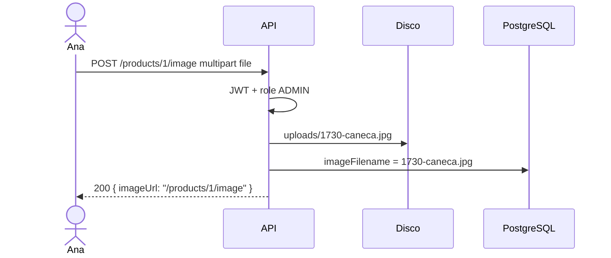

# Upload de imagem do produto

> *Episódio: foto na Caneca Nest — vitrine visual.*

## Objetivo deste material

Ao terminar, você deve conseguir:

1. Explicar a diferença entre JSON e **`multipart/form-data`**.
2. Salvar uma imagem em disco com **Multer** e guardar só o **`imageFilename`** no Postgres.
3. Expor `POST /products/:id/image` (Ana / ADMIN) e `GET /products/:id/image` (público).
4. Validar produto inexistente (`404`) e tipo/tamanho do arquivo.

**Pré-requisito:** [Swagger](8.documentacao_api.md).  
**Próximo passo:** [Testes](10.testes_software.md).  
**Contrato HTTP:** [MAPA — Cap. 9](MAPA-LINHAS-P-A.md) — em conflito, o mapa prevalece.

> Evolua o **`loja-api`**. Não crie um projeto separado.

------

## 1. Contexto

**Até aqui:** catálogo, pedidos, JWT, roles e Swagger. Ana quer foto na Caneca Nest. O cliente (ou o Postman) envia um **arquivo**.



**Modelo único (linha P):**

| Campo | Onde | Conteúdo |
|-------|------|----------|
| `imageFilename` | coluna no `Product` | nome do arquivo em `./uploads` |
| `imageUrl` | só na **resposta** HTTP | path público `/products/:id/image` (não precisa ser coluna) |

------

## 2. Dependências e pasta

```bash
npm install multer
npm install -D @types/multer
mkdir -p uploads
echo 'uploads/' >> .gitignore
```

------

## 3. Entidade — um campo só

```typescript
@Column({ type: 'varchar', length: 255, nullable: true })
imageFilename: string | null;
```

Com `synchronize: true`, reinicie a API após adicionar a coluna.

No service:

```typescript
async updateImageFilename(id: number, filename: string) {
  const product = await this.findOne(id);
  product.imageFilename = filename;
  return this.productsRepository.save(product);
}
```

------

## 4. Rotas no `ProductsController`

> **Ordem das rotas:** `@Post(':id/image')` e `@Get(':id/image')` convivem com `@Get(':id')` — `/products/1/image` tem **dois** segmentos após `/products`; `:id` sozinho não captura essa URL.

```typescript
import {
  BadRequestException,
  Controller,
  Get,
  NotFoundException,
  Param,
  ParseIntPipe,
  Post,
  Res,
  UploadedFile,
  UseGuards,
  UseInterceptors,
} from '@nestjs/common';
import { FileInterceptor } from '@nestjs/platform-express';
import { diskStorage } from 'multer';
import type { Response } from 'express';
import { createReadStream, existsSync } from 'fs';
import { join } from 'path';
import { JwtAuthGuard } from '../auth/jwt-auth.guard';
import { Roles } from '../auth/roles.decorator';
import { RolesGuard } from '../auth/roles.guard';

@Post(':id/image')
@UseGuards(JwtAuthGuard, RolesGuard)
@Roles('ADMIN')
@UseInterceptors(
  FileInterceptor('file', {
    storage: diskStorage({
      destination: './uploads',
      filename: (_req, file, cb) => {
        const safe = file.originalname.replace(/\s+/g, '_');
        cb(null, `${Date.now()}-${safe}`);
      },
    }),
    limits: { fileSize: 2 * 1024 * 1024 },
    fileFilter: (_req, file, cb) => {
      const ok = ['image/jpeg', 'image/png', 'image/webp'].includes(file.mimetype);
      // passe Error tipado como qualquer → Nest/Multer; preferível rejeitar e tratar no handler
      if (!ok) {
        return cb(null, false);
      }
      cb(null, true);
    },
  }),
)
async uploadImage(
  @Param('id', ParseIntPipe) id: number,
  @UploadedFile() file: Express.Multer.File,
) {
  if (!file) {
    throw new BadRequestException('envie o campo file (jpeg/png/webp)');
  }
  await this.productsService.updateImageFilename(id, file.filename);
  return {
    productId: id,
    imageUrl: `/products/${id}/image`,
  };
}

@Get(':id/image')
async getImage(
  @Param('id', ParseIntPipe) id: number,
  @Res() res: Response,
) {
  const product = await this.productsService.findOne(id);
  if (!product.imageFilename) {
    throw new NotFoundException('produto sem imagem');
  }
  const path = join(process.cwd(), 'uploads', product.imageFilename);
  if (!existsSync(path)) {
    throw new NotFoundException('arquivo ausente no disco');
  }
  createReadStream(path).pipe(res);
}
```

> **Conceito: `FileInterceptor('file')`**  
> O nome `'file'` = campo do form (`-F 'file=@foto.jpg'`).

> **Conceito: filename no banco, bytes no disco**  
> O Postgres não guarda a foto neste desenho — só o nome. O `GET` monta o caminho e streaming o arquivo.

------

## 5. Linha P — curls (Ana sobe a foto)

Use o JPEG do material [`fixtures/caneca.jpg`](fixtures/caneca.jpg) (copie para `loja-api/fixtures/` ou ajuste o path do `-F`).

```bash
# a partir de loja-api/, se copiou a fixture:
mkdir -p fixtures
cp ../fixtures/caneca.jpg ./fixtures/ 2>/dev/null || true

# Token JWT — opção A (python3) | B (jq) | C (manual) — ver [CURLS-P.md](CURLS-P.md)
TOKEN_ANA=$(curl -s -X POST http://localhost:3000/auth/login \
  -H 'Content-Type: application/json' \
  -d '{"username":"ana","password":"secret123"}' \
  | python3 -c "import sys,json; print(json.load(sys.stdin)['access_token'])")
# Opção B — jq: ... | jq -r .access_token

curl -s -X POST http://localhost:3000/products/1/image \
  -H "Authorization: Bearer $TOKEN_ANA" \
  -F "file=@./fixtures/caneca.jpg"

curl -s -o /tmp/caneca.jpg -w '%{http_code}\n' http://localhost:3000/products/1/image
# 200

# Cli (CLIENT) tenta upload → 403
TOKEN_CLI=$(curl -s -X POST http://localhost:3000/auth/login \
  -H 'Content-Type: application/json' \
  -d '{"username":"cli","password":"secret123"}' \
  | python3 -c "import sys,json; print(json.load(sys.stdin)['access_token'])")
# Opção C — manual: export TOKEN_CLI='eyJ...'

curl -s -o /dev/null -w '%{http_code}\n' -X POST http://localhost:3000/products/1/image \
  -H "Authorization: Bearer $TOKEN_CLI" \
  -F "file=@./fixtures/caneca.jpg"
# esperado: 403

# MIME inválido → 400 (fileFilter rejeita; handler vê !file)
echo 'nao-e-imagem' > /tmp/fake.txt
curl -s -o /dev/null -w '%{http_code}\n' -X POST http://localhost:3000/products/1/image \
  -H "Authorization: Bearer $TOKEN_ANA" \
  -F "file=@/tmp/fake.txt"
# esperado: 400
```

Anote as rotas novas no Swagger — o cap. 8 documentou o núcleo; **aqui** completa a imagem:

```typescript
import { ApiBearerAuth, ApiBody, ApiConsumes, ApiTags } from '@nestjs/swagger';

@ApiTags('products')
@ApiBearerAuth()
@ApiConsumes('multipart/form-data')
@ApiBody({
  schema: {
    type: 'object',
    properties: {
      file: { type: 'string', format: 'binary' },
    },
  },
})
@Post(':id/image')
@UseGuards(JwtAuthGuard, RolesGuard)
@Roles('ADMIN')
// ... FileInterceptor + handler como acima
```

------

## 6. Desafio (Linha A)

Várias imagens, MIME/tamanho, `DELETE` — ver [mapa](MAPA-LINHAS-P-A.md). Dispensável para testes.

------

## Arquivos que você editou neste capítulo

- `loja-api/.gitignore` (`uploads/`) · `uploads/` · `src/products/product.entity.ts` (`imageFilename`) · `products.service.ts` (`updateImageFilename`) · `products.controller.ts` (`POST`/`GET :id/image` + `FileInterceptor`)

------

## Checkpoint

1. Por que não usar `Content-Type: application/json` para a foto?  
2. O que fica no banco e o que fica no disco?  
3. Quem pode fazer o `POST` — Ana ou Cli?

> **O que a loja ganhou hoje:** o catálogo deixa de ser só texto — tem **vitrine visual**.

------

**Contrato HTTP:** [MAPA — Cap. 9](MAPA-LINHAS-P-A.md) — em conflito, o mapa prevalece.
