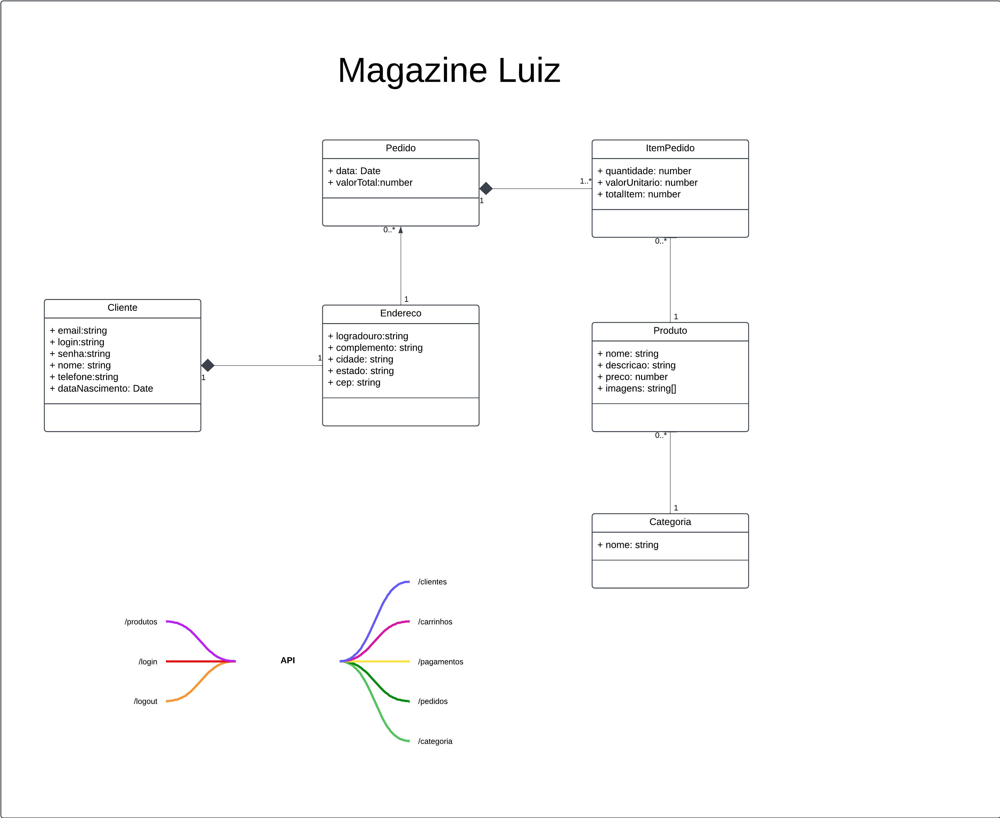

### Exercício: Desenvolvimento de Backend para um E-commerce com TypeORM e NestJS

#### **Objetivo**

Implementar um backend para um e-commerce baseado no diagrama UML fornecido, utilizando **NestJS** e **TypeORM** para o mapeamento das entidades. O sistema deve incluir endpoints HTTP RESTful para gerenciar os dados das entidades descritas no diagrama. Como desafio, os alunos devem modelar e implementar a funcionalidade de **Pagamento**, que não está incluída no diagrama inicial.



------

### **Descrição do Exercício**

O objetivo é criar o backend de um sistema de e-commerce utilizando o framework **NestJS** e o ORM **TypeORM**. Um diagrama UML será fornecido, contendo a modelagem inicial das entidades do sistema, que inclui as seguintes classes:

- **Cliente**
- **Pedido**
- **Endereço**
- **ItemPedido**
- **Produto**
- **Categoria**

Vocês deverão implementar:

1. O mapeamento ORM dessas entidades no banco de dados utilizando **TypeORM**.
2. Endpoints HTTP RESTful para manipulação de dados (criação, listagem, atualização, exclusão).
3. Como desafio, projetar e implementar a funcionalidade de **Pagamentos**, incluindo a modelagem da entidade e os endpoints necessários para gerenciar essa funcionalidade.

------

### **Especificações Técnicas**

#### **1. Configuração inicial**

1. Crie um novo projeto NestJS utilizando o comando:

   ```bash
   npx @nestjs/cli new ecommerce-backend
   ```

2. Configure o projeto para utilizar o **TypeORM** com um banco de dados PostgreSQL ou MySQL.

#### **2. Implementação do backend**

Baseando-se no diagrama UML fornecido, implemente as entidades e seus relacionamentos no backend. Certifique-se de seguir a estrutura definida no diagrama e de configurar as seguintes relações entre as entidades:

- **Cliente**:
  - Um cliente pode ter múltiplos **Pedidos** e múltiplos **Endereços**.
- **Pedido**:
  - Um pedido está relacionado a um único **Cliente** e contém múltiplos **ItemPedido**.
- **Endereço**:
  - Um endereço está relacionado a um único **Cliente**.
- **ItemPedido**:
  - Um item de pedido pertence a um único **Pedido** e está relacionado a um único **Produto**.
- **Produto**:
  - Um produto pertence a uma única **Categoria**.
- **Categoria**:
  - Uma categoria pode conter múltiplos **Produtos**.

#### **3. Endpoints obrigatórios**

Implemente os seguintes endpoints RESTful para cada entidade do diagrama UML:

1. **Cliente**
   - Criar cliente.
   - Listar todos os clientes.
   - Buscar cliente por ID.
   - Atualizar cliente.
   - Remover cliente.
2. **Pedido**
   - Criar pedido para um cliente.
   - Listar todos os pedidos.
   - Buscar pedido por ID.
   - Atualizar pedido.
   - Excluir pedido.
3. **Endereço**
   - Adicionar endereço a um cliente.
   - Listar endereços de um cliente.
   - Atualizar endereço.
   - Excluir endereço.
4. **ItemPedido**
   - Adicionar itens a um pedido.
   - Listar itens de um pedido.
   - Remover itens de um pedido.
5. **Produto**
   - Criar produto.
   - Listar todos os produtos.
   - Buscar produto por ID.
   - Atualizar produto.
   - Excluir produto.
6. **Categoria**
   - Criar categoria.
   - Listar todas as categorias.
   - Buscar categoria por ID.
   - Atualizar categoria.
   - Excluir categoria.

------

### **4. Desafio: Pagamentos**

#### **Requisitos:**

Implemente a funcionalidade de **Pagamentos**, projetando e mapeando a nova entidade no banco de dados e criando os endpoints necessários.

- **Entidade Pagamento**:
  - ID, Valor, Data de Pagamento, Status (Pendente, Pago, Cancelado), Método de Pagamento (Cartão, Boleto, PIX).
  - Relacionamento com um único **Pedido**.
- **Endpoints**:
  - Criar um pagamento para um pedido.
  - Listar pagamentos com filtro por status ou pedido.
  - Atualizar o status de um pagamento.
  - Excluir um pagamento.

#### **Regras de negócio:**

1. Cada **Pedido** pode ter apenas um pagamento ativo.
2. Apenas pedidos no status "Aberto" podem ser pagos.
3. Não é permitido alterar o método de pagamento de um pagamento já registrado.

------

### **Extras**

- **Validações**: Utilize os decorators do NestJS para validar os dados recebidos nos endpoints.
- **Autodocumentação**: Gere a documentação automática da API com **Swagger**.

------

### **Critérios de Avaliação**

1. Implementação correta do mapeamento ORM das entidades fornecidas no diagrama.
2. Funcionamento dos endpoints HTTP obrigatórios.
3. Implementação do desafio de pagamento, atendendo às regras de negócio.
4. Organização e boas práticas de codificação.
5. Documentação clara dos endpoints e aplicação de validações.

------

### **Entrega**

- Submeta o código-fonte do projeto e um script para criar o banco de dados.
- Inclua no README instruções para rodar o backend e exemplos de requisições para os endpoints.

Se precisar de ajuda com o diagrama ou a configuração inicial, estou à disposição!