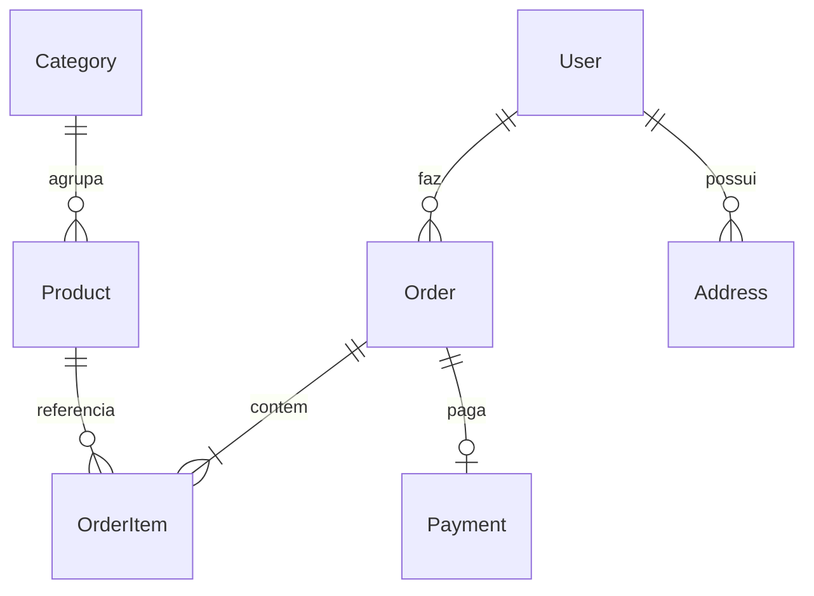
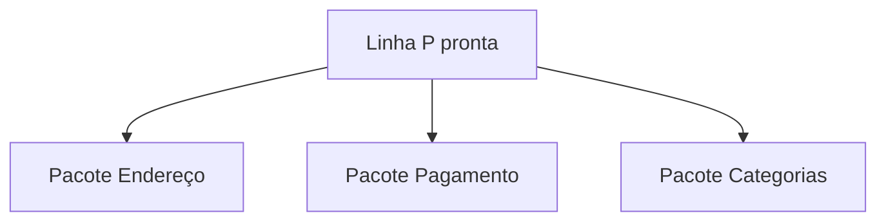
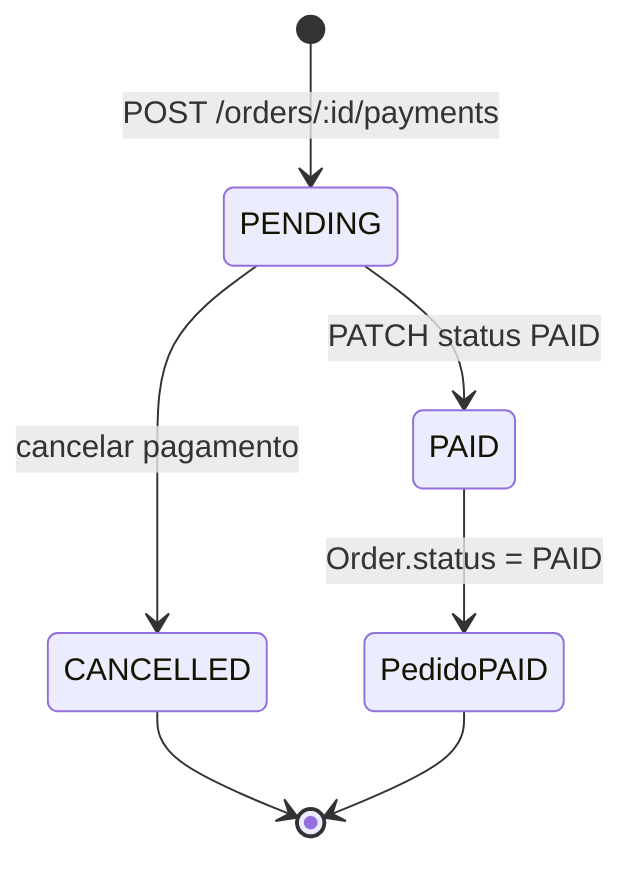

# Capstone — ampliando o `loja-api` (linha A)

> *Episódio final: pacotes A sem reinventar a loja.*

## Objetivo

Ampliar o **`loja-api` da trilha** com um ou mais **pacotes da linha A** do [mapa — Capstone](MAPA-LINHAS-P-A.md), usando NestJS + TypeORM + **PostgreSQL**.

Quem concluiu só a **linha P** já tem loja utilizável. Este exercício **não pede** `nest new` do zero.

**Pré-requisito:** linha P (caps. 1–10).  
**Contrato:** [MAPA-LINHAS-P-A.md](MAPA-LINHAS-P-A.md) — em conflito, o mapa prevalece.  
**Seed / curls:** [seed/](seed/), [CURLS-P.md](CURLS-P.md) — **Ana** (ADMIN) e **Cli** (CLIENT).

------

## 1. Contexto

Você evolui a mesma API da disciplina. O diagrama abaixo resume o domínio ampliado; na trilha os nomes oficiais são:

| Na figura / UML antigo | Na `loja-api` |
|------------------------|---------------|
| Cliente | **`User`** (Ana / Cli via auth) — não invente um CRUD paralelo de “Cliente” na linha P |
| Produto | **`Product`** |
| Pedido / Item | **`Order`** / **`OrderItem`** |
| Categoria / Endereço / Pagamento | **pacotes A** (este capstone) |

Visão do domínio ampliado (pacotes A):

```mermaid
erDiagram
  User ||--o{ Order : faz
  Order ||--|{ OrderItem : contem
  Product ||--o{ OrderItem : referencia
  User ||--o{ Address : possui
  Order ||--o| Payment : paga
  Category ||--o{ Product : agrupa
```

> **Inspiração visual** — **não** reinicie o projeto com `nest new`. Evolua o **`loja-api`** da linha P; os pacotes abaixo são só linha A.

```mermaid
flowchart TB
    P[Linha P pronta]
    P --> A1[Pacote Endereço]
    P --> A2[Pacote Pagamento]
    P --> A3[Pacote Categorias]
```

------

## 2. Regras gerais

1. Curls P do [CURLS-P.md](CURLS-P.md) continuam passando.  
2. Módulos A isolados.  
3. PostgreSQL + seed oficial.  
4. DTOs + Swagger das rotas novas.  
5. JWT / roles conforme o mapa.

------

## 3. Pacotes (escolha ≥ 1 completo)

### Endereço

| Método | Rota | Auth |
|--------|------|------|
| `POST/GET/PUT/DELETE` | `/addresses` | JWT (Cli: próprios) |
| `PATCH` | `/orders/:id/address` | JWT + `{ "addressId" }` |

### Pagamento

| Método | Rota | Regras |
|--------|------|--------|
| `POST` | `/orders/:id/payments` | 1 ativo/pedido; só `OPEN` |
| `GET` | `/payments` | filtros; JWT/ADMIN |
| `PATCH` | `/payments/:id/status` | `PAID` → pedido `PAID` |
| `DELETE` | `/payments/:id` | ADMIN |

Métodos: `CARD` \| `BOLETO` \| `PIX`. Status: `PENDING` \| `PAID` \| `CANCELLED`.

```mermaid
stateDiagram-v2
    [*] --> PENDING: POST /orders/:id/payments
    PENDING --> PAID: PATCH status PAID
    PENDING --> CANCELLED: cancelar pagamento
    PAID --> PedidoPAID: Order.status = PAID
    CANCELLED --> [*]
    PedidoPAID --> [*]
```

### Catálogo rico

CRUD `/categories` + associação produto ([mapa Cap. 5 A](MAPA-LINHAS-P-A.md)).

------

## 4. Critérios

| Nível | Entrega |
|-------|---------|
| Mínimo | Linha P + README |
| Médio | P + 1 pacote A |
| Completo | P + categorias + endereço + pagamento + Swagger |

------

## 5. Entrega

- Repo do `loja-api`  
- README: Postgres, seed Ana/Cli, curls A  
- Swagger `/api`

------

## Checkpoint

1. A entrega ainda passa nos curls P sem o pacote A?  
2. Pagamento impede segundo pagamento ativo?  
3. Cli consegue ligar endereço de outra pessoa ao pedido?

> **O que a loja ganhou hoje:** (você escolhe) endereço, pagamento ou categorias — além do núcleo P.

------

**Contrato HTTP:** [MAPA — Capstone](MAPA-LINHAS-P-A.md) — em conflito, o mapa prevalece.
