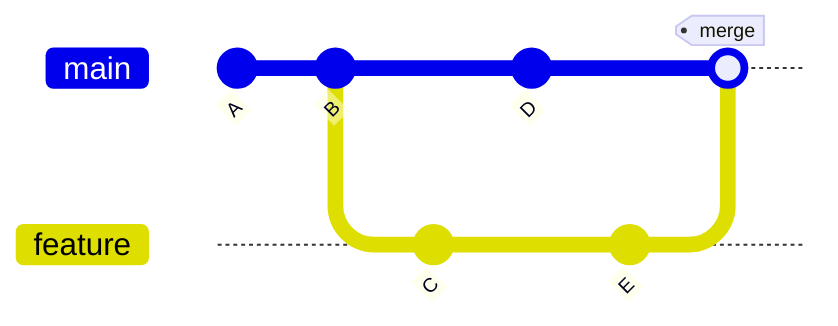

## Git: Merges, Rebase e Resolução de Conflitos (Material Aprofundado)

Este guia vai além do básico para que seus alunos entendam, pratiquem e fiquem prontos para trabalhar em equipes profissionais. Inclui teoria essencial, visualizações, exercícios práticos reproduzíveis e troubleshooting.

### O que você aprenderá

- Como o Git representa o histórico (DAG) e como isso afeta merges e rebase.
- Tipos de merge: fast-forward, merge commit (no-FF), squash merge.
- Como surgem conflitos e como resolvê-los com segurança.
- Quando usar merge vs rebase; riscos de reescrever histórico.
- Técnicas úteis: autosquash, mergetool, revert, cherry-pick, bisect, reflog.

---

## 1) Fundamentos: histórico como DAG e ancestral comum

O Git armazena commits em um grafo acíclico direcionado (DAG). Cada commit aponta para seus pais (exceto o inicial). Quando fazemos merge, o Git precisa descobrir o ancestral comum (merge base) entre duas linhas de desenvolvimento para calcular o “delta” de cada lado.

Conceitos-chave:

- Merge base: ancestral comum mais recente entre duas branches.
- 3-way merge: Git compara base, HEAD e outra branch para aplicar mudanças.
- Conflito: ocorre quando o mesmo trecho foi modificado de formas incompatíveis.

Diagrama simples (Mermaid) ilustrando histórico e merge base:



---

## 2) Tipos de merge na prática

### 2.1 Fast-forward (FF)

Ocorre quando a branch de destino não tem commits novos desde que a branch de origem foi criada; o ponteiro apenas “avança”.

Prós: histórico linear, sem commits de merge. Contras: perde-se a informação de que houve uma branch separada.

```bash
git switch main
git merge --ff-only feature/minha-feature   # falha se não for possível FF
```

### 2.2 Merge commit (no fast-forward)

Cria um commit de merge com dois pais, preservando o contexto de integração. Útil para PRs em projetos de equipe.

```bash
git switch main
git merge --no-ff feature/minha-feature -m "merge: integra minha-feature"
```

### 2.3 Squash merge

Condensa todos os commits de uma branch em um único commit no momento do merge. Muito usado em plataformas (via PR) para manter histórico limpo.

```bash
git switch main
git merge --squash feature/minha-feature
git commit -m "feat: adiciona minha-feature (squash)"
```

Quando escolher cada um?

- FF: mudanças pequenas/independentes, projeto pessoal, histórico estritamente linear.
- No-FF (merge commit): equipes com PRs e necessidade de visibilidade de integrações.
- Squash: branches com muitos commits de trabalho intermediário; prioriza um histórico mais conciso.

---

## 2.4 Como o Git calcula merges (um pouco de internals)

- 3-way merge: compara a BASE (merge-base), sua branch (HEAD) e a outra branch (MERGE_HEAD) e tenta aplicar mudanças de cada lado.
- Estratégias de merge (`-s`):
	- `ort` (padrão atual, rápido e com heurísticas melhores),
	- `recursive` (padrão antigo),
	- `octopus` (integra mais de duas branches de uma vez, só funciona sem conflitos),
	- `ours` (descarta mudanças do outro lado, raramente apropriado para código de produção).
- Opções da estratégia (`-X`), úteis em conflitos repetitivos:
	- `-X ours`/`-X theirs`: preferir o lado “nosso”/“deles” em conflitos de conteúdo,
	- `-X patience` ou `-X histogram`: algoritmos de diff que reduzem conflitos em arquivos com linhas reordenadas,
	- `-X ignore-space-change`/`-X ignore-all-space`: ignora diferenças de espaço em branco.
- Pré-visualização: `git merge --no-commit --no-ff <branch>` aplica o merge na staging area para você revisar antes de commitar.

Internamente, cada commit aponta para um objeto `tree` (estado do projeto), que aponta para `blobs` (conteúdos dos arquivos). Um commit de merge possui 2 (ou mais) pais; rebase reescreve pais, logo muda os hashes.

---

## 3) Rebase: reescrevendo a base dos seus commits

Rebase “pega” seus commits e os reaplica sobre uma nova base, produzindo um histórico linear.

```bash
# atualizar sua branch de feature alinhando-a com a main mais recente
git switch feature/minha-feature
git fetch origin
git rebase origin/main
```

Efeitos:

- Mantém histórico linear (bom para leitura e bisect).
- Reescreve commits (NOVOS hashes); por isso, evite rebase em branches públicas já compartilhadas.

Rebase interativo (limpar histórico antes do PR):

```bash
git rebase -i origin/main
# edite o todo list para squash/fixup/reword dos commits
```

Autosquash com Conventional Commits:

```bash
git commit --fixup=<hash>
git rebase -i --autosquash origin/main
```

Quando evitar rebase:

- Em branches já publicadas e consumidas por outras pessoas.
- Em repositórios com políticas que proíbem reescrita de histórico (branches protegidas).

---

### 3.1 Variantes de rebase úteis

- `git pull --rebase` ou `git config pull.rebase true`: evita merges de integração durante pull.
- `git rebase --onto <nova-base> <antiga-base> <branch>`: move uma branch para uma base totalmente diferente (útil ao trocar a base de feature).
- `git rebase --rebase-merges`: preserva a topologia de sub-branches ao reescrever (ao invés de linearizar tudo).
- Interactive rebase – comandos comuns no editor:
	- `pick` (mantém), `reword` (altera mensagem), `edit` (pausa para alterar o commit),
	- `squash`/`fixup` (combina commits), `drop` (remove), `exec` (executa comando).

Segurança: ao reescrever histórico, prefira `git push --force-with-lease` em vez de `--force`, para não sobrescrever trabalho alheio inadvertidamente.

---

## 4) Conflitos: como surgem e como resolver

Conflitos aparecem quando ambos os lados modificam o mesmo trecho de um arquivo de forma incompatível. O Git marca conflitos com indicadores em arquivo:

```text
<<<<<<< HEAD
conteúdo da sua branch
=======
conteúdo da outra branch
>>>>>>> feature/minha-feature
```

Passos para resolver conflitos:

1) Edite os arquivos e mantenha a versão correta (ou combine partes).
2) Remova os marcadores `<<<<<<<`, `=======`, `>>>>>>>`.
3) Teste localmente (build/testes) para garantir consistência.
4) `git add` para marcar como resolvido e então `git commit` (ou continue o rebase).

Ferramentas úteis:

- `git status` mostra o que está em conflito.
- `git diff` e `git diff --staged` para ver mudanças.
- `git mergetool` abre ferramentas gráficas (Kaleidoscope, Meld, VS Code) para ajudar a mesclar.
- Em rebase: `git rebase --continue`, `--skip`, `--abort`.
- Em merge: `git merge --abort` para voltar atrás.

Boas práticas:

- Integre frequentemente (branches curtas) para reduzir conflitos difíceis.
- Prefira mudanças menores e bem isoladas.
- Combine com testes automatizados para validar a resolução.

---

### 4.1 Tipos frequentes de conflitos e táticas

- `add/add`: ambos adicionaram o mesmo arquivo; você precisa decidir como uni-los.
- `modify/modify` (conteúdo): edições diferentes no mesmo trecho → editar manualmente ou usar mergetool.
- `rename/rename`: ambos renomearam o arquivo para nomes distintos → escolha um nome final e ajuste referências.
- `rename/modify`: um lado renomeou, o outro editou → aceite o rename e traga as edições para o novo caminho.
- `delete/modify`: um lado apagou, o outro editou → decidir manter (e aplicar edição) ou apagar.
- Binários: sem diff legível; escolha `ours`/`theirs` para o arquivo inteiro.
- Exec bit/permissões (chmod): pode haver conflito de permissão; escolha o bit final (ex.: `git update-index --chmod=+x arquivo`).

Configurações que ajudam:

```bash
# mostrar o conteúdo da BASE nos marcadores de conflito (melhor contexto)
git config --global merge.conflictStyle diff3
# ou o estilo mais novo com contexto extra
git config --global merge.conflictStyle zdiff3

# reutilizar resoluções vistas antes (grande ganho em monorepos)
git config --global rerere.enabled true
```

Atalhos úteis em resolução:

```bash
# escolher versão de um lado inteiro do arquivo
git checkout --ours -- caminho/arquivo
git checkout --theirs -- caminho/arquivo
# (ou com o comando moderno)
git restore --source=HEAD -- caminho/arquivo     # ours
git restore --source=MERGE_HEAD -- caminho/arq   # theirs
```

`git mergetool`: configure sua ferramenta preferida (ex.: VS Code) e chame `git mergetool` para uma UI de resolução.

---

## 5) Fluxos práticos reproduzíveis (passo a passo)

Todos os exemplos abaixo funcionam em Linux/Bash. Crie um diretório temporário para praticar.

### 5.1 Merge FF e No-FF

```bash
rm -rf /tmp/git-lab && mkdir -p /tmp/git-lab && cd /tmp/git-lab
git init
echo "v1" > app.txt && git add app.txt && git commit -m "chore: seed"
git switch -c feature/a
echo "A" >> app.txt && git commit -am "feat: adiciona A"
git switch -c main
git merge --ff-only feature/a   # fast-forward

# criar merge commit
git switch -c feature/b
echo "B" >> app.txt && git commit -am "feat: adiciona B"
git switch main
echo "v2" >> app.txt && git commit -am "chore: atualiza v2"
git merge --no-ff feature/b -m "merge: integra B"
git log --oneline --graph --decorate --all
```

### 5.2 Gerando um conflito e resolvendo

```bash
rm -rf /tmp/git-conflict && mkdir -p /tmp/git-conflict && cd /tmp/git-conflict
git init
printf "linha1\nlinha2\n" > data.txt
git add data.txt && git commit -m "chore: base"

git switch -c feature/x
sed -i 's/linha2/linha2 - X/' data.txt
git commit -am "feat: altera linha2 em X"

git switch -c main
sed -i 's/linha2/linha2 - MAIN/' data.txt
git commit -am "feat: altera linha2 em MAIN"

# tentar integrar e resolver conflito
git merge feature/x || true
cat data.txt   # observe marcadores de conflito
# edite manualmente data.txt para o resultado desejado, então:
git add data.txt
git commit -m "merge: resolve conflito de linha2"
```

### 5.2.1 Conflito de rename/modify

```bash
rm -rf /tmp/git-rename && mkdir -p /tmp/git-rename && cd /tmp/git-rename
git init
echo base > file.txt && git add file.txt && git commit -m "chore: base"

git switch -c feature/rename
git mv file.txt core.txt && git commit -m "refactor: renomeia file.txt para core.txt"

git switch -c main
echo edit >> file.txt && git commit -am "feat: edita file.txt em main"

git merge feature/rename || true
# resolvendo: manter o rename e levar a edição para core.txt
echo edit >> core.txt
git add -A
git commit -m "merge: resolve rename/modify levando edição para core.txt"
```

### 5.3 Rebase de uma feature em main

```bash
rm -rf /tmp/git-rebase && mkdir -p /tmp/git-rebase && cd /tmp/git-rebase
git init
echo 1 > num.txt && git add num.txt && git commit -m "chore: base"

git switch -c feature/incr
echo 2 >> num.txt && git commit -am "feat: adiciona 2"
echo 3 >> num.txt && git commit -am "feat: adiciona 3"

git switch -c main
echo 10 >> num.txt && git commit -am "chore: adiciona 10"

git switch feature/incr
git rebase main   # reaplica 2 e 3 por cima do commit com 10
git log --oneline --graph --decorate --all
```

### 5.4 Squash local antes do PR

```bash
rm -rf /tmp/git-squash && mkdir -p /tmp/git-squash && cd /tmp/git-squash
git init
echo base > f.txt && git add f.txt && git commit -m "chore: base"
git switch -c feat/toggle
echo a >> f.txt && git commit -am "feat: parte1"
echo b >> f.txt && git commit -am "feat: parte2"
git rebase -i HEAD~2    # marque como squash/fixup e reescreva a mensagem
git log --oneline
```

### 5.5 Recuperar-se de um rebase/merge problemático

```bash
# após perceber um problema, use o reflog para voltar a um ponto seguro
git reflog
git reset --hard <hash_seguro>
```

### 5.6 Revertendo um merge commit com segurança

```bash
# supondo que o merge criou um bug; identifique o hash do merge (dois pais)
git log --merges --oneline
# reverta o merge apontando o "pai principal" (normalmente 1)
git revert -m 1 <hash_do_merge>
```

---

## 6) Comparativo: merge vs rebase vs squash vs cherry-pick vs revert

- Merge: integra branches, preserva histórico paralelo; ideal para PRs.
- Rebase: reescreve sua linha de commits por cima de outra base; bom para manter linearidade antes de integrar.
- Squash: condensa commits antes da integração; bom para histórico limpo.
- Cherry-pick: aplica um commit específico em outra branch (ex.: hotfix em release).
- Revert: cria um commit que desfaz outro; seguro para histórico público.

Regras práticas:

- Prefira rebase em branches privadas/curtas antes do PR; faça merge (ou squash merge) no PR.
- Evite rebase em branches compartilhadas já publicadas.
- Use revert para desfazer no remoto; evite reset hard em histórico público.

---

### 6.1 Octopus merge e integrações múltiplas

Você pode mesclar múltiplas branches de uma vez se não houver conflitos:

```bash
git merge topic1 topic2 topic3
```

Se houver conflitos, o octopus falha (por design). Use merges pairwise ou rebase para preparar.

---

## 7) Ferramentas e integrações

- VS Code: integração nativa com Git, visualização de diffs e conflitos, "Accept Current/Incoming/Combine".
- Plataformas (GitHub/GitLab/Bitbucket): controles de merge (squash/merge/rebase), checks obrigatórios, branch protection.
- CI: garanta testes e linting verdes antes do merge.

---

## 8) Checklist e Troubleshooting

Checklist antes do merge:

- [ ] Sua branch está atualizada com a base? (`git fetch && git rebase origin/main`)
- [ ] Testes passam localmente e no CI?
- [ ] Commits fazem sentido (mensagens claras, sem artefatos)?
- [ ] Resolveu todos os conflitos e rodou os testes novamente?

Como sair de situações difíceis:

- Rebase travou: `git rebase --abort` para voltar ao estado anterior.
- Merge deu errado: `git merge --abort` (se possível) ou `git reset --hard` para um ponto do `reflog`.
- HEAD destacado: crie uma branch a partir do commit atual: `git switch -c hotfix/tmp`.
- Empurrou algo errado: prefira `git revert` em vez de `push --force` em branches compartilhadas.

Mais cenários e saídas:

- Stash em rebase/merge: `git rebase --autostash` ou `git pull --rebase --autostash` evita arquivos sujos.
- Arquivo ficou “unmerged”: após resolver, confirme com `git add` (não `git add -p`) e verifique `git status`.
- Esqueceu de testar antes de commitar o merge: use `git merge --no-commit` da próxima vez para validar antes.

Diagnóstico rápido:

```bash
git status
git log --graph --oneline --decorate --all -n 30
git diff    # antes de stage
git diff --staged
```

---

## 9) Exercícios para avaliação

1) Entregar um PR que causa conflito e resolvê-lo com merge.
2) Reescrever a feature com rebase e explicar os novos hashes.
3) Demonstrar um squash merge e apresentar o histórico final.
4) Usar cherry-pick para portar um fix específico para uma branch de release.
5) Simular um erro num rebase e recuperar com `reflog`/`reset --hard`.

Rubrica de avaliação (sugestão):

- Correção técnica (40%).
- Clareza das mensagens/PR e histórico (30%).
- Capacidade de recuperar-se de erros (20%).
- Boas práticas de testes/lint (10%).

---

## 10) Referências

- Pro Git (Livro): https://git-scm.com/book
- Documentação `git-merge`: https://git-scm.com/docs/git-merge
- Documentação `git-rebase`: https://git-scm.com/docs/git-rebase
- Atlassian Git Tutorials (merges e rebase): https://www.atlassian.com/git/tutorials/merging-vs-rebasing

---

## 11) Apêndice: .gitattributes e drivers de merge

Você pode ajustar o comportamento de merge por arquivo usando `.gitattributes`:

```gitattributes
# une linhas duplicadas (bom para listas simples, como CONTRIBUTORS)
CONTRIBUTORS merge=union

# tratar como binário (nunca tentar mesclar conteúdo)
*.psd binary

# preferir sempre a nossa versão (cuidado! apenas para arquivos gerados)
package-lock.json merge=ours
```

Depois, defina os drivers no `.git/config`:

```ini
[merge "union"]
	name = unifica linhas
	driver = union
```

Essas configurações reduzem conflitos repetitivos em arquivos específicos, mas use com critério para não mascarar problemas.

