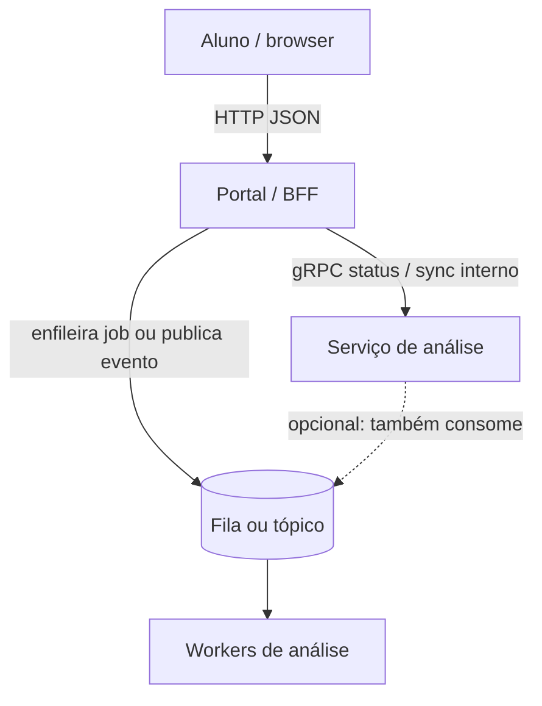

# 01 — Comunicação em sistemas distribuídos

**Conceito central:** como processos em máquinas diferentes trocam informação — e como escolher *entre* abordagens síncronas e assíncronas.  
**Domínio âncora:** aluno envia trabalho/prova; o sistema analisa depois (mesmo problema nos três labs).  
**Stack:** Python 3 · Docker Compose · Redis · Kafka · gRPC

Pré-requisito: [00 — Ambiente Docker](../00-ambiente-docker/).  
Apoio: [glossario.md](glossario.md) · [troubleshooting.md](troubleshooting.md)

---

## Objetivos de aprendizado

Ao final deste módulo, você deve ser capaz de:

1. **Explicar** como sistemas distribuídos se comunicam (troca de mensagens entre processos que não compartilham memória).
2. **Identificar** abordagens e padrões de comunicação (request–response / RPC, filas, tópicos/pub-sub, event-driven).
3. **Distinguir** comunicação **síncrona** e **assíncrona**, e as tecnologias típicas de cada família.
4. **Decidir** qual abordagem usar em um cenário, **ponderando trade-offs**.
5. **Relacionar** HTTP/REST, gRPC, filas e Kafka ao problema certo — e saber quando *não* usá-las.
6. **Experimentar** na prática: filas (caminho mínimo); tópicos Kafka e gRPC (caminho completo).

> Meta: argumentar uma escolha de comunicação — não só reproduzir `curl`.

---

## Caminhos de estudo

### Caminho mínimo (~4–5 h) — semana apertada

Fecha os objetivos **1–4** e a prática essencial de filas. O objetivo **6** (Kafka + gRPC) fica para o caminho completo — aqui você ganha a base para entender os trade-offs nos cenários de decisão.

1. [teoria.md](teoria.md) §1–4 e §7  
2. [tutorial-filas.md](tutorial-filas.md) (Partes A–C)  
3. [decisoes.md](decisoes.md) — cenários **1** e **6**  
4. Objetivo **5** (parcial): §1–2 de [tecnologias-e-escolhas.md](tecnologias-e-escolhas.md) ou Parte A do tutorial de filas  
5. Checklist **mínimo** abaixo  

**Pré-requisitos no host:** `curl`, `python3` (para `json.tool` nos exemplos), Docker Compose ([00 — Ambiente Docker](../00-ambiente-docker/)).

**Diagramas:** os `.md` usam Mermaid — renderizam no GitHub, no VS Code (preview) e em visualizadores compatíveis.

### Caminho completo (~8–10 h) — recomendado

| Ordem | Material | Tempo | Para quê |
|-------|----------|-------|----------|
| 1 | [teoria.md](teoria.md) | 40–60 min | Modelo mental |
| 2 | [tutorial-filas.md](tutorial-filas.md) | ~2 h | Fila · sync vs async · falha |
| 3 | [tutorial-kafka.md](tutorial-kafka.md) | ~1,5–2 h | Tópico · fan-out · replay |
| 4 | [tutorial-grpc.md](tutorial-grpc.md) | ~1,5–2 h | RPC tipado · sync vs async |
| 5 | [decisoes.md](decisoes.md) | 40–60 min | Trade-offs |

**Consulta (não é leitura linear obrigatória):** [tecnologias-e-escolhas.md](tecnologias-e-escolhas.md) — abra no workshop de decisões ou quando travar em “qual ferramenta?”. As Partes A dos tutoriais já cobrem o essencial de cada lab.

Cada tutorial: **A** tecnologia (curta, assume a teoria) → **B** contexto → **C** lab.

Kafka e gRPC são **aprofundamento**: faça-os depois que o lab de filas estiver sólido.

---

## Arco narrativo do módulo

1. **Dor** — no prazo, o envio trava se a análise for síncrona.  
2. **Alívio** — [filas](tutorial-filas.md): aceite rápido + worker depois.  
3. **Nova dor** — coordenação quer *também* notificar/auditar sem mudar a API → [Kafka](tutorial-kafka.md).  
4. **Nova dor** — portal HTTP na borda; miolo tipado entre serviços → [gRPC](tutorial-grpc.md).  
5. **Fechamento** — [decisoes.md](decisoes.md) + diagrama abaixo.

### Como as três peças se encaixam (sistema completo)

Em um portal acadêmico realista (escala de produto, não de lab):



| Camada | Papel | Lab que treina |
|--------|-------|----------------|
| HTTP na borda | Upload, recibo, painel | [filas](lab-filas/) · [kafka](lab-kafka/) (`POST`/`GET`) |
| Fila de jobs | Um processador por mensagem | [filas](lab-filas/) |
| Tópico / eventos | Vários interessados no mesmo fato | [kafka](lab-kafka/) |
| gRPC no miolo | Contrato tipado serviço↔serviço | [grpc](lab-grpc/) |

Os labs são **Compose separados** de propósito (um conceito por vez). O diagrama é o mapa mental de como recombinar depois.

### Escolha rápida (cola mental)

| Se você precisa… | Comece com… |
|------------------|-------------|
| Aceitar upload no pico e processar depois | HTTP curto + **fila** |
| Vários sistemas reagem ao mesmo fato | **Tópico** / eventos (Kafka) |
| Contrato tipado serviço↔serviço | **gRPC** (miolo) + HTTP na borda |
| Resposta completa na mesma chamada | RPC/HTTP **síncrono** |
| Replay / auditoria do passado | Log Kafka-like |

Detalhes: [tecnologias-e-escolhas.md](tecnologias-e-escolhas.md) · [decisoes.md](decisoes.md).

---

## Os três labs

| Lab | Porta | Ideia central |
|-----|-------|---------------|
| **[lab-filas](lab-filas/)** | `8080` | Fila Redis didática · contraste síncrono |
| **[lab-kafka](lab-kafka/)** | `8081` | Tópico · consumer groups · fan-out · replay |
| **[lab-grpc](lab-grpc/)** | `50051` | Unary sync · aceite async · streaming |

**Um lab por vez.** Antes de subir o próximo: `docker compose down -v` no lab anterior (evita conflito de portas/CPU). Ver [troubleshooting.md](troubleshooting.md).

```bash
cd sistemas-distribuidos/01-comunicacao/lab-filas && docker compose up -d --build
# … depois:
cd ../lab-kafka && docker compose up -d --build
cd ../lab-grpc  && docker compose up -d --build
```

---

## Bibliografia de apoio

Os textos abaixo fundamentam o módulo (capítulos de comunicação, EDA e trade-offs). Use os **títulos** na biblioteca / material do curso — não dependem de uma pasta local no clone do repositório.

| Fonte | Uso neste módulo |
|-------|------------------|
| van Steen & Tanenbaum, *Distributed Systems* | Tipos de comunicação · RPC · filas · semântica de entrega |
| Richards, *Software Architecture Patterns* | EDA mediator vs broker |
| Ford et al., *Software Architecture: The Hard Parts* | Trade-offs · acoplamento |
| Bellemare, *Building Event-Driven Microservices* | Comandos vs eventos |
| Richards & Ford, *Fundamentals of Software Architecture* | Comunicação como decisão |

---

## Critério de “pronto”

**Mínimo**

- [ ] Explico persistente/transiente e sync/async sem olhar o código.  
- [ ] No lab de **filas**: worker parado, escala, `kill` no meio do job.  
- [ ] Em **dois** cenários de [decisoes.md](decisoes.md), justifico vantagem + custo.  
- [ ] Sei em uma frase quando preferir fila (vs sync puro).

**Completo** (soma ao mínimo)

- [ ] Kafka: fan-out (worker + notifier), partições × consumidores, **replay**.  
- [ ] gRPC: latência sync vs aceite async; falha com servidor parado no sync.  
- [ ] Sei quando preferir fila, tópico Kafka ou gRPC — uma frase cada.
