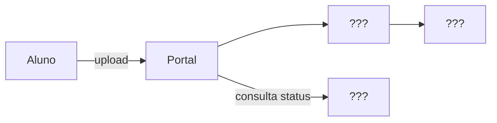
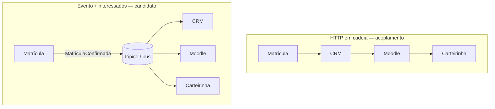

# Workshop de decisões — qual comunicação usar?

**Módulo:** [01 — Comunicação](README.md)  
**Faça depois** da [teoria](teoria.md) e, de preferência, do [lab de filas](tutorial-filas.md) (caminho mínimo) ou dos três labs.  
**Objetivo:** treinar **escolher e justificar trade-offs** — não decorar resposta “certa”.  
Termos: [glossario.md](glossario.md).

---

## Como usar

Para cada cenário:

1. Escreva a **abordagem** (ex.: “HTTP + fila”, “gRPC síncrono”, “evento + pub/sub”).
2. Liste **2 vantagens** e **2 custos/riscos**.
3. Diga o que você **monitoraria** (métrica ou sintoma).
4. (Opcional) Compare com a escolha de um colega — o desacordo é o exercício.

Critérios de apoio (releia se travar):

| Critério | Pergunta rápida |
|----------|-----------------|
| Urgência da resposta | O usuário bloqueia sem o resultado completo? |
| Pico | Chega rajada maior que o processamento? |
| Falha parcial | Se B cair, A ainda deve aceitar? |
| Fan-out | Um ou muitos interessados? |
| Complexidade | A equipe aguenta broker/DLQ/schemas agora? |

Não existe resposta única. Em dúvida, use a **rubrica** no final deste arquivo.

---

## Cenário 1 — Portal de provas (o domínio do lab)

No dia da entrega, 120 alunos enviam PDF entre 22h e 23h59. A análise de similaridade leva 5–20s por prova. Cada aluno precisa de **recibo imediato** de envio; a coordenação precisa de um **painel com pareceres** no dia seguinte.

**Canvas (complete — não é gabarito):** troque `???` pela sua escolha.

**Perguntas**

1. O upload deve ser síncrono até o parecer? Por quê?  
2. Desenhe (em caixas) API, fila/broker, worker, store de status — use o canvas acima.  
3. O `GET` de status seria REST ou gRPC neste contexto? Justifique.  
4. Depois do lab: o que você mudaria no ack do worker após o experimento do `kill`?

**Esqueleto de resposta (não copie — complete)**

| Trecho | Escolha | Trade-off aceito |
|--------|---------|------------------|
| Upload | | |
| Análise | | |
| Consulta status | | |

---

## Cenário 2 — Pagamento no checkout

Ao finalizar a compra, o sistema deve: (a) autorizar o cartão no gateway, (b) reservar estoque, (c) criar o pedido. O usuário fica na tela “processando pagamento…”. Se a autorização falhar, nada deve ser cobrado nem reservado “de verdade”.

**Perguntas**

1. Dá para colocar (a)(b)(c) só em filas assíncronas sem frustrar o usuário?  
2. Onde o síncrono é quase inevitável?  
3. Onde uma fila ainda ajuda (ex.: e-mail de confirmação, nota fiscal)?  
4. Que risco aparece se o serviço de estoque for chamado via RPC e ficar lento?

---

## Cenário 3 — Notificar três sistemas após matrícula

Quando a matrícula é confirmada, precisam reagir: CRM, ambiente Moodle e emissão de carteirinha. Nenhum deles precisa responder para a tela de “matrícula ok” do aluno.

**Contraste para debater** (escolha e justifique — nenhum dos dois é “obrigatório”):

**Perguntas**

1. Comando para cada um (3 filas) ou um evento `MatriculaConfirmada`?  
2. Mediator (orquestrador) vs broker (coreografia): qual você usaria no primeiro semestre do projeto?  
3. O que acontece se o Moodle estiver fora do ar na hora do evento? (persistência / retry / DLQ)

---

## Cenário 4 — Malha interna de microsserviços

Dez serviços internos Python/Go trocam dados de catálogo e preço milhares de vezes por minuto. Não há browser no meio. Contratos quebram com frequência porque campos JSON aparecem e somem sem aviso.

**Perguntas**

1. REST/JSON ou gRPC?  
2. O problema principal é protocolo ou **governança de contrato**?  
3. Em que ponto fila/evento ajudaria (e em que ponto atrapalharia)?

---

## Cenário 5 — “Tempo real” no painel da coordenação

Quem acompanha as correções deixa aberta uma página que deve atualizar sozinha quando uma prova muda de `processando` → `concluido`.

**Perguntas**

1. Polling HTTP a cada 2s vs WebSocket/SSE vs “só atualiza ao clicar”?  
2. Como isso se combina com a fila do worker (a fila *empurra* UI ou a UI *puxa* status)?  
3. No [lab gRPC](tutorial-grpc.md), `AcompanharStatus` (server streaming) é qual opção acima?  
4. Qual o custo de cada opção em sala com 40 notebooks batendo no servidor?

---

## Cenário 6 — Escolha errada de propósito (para debater)

Um time implementa **Kafka** para processar ~30 imagens/dia redimensionadas por um único worker.

**Perguntas**

1. Que requisito *não* está presente?  
2. Que solução mais simples atenderia?  
3. Em que momento Kafka passaria a fazer sentido neste domínio?

---

## Rubrica rápida (autoavaliação)

| Nível | Evidência |
|-------|-----------|
| Insuficiente | Só nomeia uma ferramenta (“usaria Kafka”) sem critério |
| Básico | Escolhe família sync/async com um motivo |
| Bom | Lista trade-offs e um risco de falha parcial |
| Ótimo | Propõe híbrido, contrato e o que observar em produção |

---

## Fechamento coletivo (10 min em sala)

Cada grupo apresenta **um** cenário:

- decisão em uma frase;
- o trade-off que estão **aceitando** de olhos abertos;
- uma métrica (“fila > N”, “p95 do POST”, “taxa de reprocessamento”).

Se sobrar tempo: revisitem o checklist do [README](README.md) — vocês fecharam os objetivos 4 e 5 deste módulo.
