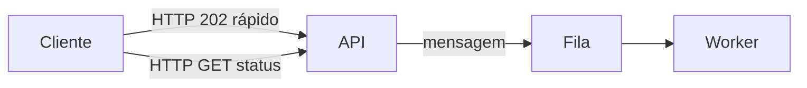
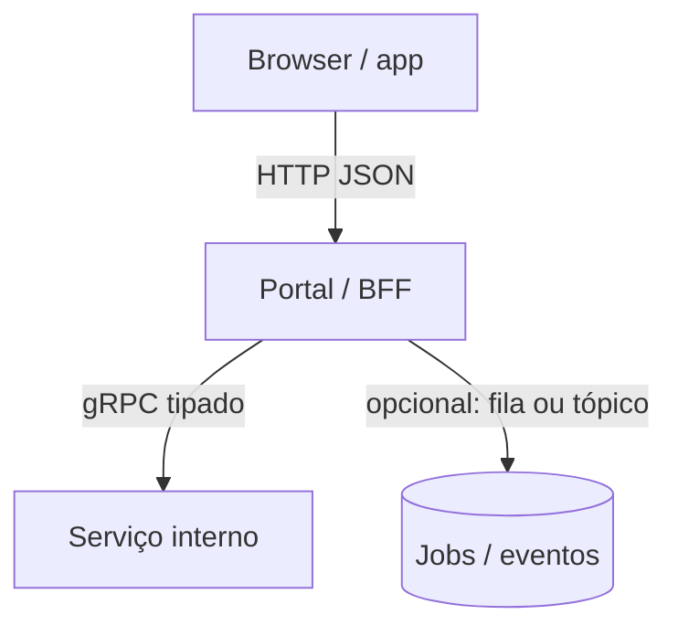
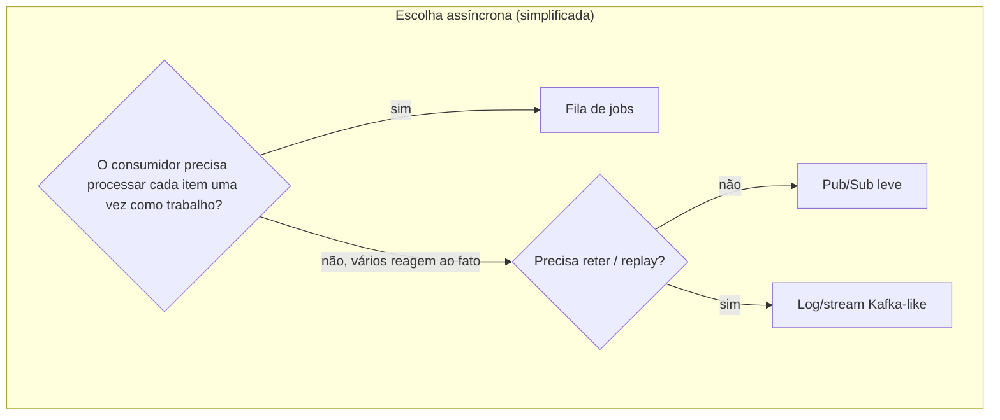

# Tecnologias e escolhas de comunicação

**Módulo:** [01 — Comunicação](README.md)  
**Pré-leitura:** [teoria.md](teoria.md)  
**Objetivo:** ligar padrões a tecnologias reais e a critérios de escolha — sem transformar isso em catálogo de marketing.

---

## 1. Duas famílias (visão prática)

| Família | Ideia | Tecnologias típicas | Onde ver no módulo |
|---------|-------|---------------------|--------------------|
| **Síncrona / request–response** | Pergunto e espero na mesma conversa | HTTP/REST, gRPC, GraphQL (muitos usos) | [filas](lab-filas/) `/sincrono` · [gRPC](lab-grpc/) unary |
| **Assíncrona / mensagens** | Entrego trabalho ou fato e sigo | Filas (RabbitMQ, SQS, Redis…), tópicos/logs (Kafka, SNS…) | [filas](lab-filas/) · [kafka](lab-kafka/) |

Híbridos são normais: HTTP **aceita** (síncrono curto) e **enfileira** o pesado. O lab de filas faz isso no caminho feliz; o de gRPC mostra o mesmo *padrão de UX* sem buffer distribuído (ver box no [tutorial-grpc](tutorial-grpc.md)).

---

## 2. Síncronas — quando e com o quê

### HTTP + REST (ou “HTTP JSON”)

**O que é bem:** interoperável, debugável (`curl`), ecossistema enorme, ótimo para APIs públicas e BFF.

**Encaixa quando:**

- consulta ou comando com resposta pequena/média;
- cliente (browser, app, outro serviço) espera confirmação imediata;
- equipe já domina HTTP e status codes (`200`, `201`, `202`, `4xx`, `5xx`).

**Cuidado:**

- chatty APIs (muitas idas e vindas) somam latência de rede;
- timeouts e retries mal feitos causam duplicação;
- “REST” mal usado vira RPC com URLs — o nome importa menos que o **contrato** e o **acoplamento**.

### gRPC (RPC tipado)

**O que é bem:** contrato Protobuf, tipagem, HTTP/2, bom desempenho, streaming (unary, server/client/bidi).

**Encaixa quando:**

- comunicação **serviço ↔ serviço** interna;
- contratos estáveis e gerados para várias linguagens;
- precisa de streaming (telemetria, chunks) ou baixa latência em malha densa.

**Cuidado:**

- browser não fala gRPC “cru” com a mesma facilidade do JSON (gRPC-Web / gateway);
- acoplamento temporal continua: se o callee cai, o caller sofre;
- versionamento de `.proto` exige disciplina.

> **Regra de bolso:** REST/JSON na borda (humanos e clientes heterogêneos); gRPC no miolo (serviços que você controla) — *quando* o ganho de contrato/perf justificar a complexidade.

### Outros (só mapa)

| Tecnologia | Nota rápida |
|------------|-------------|
| GraphQL | Flexível para o cliente agregar dados; ainda é request–response; pode virar N+1 no backend |
| WebSocket / SSE | Canal longo para push; não substitui fila de trabalho |
| SOAP | Legado corporativo; mesmos trade-offs de sync + contrato pesado |

---

## 3. Assíncronas — quando e com o quê

### Filas de trabalho (queues)

**Exemplos:** RabbitMQ (AMQP), Amazon SQS, Azure Queue, lista Redis / Redis Streams (didático ou leve).

**Encaixa quando:**

- trabalho demorado ou variável;
- produtor não pode esperar o fim;
- quer absorver pico e escalar consumidores.

**Cuidado:**

- precisa de status/consulta ou notificação (“já terminei?”);
- desenhar **ack**, retry, **dead-letter queue (DLQ)** e idempotência;
- “fila no Redis” é ótimo para lab; em produção avalie durabilidade, multi-AZ, observabilidade.

### Pub/sub e tópicos

**Exemplos:** Redis Pub/Sub, SNS + SQS, RabbitMQ topic exchange, NATS.

**Encaixa quando:** vários consumidores precisam do **mesmo** fato (notificar, indexar, auditar).

**Cuidado:** Pub/Sub “puro” muitas vezes é **não persistente** (quem não estava escutando perde). Para fan-out confiável, combine tópico + filas por consumidor.

### Log / streaming de eventos

**Exemplos:** Apache Kafka, Redpanda, Pulsar.

**Encaixa quando:**

- alto volume de eventos;
- vários consumidores em ritmos diferentes;
- replay / reprocessamento histórico importa;
- várias equipes consomem o mesmo stream.

**Cuidado:** custo operacional e conceitual alto; overkill para “uma fila de jobs do portal de provas”.

---

## 4. Tabela-guia (cole na parede mental)

| Necessidade dominante | Prefira começar com | Evite como primeira opção |
|-----------------------|---------------------|---------------------------|
| Resposta imediata ao usuário | HTTP/REST ou gRPC | Fila sem UX de status |
| Upload / job lento no pico | HTTP curto + fila | RPC que segura a conexão até o fim |
| Vários serviços reagem a um fato | Pub/sub ou eventos | Cadeia síncrona A→B→C→D |
| Contrato interno forte + perf | gRPC | JSON ad hoc sem schema |
| Replay / auditoria de eventos | Log (Kafka etc.) | Lista Redis descartável |
| Protótipo / aula / POC | Redis + HTTP (como no lab) | Cluster Kafka “porque é moderno” |

---

## 5. Trade-offs que sempre voltam

Inspirado em *The Hard Parts* e *Fundamentals of Software Architecture*:

| Se você otimiza… | Em geral você paga com… |
|------------------|-------------------------|
| Simplicidade (uma chamada HTTP) | Acoplamento temporal e cascata de falhas |
| Desacoplamento (fila/evento) | Consistência eventual, status, complexidade operacional |
| Throughput de escrita | Lag até o processamento |
| Tipagem forte (gRPC/Protobuf) | Ferramental e barreira na borda web |
| Fan-out fácil (pub/sub) | Governança de contratos e observabilidade do fluxo |

Frase útil: **não existe escolha sem custo** — a competência é **tornar o custo explícito**.

---

## 6. Os labs como “tradução”

| Conceito | Onde ver |
|----------|----------|
| Request–response síncrono (HTTP) | [lab-filas](lab-filas/) `POST /provas/sincrono` |
| Aceite curto + fila de jobs | [lab-filas](lab-filas/) `POST /provas` + worker |
| Tópico + fan-out por consumer group | [lab-kafka](lab-kafka/) worker + notifier + `GET /provas/{id}` + `GET /notificacoes` |
| Compete consumers / partições | [lab-kafka](lab-kafka/) `--scale worker=N` |
| RPC síncrono tipado | [lab-grpc](lab-grpc/) `AnalisarSincrono` |
| RPC assíncrono (aceite + poll / stream) | [lab-grpc](lab-grpc/) `SubmeterAnalise` + status |

---

## 7. Mini-exercício (antes das decisões longas)

Para cada linha, marque **S** (síncrono), **A** (assíncrono) ou **H** (híbrido) e cite **uma** tecnologia:

1. Login com senha. → depois: [decisoes cenário 2](decisoes.md)  
2. Geração de boletim em PDF para 2.000 alunos. → [decisoes cenário 1](decisoes.md)  
3. Checkout: reservar estoque + cobrar cartão (precisa saber se pagou). → [decisoes cenário 2](decisoes.md)  
4. Atualizar painel de “provas em processamento” a cada 2s. → [decisoes cenário 5](decisoes.md) · [gRPC stream](tutorial-grpc.md)  
5. Indexar a prova no ElasticSearch depois do upload. → [decisoes cenário 3](decisoes.md) (fan-out)

Compare com a turma — **não há gabarito único**; o que importa é a **justificativa** (critérios de latência, acoplamento, fan-out). Depois confira seus raciocínios nos [cenários de decisões](decisoes.md).

Depois: caminho mínimo = [filas](tutorial-filas.md) + [decisoes.md](decisoes.md); completo = filas → [Kafka](tutorial-kafka.md) → [gRPC](tutorial-grpc.md) → decisões.
