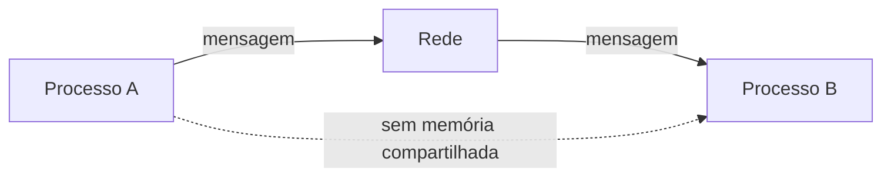
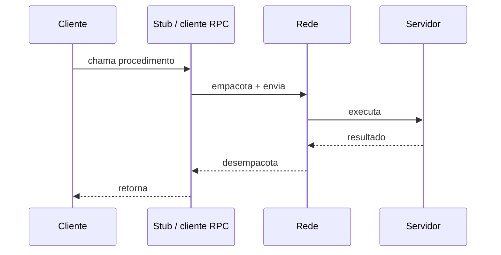
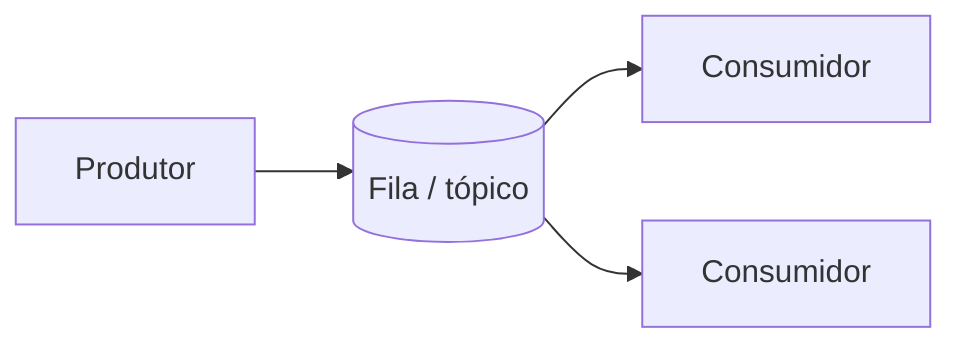
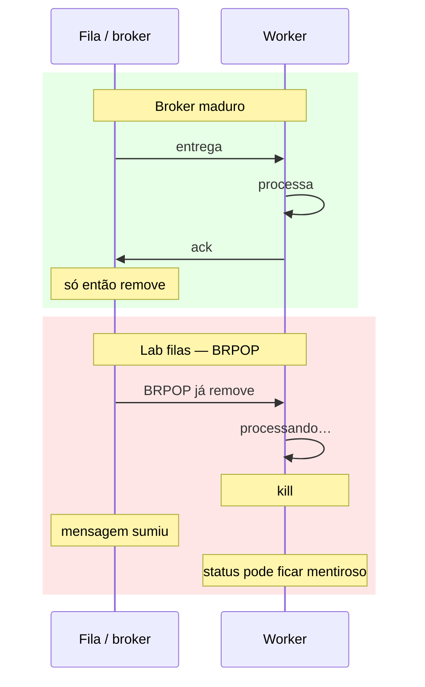
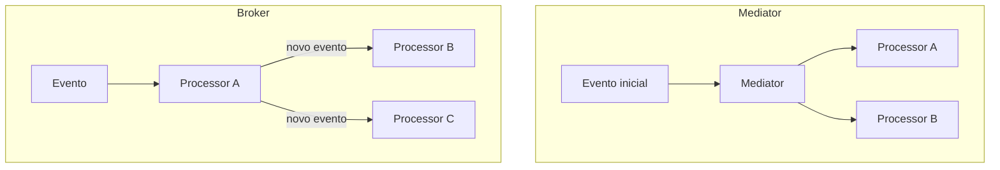

# Teoria — Como sistemas distribuídos se comunicam

**Módulo:** [01 — Comunicação](README.md)  
**Leitura sugerida:** antes do lab.  
**Objetivo:** montar o modelo mental; o lab *confirma* o modelo, não o substitui.

---

## 1. O ponto de partida

Em um sistema distribuído, os componentes são **processos** (ou containers, ou VMs) que:

- **não** compartilham memória da aplicação;
- só se coordenam **trocando mensagens**;
- podem falhar **parcialmente** (um nó cai, outro continua).

Isso já muda tudo em relação a um programa monolítico: a “chamada de função” deixa de ser um salto na mesma máquina e vira **comunicação pela rede** — com latência, perda, atraso e ambiguidades (“a mensagem chegou? o trabalho foi feito?”).



> **Para lembrar:** comunicação em SD ≈ *message passing* com falhas possíveis. Transparência total (“parece local”) é desejável, mas **nunca é gratuita** — e às vezes é perigosa (esconde o custo da rede).

---

## 2. Quatro combinações (van Steen & Tanenbaum)

Antes de falar de REST ou RabbitMQ, classifique a comunicação em **dois eixos**:

| Eixo | Opção A | Opção B |
|------|---------|---------|
| **Persistência** | **Persistente** — o middleware guarda a mensagem até entregar (mesmo se o receptor estiver offline) | **Transiente** — a mensagem só “vive” enquanto remetente/receptor (e o canal) estão ativos; se não entregar, descarta |
| **Sincronia** | **Assíncrona** — o remetente **segue** depois de submeter a mensagem | **Síncrona** — o remetente **bloqueia** até algum ponto de sincronização |

O remetente pode sincronizar em graus diferentes: (1) “o middleware aceitou”, (2) “entregue ao receptor”, (3) “o receptor processou e respondeu”. RPC clássico costuma ser o grau (3). Filas costumam ser persistentes + assíncronas no sentido de (1): o produtor recebe um *ack* rápido e continua.

```text
                    ASSÍNCRONA                         SÍNCRONA
                 (remetente segue)              (remetente bloqueia)
              ┌────────────────────────────┬────────────────────────────┐
 PERSISTENTE  │ Filas / e-mail (típico)    │ Híbridos (ack + espera     │
 (middleware  │ Produtor não precisa do    │ de entrega/processamento)  │
  guarda)     │ receptor online            │                            │
              ├────────────────────────────┼────────────────────────────┤
 TRANSIENTE   │ Fire-and-forget frágil     │ RPC / HTTP até o resultado │
 (só enquanto │ (UDP, pub sem retenção)    │ (clássico request-response)│
  ambos vivos)│                            │                            │
              └────────────────────────────┴────────────────────────────┘
```

Combinações **muito usadas**:

| Combinação | Exemplo mental | No lab deste módulo |
|------------|----------------|---------------------|
| Transiente + síncrona (até o resultado) | Chamada RPC / HTTP que espera a resposta completa | `POST /provas/sincrono` |
| Persistente + assíncrona (ack na submissão) | Fila de mensagens / e-mail | `POST /provas` → Redis → worker |

> **Pare e pense:** quem envia dezenas de trabalhos no prazo precisa de *qual* combinação no momento do upload? E na tela “ver relatório / status da prova 042”?

---

## 3. Request–response e RPC

### Ideia

**Remote Procedure Call (RPC):** fazer uma operação remota *parecer* uma chamada local — parâmetros vão, resultado volta, o caller fica bloqueado até a resposta (no modelo clássico).



### Por que ainda importa

- Modelo mental simples (“chame o serviço X”).
- Bom quando o cliente **precisa do resultado agora** para continuar (login, consulta de saldo, “qual o status?”).
- Base de tecnologias modernas: **gRPC**, muitos usos de **HTTP/REST**, SOAP legado, etc.

### O que o modelo esconde (e por que isso dói)

1. **Acoplamento temporal:** cliente e servidor precisam estar disponíveis *ao mesmo tempo*.
2. **Latência composta:** rede + segurança + processamento (em arquiteturas de serviços, “só mais uma chamada” vira segundos — ver análise de *interservice communication* em *The Hard Parts*).
3. **Falhas ambíguas:** se o servidor cair depois de executar e antes de responder, o cliente **não sabe** se deve repetir. Daí as semânticas (van Steen, cap. 8):
   - **at-most-once** — no máximo uma execução (pode não executar);
   - **at-least-once** — pelo menos uma (pode repetir);
   - **exactly-once** — o desejado; em geral **não** se obtém de graça na rede.

> **Consequência de projeto:** operações remotas relevantes precisam ser **idempotentes** (repetir não corrompe o estado) ou ter *idempotency keys*.

### Variantes

- **RPC assíncrono / deferred sync:** o servidor aceita rápido; o cliente busca o resultado depois (polling) ou recebe callback — ponte para o mundo das filas.
- **gRPC:** RPC com contrato (Protobuf), HTTP/2, tipagem forte, streaming opcional. Mesma *família* de acoplamento que o RPC clássico quando usado em request–response unário.

---

## 4. Comunicação orientada a mensagens

Quando o problema é “registre este trabalho / este fato” e o resultado **não** precisa voltar na mesma conversa, o desenho muda:



### Fila (compete consumers)

- Uma mensagem → **um** consumidor.
- Bom para **trabalho** (jobs): análise de prova, redimensionar imagem, gerar PDF.
- Absorve **pico**: produtores rápidos, consumidores no ritmo deles.
- Escala horizontal: mais consumidores drenam mais rápido.

### Pub/sub (fan-out)

- Uma mensagem / evento → **vários** interessados.
- Bom para **fatos** (“prova enviada”, “pagamento confirmado”) que vários contextos precisam saber.
- Desacopla quem publica de *quem* reage — e complica rastrear o fluxo ponta a ponta.

### Persistência e ack

Brokers maduros (AMQP/RabbitMQ, SQS, etc.) só removem a mensagem após **ack** do consumidor. Sem isso, queda no meio do processamento = trabalho perdido ou status mentiroso — exatamente o que o **Experimento 4** (falha / `kill`) do lab de filas evidencia com `BRPOP` “ingênuo”.



Pratique no [tutorial-filas — Experimento 4](tutorial-filas.md#experimento-4--queda-no-meio-do-job-falha-parcial).

---

## 5. Arquiteturas event-driven (Richards)

*Software Architecture Patterns* descreve EDA com duas topologias úteis para **decidir**, não só nomear:

| Topologia | Ideia | Quando faz sentido |
|-----------|-------|--------------------|
| **Mediator** | Um orquestrador central recebe o evento inicial e dispara passos | Fluxo com vários passos, ordem, erros e visibilidade do processo |
| **Broker** | Sem mediador central; cada processador reage e publica o próximo evento (corrente / “bastão”) | Fluxos mais simples; extensão por novos listeners; menos ponto central |



**Custos típicos do EDA** (não ignore na decisão):

- difícil manter **transação atômica** entre vários processadores;
- contratos de evento precisam de **governança**;
- debugging e “qual o estado do pedido?” ficam mais difíceis (coreografia).

*The Hard Parts* reforça o dual **orquestração × coreografia**: orquestração centraliza o fluxo (mais fácil de entender, mais acoplamento ao orquestrador); coreografia distribui (mais desacoplado, mais difícil de observar).

No [lab Kafka](tutorial-kafka.md) você pratica um sabor de topologia **broker**: um evento publicado, vários consumer groups reagindo — sem mediador central. O cenário 3 de [decisoes.md](decisoes.md) pede para comparar com mediator/orquestração.

---

## 6. Comandos vs eventos (Bellemare)

| | **Comando** | **Evento** |
|--|-------------|------------|
| Intenção | “Faça X” | “X aconteceu” |
| Direção | Em geral 1 destinatário responsável | Quem quiser escuta |
| Exemplo | `AnalisarProva(id=042)` | `ProvaEnviada { id, aluno, … }` |
| Acoplamento | Quem manda conhece a ação | Quem publica não precisa conhecer os reatores |

No lab, a mensagem na fila é, na prática, um **comando de trabalho** (`analise esta submission_id`). Um portal maduro poderia publicar também o **evento** `ProvaEnviada` para notificação, métricas, etc.

---

## 7. O que “boa comunicação” equilibra

Inspirado em *The Hard Parts* (“a melhor arquitetura costuma ser o *least worst* conjunto de trade-offs”):

| Critério | Pergunta |
|----------|----------|
| **Latência percebida** | O usuário precisa da resposta *agora*? |
| **Acoplamento temporal** | Os dois lados precisam estar no ar juntos? |
| **Disponibilidade** | Se B cair, A ainda deve aceitar pedidos? |
| **Throughput / pico** | Chegam rajadas maiores do que o processamento? |
| **Consistência** | “Aceito” pode divergir de “concluído” por um tempo? |
| **Complexidade operacional** | A equipe aguenta broker, DLQ, retries, schemas? |
| **Contrato** | API tipada (gRPC/OpenAPI) ou mensagem versionada? |

Não existe “sempre fila” nem “sempre REST”. Existe **encaixe** com o requisito.

---

## 8. Mapa mental → labs

| Momento do portal de provas | Família adequada | Lab |
|-----------------------------|------------------|-----|
| Enviar PDF no pico de entrega | Fila (job) ou tópico (evento) | [filas](tutorial-filas.md) / [Kafka](tutorial-kafka.md) |
| Vários sistemas reagem ao envio | Tópico + consumer groups | [Kafka](tutorial-kafka.md) |
| Ver status / baixar relatório agora | Request–response (HTTP ou gRPC) | [filas](tutorial-filas.md) / [Kafka](tutorial-kafka.md) `GET` / [gRPC](tutorial-grpc.md) |
| Análise “na linha” (demo sync) | RPC/HTTP bloqueante | [filas](tutorial-filas.md) `/sincrono` · [gRPC](tutorial-grpc.md) `AnalisarSincrono` |
| Observar progresso sem poll agressivo | Server streaming | [gRPC](tutorial-grpc.md) `AcompanharStatus` |

Próximo passo: labs — [filas](tutorial-filas.md), [Kafka](tutorial-kafka.md), [gRPC](tutorial-grpc.md). Se a carga apertar: [caminho mínimo no README](README.md#caminhos-de-estudo). Glossário: [glossario.md](glossario.md).
