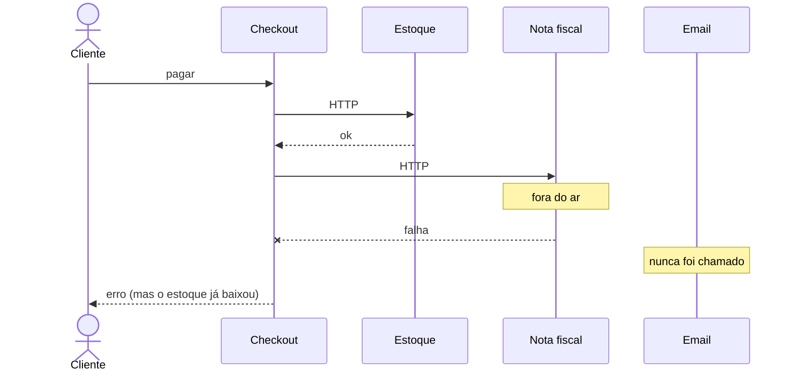
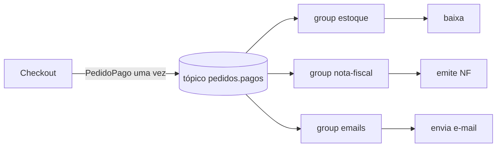

# Tutorial — Kafka: pedido pago (vários sistemas no mesmo fato)

**Módulo:** [01 — Comunicação](../../README.md)  
**Pasta deste mini-lab:** [./](./)  
**Tempo sugerido:** ~90 min  
**Pré-requisito:** [teoria.md](../../teoria.md) §4–6 · ideal [tutorial de filas](../../tutorial-filas.md)  
**Apoio:** [glossario.md](../../glossario.md) · [troubleshooting.md](../../troubleshooting.md)
**SO:** Linux, macOS e Windows — [como rodar os comandos](../../../ferramentas/linux-e-windows.md).  

> Isto **não** substitui o [lab Kafka](../../tutorial-kafka.md) (domínio provas). Aqui o problema é **depois do pagamento, três contextos reagem ao mesmo fato**.  
> Também **não** é o [tutorial RabbitMQ](../rabbitmq-integracao-externa/tutorial.md): lá há **um job** para um emissor instável. Aqui há um **evento** e **vários leitores**.

**Painel gráfico:** [http://localhost:8085](http://localhost:8085) (Kafka UI, sem senha).

---

## 1. Por que Kafka neste problema (leia antes do Compose)

### A cena

No checkout, o cartão **já foi autorizado**. A tela pode mostrar “pedido pago”.

Três outros sistemas ainda precisam saber que isso **aconteceu**:

| Contexto | O que faz com o fato `PedidoPago` |
|----------|-----------------------------------|
| Estoque | baixa as unidades |
| Nota fiscal | emite a NF |
| E-mail | manda o comprovante |

Nenhum deles precisa responder para a tela de “pago”. Não é um único job: são **interessados independentes** no mesmo fato.

### Sem Kafka — o desenho que parece óbvio

O checkout chama os três **em cadeia HTTP**: estoque, depois NF, depois e-mail.



### O problema de não usar Kafka

O lab vai **mostrar** cada item. Sem um log de eventos você paga isto:

1. **Estado partido.** A NF caiu. O estoque **já baixou**. O e-mail **nunca saiu**. O cliente vê erro. Desfazer o estoque vira compensação / saga / gente no Slack.
2. **O checkout conhece todos os destinos.** Amanhã o time de fidelidade quer pontos: **muda o portal** (mais um HTTP, mais um ponto de falha).
3. **Um contexto lento pune os outros.** A NF de 2 s **segura** o e-mail na mesma request.
4. **Não há passado para reler.** Se o e-mail esteve fora uma hora, aqueles comprovantes não “estão” em lugar nenhum para um processo novo reenviar — a menos que você invente uma fila por sistema (e aí está reinventando consumer groups).
5. **Uma fila de job não resolve o fan-out.** Um worker que chama os três HTTP **repete o acoplamento**. Três filas obrigam o produtor a conhecer **três destinos**. O fato “pedido pago” deveria ser publicado **uma vez**.

> **Uma frase (sem Kafka):** o pagamento vira uma conversa síncrona com N sistemas; qualquer um deles pode estragar o checkout e deixar os outros pela metade.

### Com Kafka — o que muda

O checkout **publica** `PedidoPago` num tópico (log append-only). Cada contexto é um **consumer group**. Groups diferentes = **fan-out**.



### O benefício de usar Kafka

| Benefício | Evita | Onde o lab prova |
|-----------|--------|------------------|
| Um fato, N leitores | Encadear HTTP / N filas no produtor | Mesmo `pedido_id` nos três rastros |
| Cada group no seu ritmo | NF lenta bloquear e-mail | Passo 5: NF parada, e-mail segue |
| Novo interessado = novo group | Mudar o checkout | Passo 6: `replay` |
| Log retém o passado | “perdeu porque o e-mail estava down” | Kafka UI: mensagem **continua** depois de consumida |
| Falha isolada | Estado partido da cadeia | Passo 5 vs passo 1 |

> **Uma frase (com Kafka):** o checkout só registra que o pedido foi pago; quem precisa reagir lê o log, quando puder, inclusive o que já passou.

> **Isto não é RabbitMQ.** Lá: *faça este trabalho uma vez, com ack e DLQ*. Aqui: *isto aconteceu; vários leem; o passado fica*.

---

## 2. Peças do ambiente

| Peça | Papel | Onde ver |
|------|--------|----------|
| Checkout (`api`) | Publica o evento **ou** orquestra a cadeia | host `8084` |
| Kafka | Log `pedidos.pagos` (3 partições) | rede Docker |
| **Kafka UI** | Tópicos, mensagens, groups, lag | **[http://localhost:8085](http://localhost:8085)** |
| `estoque` / `nota` / `email` | HTTP (cadeia) + consumer Kafka | `lab.py rastreio` + logs |

**Linux e Windows — o mesmo comando.** Terminal **nesta pasta**. O `-T` evita erro de TTY no Windows:

```text
docker compose exec -T api python lab.py …
```

---

## 3. Passo a passo

**Um lab por vez.** Portas deste tutorial: `8084` (API), `8085` (Kafka UI).

### Passo 0 — Subir e abrir o Kafka UI

```text
docker compose up -d --build
docker compose ps
docker compose exec -T api python lab.py health
```

Na primeira vez o broker pode levar 20–40 s. Abra **[http://localhost:8085](http://localhost:8085)**.

- Cluster `tutorial-pedido-pago` → **Topics** → `pedidos.pagos` (a API cria no boot).
- **Messages** começa vazio.
- **Consumers** (ou *Consumer Groups*): `estoque`, `nota-fiscal`, `emails` quando os processos conectarem.

```text
docker compose logs -f api estoque nota email
```

> **Conceito:** o UI mostra o **log** e os **offsets por group**. Uma cadeia HTTP não tem isso.

---

### Passo 1 — A dor: cadeia HTTP (sem usar o tópico)

O checkout chama os três **na mesma request**. Tudo no ar: funciona, mas o cliente **espera ~3 s**.

```text
docker compose exec -T api python lab.py cadeia ana
```

**Anote:** `tempo_total_s` ≈ 3; `executados` com os três nomes.

Agora o problema de **não** usar Kafka. Só a nota fiscal sai do ar:

```text
docker compose stop nota
docker compose exec -T api python lab.py cadeia bruno
```

**O que deve aparecer**

- HTTP **502**, `falhou: nota-fiscal`;
- `ja_executados: ["estoque"]` — estoque **já baixou**;
- `nao_chamados: ["email"]` — comprovante **não saiu**.

```text
docker compose exec -T api python lab.py rastreio estoque
docker compose exec -T api python lab.py rastreio email
```

Estoque tem o Bruno (`origem: http-cadeia`). E-mail **não**. Estado **partido**.

```text
docker compose start nota
```

A NF **não** fica sabendo daquele pagamento sozinha. Ninguém relê um log — porque a cadeia **não deixou log**.

> **Pare e pense:** quem desfaz o estoque? Esse custo existe **antes** de falar em “Kafka é moderno”.

---

### Passo 2 — Publicar o fato (o checkout para de conhecer destinos)

`POST /pedidos` **não** chama estoque/NF/e-mail. Só escreve `PedidoPago` no tópico.

```text
docker compose exec -T api python lab.py pagar clara
```

**O que deve aparecer:** `tempo_total_s` em **ms**, HTTP 202, `pedido_id`, `partition`, `offset`.

No **Kafka UI**: Topics → `pedidos.pagos` → **Messages** → atualize. Payload JSON + **key** = `pedido_id`.

> Depois que os consumers leem, a mensagem **continua** no UI (retention). No RabbitMQ, ack **remove** da fila. Esse é o modelo de **log**, não de job.

---

### Passo 3 — Fan-out: três groups, o mesmo evento

Espere ~2 s:

```text
docker compose exec -T api python lab.py rastreio
```

O mesmo `pedido_id` da Clara em **estoque**, **nota** e **email**, `origem: kafka`, mesmo `offset`.

No UI: **Consumers** — três groups, lag perto de 0.

Abra [`api/app.py`](api/app.py) na função `publicar`: **não há** lista de destinos. Esse é o benefício (2) da tabela da §1.

---

### Passo 4 — Pico: publicar é barato

```text
docker compose exec -T api python lab.py lote 6
```

O lote volta rápido. No UI, **Messages** cresce. Os rastros enchem **depois**. O checkout não pagou os 6×3 trabalhos na request.

---

### Passo 5 — Um group parado não para os outros

Contraste direto com o passo 1.

```text
docker compose stop nota
docker compose exec -T api python lab.py pagar diana
docker compose exec -T api python lab.py rastreio estoque
docker compose exec -T api python lab.py rastreio email
docker compose exec -T api python lab.py rastreio nota
```

Estoque e e-mail **têm** a Diana. Nota **não**. No UI, `nota-fiscal` com **lag** > 0; os outros na ponta.

```text
docker compose start nota
```

Espere 2 s; `rastreio nota`: catch-up **sem** republicar. O checkout não ficou sabendo.

> **Benefício:** falha isolada + fato no log. O 502 do passo 1 era o contrário.

---

### Passo 6 — Replay: interessado novo lê o passado

Métricas/fidelidade no meio do mês: **não** mudamos a API.

```text
docker compose exec -T api python lab.py replay 8
```

Linhas `REPLAY pedido=… off=…` de eventos **já** publicados. Os groups originais **não** reprocessam (offsets deles já commitados).

No UI o group `metricas-replay-…` pode aparecer e sumir (processo curto). O que importa: o log **deixou** reler.

> Sem Kafka, o e-mail do Bruno (passo 1) simplesmente **não existiu** para reprocessar.

---

### Passo 7 — Mesma chave, mesma partição

```text
docker compose exec -T api python lab.py pagar eve ped-fixo
docker compose exec -T api python lab.py pagar eve ped-fixo
```

No JSON e no UI, a **partition** é a mesma; os **offsets** são dois. Kafka **não** deduplica: o consumer é que precisa ser idempotente (dois “baixar estoque” no mesmo id).

---

## 4. Como testar e onde estão as evidências

<a id="evidencias"></a>

### 4.1 Preparação

```text
docker compose down -v
docker compose up -d --build
docker compose exec -T api python lab.py health
```

Kafka UI: [http://localhost:8085](http://localhost:8085).

---

### 4.2 Tabela de evidências

Prefixo: `docker compose exec -T api python lab.py`

| # | Afirmação | Como testar | Onde olhar | Evidência |
|---|-----------|-------------|------------|-----------|
| 1 | Sem Kafka o checkout **espera** os três | `cadeia ana` | `tempo_total_s` | ≈ 3 s, `executados` com 3 nomes |
| 2 | Sem Kafka, um down **parte** o estado | `stop nota` + `cadeia bruno` | 502; `rastreio estoque` vs `email` | estoque fez; e-mail não; `ja_executados` |
| 3 | Com Kafka o checkout **só publica** | `pagar clara` | tempo em ms; UI Messages | 202; JSON no tópico; `publicar` sem destinos |
| 4 | Fan-out: **três** leitores do mesmo fato | `rastreio` | três listas; UI Consumers | mesmo `pedido_id` / offset |
| 5 | Mensagem **não some** após consumo | depois do 4 | UI → Messages | payload ainda lá (≠ fila Rabbit) |
| 6 | NF down **não** para e-mail/estoque | `stop nota` + `pagar diana` | rastros; UI lag | diana no estoque/e-mail; lag em `nota-fiscal` |
| 7 | NF volta e **alcança** o log | `start nota` | `rastreio nota` | diana aparece sem novo `pagar` |
| 8 | Group **novo** relê o passado | `replay 8` | stdout REPLAY | ids antigos; API inalterada |
| 9 | Mesma key → mesma partição | `pagar eve ped-fixo` duas vezes | UI + JSON | `partition` igual; offsets diferentes |

Se a linha 2 e a 6 dão o **mesmo** resultado, o caminho Kafka não está isolado da cadeia — confira se usou `pagar` (não `cadeia`) no passo 5.

---

### 4.3 Cola de inspeção

```text
docker compose exec -T api python lab.py ajuda
docker compose exec -T api python lab.py health
docker compose exec -T api python lab.py rastreio

docker compose ps
docker compose logs --tail=40 estoque nota email
```

**Kafka UI** (`:8085`):

| Tela | Para quê neste lab |
|------|---------------------|
| Topics → `pedidos.pagos` | o fato existe |
| **Messages** | ver o JSON (mesmo depois do consume) |
| **Consumers** | fan-out e **lag** do group parado |
| Partição na mensagem | passo 7 |

---

### 4.4 Critério de “tutorial pronto”

Sem olhar o código, em uma frase cada:

1. **Por que Kafka** neste checkout (fato + vários interessados + passado).  
2. **O que quebra sem Kafka** (cadeia, estado partido, produtor que conhece destinos).  
3. **Por que não é RabbitMQ** (não é um job com ack; é log com fan-out).

Leve isso para [decisoes.md](../../decisoes.md) cenários **3** e **6**.

---

## 5. Encerrar

```text
docker compose down -v
```

| Sem Kafka (cadeia HTTP) | Com Kafka |
|-------------------------|-----------|
| Checkout espera e conhece N sistemas | Checkout publica `PedidoPago` |
| Um down parte estoque vs e-mail | Cada group lê quando puder; lag no UI |
| Novo time = mudar o portal | Novo group + replay |
| Não há log para reler | Messages no Kafka UI |

Código para abrir com calma: [`api/app.py`](api/app.py) (`publicar` vs `executar_cadeia`) e [`consumidor/consumidor.py`](consumidor/consumidor.py) (`GROUP_ID`).
