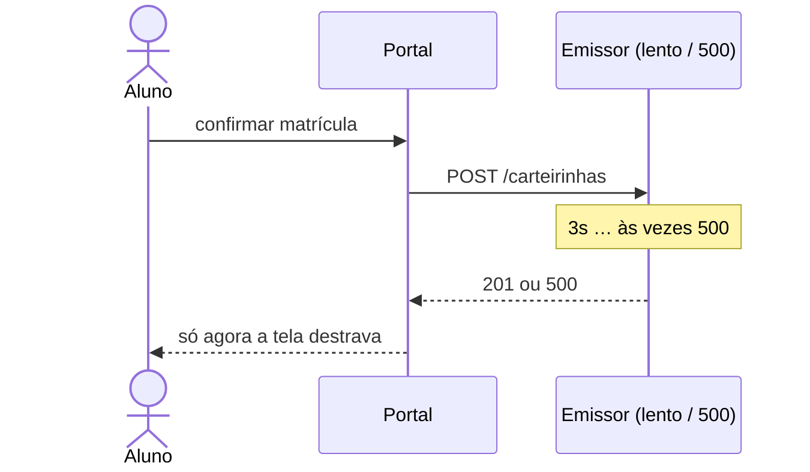
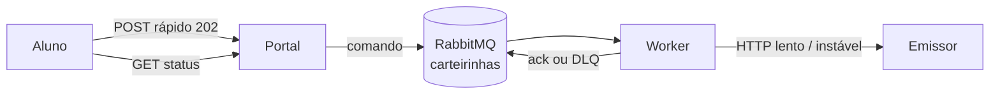
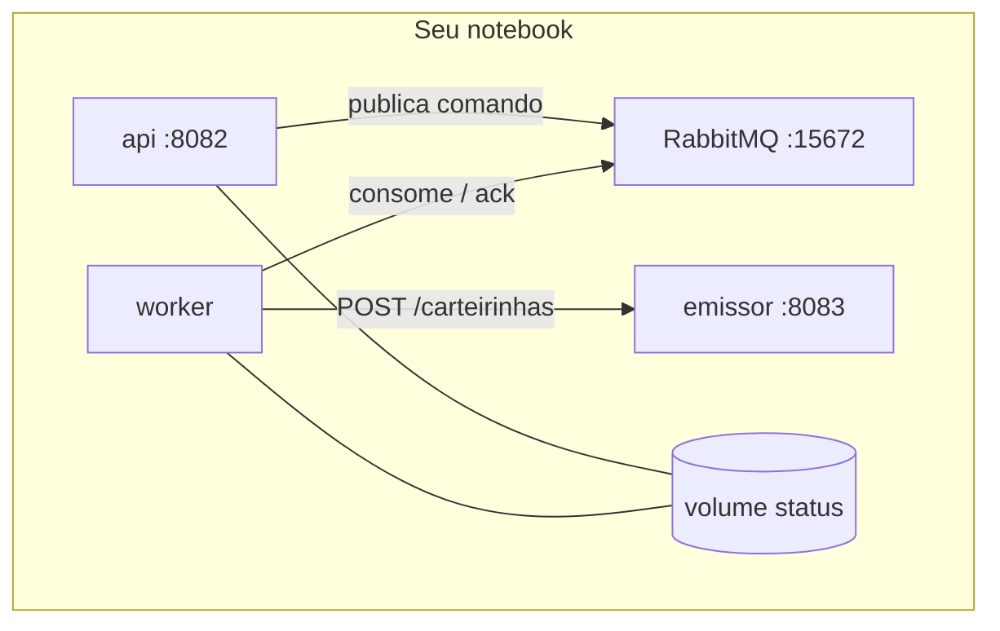

# Tutorial — RabbitMQ: integração com API externa instável

**Módulo:** [01 — Comunicação](../../README.md)  
**Pasta deste mini-lab:** [./](./)  
**Tempo sugerido:** ~90 min  
**Pré-requisito:** [teoria.md](../../teoria.md) §1–4 · ideal ter feito o [lab de filas](../../tutorial-filas.md)  
**Apoio:** [glossario.md](../../glossario.md) · [troubleshooting.md](../../troubleshooting.md)
**SO:** Linux, macOS e Windows — [como rodar os comandos](../../../ferramentas/linux-e-windows.md).  

> Isto **não** substitui o lab de filas (Redis). Lá você viu o padrão “aceite rápido + worker” e o buraco do `BRPOP`. Aqui o broker é **RabbitMQ** e o problema é outro: **chamar um sistema de fora que é lento e falha**.

---


## 1. O problema (leia antes de subir o Compose)


### A cena

A matrícula do aluno **já está confirmada** no portal da faculdade. A tela pode mostrar “matrícula ok”.

O que ainda falta é um passo **com outra empresa / outro sistema**: registrar o aluno no **emissor de carteirinha**. Esse emissor:

- demora **~3 segundos** por pedido (rede + processamento deles);
- devolve **HTTP 500** com frequência (instabilidade);
- de vez em quando está fora do ar.

Isso é comum em estágio: banco, MEC, emissor de boleto, CRM, “o sistema do fornecedor”. Você **não controla** o tempo nem a disponibilidade deles.

### O desenho que parece óbvio — e quebra

O portal chama o emissor **dentro** do `POST` da matrícula e só responde ao aluno quando o HTTP externo termina.




**O que o aluno sente**

- a tela “processando…” trava os ~3 s (ou mais, se alguém ainda retriar na mesma request);
- se o emissor devolver 500, a matrícula **parece ter falhado** — mesmo que o portal já tivesse gravado o aluno;
- se o emissor estiver fora, o portal inteiro parece fora.

**A pergunta de arquitetura:** a matrícula precisa esperar a carteirinha existir **na mesma conversa HTTP**? Quase nunca. O aluno precisa do **recibo de matrícula**. A carteirinha pode sair segundos (ou minutos) depois, com retry.

### O que o RabbitMQ faz neste problema

A fila guarda o **comando** “emita a carteirinha desta matrícula”. Um worker chama o emissor no ritmo dele, **repete** se vier 500, e se o pedido for irrecuperável manda para uma **dead-letter queue (DLQ)** — sem bloquear os outros alunos.




**Uma frase:** o portal se desacopla do sistema que ele **não controla**; o RabbitMQ segura o trabalho, o ack evita perder o pedido se o worker morrer, a DLQ evita que um pedido “venenoso” emperre a fila.

> **Isto não é Kafka.** Só existe **um** trabalho a fazer (emitir a carteirinha). Não precisamos de vários times lendo o mesmo fato nem de replay histórico. Precisamos de **fila de job + ack + retry + DLQ**.

---


## 2. O que você vai construir (visão das peças)

Quatro processos. Cada um tem um papel só.


| Peça                   | O que é                                               | Porta no seu notebook                                             |
| ---------------------- | ----------------------------------------------------- | ----------------------------------------------------------------- |
| **Portal (**`api`**)** | Aceita a matrícula; publica na fila; serve o status   | `http://localhost:8082`                                           |
| **RabbitMQ**           | Broker: fila `carteirinhas` + DLQ `carteirinhas.dlq`  | AMQP `5672` · **painel** `http://localhost:15672` (guest / guest) |
| **Worker**             | Consome um job, chama o emissor, dá **ack só no fim** | (sem porta)                                                       |
| **Emissor (mock)**     | “O sistema de fora”: lento e instável de propósito    | `http://localhost:8083`                                           |


Status (`na_fila` → `processando` → `concluido` ou `na_dlq`) fica em arquivos num **volume compartilhado** — não fica no RabbitMQ. O broker guarda a **mensagem**; o portal guarda o **estado para o GET**.




**Código para ir abrindo aos poucos** (não precisa decorar):


| Arquivo                                    | Papel                                                         |
| ------------------------------------------ | ------------------------------------------------------------- |
| `[emissor/emissor.py](emissor/emissor.py)` | Sleep + 500 aleatório; aluno `veneno` **sempre** falha        |
| `[api/app.py](api/app.py)`                 | `POST /matriculas` (202) vs `POST /matriculas/sincrono` (dor) |
| `[worker/worker.py](worker/worker.py)`     | Consume, HTTP, retry, ack / nack→DLQ                          |
| `[comum/rabbit.py](comum/rabbit.py)`       | Declara fila + DLQ                                            |


---


## 3. Passo a passo

Em cada passo: **o que estamos fazendo** → **o que rodar** → **o que deve aparecer** → **por quê**.

**Mesmos comandos no Linux e no Windows.** Abra o terminal **nesta pasta** (`rabbitmq-integracao-externa` — no Cursor/VS Code: botão direito na pasta → *Open in Integrated Terminal*).

As chamadas HTTP passam pelo container da API (não use `curl` no host: no PowerShell o `curl` não é o mesmo programa, e as aspas do JSON mudam). O `-T` evita erro de TTY no Windows:

```text
docker compose exec -T api python lab.py …
```

`docker compose` (subir, logs, kill, scale) é idêntico no PowerShell, cmd, bash e zsh.

**Um lab por vez.** Se `8082`, `5672` ou `15672` estiverem ocupadas: `docker compose down -v` no lab anterior.

---


### Passo 0 — Subir o ambiente e abrir o painel

**O que estamos fazendo:** colocar os quatro processos no ar e confirmar que o broker tem UI. Sem isso, o resto vira “log que eu não entendi”.

```text
docker compose up -d --build
docker compose ps
```

Espere o `rabbitmq` ficar `healthy` (pode levar ~20 s na primeira vez). Depois:

```text
docker compose exec -T api python lab.py health
```

Abra o painel: [http://localhost:15672](http://localhost:15672) — usuário `guest`, senha `guest`.  
Menu **Queues and Streams**: devem existir `carteirinhas` e `carteirinhas.dlq` (a API declara a topologia no boot).

**Logs em outro terminal (deixe aberto):**

```text
docker compose logs -f api worker emissor
```

> **Conceito:** quatro containers = quatro processos. Eles não compartilham memória da aplicação. Combinam por **HTTP** (portal↔você, worker↔emissor) e por **mensagens** (portal↔RabbitMQ↔worker).

---


### Passo 1 — Sentir a dor (caminho síncrono)

**O que estamos fazendo:** ainda **sem usar a fila**. O portal chama o emissor na mesma request — o anti-padrão deste tutorial. O cliente imprime `tempo_total_s` (não dependa do `time` do bash).

```text
docker compose exec -T api python lab.py sincrono estavel-maria
```

**O que deve aparecer**

- a resposta **demora ~3 s** (`latencia_api_segundos` ≈ `LENTEZA_SEGUNDOS`);
- `status=concluido` e um `protocolo` (aluno `estavel-*` **não** falha no mock);
- no log do **emissor**: `pedido … processando 3s` e depois `OK`.

Agora o caso instável — rode **duas ou três vezes**:

```text
docker compose exec -T api python lab.py sincrono joao
```

`joao` sofre a taxa de falha (~35%). Parte das vezes você leva **3 s para ganhar um 502**. A matrícula “falhou” na cara do aluno por causa de um sistema que **não é o portal**.

> **Pare e pense:** se 80 alunos confirmam matrícula no mesmo minuto, quantas conexões HTTP do portal ficam presas nos 3 s do emissor? E se 35% levarem 502?

**Anote:** tempo até a 1ª resposta; se o 502 é aceitável na tela de “matrícula ok”.

---


### Passo 2 — Aceite rápido: a API só publica um comando

**O que estamos fazendo:** o `POST /matriculas` **não** fala com o emissor. Grava status `na_fila` e publica JSON na fila `carteirinhas`. O HTTP 202 significa “aceitei o trabalho, ainda não emiti a carteirinha”.

Abra em `[api/app.py](api/app.py)` a função `enfileirar`: status primeiro, mensagem depois. A mensagem é um **comando** (`matricula_id`, `aluno`, `tentativas`) — ver [teoria §6](../../teoria.md).

Para **ver a fila encher**, pare o worker (ele ainda não deve “salvar” o passo):

```text
docker compose stop worker
```

```text
docker compose exec -T api python lab.py enviar estavel-ana
```

**O que deve aparecer**

- resposta em **fração de segundo**, HTTP implícito **202**, `"status": "na_fila"`, um `matricula_id` (guarde);
- `lab.py fila` com `"prontas": 1` (ou mais);
- no painel [http://localhost:15672](http://localhost:15672) → **Queues and Streams** → fila **`carteirinhas`**: coluna **Ready** ≥ 1.

Ainda **não** ligue o worker e ainda **não** clique em *Get messages* — isso é o passo 3 (é lá que o payload aparece na tela).

```text
docker compose exec -T api python lab.py fila
```

> **Conceito: produtor.** A API não conhece o worker. Ela conhece a **fila**. Se o emissor estiver no chão, o aluno **já levou o recibo**.

Deixe o worker parado. Vamos ligá-lo no próximo passo.

---


### Passo 3 — Ver a mensagem no painel e só então o worker

**O que estamos fazendo:** o comando ainda está **parado na fila** (worker do passo 2 continua *stop*). O painel Management deixa ver o JSON — isso só funciona enquanto a mensagem está em **Ready**. Se você ligar o worker agora, em milissegundos ela vira **Unacked** e o *Get messages* não mostra mais o corpo.

Se **Ready** já está 0 (worker ligou cedo demais), volte atrás:

```text
docker compose stop worker
docker compose exec -T api python lab.py enviar estavel-ana
```

#### 3.1 Abrir o payload no Management

1. Browser: [http://localhost:15672](http://localhost:15672) — `guest` / `guest`.
2. Menu **Queues and Streams**.
3. Clique no **nome** da fila **`carteirinhas`** (não na `carteirinhas.dlq`).
4. Confira no topo: **Ready** ≥ 1.
5. Role até a seção **Get messages**.
6. Preencha assim (os rótulos variam um pouco entre versões):

   | Campo | Valor que **mostra e devolve** a mensagem |
   |-------|-------------------------------------------|
   | **Ack mode** | **Nack message requeue true** (ou **Reject requeue true**) |
   | **Encoding** | **Auto** |
   | **Messages** | `1` |

   **Não** use *Ack … requeue false* / *remove from queue*: isso **tira** o job e o passo 3.2 não tem o que processar.

7. Clique **Get message(s)**.

**O que projetar na tela**

- **Payload:** JSON do comando, por exemplo:

```json
{
  "matricula_id": "mat-abc12345",
  "aluno": "estavel-ana",
  "tentativas": 1,
  "enqueued_at": "2026-08-28T…"
}
```

- **Properties:** `content_type = application/json`, `type = EmitirCarteirinha`, `message_id` igual ao `matricula_id`.
- **Headers:** `aluno`, `tentativas`.

Depois do Get com *requeue true*, **Ready** continua ≥ 1 — a mensagem **voltou** para a fila. Se Ready foi a 0, você ackou sem requeue: envie de novo (`lab.py enviar estavel-ana`).

#### 3.2 Ligar o worker (Ready → Unacked → 0)

Abra [`worker/worker.py`](worker/worker.py): `auto_ack=False` e o `basic_ack` **depois** do HTTP. Esse detalhe é a diferença para o lab de filas (`BRPOP` remove na pegada).

Deixe o painel da fila `carteirinhas` **visível** (Ready / Unacked) e, noutro terminal:

```text
docker compose start worker
docker compose logs -f worker emissor
```

**O que deve aparecer no painel (janela de ~3 s)**

| Momento | Ready | Unacked | Significado |
|---------|-------|---------|-------------|
| Antes do `start` | ≥ 1 | 0 | comando esperando — o JSON do 3.1 |
| Worker pegou, emissor ainda dorme | 0 | 1 | trabalho em curso; **ainda não houve ack** |
| Emissor 201 + `basic_ack` | 0 | 0 | mensagem saiu da fila de verdade |

Pegue o `matricula_id` do passo 2 (ou do enviar do 3.1):

```text
docker compose exec -T api python lab.py status SEU_ID
```

Status `concluido` e campo `protocolo`. Se piscou Unacked rápido demais para a sala, no `docker-compose.yml` suba `LENTEZA_SEGUNDOS` do emissor (ex.: `"8"`) e `docker compose up -d emissor`.

**Evidência de que o sistema de fora realmente recebeu** (não só o JSON do portal):

```text
docker compose exec -T api python lab.py registros
```

O `matricula_id` deve aparecer na lista do **emissor**. São processos diferentes: o portal consulta o volume de status; o emissor tem a “base” dele.

> **Conceito: ack.** “Tirei da fila” (Unacked) e “terminei o trabalho” (ack → some) são momentos diferentes. O RabbitMQ só considera entregue após o ack. Se o worker morrer **antes** do ack, a mensagem volta — passo 5.

---


### Passo 4 — Pico: a fila amortece; o emissor continua lento

**O que estamos fazendo:** provar que o portal continua rápido quando o emissor não dá conta. O atraso aparece no **término** da carteirinha, não no clique.

```text
docker compose exec -T api python lab.py lote 8
docker compose exec -T api python lab.py fila
```

No painel, **Ready** sobe e depois desce. Nos logs do emissor, os pedidos entram **um após o outro** (~3 s cada) com 1 worker.

Alunos `aluno-01` … no lote **não** são `estavel-*`: parte vai tomar 500 e o worker **reenfileira** (passo 6). Por isso o lote pode demorar mais que `8 × 3 s`. Isso é desejável — você vê retry no log: `FALHA` e `reenfileirado`.

**Anote:** o `enviar-lote` foi rápido? A fila ficou > 0? Os `GET /matriculas/{id}` foram virando `concluido` em momentos diferentes?

> **Conceito:** a fila **não** acelera o emissor. Ela impede que o atraso e o 500 **vazem** para a tela de matrícula.

---


### Passo 5 — Queda no meio do HTTP (a vantagem do ack)

**O que estamos fazendo:** matar o worker **enquanto** ele está bloqueado no emissor (os 3 s). No lab Redis, a mensagem já tinha saído da lista. Aqui ela deve **voltar** para Ready.

```text
docker compose exec -T api python lab.py enviar teste-kill
```

Copie o `matricula_id=` da última linha. Quando o status virar `processando` (o worker já está no HTTP de 3 s):

```text
docker compose exec -T api python lab.py esperar-processando SEU_ID
docker compose kill worker
docker compose exec -T api python lab.py status SEU_ID
docker compose exec -T api python lab.py fila
```

**O que deve aparecer**

- status provavelmente `processando` (o worker chegou a gravar isso);
- `GET /fila` → `prontas` ≥ 1 **ou** o painel com **Ready ≥ 1** na `carteirinhas` (às vezes a API conta Ready um instante depois — confie no painel);
- log do worker some (processo morto);
- o emissor pode até **completar** aquele HTTP (o mock não sabe que o cliente morreu) — o importante é o **comando na fila** ainda existir.

Religue e acompanhe o mesmo id que o script imprimiu:

```text
docker compose up -d worker
docker compose exec -T api python lab.py acompanhar SEU_ID
```

**Esperado:** vira `concluido` (aluno `teste-kill` não falha no mock). Pode haver **dois** `POST` no emissor para o mesmo id (o primeiro HTTP órfão + o reprocessamento). Isso é **at-least-once**: por isso o job deveria ser idempotente no mundo real (o mock não deduplica — e isso é uma evidência, não um acidente).

> **Pare e pense:** compare com o [Experimento 4 do lab de filas](../../tutorial-filas.md). Lá o `BRPOP` já tinha apagado o job. Aqui o RabbitMQ devolve porque **não houve ack**.

---


### Passo 6 — Retry e DLQ (pedido que nunca vai passar)

**O que estamos fazendo:** separar “emissor teve um 500 passageiro” de “este pedido é irrecuperável”. O aluno `veneno` **sempre** toma 500 no mock (veja `_deve_falhar` no emissor).

```text
docker compose exec -T api python lab.py veneno
docker compose exec -T api python lab.py acompanhar SEU_ID
```

**O que deve aparecer**

- ~3 tentativas nos logs do worker (`tentativa=1/3`, `2/3`, `3/3`) e **três** `FALHA 500` no emissor;
- status final `"na_dlq"`;
- `docker compose exec -T api python lab.py fila` → `prontas_dlq` ≥ 1;
- painel: fila `carteirinhas.dlq` com Ready ≥ 1. A fila principal continua drenando **outros** alunos.

No worker, na última falha: `basic_nack(..., requeue=False)`. A fila `carteirinhas` foi declarada com *dead-letter exchange* → a mensagem cai na DLQ em vez de voltar para o infinito.

> **Conceito: DLQ.** Retry sem teto transforma um pedido podre em um worker ocupado para sempre. A DLQ é o lugar onde **humano ou outro processo** inspeciona o lixo, sem bloquear o pico de matrícula.

Envie um `estavel-bia` **depois** do veneno (`lab.py enviar estavel-bia`): deve concluir normalmente. Evidência de que a DLQ **isolou** o problema.

---


### Passo 7 — Dois workers (compete consumers)

**O que estamos fazendo:** cada mensagem vai para **um** worker. Dois consumidores drenam mais rápido o backlog — até o limite do emissor (ainda são HTTP contra o mesmo mock).

```text
docker compose up -d --scale worker=2 worker
docker compose exec -T api python lab.py lote 10
docker compose logs --tail=40 worker
```

**O que deve aparecer:** hostnames diferentes nos logs; **Unacked** no painel pode ser 2 (um por worker, `prefetch=1`).

```text
docker compose up -d --scale worker=1 worker
```

---


<a id="evidencias"></a>

## 4. Como testar o sistema e onde estão as evidências

Esta seção é o **roteiro de correção / auto-check**. Siga na ordem. Não basta “o POST voltou 202”.

### 4.1 Preparação

```text
docker compose down -v
docker compose up -d --build
docker compose exec -T api python lab.py health
```

Painel aberto: [http://localhost:15672](http://localhost:15672) (`guest` / `guest`).

Deixe `docker compose logs -f api worker emissor` num terminal.

---


### 4.2 Tabela de evidências

Cada linha é uma **afirmação** que o tutorial prometeu. Você só “viu o RabbitMQ funcionar” se fechar as linhas.


Prefixo HTTP (iguais nos dois SOs): `docker compose exec -T api python lab.py`

| # | Afirmação | Como testar | Onde olhar | Evidência que conta |
|---|-----------|-------------|------------|---------------------|
| 1 | O caminho síncrono **prende** o aluno no emissor | `… lab.py sincrono estavel-maria` | JSON + `tempo_total_s` | ≈ 3 s; log `[emissor] pedido …` **antes** da resposta do cliente |
| 2 | O síncrono **propaga** o 500 do emissor | `… lab.py sincrono joao` (repetir) | HTTP 502, `status=erro` | Às vezes falha após ~3 s **sem** fila |
| 3 | O portal **aceita sem** chamar o emissor | `docker compose stop worker` + `… lab.py enviar estavel-ana` | `tempo_total_s`; log do **emissor**; painel Ready | ms; `status=na_fila`; **Ready ≥ 1**; emissor quieto |
| 4 | O worker **é** quem fala com o emissor | `docker compose start worker` + `… lab.py status ID` | Logs worker e emissor; `… lab.py registros` | `concluido` + `protocolo`; o **mesmo** id em `/registros` |
| 5 | A fila **amortece** o pico | `… lab.py lote 8` (worker ligado) | `… lab.py fila`; painel Ready | `tempo_total_s` curto; Ready sobe e desce; carteirinhas **depois** |
| 6 | Sem ack, a mensagem **não some** no kill | `enviar teste-kill` → `esperar-processando ID` → `docker compose kill worker` | Painel Ready/Unacked; `fila`; `status ID` | Após o kill: **Ready ≥ 1**; status pode ficar `processando` |
| 7 | Religar o worker **recupera** o job | `docker compose up -d worker` + `… lab.py acompanhar ID` | Status → `concluido`; logs | Mesmo id conclui **sem** novo POST do aluno |
| 8 | Pedido irrecuperável vai à **DLQ** e **não** trava os outros | `… lab.py veneno` + `acompanhar`; depois `enviar estavel-bia` | 3× FALHA; `na_dlq`; fila `carteirinhas.dlq` | `prontas_dlq` ≥ 1; bia conclui |
| 9 | Dois workers **competem** | `--scale worker=2` + `lote 10` | Logs com dois hostnames; Unacked ≤ 2 | Mensagens diferentes em workers diferentes — não é fan-out |


Se a linha 6 falhar (Ready vazio após o kill), o ack está cedo demais ou `auto_ack=True` — releia o worker.

Se a linha 4 falhar (`/registros` vazio mas o portal diz `concluido`), você está olhando só o volume de status: o tutorial pede as **duas** fontes.

---


### 4.3 Comandos de inspeção (cola)

```text
docker compose exec -T api python lab.py ajuda
docker compose exec -T api python lab.py health
docker compose exec -T api python lab.py fila
docker compose exec -T api python lab.py status SEU_ID
docker compose exec -T api python lab.py registros

docker compose ps
docker compose logs --tail=50 worker
docker compose logs --tail=50 emissor
```

O painel no browser (`http://localhost:15672`) é o mesmo no Windows e no Linux.

**Painel RabbitMQ** (`:15672` → *Queues*):


| Coluna / tela           | Significado neste lab                                              |
| ----------------------- | ------------------------------------------------------------------ |
| **Ready**               | Comando esperando worker                                           |
| **Unacked**             | Worker pegou; ainda não deu ack (típico durante os 3 s do emissor) |
| **Total**               | Ready + Unacked                                                    |
| Fila `carteirinhas.dlq` | Jobs que esgotaram as 3 tentativas                                 |


Não use *Get messages* com *requeue false* / *remove from queue* no passo 3 — você apaga o job. O modo certo é **Nack/Reject requeue true** (mostra o JSON e devolve para Ready).

---


### 4.4 Estados do `GET /matriculas/{id}`


| `status`      | Significa                        | Onde o trabalho está                                |
| ------------- | -------------------------------- | --------------------------------------------------- |
| `na_fila`     | Aceito; espera worker (ou retry) | Ready no RabbitMQ (se ainda não pegaram)            |
| `processando` | Worker em chamada ao emissor     | Unacked **ou** worker recém-morto (status atrasado) |
| `concluido`   | Emissor devolveu 201             | `protocolo` preenchido; item em `lab.py registros` |
| `na_dlq`      | 3 falhas                         | Mensagem em `carteirinhas.dlq`                      |
| `erro`        | Só o caminho **síncrono**        | Emissor 500 na mesma request                        |


---


### 4.5 Critério de “tutorial pronto”

Você consegue explicar, **sem olhar o código**, estas três frases:

1. Por que o `POST /matriculas` pode ser rápido mesmo com emissor de 3 s e 35% de 500.
2. Por que matar o worker **não** perde o pedido (e por que o lab Redis perdia).
3. Por que o aluno `veneno` não pode ficar para sempre na fila principal.

Leve isso para o [cenário 2 e 3 de decisoes.md](../../decisoes.md): onde o síncrono ainda é necessário (tela de matrícula ok) e onde a integração externa deve ser fila.

---


## 5. Encerrar

```text
docker compose down -v
```

**O que o RabbitMQ mostrou neste problema**


| Sem fila (síncrono)                            | Com RabbitMQ                         |
| ---------------------------------------------- | ------------------------------------ |
| Aluno espera o emissor                         | Aluno recebe 202; carteirinha depois |
| 500 do emissor vira falha da matrícula         | Retry; só o irrecuperável vai à DLQ  |
| Worker morto no meio perde o fôlego da request | Sem ack → mensagem volta             |
| Não há lugar para inspecionar lixo             | Fila `carteirinhas.dlq` no painel    |


Próximo no módulo: [tutorial Kafka](../../tutorial-kafka.md) quando o caso for **vários interessados no mesmo fato**, não um job para um emissor.