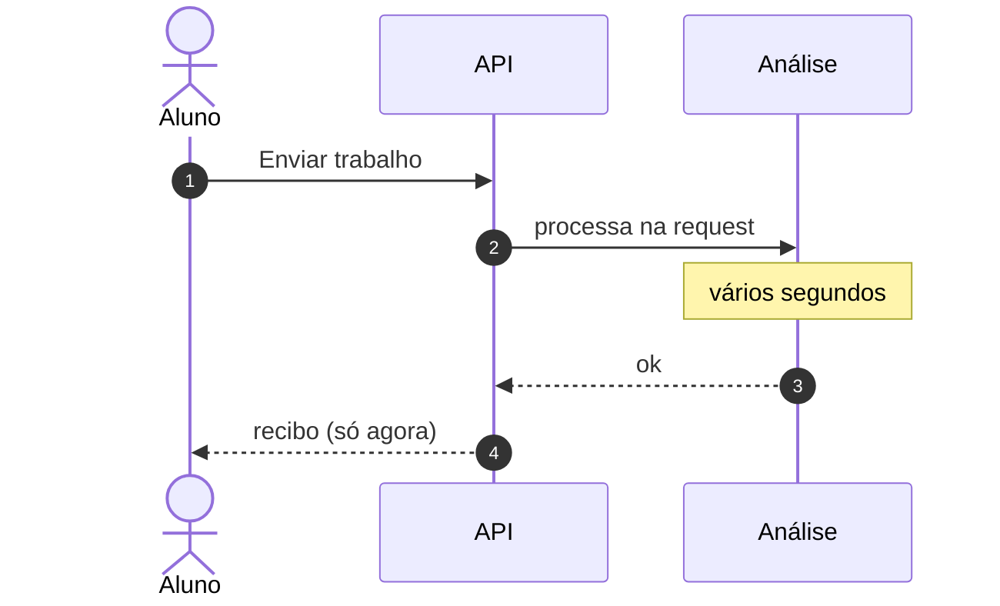
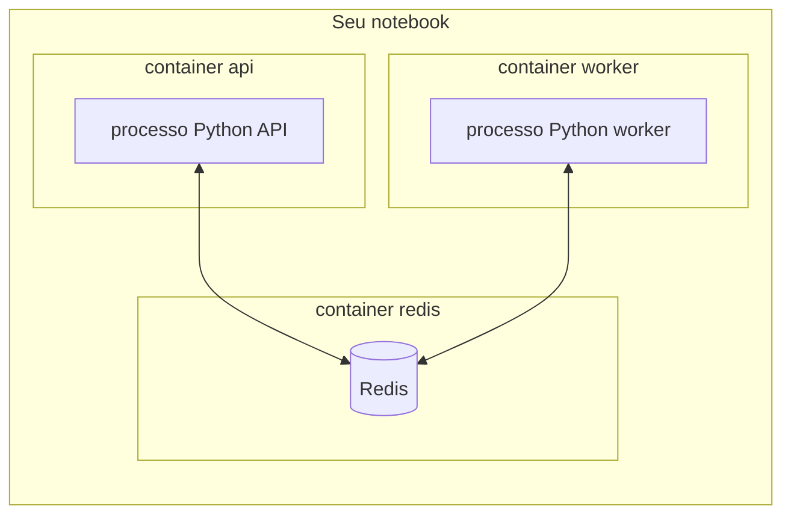
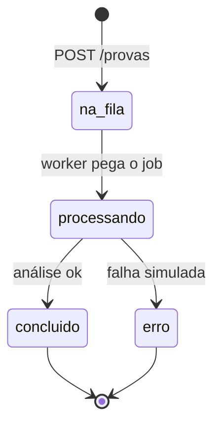
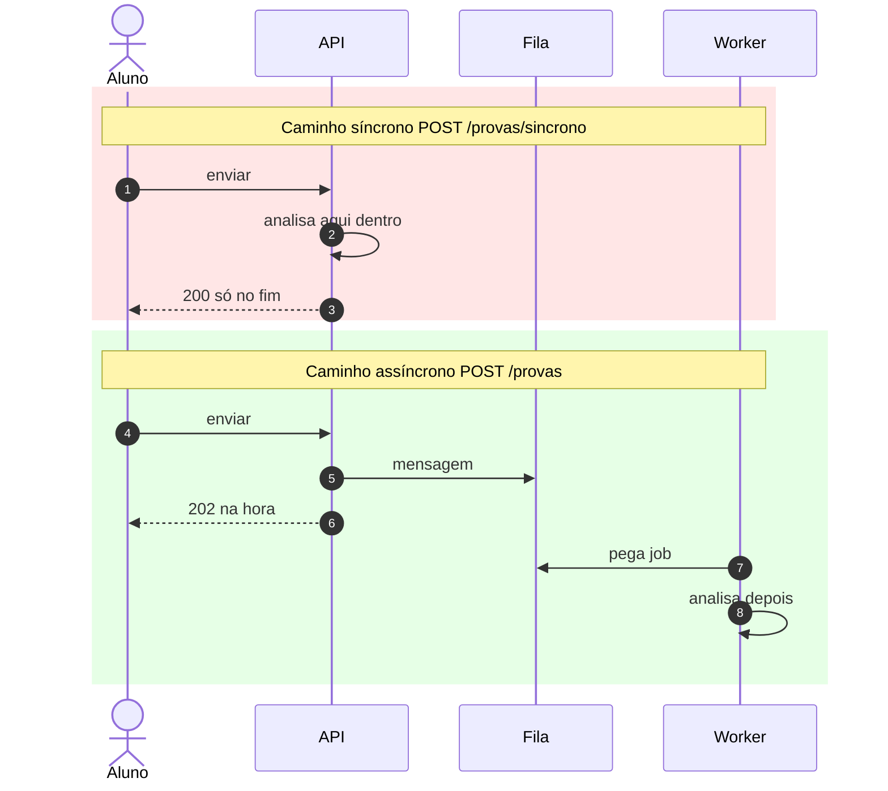
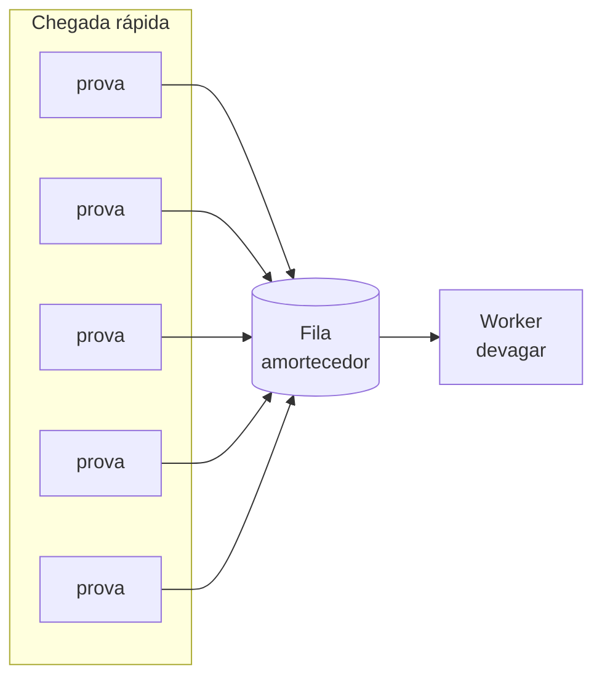
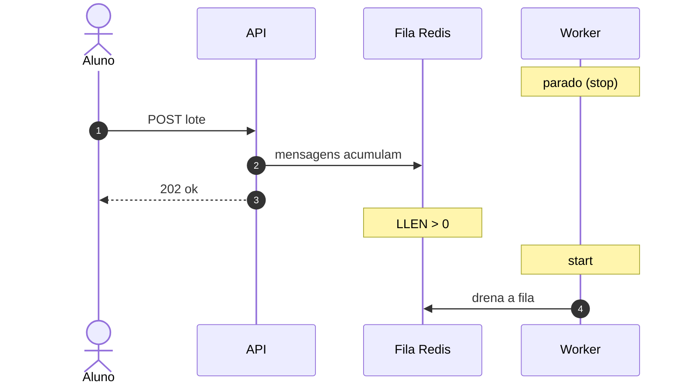
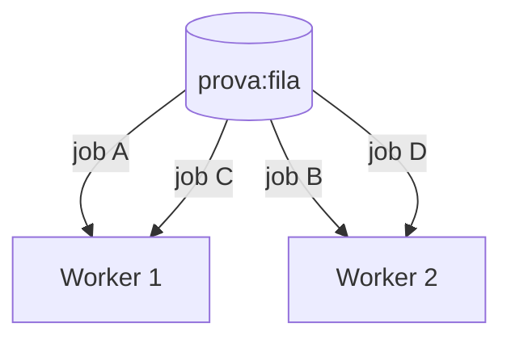
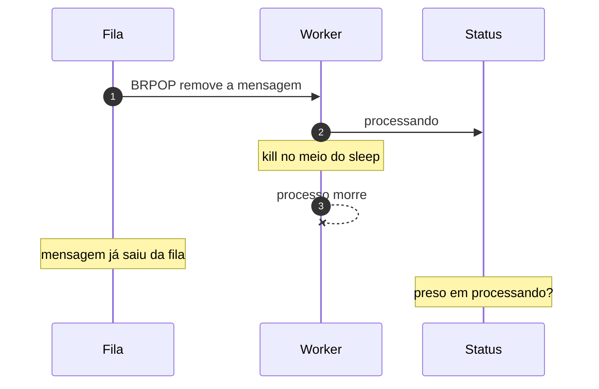

# Tutorial — Lab filas: envio de trabalhos/provas

**Módulo:** [01 — Comunicação](README.md) · **Lab:** [lab-filas/](lab-filas/)  
**Tempo sugerido:** tecnologia 10–15 min + lab 90–120 min  
**Pré-requisito:** [00 — Ambiente Docker](../00-ambiente-docker/) · [teoria.md](teoria.md) §1–4  
**Apoio:** [glossario.md](glossario.md) · [troubleshooting.md](troubleshooting.md)  
**Próximos:** [Kafka](tutorial-kafka.md) · [gRPC](tutorial-grpc.md)

> Leia A e B *antes* do Compose. No lab: rode → observe → anote.

**Protagonista deste lab:** o **aluno** envia o trabalho e precisa de **recibo rápido**; a **coordenação** consulta pareceres depois (painel / status).

---

## Parte A — A tecnologia: filas (o essencial para o lab)

> O padrão *produtor → fila → consumidor*, sync/async e persistente/transiente já estão em [teoria.md](teoria.md). Aqui: o que **esta ferramenta** faz e o que o lab **não** simula.

### Em uma frase

Buffer de **jobs**: quem produz não espera o fim do trabalho; quem consome processa no seu ritmo. Em produção: RabbitMQ, SQS, etc. Aqui: **Redis lista** (`LPUSH` / `BRPOP`) — didático.

### Funcionalidades que importam agora

| No broker maduro | Para quê |
|------------------|----------|
| Enfileirar / consumir | Separar aceite do processamento |
| Compete consumers | Escalar workers |
| Ack após processar | Não perder job se o worker cair |
| Retry / DLQ | Lidar com falha repetida |

### Vantagens / custos (lembrete)

**Ganha:** desacoplamento temporal, pico, escala de workers, ack rápido ao usuário.  
**Paga:** status eventual, operação do broker, cuidado com falha/idempotência. A fila **não** reduz o trabalho total.

### Broker maduro vs este lab

| Promessa típica | Neste lab (Redis lista) |
|-----------------|-------------------------|
| Ack **depois** de processar | `BRPOP` **remove na pegada** — se o worker morrer no meio, o job pode sumir |
| Persistência forte + replay | Status em chave Redis; sem DLQ pronta |
| Retry automático | Não há — por isso o experimento do `kill` dói |

Use a tabela na Parte C: o lab é propositalmente frágil para você **ver** o buraco.

### Quando usar

Trabalho lento/variável, pico, produtor não pode depender do worker online.  
**Não** use se o usuário precisa do resultado completo na mesma request — ou se o problema é fan-out para muitos sistemas ([Kafka](tutorial-kafka.md)).

---

## Parte B — Contexto de uso

### A dor (escala de sala / estágio)

No prazo (ex.: 23h59), dezenas de envios. Se a API só responde quando a análise (antplágio, PDF, etc.) termina, a tela trava e o servidor satura.

O mesmo desenho aparece em: gerar boletim em lote, importar CSV de notas, disparar e-mail após matrícula — **sempre** “aceitar rápido / processar depois”.

**Pergunta-guia:** nos próximos 3 segundos após “Enviar”, o que precisa estar garantido?

### Síncrono vs fila



Com fila: `202` + status `na_fila` → worker analisa → `GET` traz o parecer.

| Peça | Mundo real | Lab |
|------|------------|-----|
| API | Portal de envio | `:8080` |
| Fila | SQS / Rabbit / … | Redis `prova:fila` |
| Worker | Análise | `worker` |

Código: [`lab-filas/`](lab-filas/). PDF **simulado** (sleep).

Neste lab a mensagem na fila é um **comando** de trabalho (`AnalisarProva`) — ver [teoria §6](teoria.md) e [glossário — Comando](glossario.md).

---

## Parte C — Lab prático

> Relacione cada experimento à tabela “broker vs lab” da Parte A. Se travar: [troubleshooting.md](troubleshooting.md).

### C.1 Subir o ambiente

No terminal:

```bash
cd sistemas-distribuidos/01-comunicacao/lab-filas
docker compose up -d --build
docker compose ps
```

Espere os três serviços (`redis`, `api`, `worker`) ficarem `running`. Teste:

```bash
curl -s http://localhost:8080/health
```

Resposta esperada: `{"ok": true}`.

Se algo falhar: `docker compose logs -f api` e `docker compose logs -f worker`.

> **Conceito: vários processos = sistema distribuído em miniatura**  
> API e worker são **processos diferentes** (containers diferentes). Eles não compartilham memória da aplicação: combinam através da **fila** e do **status** no Redis. Essa indirection é o coração do desenho.



Não há memória compartilhada entre API e worker: o Redis é o **ponto de encontro**.

---

### C.2 Caminho feliz — uma prova

### C.2.1 Enviar (enfileirar)

```bash
curl -s -X POST http://localhost:8080/provas \
  -H "Content-Type: application/json" \
  -d '{"aluno":"maria","arquivo":"maria.pdf"}' | python3 -m json.tool
```

Você deve ver algo como:

- HTTP implícito **202** (Accepted) — “aceitei, ainda não terminei”  
- `"status": "na_fila"`  
- um `submission_id` (guarde esse valor)

Cronometre mentalmente: a resposta veio em **fração de segundo**, não em 3 segundos.

> **Conceito: produtor**  
> A API é o **produtor**: quem **cria** a mensagem e a coloca na fila. O produtor não precisa conhecer *quem* vai analisar — só o formato da mensagem.

### C.2.2 Acompanhar o status

Substitua `SEU_ID` pelo `submission_id` retornado:

```bash
./scripts/acompanhar.sh SEU_ID
```

Ou manualmente:

```bash
curl -s http://localhost:8080/provas/SEU_ID | python3 -m json.tool
```

Em poucos segundos o status passa por:

1. `na_fila`  
2. `processando`  
3. `concluido` (com um `relatorio` fictício)



Olhe também o log do worker:

```bash
docker compose logs -f worker
```

> **Conceito: consumidor (worker)**  
> O worker é o **consumidor**: fica esperando mensagens (`BRPOP`), processa uma, depois a próxima. Quem envia a prova e quem analisa estão **desacoplados no tempo**: a API já respondeu quando o worker ainda nem começou.

> **Conceito: fila de mensagens**  
> A fila é um buffer ordenado de trabalhos. Quem produz pode ser mais rápido (ou estar disponível em outro horário) do que quem consome. A fila **segura** o que ainda não foi feito.

---

### C.3 Comparar com a versão síncrona (teoria na pele)

A API também tem um endpoint que **faz a análise dentro do próprio request** — o anti-padrão que queremos evitar no dia da entrega:

```bash
time curl -s -X POST http://localhost:8080/provas/sincrono \
  -H "Content-Type: application/json" \
  -d '{"aluno":"joao","arquivo":"joao.pdf"}' | python3 -m json.tool
```

Observe:

- a resposta demora ≈ `ANALISE_SEGUNDOS` (padrão: 3s)  
- o campo `latencia_api_segundos` confirma isso  
- quem envia só recebe “ok” quando a análise acabou

Agora compare com o assíncrono:

```bash
time curl -s -X POST http://localhost:8080/provas \
  -H "Content-Type: application/json" \
  -d '{"aluno":"ana","arquivo":"ana.pdf"}' | python3 -m json.tool
```

| | `POST /provas/sincrono` | `POST /provas` (fila) |
|--|-------------------------|----------------------|
| Tempo até a resposta | ≈ tempo da análise | curto |
| Análise pronta na resposta? | sim | ainda não |
| Se o analisador estiver sobrecarregado | o upload “trava” | o upload ainda aceita |

Lado a lado no tempo:



> **Conceito: acoplamento temporal**  
> No síncrono, cliente e analisador precisam estar disponíveis **ao mesmo tempo** e o cliente paga a latência do trabalho pesado.  
> No assíncrono com fila, o cliente e o worker podem viver em ritmos diferentes. O preço é outro: você precisa de **status** (“já enviei” ≠ “já tenho relatório”).

Anote em uma frase: *o que quem envia ganha e o que deixa de ter na hora do upload?*

> **Pare e pense (objetivo de decisão)**  
> O caminho feliz do lab é um **híbrido**: HTTP síncrono *curto* (aceite + `202`) + trabalho assíncrono na fila. Isso não é “trapaça” — é o padrão mais comum em portais reais. A pergunta de arquitetura vira: *quais partes do fluxo exigem sincronia até o resultado, e quais só exigem sincronia até o aceite?*

---

### C.4 Entender a mensagem (o “contrato” da fila)

Quando a API enfileira, ela grava um JSON parecido com:

```json
{
  "submission_id": "prova-a1b2c3d4",
  "aluno": "maria",
  "arquivo": "maria.pdf",
  "enqueued_at": "2026-08-23T02:10:00Z"
}
```

Pontos importantes:

- A mensagem carrega **dados suficientes** para o worker trabalhar sem ligar de volta para a API.  
- O `submission_id` identifica a prova de forma estável (vamos usar isso nos testes de falha).

> **Conceito: contrato de mensagem**  
> Em sistemas assíncronos, o “contrato” entre serviços muitas vezes é o **formato da mensagem**, não uma URL de API. Mudar esse JSON sem cuidado quebra produtores e consumidores — mesmo que eles nunca se falem por HTTP.

Inspecione a fila (tamanho):

```bash
curl -s http://localhost:8080/fila | python3 -m json.tool
```

Ou direto no Redis:

```bash
docker compose exec redis redis-cli LLEN prova:fila
```

---

### C.5 Experimentos — evidenciar características de sistemas distribuídos

A partir daqui o objetivo não é “fazer funcionar”. É **provocar o sistema** e anotar o que acontece. Use uma folha (ou o final desta seção) para registrar tempos e impressões.

Antes de cada experimento, se a fila estiver suja:

```bash
docker compose restart worker
# esvaziar fila (cuidado: apaga jobs pendentes)
docker compose exec redis redis-cli DEL prova:fila
```

---

### Experimento 1 — Pico de entrega (a fila como amortecedor)

**Hipótese:** a API continua rápida mesmo quando há muitas provas; o atraso aparece no *término* da análise, não no upload.



```bash
./scripts/enviar-lote.sh 15
curl -s http://localhost:8080/fila | python3 -m json.tool
docker compose logs --tail=30 worker
```

**O que anotar**

- Quanto tempo o `enviar-lote` levou?  
- Qual o `tamanho` da fila logo após o lote?  
- Os statuses das primeiras provas já viraram `processando`/`concluido` enquanto as últimas ainda estão `na_fila`?

> **Conceito: buffer / absorção de pico**  
> A fila acumula trabalho quando a chegada é mais rápida que o consumo. Isso protege a API e espalha a carga no tempo. Em troca, aparece **lag** (atraso até `concluido`).

---

### Experimento 2 — Worker desligado (desacoplamento temporal)

**Hipótese:** com o analisador fora do ar, quem envia **ainda consegue enviar**; as provas esperam.



```bash
docker compose stop worker
./scripts/enviar-lote.sh 10
curl -s http://localhost:8080/fila | python3 -m json.tool
```

Escolha um `submission_id` do lote e consulte:

```bash
curl -s http://localhost:8080/provas/SEU_ID | python3 -m json.tool
```

Status esperado: `na_fila`. A fila não deve estar vazia.

Agora religue:

```bash
docker compose start worker
docker compose logs -f worker
```

A fila deve **drenar** e os statuses irem para `concluido`.

**O que anotar**

- O `POST` falhou com o worker parado? (não deve)  
- Quanto tempo até a fila voltar a zero depois do `start`?

> **Conceito: desacoplamento temporal**  
> Produtor e consumidor não precisam estar no ar no mesmo instante. A fila “segura o bastão”. Isso é o oposto do `POST /provas/sincrono`, que falharia ou travaria se a análise não pudesse rodar na hora.

---

### Experimento 3 — Escalar consumidores (paralelismo)

**Hipótese:** dois workers processam o backlog mais rápido que um.



Vários consumidores **competem** pela mesma fila: cada mensagem vai para **um** worker (não para todos).

Garanta um worker só, esvazie a fila, pare o worker, enfileire 12 provas, meça o tempo para drenar com 1 worker; repita com 2.

**Com 1 worker**

```bash
docker compose stop worker
docker compose exec redis redis-cli DEL prova:fila
./scripts/enviar-lote.sh 12

# anote a hora e suba 1 worker
time (
  docker compose start worker
  while [ "$(curl -s http://localhost:8080/fila | python3 -c 'import sys,json; print(json.load(sys.stdin)["tamanho"])')" != "0" ]; do
    sleep 1
  done
)
```

**Com 2 workers**

No `docker-compose.yml` o serviço se chama `worker`. Suba uma segunda réplica:

```bash
docker compose stop worker
docker compose exec redis redis-cli DEL prova:fila
./scripts/enviar-lote.sh 12

time (
  docker compose up -d --scale worker=2 worker
  while [ "$(curl -s http://localhost:8080/fila | python3 -c 'import sys,json; print(json.load(sys.stdin)["tamanho"])')" != "0" ]; do
    sleep 1
  done
)
```

Veja nos logs hostnames diferentes dos containers — cada réplica do worker se identifica sozinha. O essencial é confirmar **dois consumidores** competindo pela mesma fila.

**O que anotar**

- Tempo com 1 vs 2 workers  
- O ganho foi próximo de 2×? Se não, por quê? (overhead, Redis, sleep fixo…)

> **Conceito: escala horizontal do consumidor**  
> Em filas do tipo *compete consumers*, vários workers pegam mensagens diferentes da mesma fila. Você escala o **trabalho pesado** sem mudar a API. Isso é uma característica clássica de arquiteturas baseadas em mensagens.

Para voltar ao padrão:

```bash
docker compose up -d --scale worker=1 worker
```

---

### Experimento 4 — Queda no meio do job (falha parcial)

**Hipótese:** se o worker morrer durante a análise, o sistema pode ficar em um estado estranho (status `processando` para sempre, ou trabalho perdido) — evidência de que “assíncrono” exige cuidado com falhas.



Neste lab simples o `BRPOP` tira a mensagem **antes** do fim do trabalho. Se o worker cair no meio, a prova pode “sumir” da fila e ficar com status inconsistente — exatamente o tipo de bug que sistemas reais tentam evitar com ack, timeout e retry.

**Opção A — script automático (recomendado)**

```bash
./scripts/provocar-kill.sh
```

O script envia uma prova, espera `processando` e mata o worker — sem depender de reflexo manual.

**Opção B — manual**

```bash
# limpe e envie uma prova
docker compose exec redis redis-cli DEL prova:fila
ID=$(curl -s -X POST http://localhost:8080/provas \
  -H "Content-Type: application/json" \
  -d '{"aluno":"teste-kill","arquivo":"kill.pdf"}' \
  | python3 -c "import sys,json; print(json.load(sys.stdin)['submission_id'])")
echo "ID=$ID"

# quando aparecer "processando" nos logs, mate o worker na hora
docker compose logs -f worker &
sleep 1
docker kill "$(docker compose ps -q worker)"
curl -s "http://localhost:8080/provas/$ID" | python3 -m json.tool
curl -s http://localhost:8080/fila | python3 -m json.tool
```

**O que anotar** (vale para A ou B)

- O status ficou em `processando`?  
- A mensagem ainda está na fila? (neste lab simples, o `BRPOP` **já removeu** a mensagem — ela pode ter “sumido”)  
- O que um sistema de produção faria? (ack só no fim, retry, timeout de status, fila de dead letter…)

Suba o worker de novo:

```bash
docker compose up -d worker
```

> **Conceito: falha parcial e at-least-once**  
> Em sistemas distribuídos, um nó pode morrer no meio do caminho. Brokers maduros só consideram a mensagem “entregue” depois de um **ack**. Muitos sistemas garantem **pelo menos uma vez** (*at-least-once*): a mensagem pode ser processada de novo. Por isso jobs precisam ser **idempotentes** (processar a mesma `submission_id` duas vezes não cria dois relatórios conflitantes).  
> Lembre da ambiguidade clássica do RPC (van Steen, cap. 8): *at-most-once* vs *at-least-once* vs o desejado *exactly-once* — que **não** vem de graça. O `BRPOP` deste lab é propositalmente frágil para você *ver* o buraco.

> **Conceito: consistência eventual**  
> Por um tempo, a verdade do sistema é “a prova foi recebida, mas o relatório ainda não existe” (ou “parece processando, mas o worker morreu”). Usuários e outras partes do sistema precisam ser desenhados para esse atraso — painéis de status, não uma única resposta HTTP mágica.  
> Esse é o preço típico do desacoplamento: você ganha disponibilidade no upload e paga com “ainda não sei o parecer”.

---

### Experimento 5 — O que a fila *não* esconde

**Hipótese:** fila não acelera a análise; só muda *quando* o custo aparece.

Com 1 worker e `ANALISE_SEGUNDOS=3`, 10 provas precisam de ≈ 30s de trabalho total (em série). Enfileirar em 1s não faz a turma ficar pronta em 1s.

Calcule:

```text
tempo_mínimo_aproximado ≈ (número de provas × ANALISE_SEGUNDOS) / número_de_workers
```

Confira com um lote e o relógio.

> **Conceito: a fila não é milagre de performance**  
> Ela melhora **latência do ack**, **resiliência** e **escala do consumidor**. O trabalho total continua existindo. Sem mais workers (ou análise mais rápida), o backlog só espera.

---

### C.6 Tabela de fechamento (preencha com o grupo)

| Característica observada | Onde viu no lab | Vantagem? | Custo / risco? |
|--------------------------|-----------------|-----------|----------------|
| Desacoplamento temporal | Experimento 2 | | |
| Absorção de pico | Experimento 1 | | |
| Escala de workers | Experimento 3 | | |
| Falha parcial | Experimento 4 | | |
| Consistência eventual (status) | Experimento 1–2 | | |
| Acoplamento do caminho síncrono | C.3 | | |

**Perguntas finais**

1. Em qual tela do portal a comunicação **precisa** ser síncrona?  
2. O que você mudaria no worker após o **Experimento 4** (falha / `kill` em C.5) para não perder prova?
3. O `submission_id` ajuda em quê se a mesma mensagem for processada duas vezes?  
4. Onde entraria o armazenamento de arquivos (MinIO) neste desenho — a mensagem carregaria o PDF ou só um caminho?  
5. Se amanhã a equipe trocasse Redis por RabbitMQ, **quais conceitos** do lab permaneceriam iguais e o que mudaria só de ferramenta?  
6. Leve suas anotações da tabela acima para o [Cenário 1 em decisoes.md](decisoes.md) e complete a justificativa de trade-offs.

Comandos e leitura de código: [lab-filas/README.md](lab-filas/README.md#referencia-rapida).

---

### C.7 Para onde ir a partir daqui

**Ainda neste módulo**

1. [tutorial-kafka.md](tutorial-kafka.md) — tópicos e fan-out.  
2. [tutorial-grpc.md](tutorial-grpc.md) — RPC sync e async.  
3. Releia [teoria.md](teoria.md) §5–7 com os labs frescos.  
4. Faça o [workshop de decisões](decisoes.md).  
5. Confira o checklist do [README](README.md).

**Na disciplina (módulos seguintes)**

- **05 Escalabilidade:** medir drenagem com 1/2/4 workers de forma mais sistemática.  
- **06 Falhas:** retry + timeout + dead letter de verdade.  
- **08 Arquivos:** PDF no MinIO; mensagem só com `object_key`.  
- **09 Observabilidade:** propagar `submission_id` em logs/traces.

---

## Encerrar o lab

```bash
docker compose down -v
```

Se você conseguiu: (1) sentir a diferença síncrono vs fila, (2) enviar com worker parado, (3) acelerar com mais um worker, (4) ver o estrago de um `kill` no meio do job e (5) **explicar** pelo menos um trade-off sem olhar o código — você usou a prática para entender comunicação em sistemas distribuídos, não só para reproduzir um tutorial.
