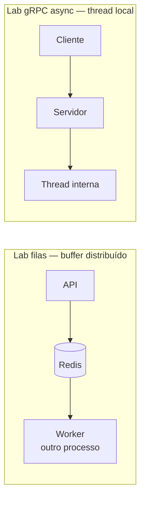
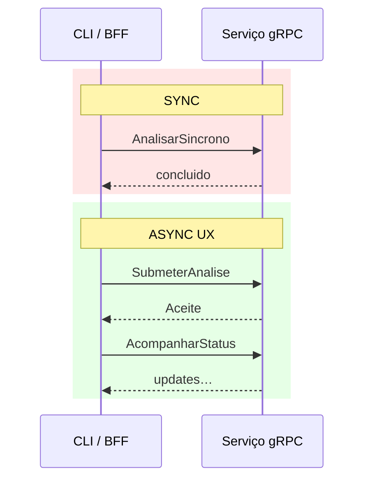
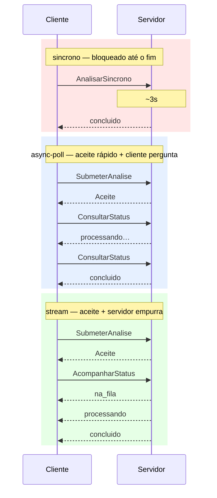

# Tutorial — Lab gRPC: síncrono e assíncrono

**Módulo:** [01 — Comunicação](README.md) · **Lab:** [lab-grpc/](lab-grpc/)  
**Tempo sugerido:** tecnologia 10–15 min + lab 60–90 min  
**Pré-requisito:** [teoria.md](teoria.md) §3 · ideal [tutorial-filas.md](tutorial-filas.md)  
**Apoio:** [glossario.md](glossario.md) · [troubleshooting.md](troubleshooting.md)

> O CLI deste lab **simula o BFF/portal** (não é o browser). Em produção: HTTP na borda → gRPC no miolo.

---

## Parte A — A tecnologia: gRPC (o essencial para o lab)

> RPC, acoplamento temporal e semântica de falha estão em [teoria.md](teoria.md) §3. Aqui: o que o **contrato `.proto`** muda e o cuidado com a palavra “async”.

### Em uma frase

RPC tipado: cliente chama método remoto via stub gerado; contrato em Protobuf; transporte HTTP/2. Família request–response — **complementa** fila/Kafka, não os substitui.

### O que você usa neste lab

| RPC | Estilo | Sensação |
|-----|--------|----------|
| `AnalisarSincrono` | Unary **síncrono** | Bloqueia ≈ tempo da análise |
| `SubmeterAnalise` + `ConsultarStatus` | Aceite + poll | Resposta rápida; status depois |
| `SubmeterAnalise` + `AcompanharStatus` | Server streaming | Servidor empurra mudanças |

### Atenção: “async” aqui ≠ fila distribuída

> Neste lab, **assíncrono** significa: *o cliente não espera o parecer na mesma chamada*.  
> Por baixo, `SubmeterAnalise` dispara uma **thread no mesmo servidor** — não há Redis/Kafka.  
> Em sistema real, esse aceite enfileiraria ([filas](tutorial-filas.md) / [Kafka](tutorial-kafka.md)).  
> **gRPC** resolve contrato + estilo da chamada; o **buffer distribuído** é outro componente.



### Vantagens / custos (lembrete)

**Ganha:** contrato explícito, tipagem, stubs multi-linguagem, streaming nativo, bom no miolo serviço↔serviço.  
**Paga:** acoplamento temporal no unary sync; browser não fala gRPC cru; ferramental e versionamento de `.proto`.

### Quando usar

Malha interna tipada; status/consultas entre serviços.  
**Prefira** REST na borda pública; **fila/Kafka** para jobs em massa no pico.

---

## Parte B — Contexto de uso

> Onde este lab encaixa no [diagrama do módulo](README.md#como-as-três-peças-se-encaixam-sistema-completo): seta **Portal → gRPC** (miolo tipado entre serviços).

### Onde isso aparece na sua trilha

| Camada | Tecnologia | Exemplo |
|--------|------------|---------|
| Portal | HTTP + JSON | Aluno envia trabalho |
| Serviço de análise | **gRPC** | Status / análise tipada |
| Lote no prazo | Fila ou tópico | Lab filas / Kafka |

Estágio ou TCC com “API + workers” costuma chegar aqui: o portal não implementa a análise; **chama um serviço** com contrato firme.

### Cenário do lab

Cliente CLI (= BFF) fala com o serviço de análise:

1. **Sync** — precisa do parecer agora (demo / operação pontual).  
2. **Async (UX)** — submete e acompanha (poll ou stream).



Contrato: [`lab-grpc/proto/provas.proto`](lab-grpc/proto/provas.proto).

---

## Parte C — Lab prático

> Meça latência. Lembre o box da Parte A: async UX ≠ fila.

### C.1 Subir o servidor

```bash
cd sistemas-distribuidos/01-comunicacao/lab-grpc
docker compose up -d --build
docker compose logs -f grpc-server
```

Deve aparecer: `gRPC em 0.0.0.0:50051`. Se `UNAVAILABLE` no cliente: [troubleshooting.md](troubleshooting.md).

---

### C.2 Caminho síncrono

```bash
./scripts/cliente.sh sincrono
```

**Saída esperada (exemplo):**

```text
== AnalisarSincrono (SYNC) → grpc-server:50051
status=concluido parecer='ok para correção manual' similaridade=18
latência do RPC: 3.02s (≈ tempo da análise)
```

**Anote:** a latência ≈ `ANALISE_SEGUNDOS` (padrão 3s). O cliente ficou **bloqueado** o tempo todo — mesmo efeito do `POST /provas/sincrono` no lab de filas.

> **Pare e pense:** em qual tela real isso ainda faria sentido? (Dica: operação pontual, admin, “preciso do parecer agora”.)

---

### C.3 Assíncrono com polling

```bash
./scripts/cliente.sh async-poll
```

**Saída esperada (trecho):**

```text
aceite em 0.01s → id=prova-abc12345 status=na_fila
  poll: status=processando
  poll: status=concluido
final: parecer='ok para correção manual' similaridade=22
```

**Anote:** tempo até o aceite (curto); quantos polls até `concluido`; quem **inicia** cada consulta (o cliente).

> **Conceito:** UX assíncrona com **acoplamento temporal** no miolo — cada poll é um RPC. Sem fila externa, o trabalho roda numa thread do mesmo servidor (box da Parte A).

---

### C.4 Assíncrono com server streaming

```bash
./scripts/cliente.sh stream
```

**Saída esperada (trecho):**

```text
submetido id=prova-def67890
  stream: status=na_fila parecer=''
  stream: status=processando parecer=''
  stream: status=concluido parecer='revisar trechos'
```

Compare com o poll: quem detecta a mudança — **cliente** (poll) ou **servidor** (stream)?

> **Ligação:** no [cenário 5 de decisoes.md](decisoes.md) você escolhe polling HTTP vs WebSocket/SSE para o painel. `AcompanharStatus` é o equivalente **gRPC** de “servidor empurra atualizações” — ver [tutorial-grpc C.4](tutorial-grpc.md) e [glossario — Server streaming](glossario.md).

---

### C.5 Experimento — Sync vs async no relógio

Compare os três modos no tempo (rode C.2–C.4 e complete a tabela):



| Modo | Tempo até 1ª resposta útil | Tempo até parecer | Cliente bloqueado o tempo todo? |
|------|----------------------------|-------------------|----------------------------------|
| `sincrono` | | | |
| `async-poll` | | | |
| `stream` | | | |

*Exemplo ilustrativo* (valores aproximados com `ANALISE_SEGUNDOS=3` — preencha com os seus):

| Modo | Tempo até 1ª resposta útil | Tempo até parecer | Cliente bloqueado o tempo todo? |
|------|----------------------------|-------------------|----------------------------------|
| `sincrono` | ~3s (já traz parecer) | ~3s | **sim** |
| `async-poll` | ~0,01s (aceite) | ~3s + intervalo dos polls | **não** (só bloqueia em cada poll) |
| `stream` | ~0,01s (aceite) | ~3s (updates empurrados) | **não** |

---

### C.6 Experimento — Servidor parado (acoplamento temporal)

**Hipótese:** no unary síncrono, se o serviço cair, o cliente falha na hora. Com aceite async + estado **só em memória**, reiniciar o processo apaga o trabalho — não há fila externa.

**1) Sync: funciona → derruba → falha**

```bash
./scripts/cliente.sh sincrono          # deve funcionar (~3s)
docker compose stop grpc-server
./scripts/cliente.sh sincrono          # deve falhar (UNAVAILABLE / conexão)
docker compose start grpc-server
sleep 2
```

**2) Aceite async e perda de estado ao reiniciar o processo**

```bash
# server deve estar up
OUT=$(./scripts/cliente.sh aceite)
echo "$OUT"
ID=$(echo "$OUT" | sed -n 's/^SUBMISSION_ID=//p')
echo "ID=$ID"
# derruba o processo inteiro (estado só vive em memória)
docker compose stop grpc-server
docker compose start grpc-server
sleep 2
./scripts/cliente.sh status "$ID"      # esperado: NOT_FOUND (memória zerou)
```

Alternativa: copie o id manualmente da linha `SUBMISSION_ID=…` impressa pelo comando `aceite`.

**Anote**

- O sync falhou de forma clara com o server down?  
- Depois do restart, o `status` do id aceito ainda existia? Por quê?

> Contrastar com [filas](tutorial-filas.md): lá o job pode sobreviver na Redis se o worker cair *depois* do enqueue (o problema era o ack). Aqui não há buffer distribuído — releia o box da Parte A.

---

### C.7 Ler o contrato

Abra `proto/provas.proto`:

1. Quais RPCs são unários? Qual é streaming?  
2. Renomear `parecer` quebra o quê?  
3. Por que gRPC é mais comum **entre serviços** do que no browser?

---

### C.8 Tabela de fechamento

| Característica | Onde viu | Vantagem? | Custo? |
|----------------|----------|-----------|--------|
| Unary sync (bloqueio) | C.2 / C.5 | | |
| Aceite + poll | C.3 | | |
| Server streaming | C.4 | | |
| Falha com server down | C.6 | | |
| Async UX ≠ fila | Parte A / C.6 | | |

**Perguntas finais**

1. O portal (browser) falaria gRPC direto ou HTTP → BFF → gRPC? Por quê?  
2. Onde entraria fila/Kafka **depois** do `SubmeterAnalise` em produção?  
3. Stream vs poll: qual você usaria no painel “tempo real” do [cenário 5](decisoes.md)?  
4. → [decisoes.md](decisoes.md) cenários **1**, **4** e **5**

Comandos e leitura de código: [lab-grpc/README.md](lab-grpc/README.md#referencia-rapida).

---

### C.9 Ligação com os outros labs

| Necessidade | Lab |
|-------------|-----|
| Job com buffer e escala | [filas](tutorial-filas.md) / [Kafka](tutorial-kafka.md) |
| Contrato tipado / status interno | **este** |
| Observar progresso sem poll agressivo | `AcompanharStatus` |

Diagrama completo: [README — sistema completo](README.md#como-as-tres-pecas-se-encaixam-sistema-completo).

---

## Encerrar

```bash
docker compose down -v
```

Se você conseguiu: (1) medir sync vs aceite async, (2) comparar poll vs stream, (3) ver falha clara com server down no sync, (4) explicar por que restart apaga estado async e (5) dizer onde entraria fila/Kafka em produção — você entendeu gRPC como **contrato no miolo**, não substituto de fila.

Leve C.5 e C.6 para [decisoes.md](decisoes.md) (cenários 1, 4 e 5).
