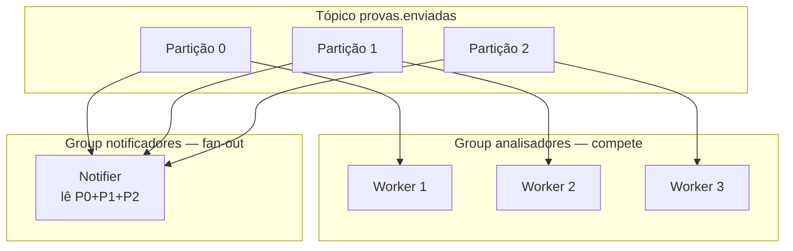
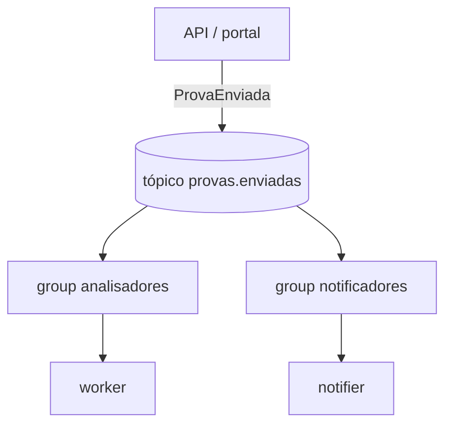
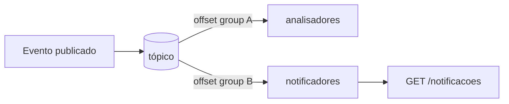
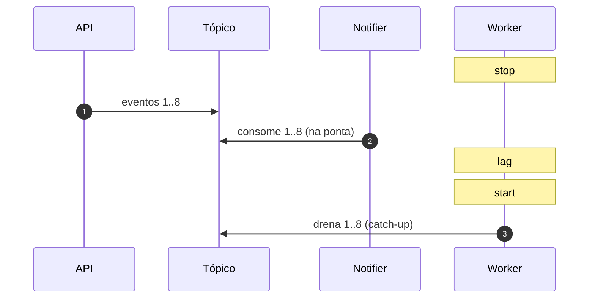
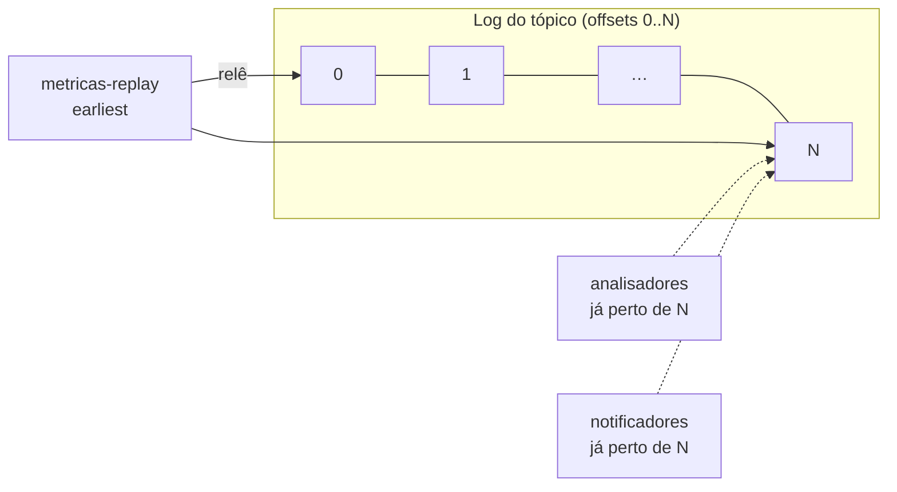

# Tutorial — Lab Kafka: tópicos e eventos

**Módulo:** [01 — Comunicação](README.md) · **Lab:** [lab-kafka/](lab-kafka/)  
**Tempo sugerido:** tecnologia 10–15 min + lab 60–90 min  
**Pré-requisito:** [tutorial-filas.md](tutorial-filas.md) · [teoria.md](teoria.md) §4–5  
**Apoio:** [glossario.md](glossario.md) · [troubleshooting.md](troubleshooting.md)
**SO:** Linux, macOS e Windows — [como rodar os comandos](../ferramentas/linux-e-windows.md).  

> Não é “Kafka > fila”. É: **quando o modelo de log/tópico** se justifica (vários interessados no **mesmo fato**, replay, leituras independentes).

> **Diferença mental em uma frase:** fila = “faça este **trabalho** uma vez”; Kafka = “registrei este **fato** — quem quiser lê depois, no seu ritmo”.

---

## Parte A — A tecnologia: Kafka (o essencial para o lab)

> Fila vs mensagem, comandos vs eventos e EDA estão em [teoria.md](teoria.md). Aqui: o que o **tópico + consumer group** muda em relação ao lab de filas.

### Em uma frase

Log de eventos append-only: produtores publicam; cada **consumer group** lê com seu **offset**. Groups diferentes = **fan-out**. Mesmo group = **compete** (partições).

### Fila Redis (lab anterior) vs tópico Kafka (este lab)

| | Lab filas | Lab Kafka |
|--|-----------|-----------|
| Unidade | Job/comando na fila | Evento no log (`ProvaEnviada`) |
| Consumidor típico | Um worker pega e a mensagem **sai** | Vários groups leem a **mesma** entrada |
| Novo interessado | Nova fila ou mudar produtor | Novo **consumer group** |
| Consultar resultado | `GET /provas/{id}` (Redis) | `GET /provas/{id}` (status) + `GET /notificacoes` (rastro do notifier) |
| Replay | Não (lista Redis) | Sim — group novo com `earliest` |

### O que você precisa dominar agora

| Conceito | Para quê no lab |
|----------|-----------------|
| Tópico + partições | Paralelismo; ordem por **chave** |
| Consumer group | Compete vs fan-out |
| Offset / lag | Um group atrasa; outro segue |
| Retention / replay | Reler o passado (experimento **C.7**) |



> Mesmo group: cada partição vai para **um** consumidor. Outro group: **outra** leitura do mesmo log (offsets independentes).

### Vantagens / custos (lembrete)

**Ganha:** fan-out, desacoplamento (novo listener = novo group), replay, escala até nº de partições.  
**Paga:** operação, governança de schema, overkill se só há um worker e pouco volume.

### Ligação com EDA (Richards)

O lab se aproxima da topologia **broker** (*Software Architecture Patterns*): não há mediador central orquestrando passos; o fato `ProvaEnviada` é publicado e cada processador (análise, notificação) reage no seu group.  
Se amanhã a coordenação pedisse um fluxo rígido com compensações e estado global do processo, aí entraria um **mediator**/orquestrador ([teoria.md](teoria.md) §5 · [decisoes.md](decisoes.md) cenário 3).

### Quando usar

Vários sistemas reagem ao **mesmo fato**; precisa de replay/auditoria.  
**Prefira fila** se só existe um processador de job e o volume é baixo ([decisoes.md](decisoes.md) cenário 6).

---

## Parte B — Contexto de uso

### A nova dor (depois da fila)

Com a fila você resolveu “aceitar rápido / analisar depois”. A coordenação pede **mais um interessado** sem mudar o portal:

| Fato | Interessados |
|------|----------------|
| Trabalho/prova **enviado** | Análise (antplágio) · notificação à coordenação · (depois) métricas/auditoria |

Chamadas HTTP em cadeia (`portal → análise → e-mail`) acoplam falha e latência. Nova fila por interessado também escala mal.

**Tópico:** publica o **evento** `ProvaEnviada` uma vez; cada team/group consome no seu ritmo — ver [teoria §6](teoria.md) e [glossário — Evento](glossario.md).

### O que este lab constrói

Mesmo domínio do lab de filas (envio de prova/trabalho), agora com **dois consumer groups**:

1. **analisadores** — compete (cada evento analisado uma vez no group)  
2. **notificadores** — fan-out (vê *todos*; grava rastro consultável em `GET /notificacoes` + log `NOTIFICAR`)



**Pergunta-guia:** um terceiro interessado (métricas) exige mudar o produtor — ou só um novo group?

Código: [`lab-kafka/`](lab-kafka/).

### Duas consultas HTTP (não confunda)

| Endpoint | O que mostra | Quem escreve |
|----------|--------------|--------------|
| `GET /provas/{id}` | Status da **análise** (`na_fila` → `concluido`) — igual ao lab de filas | API (publicação) + worker (processamento) |
| `GET /notificacoes` | Rastro do **notifier** (fan-out) — prova que outro group reagiu | notifier |

O evento no tópico é compartilhado; cada group consome de forma independente. O status HTTP espelha o worker de análise; as notificações espelham o group `notificadores`.

> **Atalho didático — de onde vem o status?**  
> `GET /provas/{id}` lê JSON num **volume compartilhado** (`status_store.py` na API e no worker) — **não** vem do broker Kafka. O tópico guarda o **evento** (`ProvaEnviada`); o parecer fica em store de aplicação (DB, Redis, etc. em produção). Não confunda *log de eventos* com *estado da análise*.

---

## Parte C — Lab prático

> Confirme: fan-out, partições × consumidores, chave estável, lag, **replay**.

### C.1 Subir o ambiente

```bash
cd sistemas-distribuidos/01-comunicacao/lab-kafka
docker compose up -d --build
docker compose ps
curl -s http://localhost:8081/health
```

Se `health` falhar no começo, espere 30–60s (broker subindo). Ver [troubleshooting.md](troubleshooting.md).

```bash
docker compose logs -f api
```

---

### C.2 Publicar um evento

```bash
curl -s -X POST http://localhost:8081/provas \
  -H "Content-Type: application/json" \
  -d '{"aluno":"maria","arquivo":"maria.pdf"}' | python3 -m json.tool
```

**Saída esperada (exemplo):**

```json
{
  "event_type": "ProvaEnviada",
  "submission_id": "prova-a1b2c3d4",
  "aluno": "maria",
  "arquivo": "maria.pdf",
  "topic": "provas.enviadas",
  "partition": 1,
  "offset": 42
}
```

Guarde o `submission_id`. Logo após o `POST`, `GET /provas/{id}` deve mostrar `"status": "na_fila"`.

```bash
docker compose logs --tail=20 worker
docker compose logs --tail=20 notifier
curl -s "http://localhost:8081/notificacoes?n=5" | python3 -m json.tool
./scripts/acompanhar.sh SEU_ID
```

**O que você deve ver**

- Worker: linha `analisando prova-…` e depois `concluído`  
- Notifier: linha `NOTIFICAR aluno=maria …`  
- `/notificacoes`: item com o mesmo `submission_id`  
- `/provas/{id}`: status passa `na_fila` → `processando` → `concluido` (com `relatorio`)

> **Consumer group:** offset por (group, partição). Groups diferentes = fan-out — o notifier não “rouba” mensagem do worker.

> **Pare e pense:** o `POST` respondeu rápido como no lab de filas. O que mudou **depois** do aceite? (Dica: dois consumidores independentes + evento imutável no log.)

---

### C.3 Experimento — Fan-out (dois groups)

O que você vai ver: **dois offsets** no mesmo tópico — análise e notificação independentes.



```bash
./scripts/enviar-lote.sh 6
docker compose logs --tail=40 worker notifier
curl -s "http://localhost:8081/notificacoes?n=10" | python3 -m json.tool
```

**Anote:** ~6 análises nos logs do worker, ~6 linhas `NOTIFICAR`, ~6 itens em `/notificacoes`? Os `submission_id` batem entre worker e notifier?

> **Pare e pense:** se o notifier usasse o **mesmo** `GROUP_ID` do worker (`analisadores`), o que aconteceria? (Teste opcional: mude temporariamente no Compose e reverta.)

---

### C.4 Experimento — Escala no mesmo group

3 partições → até 3 workers úteis no group `analisadores` (releia o diagrama da Parte A):

```bash
docker compose up -d --scale worker=3 worker
./scripts/enviar-lote.sh 12
docker compose logs --tail=50 worker
```

**Anote:** hostnames diferentes nos logs? Com `--scale worker=4`, o 4º fica ocioso? Por quê?

**Medição opcional (espelha filas Exp. 3):** com fila vazia, envie lote de 12, cronometre até todos `concluido` com 1 worker; repita com 3 workers.

```bash
docker compose up -d --scale worker=1 worker
./scripts/enviar-lote.sh 12
# anote IDs e acompanhe um deles; repita com --scale worker=3
```

> **Conceito:** paralelismo no group = **nº de partições** (3 neste lab). Consumidor extra no mesmo group não acelera além disso.

```bash
docker compose up -d --scale worker=1 worker
```

---

### C.5 Experimento — Partição estável por chave

A **chave** do evento (`submission_id`) decide a partição. Mesma chave → mesma partição (útil para ordem local).

```bash
curl -s -X POST http://localhost:8081/provas \
  -H "Content-Type: application/json" \
  -d '{"submission_id":"prova-fix","aluno":"x","arquivo":"a.pdf"}' | python3 -m json.tool

curl -s -X POST http://localhost:8081/provas \
  -H "Content-Type: application/json" \
  -d '{"submission_id":"prova-fix","aluno":"x","arquivo":"a.pdf"}' | python3 -m json.tool
```

A `partition` deve ser a **mesma** nos dois responses — mas são **dois eventos** no log (offsets diferentes). Kafka **não** deduplica por id: idempotência é responsabilidade do consumidor.

> **Pare e pense:** em produção, republicar o mesmo `submission_id` por engano geraria análise duplicada. O que o worker deveria fazer? (Dica: [glossario — idempotência](glossario.md))

---

### C.6 Experimento — Lag e desacoplamento

O que você vai ver: notifier na ponta do log; worker atrasado (**lag**) e depois catch-up.



```bash
docker compose stop worker
./scripts/enviar-lote.sh 8
docker compose logs --tail=15 notifier
docker compose start worker
docker compose logs -f worker
```

**Anote:** notifier seguiu com worker parado? Worker fez catch-up depois do `start`? Compare `GET /provas/{id}` de uma prova do lote — ficou `na_fila` até o worker voltar?

> **Conceito — lag:** um group pode estar “atrás” do log enquanto outro já leu tudo. Isso é normal e desejável em fan-out.

---

### C.7 Experimento — Replay (novo consumer group)

A Parte A vendeu **replay**. Evidência: um **terceiro** interessado lê o histórico sem republicar e sem mudar a API.



```bash
# precisa ter eventos no tópico (rode C.3 ou C.6 antes)
./scripts/replay-group.sh 8
```

**Saída esperada (exemplo):**

```text
replay group=metricas-replay-12345 topic=provas.enviadas max=8
REPLAY id=prova-abc12345 part=0 off=0
REPLAY id=prova-def67890 part=1 off=1
…
total_lido=8
```

**Anote**

- O novo group viu eventos **antigos**?  
- Worker/notifier originais mudaram de comportamento? (não devem — offsets deles já estavam commitados)

> Isso é o “terceiro interessado” da Parte B (ex.: métricas) — só um novo `GROUP_ID` com `auto_offset_reset=earliest`.

> **Pare e pense:** por que isso seria impossível (ou muito mais difícil) com a lista Redis do lab de filas?

---

### C.8 Tabela de fechamento

| Característica | Onde viu | Vs fila Redis | Vantagem? | Custo? |
|----------------|----------|---------------|-----------|--------|
| Fan-out por group | C.3 (+ `/notificacoes`) | | | |
| Status da análise (`GET /provas/{id}`) | C.2 | | | |
| Compete / partições | C.4 | | | |
| Chave → partição | C.5 | | | |
| Lag / catch-up | C.6 | | | |
| Replay (novo group) | C.7 | | | |

**Perguntas finais**

1. Em uma frase: quando **fila** basta e quando **Kafka** se justifica?  
2. Fan-out vale a complexidade operacional neste domínio de provas?  
3. O que `/provas/{id}` e `/notificacoes` provam **cada um**?  
4. → [decisoes.md](decisoes.md) cenários **3** e **6**

Comandos e leitura de código: [lab-kafka/README.md](lab-kafka/README.md#referencia-rapida).

---

## Encerrar

```bash
docker compose down -v
```

Se você conseguiu: (1) ver fan-out (worker + notifier + `/notificacoes`), (2) explicar por que 4 workers no mesmo group não aceleram além de 3, (3) observar lag com worker parado, (4) rodar replay e (5) distinguir status HTTP do evento no tópico — você entendeu Kafka como **log de fatos**, não como fila mais cara.
