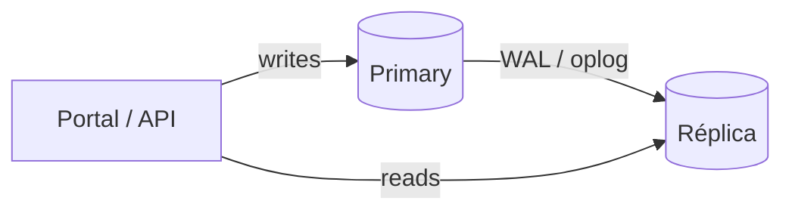

# 02 — Replicação em sistemas distribuídos

**Conceito central:** copiar estado entre nós para disponibilidade e/ou escala de leitura — e entender o que se **ganha** e o que se **paga** (lag, failover, consistência).  
**Domínio âncora:** portal acadêmico — notas lançadas pelo primary, consultadas em massa (boletim / painel).  
**Stack:** Python 3 · Docker Compose · PostgreSQL (streaming replication + lab sync/async) · MongoDB (replica set)

Pré-requisitos: [00 — Ambiente Docker](../00-ambiente-docker/) · ideal [01 — Comunicação](../01-comunicacao/) (falha parcial, desacoplamento).  
Apoio: [glossario.md](glossario.md) · [troubleshooting.md](troubleshooting.md)

---

## Objetivos de aprendizado

Ao final deste módulo, você deve ser capaz de:

1. **Explicar** por que sistemas distribuídos replicam dados (disponibilidade, leitura, tolerância a falha de nó).
2. **Descrever** o modelo **líder / seguidores** (primary–replica) e onde a escrita vs leitura acontece.
3. **Distinguir** replicação **síncrona** vs **assíncrona** e o trade-off latência de escrita × risco de perda / lag.
4. **Observar e interpretar** *replication lag* e leituras **stale** em réplica.
5. **Relacionar** replicação em **SQL** (Postgres) e **NoSQL** (MongoDB replica set) — sem achar que “é tudo igual”.
6. **Decidir** em cenários reais quando réplicas de leitura valem a complexidade operacional.
7. **Experimentar** na prática: escrita no primary, leitura na réplica, lag, **sync vs async** e failover (Mongo).

> Meta: argumentar uma escolha de replicação — não só rodar `docker compose up`.

---

## Caminhos de estudo

### Caminho mínimo (~4–5 h)

Fecha objetivos **1–4** e **6** (parcial) com o lab Postgres; objetivo **3** (sync vs async) fica na **teoria** §3:

1. [teoria.md](teoria.md) §1–4, **§3** (sync vs async) e §8  
2. [tutorial-postgres.md](tutorial-postgres.md) (Partes A–C)  
3. [decisoes.md](decisoes.md) — cenários **1** e **4**; cenário **6** (conceitual, sem lab sync-async)  
4. Objetivo **5** (parcial): §1–2 de [tecnologias-e-escolhas.md](tecnologias-e-escolhas.md)  
5. Checklist **mínimo** abaixo  

> Objetivo **3** no caminho mínimo = explicar sync/async pela **teoria** e [decisoes §6](decisoes.md). O [lab sync-async](tutorial-sync-async.md) é do **caminho completo**.

**Pré-requisitos no host:** `curl`, `python3` (para `json.tool` nos exemplos), Docker Compose ([00 — Ambiente Docker](../00-ambiente-docker/)).

**Diagramas:** os `.md` usam Mermaid — renderizam no GitHub, no VS Code (preview) e em visualizadores compatíveis.

### Caminho completo (~9–11 h) — recomendado

Reserve tempo extra para **três** boots de réplica (1–3 min cada) além dos experimentos. Turma no primeiro contato com Docker: considere **+1–2 h** de margem.

| Ordem | Material | Tempo | Para quê |
|-------|----------|-------|----------|
| 1 | [teoria.md](teoria.md) | 40–50 min | Modelo mental |
| 2 | [tutorial-postgres.md](tutorial-postgres.md) | ~2 h | Primary + standby · lag |
| 3 | [tutorial-sync-async.md](tutorial-sync-async.md) | ~1–1,5 h | Commit sync vs async · RPO |
| 4 | [tutorial-mongodb.md](tutorial-mongodb.md) | ~1,5–2 h | Replica set · eleição |
| 5 | [decisoes.md](decisoes.md) | 40–50 min | Trade-offs |
| 6 | Releia §5–7 de [teoria.md](teoria.md) | 15 min | Multi-leader · ponte p/ 03 |

**Consulta:** [tecnologias-e-escolhas.md](tecnologias-e-escolhas.md) — quando travar em “Postgres ou Mongo?”.

Cada tutorial: **A** tecnologia → **B** contexto → **C** lab.

---

## Arco narrativo

1. **Dor** — no dia do boletim, milhares de alunos consultam notas; o único banco satura.  
2. **Alívio** — [Postgres + read replica](tutorial-postgres.md): escrita no primary, leitura na réplica.  
3. **Nova dor (leitura)** — aluno vê nota **antiga** na réplica (lag). Use `./scripts/provocar-stale.sh` se o stale não aparecer sozinho no laptop.  
4. **Nova dor (escrita)** — [sync vs async](tutorial-sync-async.md): “salvo com sucesso” garante o quê na réplica se o primary cair?  
5. **Nova dor (disponibilidade)** — primary cai: no Postgres read-replica isso **não** é exercitado (promoção manual/Patroni); em [Mongo replica set](tutorial-mongodb.md) você **sente** eleição automática — **mesmo domínio de notas, mecanismos diferentes** (WAL vs oplog).  
6. **Fechamento** — [decisoes.md](decisoes.md) + ponte para [03 — Consistência/CAP](../03-consistencia-cap/).



> No lab Postgres há **uma** réplica; no Mongo, **duas** secondaries — o diagrama é genérico.

### Mapa dos 3 labs — qual pergunta cada um responde

| Lab | Pergunta central | Objetivo principal |
|-----|------------------|-------------------|
| [lab-postgres](lab-postgres/) | Posso aliviar leitura na réplica? O que é lag/stale? | 2, 4 |
| [lab-sync-async](lab-sync-async/) | O “ok” após salvar garante cópia na réplica (RPO)? | 3 |
| [lab-mongodb](lab-mongodb/) | Se o primary cair, quem assume (RTO)? | 5, 7 |

Os dois primeiros usam **Postgres** de propósito: primeiro **escala/frescor de leitura**, depois **garantia de commit** — perguntas diferentes, mesma stack familiar.

| Papel técnico | Lab |
|-------|----------------|
| Streaming replication (SQL) | [lab-postgres](lab-postgres/) |
| Sync vs async (commit / RPO) | [lab-sync-async](lab-sync-async/) |
| Replica set + eleição (documento) | [lab-mongodb](lab-mongodb/) |

**Um lab por vez.** Antes do próximo: `docker compose down -v` no lab atual. Ver [troubleshooting.md](troubleshooting.md).

```bash
cd sistemas-distribuidos/02-replicacao/lab-postgres && docker compose up -d --build
# … depois (encerrando o anterior):
cd ../lab-sync-async && ./scripts/subir-async.sh
# … depois:
cd ../lab-mongodb && docker compose up -d --build
```

---

## Os labs

| Lab | Porta API | Ideia central |
|-----|-----------|---------------|
| **[lab-postgres](lab-postgres/)** | `8082` | Primary + standby · lag · read replica |
| **[lab-sync-async](lab-sync-async/)** | `8084` | Commit async vs sync · RPO |
| **[lab-mongodb](lab-mongodb/)** | `8083` | Replica set · read preference · failover |

---

## Bibliografia de apoio

| Fonte | Uso neste módulo |
|-------|------------------|
| van Steen & Tanenbaum, *Distributed Systems* | Modelos de replicação · primary–backup · consistência |
| Xu, *System Design Interview* (vol. 2) | Read replicas · lag · failover |
| Ford et al., *Software Architecture: The Hard Parts* | Trade-offs de distribuição de dados |
| Richards & Ford, *Fundamentals of Software Architecture* | Disponibilidade vs complexidade operacional |

---

## Critério de “pronto”

**Mínimo**

- [ ] Explico primary/replica (**teoria** §2) e sync vs async (**teoria** §3) sem olhar o Compose.  
- [ ] No lab **Postgres**: escrevo no primary, leio na réplica, discuto lag/stale (`provocar-stale.sh` se precisar).  
- [ ] Em **dois** cenários de [decisoes.md](decisoes.md), justifico vantagem + custo.  
- [ ] Sei em uma frase quando réplica de leitura ajuda (vs um banco só).

> **Caminho completo** (labs extras): [sync-async](tutorial-sync-async.md) fecha obj. **3** na prática; [Mongo](tutorial-mongodb.md) fecha obj. **7** (failover).

**Completo** (soma ao mínimo)

- [ ] Lab **sync-async**: comparo `sync_state` async vs sync e POST com réplica parada.  
- [ ] Mongo: interpreto `replSetGetStatus` e vi efeito de parar o primary.  
- [ ] Comparo Postgres standby vs Mongo secondary em uma frase cada.  
- [ ] Sei o que delegar ao módulo [03 — CAP](../03-consistencia-cap/) (partição, quórum).

**Próximo módulo:** [03 — Consistência e CAP](../03-consistencia-cap/) — partição de rede, CP vs AP, matrícula vs feed de avisos.
