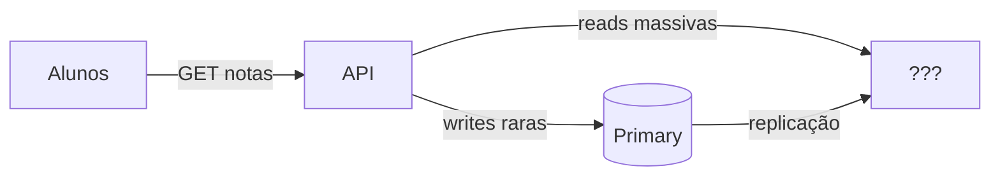
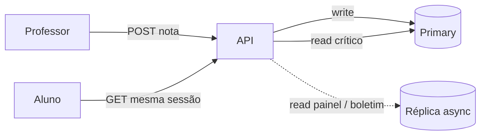
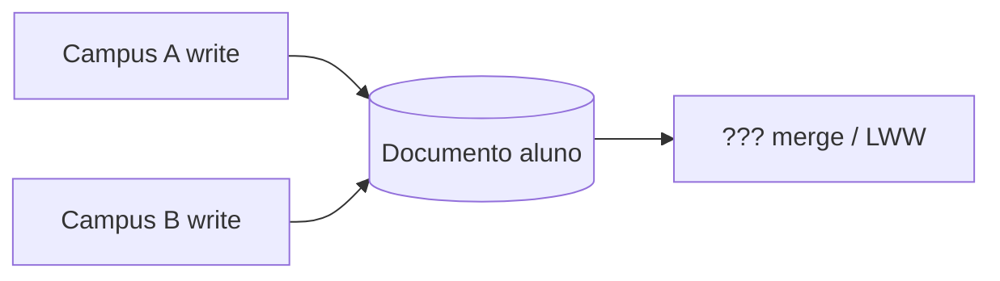
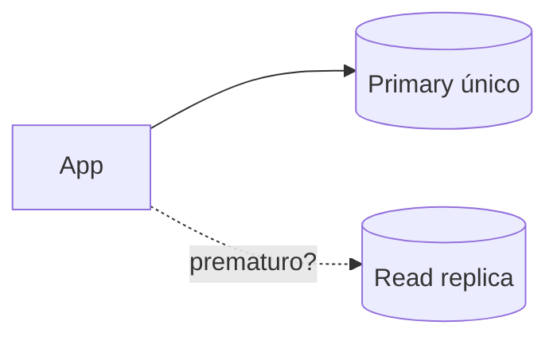
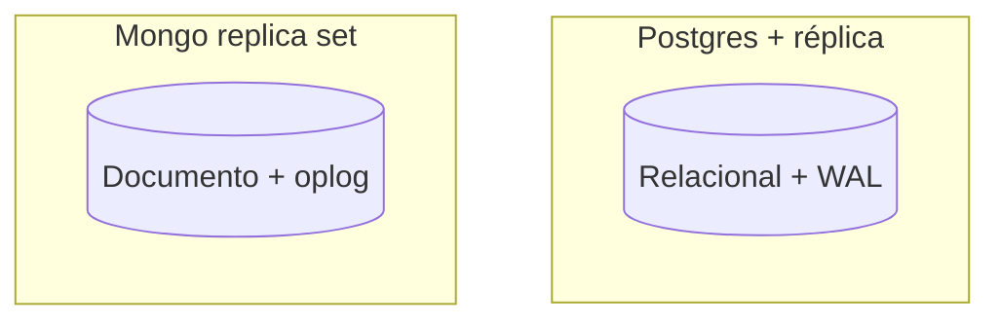
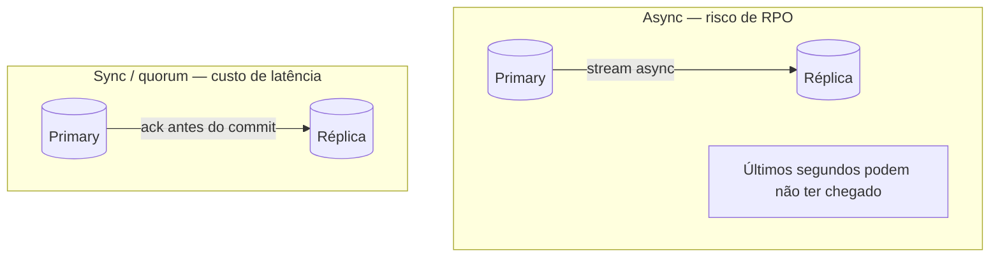

# Workshop de decisões — qual replicação usar?

**Módulo:** [02 — Replicação](README.md)  
**Faça depois** da [teoria](teoria.md) e, de preferência, do [lab Postgres](tutorial-postgres.md) (caminho mínimo) ou dos dois labs.  
**Objetivo:** treinar **escolher e justificar trade-offs** — não decorar resposta “certa”.  
Termos: [glossario.md](glossario.md).

---

## Como usar

Para cada cenário:

1. Escreva a **abordagem** (ex.: “Postgres primary + 2 read replicas async”, “Mongo replica set, read secondary”, “um banco só + cache”).
2. Liste **2 vantagens** e **2 custos/riscos**.
3. Diga o que você **monitoraria** (lag, `pg_stat_replication`, `replSetGetStatus`, p95 de leitura).
4. (Opcional) Compare com a escolha de um colega — o desacordo é o exercício.

Critérios de apoio (releia se travar):

| Critério | Pergunta rápida |
|----------|-----------------|
| Proporção leitura/escrita | Boletim aberto por 2000 alunos vs 20 professores lançando nota? |
| Frescor | Stale de 30s no painel é aceitável? |
| Falha | Se o primary cair, quanto dado pode faltar (RPO)? |
| Modelo | Relacional rígido ou documento? |
| Operação | Quem faz failover às 2h da manhã? |

Não existe resposta única. Em dúvida, use a **rubrica** no final deste arquivo.

---

## Cenário 1 — Dia do boletim (domínio do lab)

Na manhã da divulgação, **3.000 alunos** abrem o portal em 20 minutos. Professores **não** lançam notas nesse horário. Hoje um único Postgres primary atende tudo; CPU e conexões estouram.

**Canvas (complete — não é gabarito):**

**Perguntas**

1. Réplica de **leitura** resolve? O que **não** resolve?  
2. Async ou sync na replicação — o que muda para o aluno que acabou de receber nota nova?  
3. O que mostrar na UI se a leitura for stale? (“Atualizado há…”?)  
4. Depois do lab Postgres: o que você mediu em `/replicacao/lag`?  
5. (Caminho completo) Depois do [lab sync-async](tutorial-sync-async.md): async basta para o aluno que acabou de receber nota?

**Esqueleto de resposta (não copie — complete)**

| Trecho | Escolha | Trade-off aceito |
|--------|---------|------------------|
| Escrita | | |
| Leitura do boletim | | |
| Tipo de replicação | | |

---

## Cenário 2 — Lançamento de nota em tempo real

Durante a prova prática, o professor **atualiza** a nota na mesma tela em que o aluno **recarrega** a cada 10 segundos. A nota precisa aparecer **consistente** para os dois na mesma sessão.

> **Padrão de apoio:** [sticky read after write](tecnologias-e-escolhas.md) (§6) — **não está implementado** nos labs; resposta conceitual.

**Perguntas**

1. Dá para servir essa leitura na réplica async?  
2. O padrão “sticky read after write” ajudaria — como?  
3. O custo de ler sempre no primary é aceitável neste fluxo?

---

## Cenário 3 — Dois campi lançando a mesma matrícula

Campus A e Campus B têm sistemas locais. Ambos podem **alterar** a ficha do mesmo aluno (telefone, endereço) offline por horas. Depois sincronizam.

**Perguntas**

1. Isso é primary–replica ou **multi-leader**?  
2. Que tipo de conflito aparece? Como resolver (LWW, merge manual)?  
3. Por que o lab deste módulo **não** implementa isso?

---

## Cenário 4 — Startup com 50 usuários/dia

Portal de estágio; Postgres pequeno; um dev part-time. Tráfego previsível; backup diário basta.

**Perguntas**

1. Vale montar read replica agora?  
2. O que fazer **antes** de replicar (índice, connection pool, cache)?  
3. Em que métrica você **reavaliaria** (conexões, CPU, p95)?

---

## Cenário 5 — Mongo vs Postgres para “perfil do aluno”

Documento JSON grande (histórico, anexos, tags customizadas por curso). Consultas por `aluno_id`; poucas joins. Equipe já usa Mongo em outro projeto.

**Perguntas**

1. Replica set Mongo resolve disponibilidade **e** escala de leitura?  
2. O que você perde vs Postgres + réplica?  
3. `readPreference: secondary` — mesmo risco de stale do lab?

---

## Cenário 6 — Primary cai na véspera das inscrições

RTO desejado: **15 minutos**. RPO: **zero** perda de matrículas já confirmadas. Orçamento limitado (2 nós de banco).

**Perguntas**

1. Async replication basta para RPO zero?  
2. Failover manual vs eleição (Postgres operado vs Mongo replica set)?  
3. O que testar **antes** do dia D (game day)?  
4. Depois do [lab sync-async](tutorial-sync-async.md): o POST com réplica parada mudou entre os modos? O professor aceitaria +200 ms no save por sync?

---

## Rubrica rápida (autoavaliação)

| Nível | Evidência |
|-------|-----------|
| Insuficiente | Só nomeia ferramenta (“3 réplicas Mongo”) sem critério |
| Básico | Distingue leitura vs escrita e menciona lag |
| Bom | Lista trade-offs, RPO/RTO ou stale read com exemplo |
| Ótimo | Propõe híbrido (réplica + sticky read), monitoramento e quando **não** replicar |

---

## Fechamento coletivo (10 min em sala)

Cada grupo apresenta **um** cenário:

- decisão em uma frase;
- o trade-off que estão **aceitando** de olhos abertos;
- uma métrica (`lag_bytes`, `stateStr != PRIMARY`, “% leituras na réplica”).

Se sobrar tempo: revisitem o checklist do [README](README.md).
