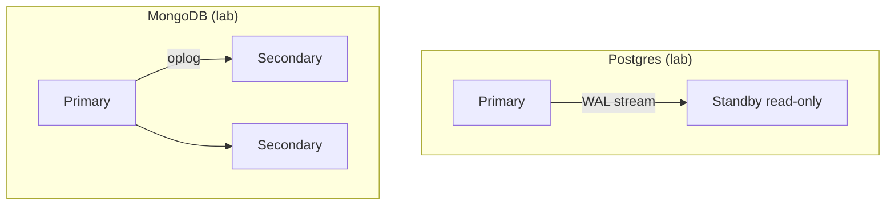
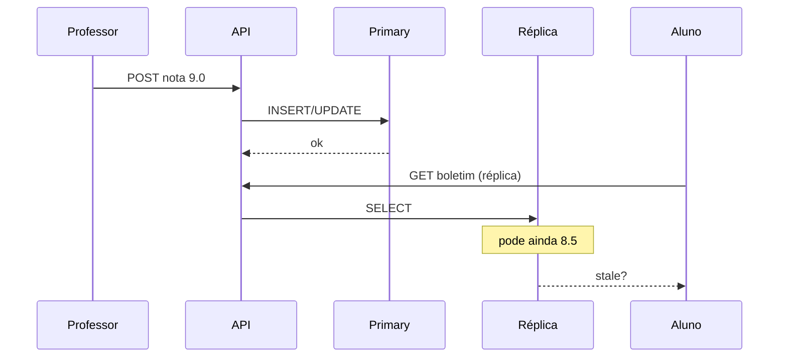

# Tecnologias e escolhas de replicação

**Módulo:** [02 — Replicação](README.md)  
**Pré-leitura:** [teoria.md](teoria.md)  
**Objetivo:** ligar padrões (primary–replica, lag, failover) a **Postgres**, **MongoDB** e alternativas — sem catálogo de marketing.

---

## 1. Duas famílias (visão prática)

| Família | Ideia | Onde ver no módulo |
|---------|-------|--------------------|
| **Relacional + WAL** | Journal (WAL) replicado para standby | [lab-postgres](lab-postgres/) |
| **Documento + oplog** | Log de operações em replica set | [lab-mongodb](lab-mongodb/) |

Ambas implementam **líder + seguidores**. A diferença está no **mecanismo**, nos **defaults** e na **operação** (failover manual vs eleição integrada).

---

## 2. PostgreSQL — read replica / streaming replication

### O que é bem

- Modelo **ACID** familiar; SQL para relatórios e integridade referencial.
- **Hot standby**: réplica pronta para `SELECT` e para promoção.
- Ecossistema maduro (RDS, Cloud SQL, Patroni, pgBackRest…).
- Métricas de lag em `pg_stat_replication`.

### Encaixa quando

- domínio já é relacional (notas, matrículas, financeiro);
- leituras pesadas (boletim, BI) podem tolerar **lag** ou você roteia leituras críticas ao primary;
- equipe opera Postgres e quer controle fino de sync/async por transação ou cluster.

### Cuidado

- Failover **não** é “de graça” — exige runbook ou operador (Patroni, cloud).
- Réplica async → **stale read** inevitável em algum intervalo.
- Multi-primary nativo **não** é o modelo padrão (contrastar com [decisoes §3](decisoes.md)).

> **Regra de bolso:** escrita no primary; leitura de painéis e relatórios na réplica **se** stale for aceitável ou você mostra “atualizado há X segundos”.

---

## 3. MongoDB — replica set

### O que é bem

- **Replica set** com eleição de primary embutida no produto.
- `readPreference` (primary, secondary, nearest…) sem reescrever a app toda.
- Escala horizontal de leitura e resiliência a queda de nó — bom para documentos flexíveis.

### Encaixa quando

- schema de documento evolui rápido (perfil de aluno, feed, logs enriquecidos);
- você quer failover automático sem montar Patroni do zero;
- carga mista read-heavy com tolerância a eventual consistency na leitura.

### Cuidado

- Consistência entre primary e secondary **não** é instantânea por default.
- Escritas concorrentes em multi-documento exigem transações ou desenho cuidadoso.
- Operar replica set (eleições, índices, backups) ainda é trabalho — só muda *quem* faz a eleição.

---

## 4. Outras opções (mapa mental)

| Tecnologia | Papel típico | Nota para este módulo |
|------------|--------------|------------------------|
| **MySQL / MariaDB** | Primary + binlog → replica | Mesma ideia do Postgres; binlog vs WAL |
| **Redis replication** | Cache / fila replicada | Não substitui banco de notas; ver módulo 07 |
| **Cockroach / Spanner** | SQL distribuído multi-região | Replicação + particionamento no produto — complexidade maior |
| **Dynamo-style** | Quórum, anti-entropy | Ponte para módulo [03 — CAP](../03-consistencia-cap/) |
| **Read-through cache** | Alívio de leitura | Complementa réplica; stale diferente (TTL) |

Este módulo **não** implementa Redis nem Cockroach — só mapa para não confundir “réplica de banco” com “réplica de cache”.

---

## 5. Critérios de escolha (checklist)

| Critério | Pergunta |
|----------|----------|
| Modelo de dados | Relacional rígido ou documento flexível? |
| Leitura vs escrita | Proporção? Boletim 1000:1 vs lançamento de nota? |
| Frescor | Stale de 1s, 30s, 5min — aceitável? |
| Failover | RTO/RPO? Eleição automática ou runbook manual? |
| Equipe | Quem opera backup, lag, promoção? |
| Custo | Nós extras, rede cross-AZ, licença |

---

## 6. Padrões de aplicação

| Padrão | Descrição | Lab |
|--------|-----------|-----|
| **Write primary, read replica** | POST/UPDATE no líder; GET de painel na cópia | Postgres `dest=replica` |
| **Read preference** | Driver escolhe secondary quando possível | Mongo `dest=secondary` |
| **Sticky read after write** | Após alterar nota, próxima tela lê primary | Não implementado — ver [decisoes §2](decisoes.md) |
| **Lag-aware routing** | Se lag > limite, força primary | Produção; aqui você **mede** lag |

---

## 7. Sync vs async na prática (produto)

| Config | Efeito | Quando considerar | Ver no módulo |
|--------|--------|-----------------|---------------|
| **Async (default muitos clouds)** | Escrita rápida; lag na réplica | Painéis, analytics | [lab-postgres](lab-postgres/) · lag |
| **Sync / quorum** | Escrita espera réplica | “Não perder última nota se primary cair” | [lab-sync-async](lab-sync-async/) · [tutorial](tutorial-sync-async.md) |
| **Sem réplica de leitura** | Simples; primary aguenta tudo | Tráfego baixo, MVP | [decisoes §4](decisoes.md) |

Detalhe formal de partição e quórum: módulo [03](../03-consistencia-cap/).  
Experimento guiado (RPO, `sync_state`, réplica parada): [tutorial-sync-async.md](tutorial-sync-async.md).

---

## 8. O que levar para [decisoes.md](decisoes.md)

Depois dos labs, você deve conseguir:

1. Dizer se o cenário precisa de **réplica de leitura** ou só **backup/failover**.
2. Escolher **Postgres vs Mongo** por modelo + operação, não por moda.
3. Nomear o **custo** que aceita (lag, complexidade, RPO).

Próximo passo prático: [tutorial-postgres.md](tutorial-postgres.md).
