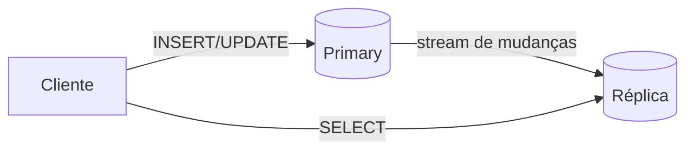
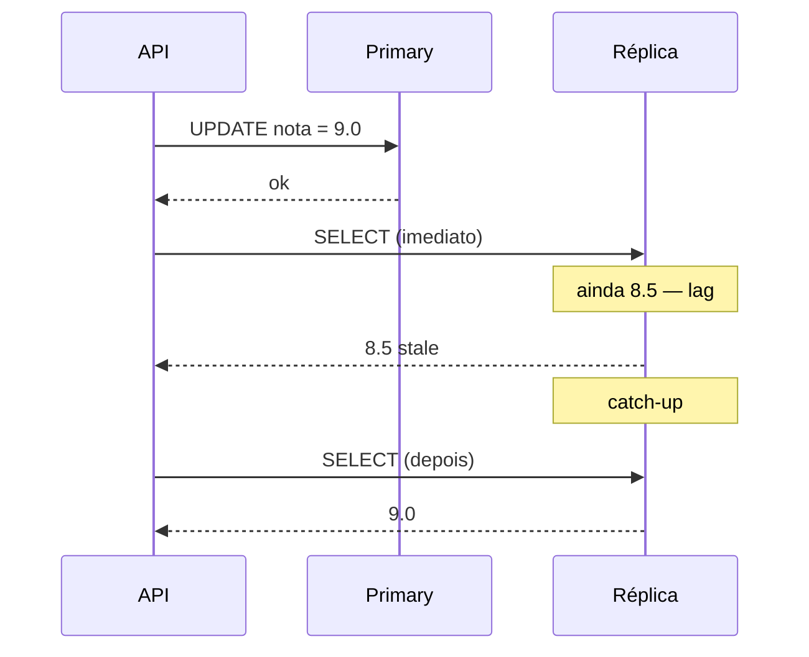

# Teoria — Replicação em sistemas distribuídos

**Módulo:** [02 — Replicação](README.md)  
**Leitura sugerida:** antes dos labs.  
**Objetivo:** montar o modelo mental; os labs *confirmam* o modelo nos bancos reais.

---

## 1. Por que replicar?

Um único nó de dados é um **único ponto de falha** e um **gargalo** quando:

- muitos clientes **leem** ao mesmo tempo (painel, boletim, relatório);
- o nó precisa de manutenção ou cai;
- você quer dados mais **perto** geograficamente do usuário (réplica em outra região).

**Replicação** = manter **cópias** do mesmo estado em mais de um nó.

> **Para lembrar:** replicar melhora **disponibilidade de leitura** e **resiliência** — não elimina o trabalho de **decidir** qual cópia é a “verdade” nem o atraso entre nós. Réplica down com primary no ar = **falha parcial** (compare [01 — Comunicação](../01-comunicacao/)).

### Três eixos deste módulo (e três labs)

| Eixo | Pergunta | Lab |
|------|----------|-----|
| **Leitura** | Posso consultar na réplica? O dado pode estar atrasado (stale)? | [Postgres](tutorial-postgres.md) |
| **Escrita / commit** | “Salvo com sucesso” garante cópia na réplica (RPO)? | [sync vs async](tutorial-sync-async.md) |
| **Disponibilidade** | Se o primary cair, quem assume (RTO)? | [Mongo](tutorial-mongodb.md) |

Não misture os eixos: read replica async **não** substitui sync commit; failover **não** elimina lag de leitura.

---

## 2. Líder e seguidores (primary–replica)

Modelo clássico *primary–backup* (van Steen & Tanenbaum, cap. sobre replicação): um líder aceita mudanças; seguidores copiam.

Modelo mais comum em bancos relacionais e em muitos NoSQL:

| Papel | Escrita | Leitura (típico) |
|-------|---------|------------------|
| **Primary / líder** | Sim | Sim |
| **Réplica / seguidor** | Não (só recebe cópia) | Sim (read replica) |

**Regra de ouro do lab:** escrita **sempre** no primary; leitura na réplica é **opcional** e pode estar **atrasada**.

---

## 3. Síncrona vs assíncrona

| | **Síncrona** | **Assíncrona** |
|--|--------------|----------------|
| Commit da escrita | Espera réplica confirmar | Primary confirma antes da réplica aplicar |
| Latência de escrita | Maior | Menor |
| Risco se primary cair logo após ack | Menor (réplica já tem) | Maior (últimas escritas podem não ter chegado) |
| Lag de leitura na réplica | Em geral menor | Pode existir janela stale |

Na prática, muitos sistemas usam **async** para read replicas (throughput) e reservam sync (ou quorum) para dados críticos — ver módulo [03](../03-consistencia-cap/) e lab [sync vs async](tutorial-sync-async.md).

> **Pare e pense:** no portal de notas, qual operação tolera lag na consulta? Qual não toleraria perda após “salvo com sucesso”?

---

## 4. Replication lag e leituras stale

**Lag** = atraso entre a mudança no primary e a mesma mudança visível na réplica.

Causas comuns: rede, carga na réplica, batch de WAL/oplog, I/O lento.

**O que trafega na rede (WAL / oplog):** não é cópia do arquivo inteiro a cada request. O primary grava mudanças num **journal** (Postgres: WAL; MongoDB: oplog). A réplica **reaplica** essas entradas no disco dela — por isso há um intervalo entre “commit no primary” e “visível na cópia”.

**Stale read** = cliente lê valor **antigo** na réplica porque o lag ainda não zerou.

No [lab Postgres](tutorial-postgres.md) você mede lag via `pg_stat_replication` e compara leituras `dest=primary|replica`.

---

## 5. Failover e eleição (visão)

Se o **primary** cai:

- **Postgres (lab):** standby pode ser promovido manualmente — operação explícita; fora do lab, ferramentas (Patroni, operador cloud) automatizam.
- **MongoDB replica set:** eleição automática de novo primary entre membros — você vê isso no [lab Mongo](tutorial-mongodb.md).

Intuição **RPO** (quanto dado pode perder) e **RTO** (quanto tempo até voltar) dependem de sync/async e do processo de failover — detalhe operacional, não decorar fórmula aqui.

---

## 6. Multi-leader (só mapa mental)

Dois ou mais nós aceitam **escrita** → risco de **conflito** (mesma chave alterada em dois lugares). Resolução: last-write-wins, merge, CRDT, ou evitar multi-leader.

Este módulo **não** implementa multi-leader; aparece nos [cenários de decisão](decisoes.md) para contraste.

---

## 7. SQL vs documento na prática

| | Postgres (lab) | MongoDB (lab) |
|--|----------------|---------------|
| Mecanismo | WAL → streaming replication | Oplog → replica set |
| Termo do seguidor | Standby / hot standby | Secondary |
| Leitura na cópia | Hot standby (read-only) | `readPreference` secondary |
| Failover | Mais manual / operacional | Eleição integrada ao produto |

Mesma **ideia** (cópia do líder); **ferramentas** e **defaults** diferentes.

> **Dois labs, mesma história:** portal de notas nos dois — comparamos **mecanismos** (WAL vs oplog, standby vs replica set), não “qual banco o IFPE deve adotar”.

---

## 8. O que “boa replicação” equilibra

| Critério | Pergunta |
|----------|----------|
| Carga de leitura | Consultas podem ir para réplica? |
| Frescor dos dados | Stale read é aceitável por quanto tempo? |
| Perda aceitável | RPO após falha do primary? |
| Complexidade | A equipe opera failover, backups, monitoramento de lag? |
| Custo | Mais nós = mais disco, rede, licença |

Não existe “sempre 3 réplicas”. Existe **encaixe** com o requisito.

---

## 9. Mapa mental → labs e próximo módulo

| Necessidade | Onde ver |
|-------------|----------|
| Read replica SQL + lag | [tutorial-postgres](tutorial-postgres.md) |
| Sync vs async (commit / RPO) | [tutorial-sync-async](tutorial-sync-async.md) |
| Replica set + eleição | [tutorial-mongodb](tutorial-mongodb.md) |
| Escolher abordagem | [decisoes.md](decisoes.md) |
| Partição de rede · CAP · quórum | [03 — Consistência/CAP](../03-consistencia-cap/) |

Próximo passo: [tutorial-postgres.md](tutorial-postgres.md). Glossário: [glossario.md](glossario.md).
