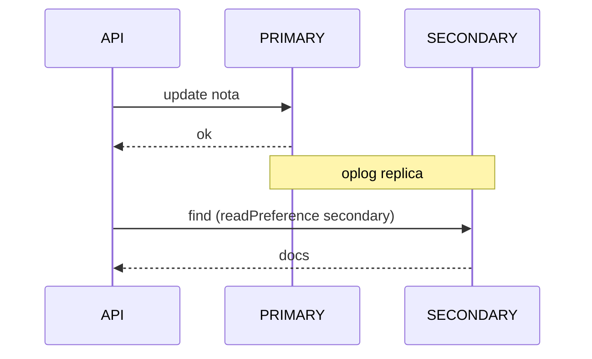
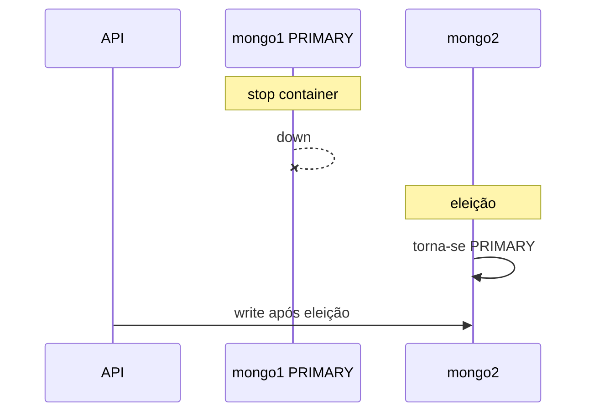
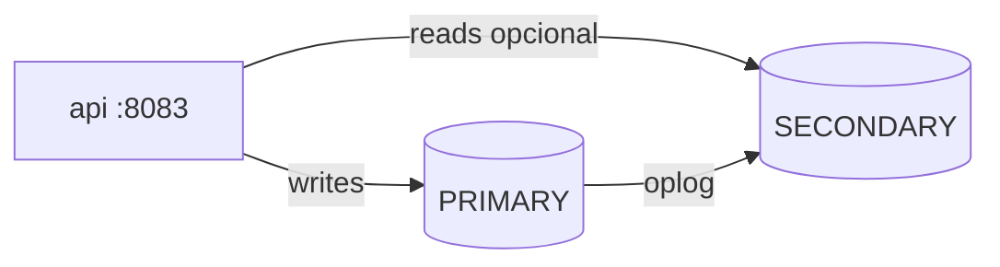

# Tutorial — Lab MongoDB: replica set e failover

**Módulo:** [02 — Replicação](README.md) · **Lab:** [lab-mongodb/](lab-mongodb/)  
**Tempo sugerido:** tecnologia 10–15 min + lab 90–120 min  
**Pré-requisito:** [tutorial-postgres.md](tutorial-postgres.md) · ideal [tutorial-sync-async.md](tutorial-sync-async.md) · [teoria.md](teoria.md) §1–4  
**Apoio:** [glossario.md](glossario.md) · [troubleshooting.md](troubleshooting.md)

**Arco narrativo:** passo **5** (failover · RTO) · [README](README.md)

> Leia A e B *antes* do Compose. **Encerre o lab Postgres** antes (`docker compose down -v`).

**Protagonista deste lab:** o portal continua com **notas**, mas agora em **documentos** MongoDB; o cluster **elege** novo primary se um nó cair.

> **Por que este lab (e não só Postgres)?** Nos labs anteriores você viu **read replica + lag** e **sync vs async**. Failover do primary no Postgres exigiria promoção manual (Patroni/cloud). Aqui você **experimenta eleição automática** — comparando **mecanismos** (WAL/stream vs oplog/replica set), não “Mongo é o banco certo do portal”.

---

## Parte A — A tecnologia: MongoDB replica set

> A ideia líder/seguidor é a mesma da [teoria](teoria.md). Aqui: o que o **replica set** acrescenta em relação ao Postgres do lab anterior.

### Em uma frase

Três (ou mais) processos `mongod` formam um **replica set**: um **PRIMARY** aceita escritas; **SECONDARY** replicam o **oplog**; se o primary cai, os membros **elegem** outro.

### Funcionalidades que importam agora

| No MongoDB real | Para quê |
|-----------------|----------|
| `rs.initiate()` / replica set | Cluster mínimo com eleição |
| Oplog | Log de operações replicado |
| `readPreference` | Ler em secondary (com lag) |
| `replSetGetStatus` | Quem é primary, saúde dos membros |
| Failover automático | Disponibilidade sem promoção manual |

### Vantagens / custos (lembrete)

**Ganha:** eleição integrada, escala de leitura com secondaries, modelo documento flexível.  
**Paga:** eventual consistency na leitura secondary, operação de cluster (ímpar de votos, backups), schema menos rígido que SQL.

### Cloud / produção vs este lab

| Promessa típica | Neste lab (Compose) |
|-----------------|---------------------|
| Replica set em 3+ AZ/regiões | Três containers na mesma máquina |
| Arbiter / hidden nodes | Três membros com voto, sem arbiter |
| Read concern / write concern finos | `readPreference` via `?dest=` na API |
| Backups point-in-time | Não incluído |

### Postgres lab vs Mongo lab

| | Postgres lab | Mongo lab |
|--|--------------|-----------|
| Failover | Não exercitado | Parar o nó **PRIMARY** (qualquer membro) |
| Termo seguidor | Standby / réplica | Secondary |
| Leitura na cópia | `?dest=replica` | `?dest=secondary` |
| Status | `pg_stat_replication` | `replSetGetStatus` |

---

## Parte B — Contexto de uso

### A dor

Além de escala de leitura, a coordenação precisa que o serviço de notas **volte** se o nó principal cair na véspera de inscrições. Em MongoDB, o replica set é o mecanismo **padrão** de alta disponibilidade — não um add-on raro.

**Pergunta-guia:** quando o primary some, quanto tempo até outro membro assumir — e o que acontece com writes **durante** a eleição?

### Fluxo normal vs failover





| Peça | Lab |
|------|-----|
| Membros | `mongo1`, `mongo2`, `mongo3` |
| Init | serviço `mongo-init` |
| API | `:8083` |

---

## Parte C — Lab prático

### C.1 Subir o ambiente

Confirme que o lab Postgres está **down**:

```bash
cd sistemas-distribuidos/02-replicacao/lab-mongodb
docker compose up -d --build
docker compose ps
```

Aguarde `mongo-init` **completed** e `api` **running**:

```bash
curl -s http://localhost:8083/health
./scripts/status-rs.sh
```

Esperado: um membro `stateStr: "PRIMARY"`, demais `"SECONDARY"`.



> **Conceito: três nós de dados** — mesmo padrão do Postgres, com eleição integrada ao produto.

---

### Experimento 1 — Escrita no primary

```bash
./scripts/gravar-nota.sh aluno-m1 "SD" 8.5
./scripts/ler-notas.sh aluno-m1 primary
```

Corpo equivalente:

```bash
curl -s -X POST http://localhost:8083/notas \
  -H "Content-Type: application/json" \
  -d '{"aluno_id":"aluno-m1","disciplina":"SD","valor":8.5}' \
  | python3 -m json.tool
```

**O que anotar:** `destino_escrita: "primary"` — driver sempre escreve no membro PRIMARY.

---

### Experimento 2 — Leitura no secondary

```bash
./scripts/ler-notas.sh aluno-m1 secondary
```

Atualize e compare:

```bash
./scripts/gravar-nota.sh aluno-m1 "SD" 10.0
./scripts/ler-notas.sh aluno-m1 primary
./scripts/ler-notas.sh aluno-m1 secondary
```

**O que anotar:** mesmo fenômeno **stale** do Postgres? `readPreference: secondaryPreferred` no código da API. Se primary e secondary coincidirem no laptop, é **esperado** — stale silencioso é raro localmente (como no Postgres Exp. 2).

> **Stale na leitura ≠ RPO na escrita:** lag no secondary (este lab) é parente do stale do [Postgres](tutorial-postgres.md); **garantia após “salvo”** você explorou no [lab sync-async](tutorial-sync-async.md) — não confunda os dois.

> **Fora do escopo:** Mongo tem `readConcern` / `writeConcern` para afinar frescor e durabilidade — aqui usamos só `readPreference` via `?dest=` na API.

> **Leitura de código:** [`api/app.py`](lab-mongodb/api/app.py) — `coll_com_dest("secondary")` usa `ReadPreference.SECONDARY_PREFERRED`; escrita sempre no primary.

Script equivalente ao `comparar-lag.sh` do Postgres:

```bash
./scripts/comparar-leitura.sh aluno-m1 "SD" 10.0
```

**Exemplo — `replSetGetStatus` (trecho):**

```json
{
  "membros": [
    { "name": "mongo1:27017", "stateStr": "PRIMARY", "health": 1 },
    { "name": "mongo2:27017", "stateStr": "SECONDARY", "health": 1 },
    { "name": "mongo3:27017", "stateStr": "SECONDARY", "health": 1 }
  ]
}
```

---

### Experimento 3 — Status do cluster

```bash
./scripts/status-rs.sh
```

Anote para cada membro: `name`, `stateStr`, `health`, `optimeDate`.

Repita após cada experimento pesado (failover).

> **Conceito: quorum e votos**  
> Três membros → maioria = 2. Um nó pode cair e o set ainda elege. Por isso produção evita número **par** de votantes sem arbiter.

---

### Experimento 4 — Failover (parar o primary)

**Sempre** confira quem é PRIMARY antes de parar um container:

```bash
./scripts/status-rs.sh
```

Anote o host com `"stateStr": "PRIMARY"` (pode ser `mongo1`, `mongo2` ou `mongo3`). Exemplo — parar `mongo1` **se** ele for PRIMARY:

```bash
docker compose stop mongo1
```

Cronometre o RTO (anote `date` ou use o relógio):

```bash
date +%H:%M:%S
# espere 10–30 s
./scripts/status-rs.sh
date +%H:%M:%S
```

**Exemplo — após eleição** (PRIMARY migrou para outro membro):

```json
{
  "membros": [
    { "name": "mongo1:27017", "stateStr": "(not reachable)", "health": 0 },
    { "name": "mongo2:27017", "stateStr": "PRIMARY", "health": 1 }
  ]
}
```

Tente gravar (repita se `503` durante eleição):

```bash
./scripts/gravar-nota.sh aluno-fail "SD" 6.0
./scripts/ler-notas.sh aluno-fail primary
```

Suba o nó parado:

```bash
docker compose start mongo1
sleep 15
./scripts/status-rs.sh
```

**O que anotar**

- Quem virou PRIMARY?  
- Quantos segundos entre `stop` e POST ok (**RTO**)?  
- O nó que voltou ficou SECONDARY?

> **Conceito: RTO na prática**  
> O tempo entre parar o PRIMARY e POST ok de novo é uma intuição de **RTO**. O dado gravado **antes** da queda depende de oplog/replicação para **RPO** — async ainda pode perder últimos segundos em cenários extremos.

---

### Experimento 5 — Cluster com um nó a menos (leitura vs write)

Pare **um** membro que esteja `SECONDARY` (confira com `status-rs` — **não** pare o PRIMARY):

```bash
./scripts/status-rs.sh
docker compose stop mongo3
./scripts/ler-notas.sh aluno-fail secondary
./scripts/ler-notas.sh aluno-fail primary
./scripts/gravar-nota.sh aluno-fail "Redes" 7.0
docker compose start mongo3
sleep 10
./scripts/status-rs.sh
```

**O que anotar:** secondary ainda serve leitura com 2/3 nós? write no PRIMARY continua?

> **Conceito: quorum**  
> Com 3 votantes, 2 bastam para eleger — por isso um nó pode cair e o set sobrevive.

---

### Experimento 6 — O que o replica set *não* esconde

**Hipótese:** três nós **não** triplicam gratuitamente a capacidade de **escrita** — ainda há **um** PRIMARY por vez.

**Pergunta:** o que você **paga** em disco, RAM e operação (eleições, `status-rs`) em troca de HA + leitura em secondaries?

Compare com [Experimento 5 do Postgres](tutorial-postgres.md) (réplica não reduz writes).

---

### C.6 Tabela de fechamento

| Característica | Onde viu | Vantagem? | Custo / risco? |
|----------------|----------|-----------|----------------|
| Replica set (3 nós) | C.1 | | |
| readPreference secondary | Exp. 2 | | |
| Stale read | Exp. 2 | | |
| Eleição / failover | Exp. 4 | | |
| Janela de indisponibilidade write | Exp. 4 | | |
| Custo de N nós (HA) | Exp. 6 | | |

**Perguntas finais**

1. Em uma frase: diferença entre standby Postgres e secondary Mongo.  
2. Quando preferir eleição automática vs runbook Patroni?  
3. [Cenário 6 em decisoes.md](decisoes.md) — o que este lab ilustra?  
4. O que delegar ao módulo [03 — CAP](../03-consistencia-cap/)?

Comandos: [lab-mongodb/README.md](lab-mongodb/README.md#referencia-rapida).

---

### C.7 Para onde ir a partir daqui

**Ainda neste módulo**

1. [decisoes.md](decisoes.md) — todos os cenários.  
2. Releia [teoria.md](teoria.md) §5–7.  
3. [tecnologias-e-escolhas.md](tecnologias-e-escolhas.md) §3–7.

**Na disciplina**

- **03 CAP:** sync vs async sob partição.  
- **06 Falhas:** retries durante eleição.  
- **07 Cache:** secondary ≠ cache Redis.

---

## Encerrar o lab

```bash
docker compose down -v
```

Se você conseguiu: (1) interpretar `replSetGetStatus`, (2) ler em secondary, (3) cronometrar failover no Exp. 4, (4) comparar com o lab Postgres e (5) explicar por que o segundo lab existe — você fechou o arco **SQL + documento** deste módulo.
