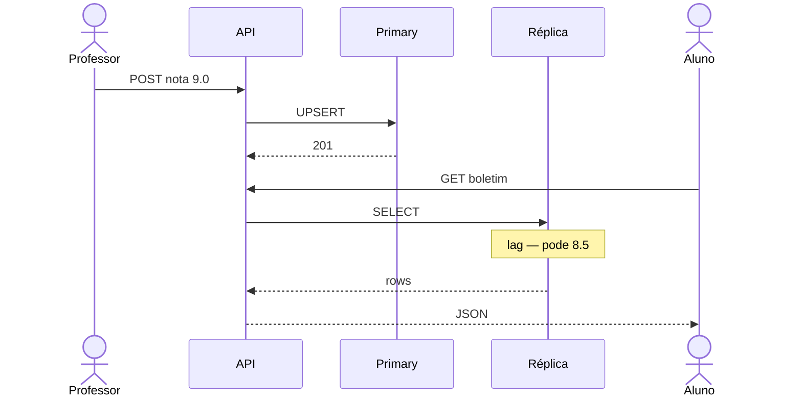
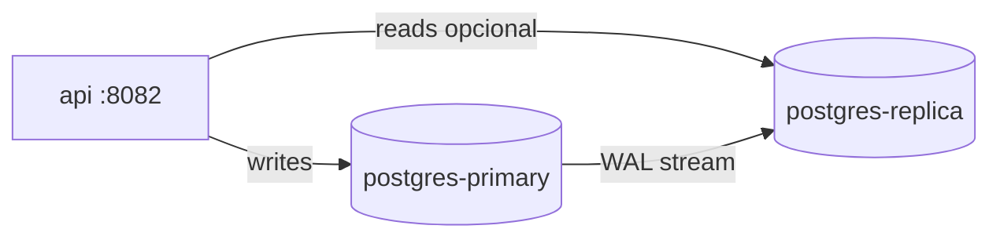

# Tutorial — Lab Postgres: notas com primary e réplica

**Módulo:** [02 — Replicação](README.md) · **Lab:** [lab-postgres/](lab-postgres/)  
**Tempo sugerido:** tecnologia 10–15 min + lab 90–120 min  
**Pré-requisito:** [00 — Ambiente Docker](../00-ambiente-docker/) · [teoria.md](teoria.md) §1–4  
**Apoio:** [glossario.md](glossario.md) · [troubleshooting.md](troubleshooting.md)  
**SO:** Linux, macOS e Windows — [como rodar os comandos](../ferramentas/linux-e-windows.md).  
**Próximo:** [sync vs async](tutorial-sync-async.md)

> Leia A e B *antes* do Compose. No lab: rode → observe → anote.

**Arco narrativo:** passo **2** (alívio — read replica) · [README](README.md)

**Protagonista deste lab:** o **professor** lança nota (escrita); milhares de **alunos** consultam boletim (leitura) — a réplica alivia o primary, mas pode mostrar valor **atrasado**.

---

## Parte A — A tecnologia: PostgreSQL streaming replication

> Primary–replica, lag e stale read estão em [teoria.md](teoria.md). Aqui: o que **esta ferramenta** faz e o que o lab **não** simula.

### Em uma frase

O **primary** grava no WAL; o **standby** recebe o stream e fica em *hot standby* (read-only). Escrita só no líder; leitura pode ir na cópia — com **lag** possível.

### Funcionalidades que importam agora

| No Postgres real | Para quê |
|------------------|----------|
| Streaming replication | Copiar mudanças quase em tempo real |
| Hot standby | `SELECT` na réplica enquanto replica |
| `pg_stat_replication` | Medir lag (bytes, tempo) |
| `pg_is_in_recovery()` | Saber se o nó é réplica |
| Promoção (`pg_promote`) | Failover — **fora** deste lab automático |

### Vantagens / custos (lembrete)

**Ganha:** escala de leitura, resiliência (cópia quente), separação carga write/read.  
**Paga:** lag/stale, operação de failover, mais um nó (disco, rede, backup).

### Cloud / produção vs este lab

| Promessa típica | Neste lab (Bitnami Compose) |
|-----------------|----------------------------|
| Failover automático (Patroni, RDS Multi-AZ) | Só primary + 1 standby; sem promoção guiada |
| Sync replication configurável | Default async do image |
| Múltiplas réplicas + load balancer | Uma réplica só |
| Monitoramento de lag integrado | Endpoint `/replicacao/lag` didático |

Use a tabela na Parte C: o lab é **pequeno** de propósito para você **ver** lag e stale sem Patroni no meio.

### Quando usar read replica Postgres

Boletins, relatórios, BI, APIs read-heavy com tolerância a atraso.  
**Não** use réplica async se a mesma sessão exige “acabei de gravar e preciso ler o valor novo” sem roteamento ao primary — ver [decisoes §2](decisoes.md).

---

## Parte B — Contexto de uso

### A dor (escala de sala / estágio)

Na divulgação do boletim, o portal recebe milhares de `GET /notas`. O **mesmo** Postgres que recebe `INSERT` dos professores vira gargalo: CPU alta, fila de conexões, timeouts.

Réplica de leitura: professores continuam escrevendo no **primary**; painel do aluno lê na **cópia**.

**Pergunta-guia:** se a nota mudou há 2 segundos, o aluno **precisa** ver o valor novo na primeira carga do boletim?

### Escrita no primary vs leitura na réplica



| Peça | Mundo real | Lab |
|------|------------|-----|
| Primary | RDS / Cloud SQL writer | `postgres-primary` :5432 |
| Réplica | Read replica | `postgres-replica` :5433 |
| API | Portal | `:8082` |

Código: [`lab-postgres/`](lab-postgres/). Domínio: tabela `notas(aluno_id, disciplina, valor)`.

---

## Parte C — Lab prático

> Relacione cada experimento à teoria. Se travar: [troubleshooting.md](troubleshooting.md).

### C.1 Subir o ambiente

```bash
cd sistemas-distribuidos/02-replicacao/lab-postgres
docker compose up -d --build
docker compose ps
```

Espere `postgres-primary` **healthy**. A réplica pode levar **1–3 min** no primeiro boot (base backup). Teste:

```bash
curl -s http://localhost:8082/health
curl -s http://localhost:8082/replicacao/status | python3 -m json.tool
```

Resposta esperada em `/replicacao/status`: primary `em_recovery: false`; réplica `em_recovery: true`, `ok: true`.

Se a réplica ainda não estiver pronta: `docker compose logs -f postgres-replica` e use o [poll de réplica](troubleshooting.md#enquanto-espera-a-réplica-postgres) (revise [teoria §1–2](teoria.md) enquanto espera).



> **Conceito: dois nós de dados**  
> Primary e réplica são **processos separados** com **discos separados**. A API escolhe o DSN conforme `dest=` — em produção isso seria roteamento no pool de conexões ou middleware.

---

### Experimento 1 — Escrita sempre no primary

Grave uma nota:

```bash
./scripts/gravar-nota.sh aluno-01 "SD" 8.0
```

Ou:

```bash
curl -s -X POST http://localhost:8082/notas \
  -H "Content-Type: application/json" \
  -d '{"aluno_id":"aluno-01","disciplina":"SD","valor":8.0}' \
  | python3 -m json.tool
```

Confira `destino_escrita: "primary"` na resposta.

Leia no primary:

```bash
./scripts/ler-notas.sh aluno-01 primary
```

**Réplica down — escrita continua?** (passo explícito):

```bash
docker compose stop postgres-replica
./scripts/gravar-nota.sh aluno-01 "Redes" 7.5
docker compose start postgres-replica
```

**O que anotar**

- O POST acima funcionou com a réplica parada?  
- Escrita depende da réplica estar up?

> **Não pare o `postgres-primary`** neste lab — a escrita para e failover manual não é o foco aqui (isso aparece no [lab Mongo](tutorial-mongodb.md) e em Patroni/cloud).

---

### Experimento 2 — Leitura na réplica

Mesmo aluno, destino réplica:

```bash
./scripts/ler-notas.sh aluno-01 replica
```

Observe `destino_leitura: "replica"` e `em_recovery: true` (confirma que é standby).

Atualize a nota e compare:

```bash
./scripts/gravar-nota.sh aluno-01 "SD" 9.5
./scripts/ler-notas.sh aluno-01 primary
./scripts/ler-notas.sh aluno-01 replica
```

**O que anotar**

- Os valores bateram na hora?  
- Se diferirem, qual é mais novo?

**Exemplo — sincronizados** (comum em laptop):

```json
{
  "aluno_id": "aluno-01",
  "destino_leitura": "replica",
  "em_recovery": true,
  "notas": [{ "disciplina": "SD", "valor": 9.5 }]
}
```

**Exemplo — stale** (réplica atrás; veja Experimento 2b):

```json
{
  "destino_leitura": "primary",
  "notas": [{ "valor": 9.5 }]
}
```

versus réplica ainda com `"valor": 8.0`.

> **Leitura de código:** [`api/app.py`](lab-postgres/api/app.py) — `upsert_nota` usa sempre `PRIMARY_DSN`; `listar_notas` escolhe DSN conforme `dest=`. O parâmetro `?dest=` é o roteamento didático write/read.

> **Conceito: stale read**  
> Réplica async pode estar **atrás** do primary. Para boletim em massa isso pode ser OK; para “professor e aluno na mesma tela” talvez não.

---

### Experimento 2b — Stale read garantido (`provocar-stale.sh`)

Se o Experimento 2 não mostrou diferença (normal em lab local), rode:

```bash
./scripts/provocar-stale.sh aluno-stale "SD" 9.9
```

O script: grava valor inicial → **para a réplica** → grava valor novo no primary → compara leituras → sobe a réplica e espera **catch-up**.

> **Stale clássico vs indisponibilidade:** stale silencioso = réplica **rodando** com valor antigo (HTTP 200). Com a réplica **parada**, você vê `503` ou erro — outra face do lag. Nos passos 4–6, o primary tem dado novo que a réplica ainda não aplicou.

**O que anotar**

- Entre parar a réplica e o catch-up, o primary tinha valor novo e a réplica não.  
- Isso é a “nova dor” do [arco narrativo](README.md) — lag não é só número em `lag_bytes`.

---

### Experimento 3 — Medir lag

```bash
curl -s http://localhost:8082/replicacao/lag | python3 -m json.tool
```

Campos úteis: `lag_bytes`, `state`, `sync_state`.

Script que junta gravação + leituras + lag:

```bash
./scripts/comparar-lag.sh aluno-lag "Redes" 9.9
```

Repita `./scripts/comparar-lag.sh` duas ou três vezes seguidas.

**Exemplo de `/replicacao/lag`:**

```json
{
  "replicas": [{
    "application_name": "walreceiver",
    "state": "streaming",
    "sync_state": "async",
    "lag_bytes": 0
  }]
}
```

`lag_bytes: 0` no laptop é **esperado** — o instrumento importa; o stale dramático está no [Experimento 2b](#experimento-2b--stale-read-garantido-provocar-stalesh).

**O que anotar**

- Lag chegou a zero entre tentativas?  
- Em laptop local, lag costuma ser **mínimo** — o experimento treina o **instrumento**, não só o drama.

---

### Experimento 4 — Réplica indisponível

> **Cruzamento:** no [Experimento 1](#experimento-1--escrita-sempre-no-primary) você viu que **escrita** continua com réplica parada. Aqui o foco é **leitura** e degradação do painel (fallback ou erro ao usuário).

```bash
docker compose stop postgres-replica
./scripts/ler-notas.sh aluno-01 replica
./scripts/ler-notas.sh aluno-01 primary
./scripts/gravar-nota.sh aluno-01 "SD" 7.0
docker compose start postgres-replica
```

Espere a réplica voltar (`/replicacao/status`) e leia de novo na réplica.

**O que anotar**

- Leitura na réplica retornou erro (`503`)?  
- Escrita no primary continuou?  
- Depois do restart, a réplica **catch-up**?

> **Conceito: degradação parcial**  
> Se o painel depende só da réplica, queda dela derruba consulta — mas lançamento de nota pode continuar. Desenho resiliente: fallback para primary ou mensagem clara ao usuário.

---

### Experimento 5 — O que a réplica *não* esconde

**Hipótese:** réplica **não** reduz o custo de **escrita**; só distribui **leitura**.

Com um primary, 1000 writes/min continuam 1000 writes/min no primary. O ganho aparece quando milhares de `SELECT` vão para a cópia.

**Pergunta:** se 90% do tráfico for leitura e você mover leituras para a réplica, o que acontece com a CPU do primary?

---

### C.6 Tabela de fechamento (preencha com o grupo)

| Característica observada | Onde viu no lab | Vantagem? | Custo / risco? |
|--------------------------|-----------------|-----------|----------------|
| Escrita centralizada no primary | Exp. 1 | | |
| Leitura na réplica | Exp. 2 | | |
| Replication lag | Exp. 3 | | |
| Stale read | Exp. 2–2b | | |
| Falha parcial (réplica down) | Exp. 4 | | |
| Hot standby (`em_recovery`) | Exp. 2 | | |

**Perguntas finais**

1. No dia do boletim, qual % de leituras iria para réplica?  
2. Após o professor salvar, a tela do aluno deve ler primary ou réplica?  
3. O que monitorar em produção além de `lag_bytes`?  
4. Compare com [Cenário 1 em decisoes.md](decisoes.md).  
5. O que o módulo [03 — CAP](../03-consistencia-cap/) vai formalizar que aqui você só **intuiu**?

Comandos: [lab-postgres/README.md](lab-postgres/README.md#referencia-rapida).

---

### C.7 Para onde ir a partir daqui

**Ainda neste módulo**

1. [tutorial-sync-async.md](tutorial-sync-async.md) — commit sync vs async.  
2. [tutorial-mongodb.md](tutorial-mongodb.md) — replica set e eleição.  
3. [decisoes.md](decisoes.md) — cenários 1, 2 e 4.  
4. [tecnologias-e-escolhas.md](tecnologias-e-escolhas.md) §2–3.

**Na disciplina**

- **03 CAP:** sync vs async sob partição.  
- **07 Cache:** réplica ≠ cache — stale de naturezas diferentes.

---

## Encerrar o lab

```bash
docker compose down -v
```

Antes do lab Mongo, **sempre** derrube este stack (`down -v`) para liberar portas.

Se você conseguiu: (1) gravar no primary, (2) ler primary vs réplica, (3) interpretar lag, (4) ver stale com `provocar-stale.sh` **ou** explicar por que no laptop os valores coincidiram, e (5) dizer quando **não** usar réplica async — você usou a prática para entender replicação SQL, não só para rodar Compose.
