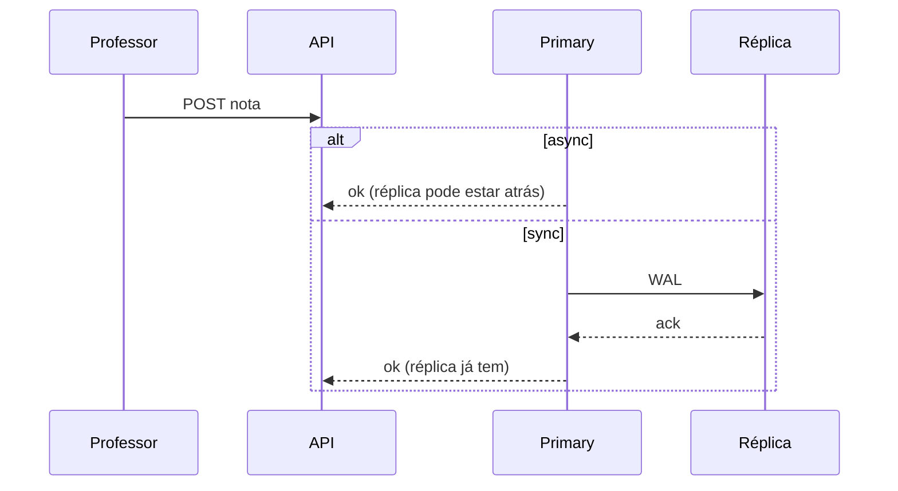

# Tutorial — Lab sync vs async: quando o commit espera a réplica?

**Módulo:** [02 — Replicação](README.md) · **Lab:** [lab-sync-async/](lab-sync-async/)  
**Tempo sugerido:** tecnologia 10 min + lab 60–90 min  
**Pré-requisito:** [tutorial-postgres.md](tutorial-postgres.md) (lag e primary/replica) · [teoria.md](teoria.md) §3  
**Apoio:** [glossario.md](glossario.md) · [troubleshooting.md](troubleshooting.md)  
**SO:** Linux, macOS e Windows — [como rodar os comandos](../ferramentas/linux-e-windows.md).  
**Próximo:** [MongoDB](tutorial-mongodb.md)

> **Encerre** o lab Postgres antes (`docker compose down -v` em `lab-postgres/`).  
> Este lab usa portas **8084**, **5434**, **5435** — não conflita com os outros.

**Arco narrativo:** passo **4** (commit sync vs async · RPO) · [README](README.md)

**Protagonista:** a coordenação pergunta — *“Se o primary cair logo após ‘nota salva’, a réplica **já tinha** a nota?”* — a resposta depende de **sync vs async**.

---

## Parte A — A tecnologia: synchronous commit no Postgres

> A tabela sync/async está em [teoria §3](teoria.md). Aqui: o que muda **no commit** e o que este lab mede.

### Em uma frase

**Async:** o primary confirma a escrita **sem** esperar a réplica aplicar. **Sync:** o commit **espera** ack de réplica(s) síncronas — mais lento, menor risco de perder a última transação se o primary cair.

### O que observar neste lab

| Sinal | Async (`subir-async.sh`) | Sync (`subir-sync.sh`) |
|-------|--------------------------|-------------------------|
| `sync_state` em `/replicacao/status` | `async` | `sync` |
| `replica_apos_commit` no POST | Pode faltar valor na réplica no instante | Deve bater com o primary |
| POST com réplica **parada** | Confirma rápido (RPO em risco) | Bloqueia ou timeout (protege RPO) |
| `duracao_commit_ms` | Em geral menor | Em geral maior ou igual |

### Cloud / produção vs este lab

| Produção | Este lab |
|----------|----------|
| Sync só em dados críticos; async em read replicas | Dois Compose: um arquivo base + `docker-compose.sync.yml` |
| `synchronous_standby_names` fino | Bitnami: `POSTGRESQL_NUM_SYNCHRONOUS_REPLICAS=1` |
| Patroni / operador ajusta em runtime | Recria cluster ao trocar modo (`down -v`) |

---

## Parte B — Contexto de uso

### A dor

No [lab Postgres](tutorial-postgres.md) você viu **lag** e **stale read** — a réplica pode estar atrás **com o primary no ar**.

Nova pergunta: o professor clica “Salvar nota”, vê “ok”, e **segundos depois** o primary cai. A nota estava na réplica?

- **Async:** talvez **não** — últimas transações podem não ter replicado (**RPO** > 0).  
- **Sync:** a réplica confirmou antes do “ok” — **menor** RPO; o professor pagou **latência** no save.

**Pergunta-guia:** vale fazer **toda** escrita sync, ou só matrícula/pagamento/nota final?



---

## Parte C — Lab prático

### C.1 Modo assíncrono

```bash
cd sistemas-distribuidos/02-replicacao/lab-sync-async
./scripts/subir-async.sh
```

Espere a réplica: [poll Postgres sync-async](troubleshooting.md#enquanto-espera-a-réplica-postgres-sync-async) (revise [teoria §3](teoria.md) enquanto espera).

```bash
curl -s http://localhost:8084/health | python3 -m json.tool
```

---

### Experimento 1 — Escrita async

```bash
./scripts/medir-escrita.sh aluno-async "SD" 7.5
```

**Exemplo de resposta (async):**

```json
{
  "valor": 7.5,
  "duracao_commit_ms": 12.4,
  "modo_lab": "async",
  "replica_apos_commit": { "valor": 7.5 }
}
```

Confira em `/replicacao/status`: `"sync_state": "async"`.

> **Se `replica_apos_commit` já bater com o primary:** em laptop local o lag pode ser **menor** que o tempo de uma ida à réplica — isso **não** prova que async “não replica”. A prova do modo é `"sync_state": "async"`. A diferença de **RPO** aparece no [Experimento 3](#experimento-3--réplica-parada-rpo-na-prática) (réplica parada).

**Leitura de código:** em [`api/app.py`](lab-sync-async/api/app.py), `upsert_nota` mede `duracao_commit_ms` em torno do `INSERT`; `replica_apos_commit` lê a réplica **logo após** o commit — compare com o modo sync.

---

### Experimento 2 — Modo síncrono

```bash
docker compose down -v
./scripts/subir-sync.sh
```

Repita o [poll da réplica](troubleshooting.md#enquanto-espera-a-réplica-postgres-sync-async) e:

```bash
./scripts/medir-escrita.sh aluno-sync "SD" 8.0
```

**Exemplo (sync):**

```json
{
  "duracao_commit_ms": 18.2,
  "modo_lab": "sync",
  "replica_apos_commit": { "valor": 8.0 }
}
```

Em `/replicacao/status`: `"sync_state": "sync"` e `synchronous_standby_names` não vazio.

**O que anotar**

- `replica_apos_commit` bate com o primary?  
- `duracao_commit_ms` mudou? (diferença pode ser pequena em laptop local — o **sync_state** é a prova do modo)

---

### Experimento 3 — Réplica parada: RPO na prática

Com o lab **sync** ainda no ar:

```bash
./scripts/provocar-replica-down.sh aluno-rpo "SD"
```

Repita com modo **async** (`./scripts/subir-async.sh` + [poll](troubleshooting.md#enquanto-espera-a-réplica-postgres-sync-async) + mesmo script).

**Tabela esperada (complete com o que você viu):**

| Modo | POST com réplica down | O que isso sugere sobre RPO |
|------|------------------------|----------------------------|
| Sync | Demora ou timeout (~90 s) | “Ok” não sai sem réplica — menor risco de perda |
| Async | Confirma em poucos segundos | “Ok” pode existir **sem** dado na réplica |

**O que anotar**

Compare sua tabela com a acima. Pequenas variações de tempo são normais; o **padrão** (rápido vs bloqueado) é o que importa.

> **Conceito:** sync **não** elimina failover — muda o que “salvo com sucesso” **garante** sobre a cópia.

---

### Experimento 4 — Comparar os dois modos (opcional)

```bash
./scripts/comparar-modos.sh
```

Derruba e recria os volumes nos dois modos — reserve **~5–8 min**.

---

### C.5 Tabela de fechamento

| Observação | Async | Sync |
|------------|-------|------|
| `sync_state` | | |
| `duracao_commit_ms` (ordem de grandeza) | | |
| POST com réplica down | | |
| RPO se primary cair após ok | | |
| Custo para o professor no save | | |

**Perguntas finais**

1. [Cenário 6 em decisoes.md](decisoes.md): async basta para RPO zero?  
2. Por que boletim (leitura) usa async na réplica, mas matrícula pode exigir sync?  
3. O que o módulo [03 — CAP](../03-consistencia-cap/) formaliza sobre essa escolha?

Comandos: [lab-sync-async/README.md](lab-sync-async/README.md#referencia-rapida).

---

### C.7 Para onde ir a partir daqui

**Ainda neste módulo**

1. [tutorial-mongodb.md](tutorial-mongodb.md) — failover e RTO.  
2. [decisoes.md](decisoes.md) — cenários 2 e 6 (sticky read · RPO/RTO).  
3. Releia [teoria.md](teoria.md) §5 com os três labs frescos.

**Lembrete:** stale na **leitura** (Postgres/Mongo) ≠ RPO na **escrita** (este lab).

---

## Encerrar o lab

```bash
docker compose down -v
```

Se você conseguiu: (1) ler `sync_state`, (2) comparar `replica_apos_commit` nos dois modos, (3) explicar o POST com réplica parada e (4) relacionar com RPO — você fechou o objetivo **3** do módulo na prática.
