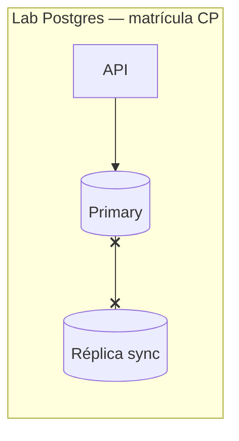
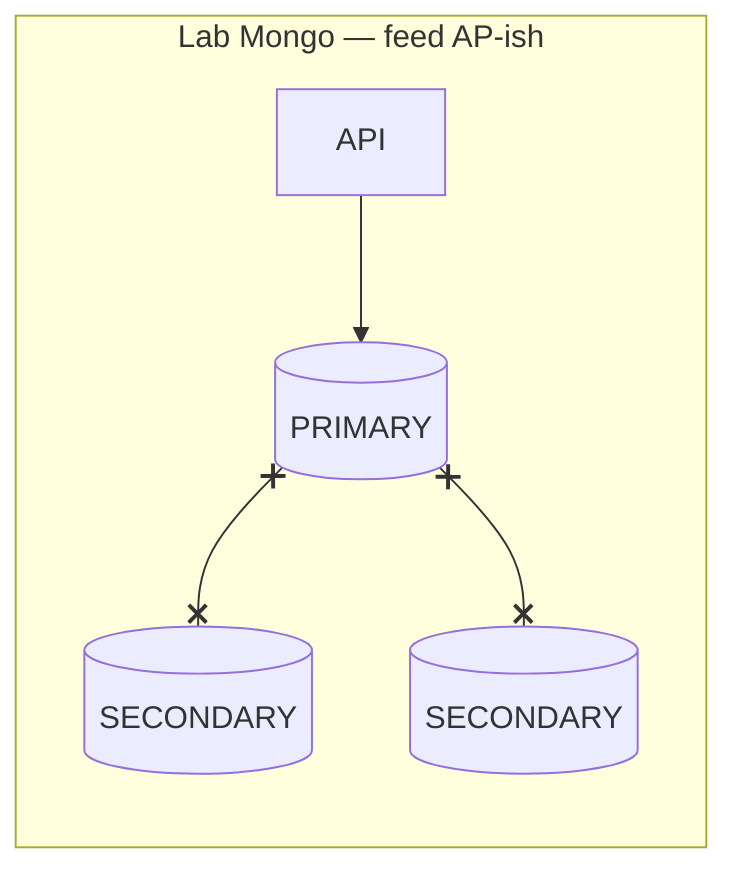

# 03 — Consistência e CAP (intuição)

**Conceito central:** sob **partição de rede**, réplicas não concordam instantaneamente — o sistema precisa **escolher** o que garantir (consistência vs disponibilidade) e **qual nível** de consistência expor ao usuário.  
**Domínio âncora:** portal acadêmico — **matrícula com vagas limitadas** (CP) vs **feed de avisos** (AP / concerns flexíveis).  
**Stack:** Python 3 · Docker Compose · PostgreSQL (sync + partição simulada) · MongoDB (replica set + `readConcern` / `writeConcern`)

Pré-requisitos: [00 — Ambiente Docker](../00-ambiente-docker/) · [02 — Replicação](../02-replicacao/) (caminho mínimo: Postgres + teoria §3). Ideal ter feito [sync-async](../02-replicacao/tutorial-sync-async.md) no 02.  
Apoio: [glossario.md](glossario.md) · [troubleshooting.md](troubleshooting.md)

---

## Objetivos de aprendizado

Ao final deste módulo, você deve ser capaz de:

1. **Explicar** o teorema **CAP** em nível intuitivo (C, A, P) e por que “escolher 2 de 3” é simplificação didática, não receita de produto.
2. **Descrever** **partição de rede** como falha real (não só “nó caiu”) e simulá-la em lab (Docker networks).
3. **Distinguir** níveis práticos de consistência: **forte / majority (quórum)** vs **eventual**; relacionar com stale read do módulo 02.
4. **Observar** comportamento **CP** (escrita recusada ou bloqueada) vs **AP** (escrita/leitura seguem com divergência possível) sob partição simulada.
5. **Relacionar** garantias em **Postgres** (sync replication, primary isolado) e **MongoDB** (`writeConcern`, `readConcern`, replica set partido).
6. **Decidir** CP vs AP (e consistência intermediária) em cenários do portal — matrícula vs avisos vs boletim.
7. **Experimentar** partição, quórum/majority e leitura inconsistente nos dois labs.

> Meta: argumentar *“sob partição, o que este fluxo prioriza?”* — não decorar CAP como slogan.

---

## Caminhos de estudo

### Caminho mínimo (~4–5 h)

Fecha objetivos **1–4** e **6** (parcial); objetivo **5** (Mongo): teoria §7 + cenário conceitual em [decisoes.md](decisoes.md).

1. [teoria.md](teoria.md) §1–5  
2. [tutorial-particao-postgres.md](tutorial-particao-postgres.md) (Partes A–C)  
3. [decisoes.md](decisoes.md) — cenários **1** (matrícula) e **2** (boletim / lag vs partição)  
4. Objetivo **5** (parcial): §6–7 de [tecnologias-e-escolhas.md](tecnologias-e-escolhas.md) · cenário **3** (feed) só conceitual  
5. Checklist **mínimo** abaixo  

> Exp. 5 do tutorial Postgres (contraste async) assume [02 teoria §3](../02-replicacao/teoria.md) ou [lab sync-async](../02-replicacao/tutorial-sync-async.md).

**Pré-requisitos no host:** `curl`, `python3`, Docker Compose ([00](../00-ambiente-docker/)).

### Caminho completo (~8–10 h) — recomendado

Reserve **+1–2 h** se for a primeira partição Docker na turma.

| Ordem | Material | Tempo | Para quê |
|-------|----------|-------|----------|
| 1 | [teoria.md](teoria.md) | ~50 min | Modelo mental + CAP |
| 2 | [tutorial-particao-postgres.md](tutorial-particao-postgres.md) | ~2 h | Partição + matrícula CP |
| 3 | [tutorial-consistencia-mongodb.md](tutorial-consistencia-mongodb.md) | ~1,5–2 h | Concerns + feed AP-ish |
| 4 | [decisoes.md](decisoes.md) | ~45 min | Trade-offs |
| 5 | Releia §6–8 de [teoria.md](teoria.md) + [tecnologias-e-escolhas.md](tecnologias-e-escolhas.md) | ~20 min | Consolidar |

Cada tutorial: **A** tecnologia → **B** contexto → **C** lab.

---

## Arco narrativo

1. **Dor (herdada do 02)** — réplicas existem, mas o **link primary↔réplica cai** (partição na replicação).  
2. **Crise CP** — matrícula com 1 vaga: se o commit confirmar **sem** a réplica sync, o portal mente “ok” → [lab Postgres](tutorial-particao-postgres.md).  
3. **Alívio CP** — escrita **recusa** (503 / timeout) quando não há sync — erro claro, não overbooking silencioso.  
4. **Contraste AP** — feed de avisos: portal **continua** publicando/lendo com aviso “pode estar desatualizado” → [lab MongoDB](tutorial-consistencia-mongodb.md).  
5. **Reconciliação** — partição curada; catch-up; o que o usuário precisa ver.  
6. **Fechamento** — [decisoes.md](decisoes.md) + ponte para [04 — Coordenação/locks](../04-coordenacao-locks/).





| Fluxo | Lab | Sob partição |
|-------|-----|----------------|
| Matrícula | Postgres sync | Escrita **503/timeout** se sync falhar |
| Avisos | Mongo `w:1` + `local` | Publicação segue no primary; feed pode divergir |

---

## Mapa dos 2 labs — qual pergunta cada um responde

| Lab | Pergunta central | Objetivos |
|-----|------------------|-----------|
| [lab-particao-postgres](lab-particao-postgres/) | Partição + matrícula: aceito matricular sem garantir no cluster? | 2, 4, 5 (parcial) |
| [lab-consistencia-mongodb](lab-consistencia-mongodb/) | `readConcern`/`writeConcern` sob partição parcial | 3, 4, 5, 7 |

**Um lab por vez.** Antes do próximo: `docker compose down -v` no lab atual. Ver [troubleshooting.md](troubleshooting.md).

```bash
cd sistemas-distribuidos/03-consistencia-cap/lab-particao-postgres && ./scripts/up.sh
# … depois (encerrando o anterior):
cd ../lab-consistencia-mongodb && docker compose up -d --build
```

---

## Os labs

| Lab | Porta API | Postgres / Mongo host | Ideia central |
|-----|-----------|------------------------|---------------|
| **[lab-particao-postgres](lab-particao-postgres/)** | `8085` | `5436` / `5437` | Sync replication + partição Docker · matrícula CP |
| **[lab-consistencia-mongodb](lab-consistencia-mongodb/)** | `8086` | `27117` (mongo1) | Replica set · concerns · feed de avisos |

---

## Checklist — pronto para a próxima aula?

### Mínimo

- [ ] Explico C, A, P sem confundir com “2 de 3 checkbox”.  
- [ ] Simulei partição no lab Postgres e descrevi CP na matrícula.  
- [ ] Justifiquei CP vs AP em **dois** cenários de [decisoes.md](decisoes.md) (**1** matrícula + **2** boletim no caminho mínimo).

### Completo

- [ ] Comparei `writeConcern`/`readConcern` no Mongo sob partição.  
- [ ] Relaciono stale read (02) com eventual consistency (03).  
- [ ] Sei o que delegar ao módulo 04 (locks, exclusão mútua para vagas).

---

## Ponte com outros módulos

| De onde veio | Para onde vai |
|--------------|---------------|
| [02 — lag, sync/async, failover](../02-replicacao/) | Partição + modelos de consistência |
| [01 — falha parcial](../01-comunicacao/) | Partição ≠ “tudo caiu” |
| Este módulo | [04 — locks](../04-coordenacao-locks/) — exclusão mútua distribuída para vagas |

**Próximo módulo →** [04 — Coordenação e locks](../04-coordenacao-locks/)
