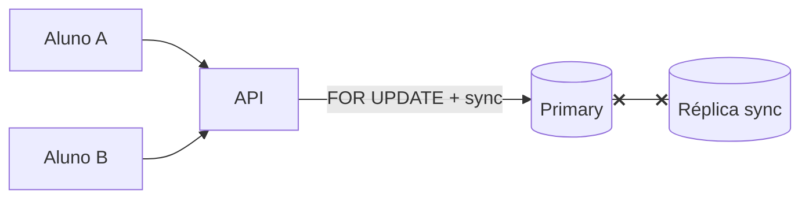

# Workshop de decisões — CP ou AP? Qual consistência?

**Módulo:** [03 — Consistência/CAP](README.md)  
**Faça depois** da [teoria](teoria.md) e, de preferência, do [lab Postgres](tutorial-particao-postgres.md).  
**Objetivo:** treinar **escolher e justificar** consistência vs disponibilidade — sem gabarito único.  
Termos: [glossario.md](glossario.md).

---

## Como usar

Para cada cenário:

1. Escreva **CP, AP ou híbrido** (fluxo a fluxo).  
2. Nomeie **nível de consistência** (strong, majority, eventual, read-your-writes).  
3. Liste **2 vantagens** e **2 custos/riscos**.  
4. Diga o que mostraria na **UI** ou no **erro** ao usuário.  
5. (Opcional) Compare com um colega — o desacordo é o exercício.

| Critério | Pergunta rápida |
|----------|-----------------|
| Perda financeira / legal | Overbooking ou saldo errado é aceitável? |
| Frescor | Stale de 30s mata a experiência? |
| Partição | O fluxo pode **parar** ou deve **seguir**? |
| Operação | Quem reconcilia depois da partição? |

---

## Cenário 1 — Matrícula na última vaga

Disciplina **SD-101** tem **1 vaga**. Dois alunos clicam “Matricular” no mesmo segundo. O link **primary↔réplica** cai (partição na replicação) — como no [lab Postgres](tutorial-particao-postgres.md).

> **Multi-primary / multi-campus** (dois bancos isolados confirmando matrícula) → [04 — locks](../04-coordenacao-locks/). O diagrama abaixo = **lab Postgres** (um primary + sync).

**Perguntas**

1. CP ou AP para este fluxo? Por quê?  
2. Quórum mínimo na escrita? Sync Postgres? `writeConcern: majority`?  
3. O que o aluno vê se a escrita **recusar** (503) vs se passasse com async sem sync?  
4. Depois do [lab-particao-postgres](tutorial-particao-postgres.md): o que você observou no `POST /matricular` com partição?  
5. O que delegaria ao módulo [04 — locks](../04-coordenacao-locks/) além do banco?

---

## Cenário 2 — Boletim no dia da divulgação

08h: **3.000 alunos** abrem notas. Professores **não** lançam nota nesse horário. Réplicas async existem ([módulo 02](../02-replicacao/)).

**Perguntas**

1. Isso é problema de **partição** ou de **lag**?  
2. CP ou AP para **leitura** do boletim?  
3. Se houver partição **durante** a divulgação, muda sua resposta?  
4. O que mostrar na UI (“atualizado há…”, read no primary para quem acabou de lançar nota)?

---

## Cenário 3 — Feed de avisos institucional

Coordenação publica “Prova adiada”. Alunos leem no app. Atraso de **1–2 min** é aceitável; **portal fora** por 1 min não.

**Perguntas**

1. `writeConcern: majority` ou `w:1`? `readConcern: local` na réplica?  
2. Sob partição parcial, prefere **falhar publicação** ou **publicar só no primary**?  
3. Depois do [lab Mongo](tutorial-consistencia-mongodb.md): compare latência majority vs local.  
4. Banner na UI: o que escrever?

---

## Cenário 4 — Pagamento de taxa de matrícula

> **Só teoria** — sem lab neste módulo; extensão opcional. Leitura: [tecnologias §5](tecnologias-e-escolhas.md) (sagas).

Integração com gateway. Valor debitado deve bater com vaga reservada. Falha parcial na rede entre serviços.

**Perguntas**

1. Strong consistency ponta a ponta ou **saga** eventual com compensação?  
2. Onde fica o **CP** (banco, serviço de pagamento, ambos)?  
3. Idempotência e reconciliação — o que monitorar?

---

## Cenário 5 — App offline-first (dois campi)

> **Só teoria** — sem lab neste módulo. Leitura: [tecnologias §5](tecnologias-e-escolhas.md) (CRDT / LWW).

Alunos anotam frequência **offline**; sync quando a rede volta. Campi podem ficar **particionados** por horas.

**Perguntas**

1. Multi-leader vs primary centralizado CP?  
2. Conflitos de edição — LWW, CRDT, manual?  
3. O que é aceitável divergir temporariamente?

---

## Cenário 6 — “CAP diz: escolho Mongo **ou** Postgres”

Colega afirma: “Mongo é AP, Postgres é CP — escolhi Mongo no feed e Postgres na matrícula por isso.”

**Perguntas**

1. O que está **certo** e o que está **simplificado demais** nessa frase?  
2. Cite **configurações** concretas que mudam o comportamento (sync, concerns).  
3. O CAP fala de **sistema** ou de **cada operação**?

---

## Rubrica (autoavaliação)

| Nível | O que esperamos |
|-------|-----------------|
| **Insuficiente** | Só “Mongo AP / Postgres CP” sem fluxo nem configuração. |
| **Básico** | Nomeia CP/AP por cenário, um trade-off. |
| **Bom** | Distingue lag vs partição; cita majority/sync/concerns; UI/erro. |
| **Ótimo** | Híbrido por fluxo; PACELC; liga labs 02+03; reconciliação pós-partição. |
