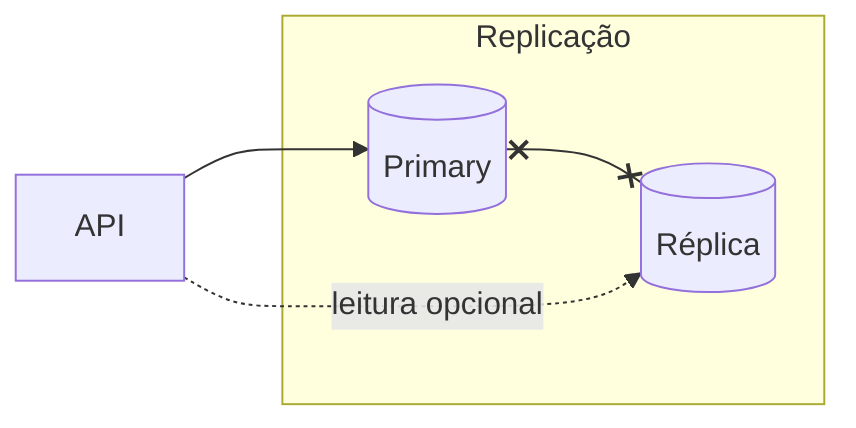
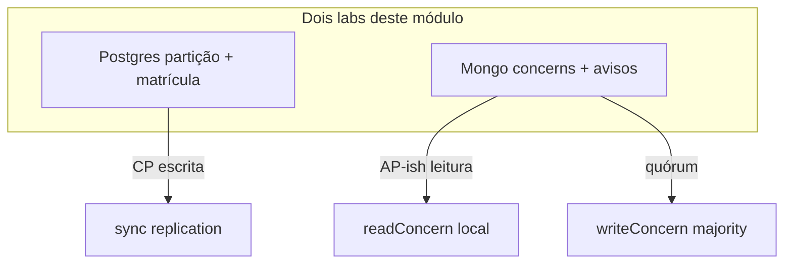

# Teoria — Consistência e CAP

**Módulo:** [03 — Consistência/CAP](README.md)  
**Leitura sugerida:** antes dos labs.  
**Objetivo:** montar o modelo mental; os labs *provocam* partição e consistência nos bancos reais.

---

## 1. Por que consistência importa após replicação

No [módulo 02](../02-replicacao/) você viu **cópias** do estado: primary, réplica, lag, sync/async, failover.

Replicação resolve **disponibilidade de leitura** e **resiliência** — mas abre uma pergunta:

> Se existem duas cópias, **qual** é a verdade **agora**?

- **Stale read** (02): a réplica está **atrasada**, mas ainda **converge**.  
- **Partição** (03): os nós **não se falam** por um tempo — podem **divergir** ou **recusar** operações.

Mesmo portal acadêmico, requisitos diferentes:

| Fluxo | Exemplo | O que não pode acontecer |
|-------|---------|---------------------------|
| **Crítico** | Matrícula com **1 vaga** | Dois alunos matriculados “com sucesso” |
| **Tolerante** | Feed de **avisos** | Sumir o portal inteiro por 30s |

---

## 2. Falhas: crash vs partição

| Falha | O que é | Lab |
|-------|---------|-----|
| **Crash** | Um nó para | Réplica down no [02](../02-replicacao/tutorial-postgres.md) |
| **Partição** | Nós vivos, **rede entre grupos cortada** | [lab-particao-postgres](tutorial-particao-postgres.md) |

Partição é **real**: link de campus, firewall, AZ isolada, cabo rompido. Não é “tudo caiu” — é **falha parcial** ([01](../01-comunicacao/)).



> Metáfora física: campus/DC = grupos de nós; **no lab** a partição é cortar `repl_net` entre primary e réplica.

> **P** (partition tolerance) no CAP = sistemas distribuídos **assumem** que partição pode ocorrer.

---

## 3. CAP — intuição e limites

**CAP** (Brewer, visão didática): em presença de **partição**, você **não** obtém ao mesmo tempo:

| Letra | Significado prático |
|-------|---------------------|
| **C** — Consistency | Todos os nós “enxergam” a mesma versão dos dados (linearizável / strong — simplificado aqui) |
| **A** — Availability | Toda requisição recebe **resposta** (não erro) de **algum** nó vivo |
| **P** — Partition tolerance | Sistema continua operando **mesmo com** link cortado entre partes |

Sob **partição**, escolha **CP** ou **AP** (não “2 de 3 checkbox” eterno):

- **CP** — prefere **recusar/bloquear** escrita se não garantir consistência no cluster.  
- **AP** — prefere **responder**, aceitando leitura/escrita **desatualizada** ou divergente temporariamente.

```text
                    SEM partição          COM partição (P)
                 ┌──────────────────┬─────────────────────────────┐
 Prioriza C      │ Strong / sync    │ CP: erro ou timeout na      │
 (matrícula)     │ funciona bem     │ escrita sem quórum            │
                 ├──────────────────┼─────────────────────────────┤
 Prioriza A      │ Eventual OK      │ AP: feed segue; stale /      │
 (avisos)        │                  │ divergência possível         │
                 └──────────────────┴─────────────────────────────┘
```

**Mito a evitar:** “Postgres é CP, Mongo é AP” — **depende da configuração** (`synchronous_commit`, `writeConcern`, etc.) e do **fluxo** da aplicação.

> **503 na matrícula = CP, não contradição ao CAP.** Sob partição, **recusar** a escrita (HTTP 503 / timeout) é **priorizar consistência** — o sistema prefere não confirmar a matrícula a mentir “matriculado com sucesso” sem garantia no cluster. **AP** seria aceitar a escrita com risco de divergência (ex.: `writeConcern: w:1` no feed de avisos).

---

## 4. Modelos de consistência (práticos)

| Modelo | Ideia | Relação com módulo 02 |
|--------|-------|------------------------|
| **Strong / linearizável** | Leitura vê última escrita confirmada globalmente — como **uma fila única** atendendo todas as operações | Escrita sync + leitura no primary |
| **Majority / quórum** | Operação ok se **maioria** dos nós confirmar | Mongo `writeConcern: majority` |
| **Eventual** | Réplicas convergem **depois**, se não houver novas escritas | Lag + stale read na réplica async |
| **Read-your-writes** | Quem escreveu vê sua própria escrita na sequência | Sticky session → primary (02 §6 tecnologias) |

**Stale read (02)** ≈ leitura **eventual** na réplica.  
**Partição (03)** ≈ risco de **divergência** ou **indisponibilidade de escrita** se você exigir quórum.

### Dois eixos deste módulo (e dois labs)

| Eixo | Pergunta | Lab |
|------|----------|-----|
| **Escrita CP** | Aceito confirmar matrícula sem sync/quórum na réplica? | [Postgres partição](tutorial-particao-postgres.md) |
| **Consistência por operação** | `majority` ou `local` neste feed? | [Mongo concerns](tutorial-consistencia-mongodb.md) |

Não misture: sync no Postgres **não** substitui `writeConcern`; concerns **não** impedem overbooking sem transação no app.

---

## 5. CP vs AP em produto (não só no banco)

A escolha é por **fluxo de negócio**:

| Decisão | CP-ish | AP-ish |
|---------|--------|--------|
| Matrícula última vaga | Erro claro > overbooking | — |
| Boletim 08h (02) | — | Réplica async + “atualizado há…” |
| Feed de avisos | — | Publicar com `w:1`, ler local se preciso |
| Pagamento / saldo | Strong / saga com compensação | — |

**UX importa:** CP → mensagem “não foi possível matricular, tente de novo”; AP → banner “avisos podem estar desatualizados”.

---

## 6. Postgres: sync + primary isolado → tendência CP na escrita

No [lab-particao-postgres](tutorial-particao-postgres.md):

- Réplica **síncrona** (`synchronous_commit = on`).  
- Commit **espera** ack da standby.  
- Script **particiona** primary ↔ réplica (rede `repl_net`).  
- `POST /matricular` retorna **503** se não há réplica `sync`/`quorum` — **não** confirma matrícula sem garantia (fail-fast CP na API; um `COMMIT` sync puro no Postgres ficaria em `SyncRep` indefinidamente).

Isso **não** impede overbooking sozinho — a transação `FOR UPDATE` nas vagas faz isso **no primary**. O sync impede “ok” silencioso **sem** replicação confirmada.

> **Escopo do lab:** uma API, um primary. Cenário “dois campi, dois bancos” é decisão arquitetural ([decisoes §1](decisoes.md), módulo [04](../04-coordenacao-locks/)) — não confunda com partição **primary↔réplica**.

Liga ao [lab sync-async do 02](../02-replicacao/tutorial-sync-async.md): async aceita commit mais rápido; sob partição, **RPO** pior.

---

## 7. MongoDB: writeConcern / readConcern + replica set partido

No [lab-consistencia-mongodb](tutorial-consistencia-mongodb.md):

| Parâmetro | Efeito didático |
|-----------|-----------------|
| `writeConcern=majority` | Escrita só confirma se **quórum** replicar — falha se secondaries isoladas |
| `writeConcern=w1` | Primary confirma sozinho — **mais disponível**, menos seguro |
| `readConcern=majority` | Leitura só de dados commitados na maioria |
| `readConcern=local` + secondary | Feed **disponível**, pode ver oplog não replicado |

Partição parcial (secondaries fora da `rs_net`) simula split **sem** montar dois data centers.

> No [02](../02-replicacao/tutorial-mongodb.md) você viu failover; aqui o foco é **nível de consistência** por operação.

---

## 8. PACELC + mapa mental → labs

**PACELC** (extensão): **se não há partição (PAC)**, ainda há trade-off **latência (L) vs consistência (C)** — liga ao [sync-async do 02](../02-replicacao/tutorial-sync-async.md).

| Situação | Tendência | Onde sentir |
|----------|-----------|-------------|
| Sem partição, sync / majority | Mais **C**, mais latência | POST matrícula sync; Mongo `writeConcern=majority` |
| Sem partição, async / local | Mais **L**, menos C | Boletim na réplica (02); Mongo `readConcern=local` |
| Com partição | CAP entra — CP vs AP | Labs deste módulo |

No laptop local a diferença de latência pode ser **~0 ms** — o experimento de `time curl` no Mongo serve de **roteiro**; o argumento PACELC vale mesmo quando a diferença só aparece em produção (WAN, carga).



**Próximo módulo:** [04 — Coordenação/locks](../04-coordenacao-locks/) — exclusão mútua **distribuída** para vagas quando CP no banco não basta.

---

## Referências (`books/`)

- van Steen & Tanenbaum — consistência, replicação, fault tolerance  
- Xu — *System Design Interview* — CAP na prática  
- Ford et al. — *Hard Parts* — trade-offs de dados distribuídos  
- Richards & Ford — *Fundamentals* — disponibilidade vs consistência
