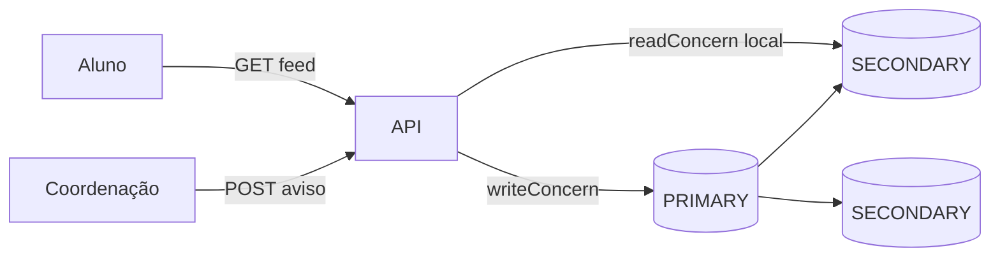

# Tutorial — Lab MongoDB: readConcern / writeConcern e avisos

**Módulo:** [03 — Consistência/CAP](README.md) · **Lab:** [lab-consistencia-mongodb/](lab-consistencia-mongodb/)  
**Tempo sugerido:** tecnologia 15 min + lab 90–120 min  
**Pré-requisito:** [02 — Mongo replica set](../02-replicacao/tutorial-mongodb.md) · [teoria.md](teoria.md) §4–7  
**Apoio:** [glossario.md](glossario.md) · [troubleshooting.md](troubleshooting.md)

> Leia A e B *antes* do Compose.

**Arco narrativo:** passo **4** (contraste AP no feed) · [README](README.md)

**Protagonista deste lab:** a **coordenação** publica avisos; alunos leem no app — atraso de minutos é OK; **portal fora** não.

---

## Parte A — A tecnologia: concerns no replica set

> Failover você viu no [02](../02-replicacao/tutorial-mongodb.md). Aqui: **por operação**, quanta consistência pedir.

### Em uma frase

`writeConcern` define **quantos nós** confirmam a escrita; `readConcern` define **quão “confirmado”** o dado lido precisa estar. Sob **partição**, `majority` tende a **falhar**; `w:1` + `local` tende a **seguir** (AP-ish).

### Parâmetros do lab

| Query param | Valores | Efeito |
|-------------|---------|--------|
| `writeConcern` | `majority`, `w1` | Quórum vs só primary |
| `readConcern` | `majority`, `local` | Leitura segura vs leitura local |
| `dest` | `primary`, `secondary` | Onde a API lê |

### vs módulo 02

| | [02 Mongo](../02-replicacao/tutorial-mongodb.md) | Este lab |
|--|--------------------------------------------------|----------|
| Pergunta | Quem é primary? Failover? | Quanto C por request? |
| Partição | Não simula | `particionar-mongo.sh` |
| Domínio | Notas | Feed de avisos |

### Cloud / produção vs este lab

| Promessa típica | Neste lab (Compose) |
|-----------------|---------------------|
| Regiões / zonas múltiplas | 3 nós num host; partição = `network disconnect` |
| Concerns por collection default | Query param explícito na API |
| Read preference automática | `dest=primary\|secondary` didático |

A API está em **`app_net` + `rs_net`** para alcançar secondaries — igual padrão “app enxerga cluster interno”.

### Vantagens / custos

**Ganha:** ajuste fino por rota HTTP; feed disponível com `local`.  
**Paga:** combinações erradas → stale; majority mais lento; partição exige copy na UI.

---

## Parte B — Contexto de uso

### A dor

“A prova de SD foi adiada” precisa chegar aos alunos. O cluster Mongo tem 3 nós; o **link de replicação** entre o primary e **parte do cluster** falha (partição parcial no lab).

- **Matrícula** ([lab Postgres](tutorial-particao-postgres.md)) pararia escrita crítica (sync / 503).  
- **Feed** pode mostrar banner “pode estar desatualizado” mas **continuar online** com `w:1` + `readConcern=local`.



Coleção: `avisos`. API: `:8086`.

---

## Parte C — Lab prático

> Relacione cada experimento à teoria. Travou? [troubleshooting.md](troubleshooting.md).

### C.1 Subir

```bash
cd sistemas-distribuidos/03-consistencia-cap/lab-consistencia-mongodb
docker compose up -d --build
curl -s http://localhost:8086/consistencia/status | python3 -m json.tool
```

Poll: [troubleshooting § Mongo](troubleshooting.md#enquanto-espera-o-replica-set).

Resposta **esperada** em `/consistencia/status` (saudável):

```json
{
  "set": "rs0",
  "primary": "mongo1:27017",
  "membros": [
    { "name": "mongo1:27017", "stateStr": "PRIMARY", "health": 1 }
  ]
}
```

Liste 3 membros com `PRIMARY` + 2 `SECONDARY` quando saudável.

### C.2 Experimento 1 — majority write + majority read

```bash
./scripts/publicar-aviso.sh "Calendário atualizado"
curl -s 'http://localhost:8086/avisos?dest=primary&readConcern=majority&limit=3' | python3 -m json.tool
```

**Observe:** publicação confirma com quórum; leitura majority lista o aviso.

| Pergunta | Sua anotação |
|----------|--------------|
| `duracao_ms` da escrita? | |
| Primary em `/consistencia/status`? | |

### C.3 Experimento 2 — Latência majority vs local (PACELC)

```bash
curl -s 'http://localhost:8086/avisos?dest=primary&readConcern=majority&limit=5' | python3 -c "import sys,json; print('majority ms:', json.load(sys.stdin)['duracao_ms'])"
curl -s 'http://localhost:8086/avisos?dest=secondary&readConcern=local&limit=5' | python3 -c "import sys,json; print('local secondary ms:', json.load(sys.stdin)['duracao_ms'])"
```

**Observe:** no laptop a diferença pode ser mínima — releia [teoria §8 PACELC](teoria.md#8-pacelc--mapa-mental--labs). Em produção (WAN/carga), `local` costuma ganhar.

### C.4 Experimento 3 — Partição parcial

```bash
./scripts/particionar-mongo.sh
curl -s http://localhost:8086/consistencia/status | python3 -m json.tool
```

Tente majority (deve falhar) e w1 (deve passar):

```bash
./scripts/publicar-aviso.sh "Aviso majority" || true
./scripts/provocar-divergencia.sh
```

**Observe:** `writeConcern=majority` → **503**; `w1` → **201**; leitura `local` na secondary pode **não listar** o aviso recém-publicado — ou retornar **503** se a secondary estiver fora da rede (também válido como trade-off AP: feed indisponível na réplica, mas primary segue).

> **Pare e pense:** isso é **AP-ish** — portal no ar no primary, feed possivelmente desatualizado ou leitura secondary indisponível. O que colocaria no banner da UI?

### C.5 Experimento 4 — Curar e convergir

```bash
./scripts/curar-particao-mongo.sh
sleep 15
./scripts/comparar-concerns.sh
```

**Observe:** após catch-up do oplog, majority e local tendem a **bater**.

### C.6 Experimento 5 (opcional) — Read-your-writes (conceitual)

Sem código extra: após publicar um aviso com `writeConcern=majority`:

```bash
./scripts/publicar-aviso.sh "Aviso sticky"
curl -s 'http://localhost:8086/avisos?dest=primary&readConcern=majority&limit=1' | python3 -m json.tool
curl -s 'http://localhost:8086/avisos?dest=secondary&readConcern=local&limit=1' | python3 -m json.tool
```

**Pergunta:** quem **acabou de publicar** deve ler no **primary** (majority) ou aceitar stale na secondary? Em produção: **sticky session** ou parâmetro `readPreference=primary` na rota “minhas publicações” — padrão citado na [teoria §4](teoria.md) e no [02 tecnologias §6](../02-replicacao/tecnologias-e-escolhas.md).

---

## Tabela de fechamento

| Experimento | CP/AP | Objetivos |
|-------------|-------|-----------|
| 1 | Quórum (C) | 3, 5 |
| 2 | PACELC (sem P) | liga 02↔03 |
| 3 | AP-ish w1/local | 4 |
| 4 | Eventual → convergência | 7 |
| 5 (opc.) | Read-your-writes (conceitual) | liga teoria §4 |

### Dois mecanismos — não confunda na redação

| Mecanismo | O que garante | Onde viu |
|-----------|-----------------|----------|
| **`writeConcern: majority`** | Escrita só confirma com **quórum** | Exp. 1, 3 (falha sob partição) |
| **`w:1` + `readConcern: local`** | Primary/publicação segue; leitura pode **divergir** ou secondary **503** | Exp. 3–4 |

Majority **não** substitui regra de negócio no app; w1 **não** elimina necessidade de banner “feed pode estar desatualizado”.

---

## Encerrar

```bash
docker compose down -v
```

**Workshop:** [decisoes.md](decisoes.md) — cenários 3 e 6 (caminho completo).  
**Ponte:** [04 — locks](../04-coordenacao-locks/).
