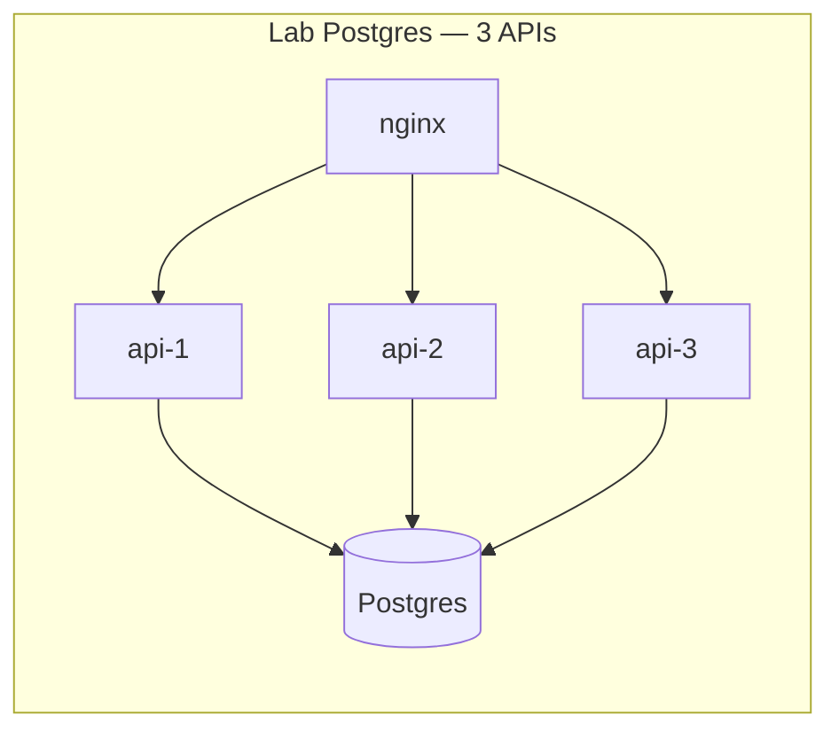
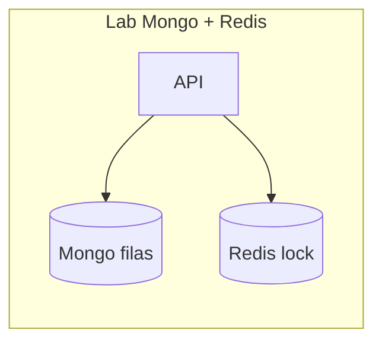

# 04 — Coordenação e locks

**Conceito central:** exclusão mútua **distribuída** — quando transação no banco ou sync replication **não bastam** (várias APIs, vários serviços, mesmo recurso).  
**Domínio âncora:** portal acadêmico — **matrícula na última vaga** (continuação do 03) e **fila de reserva** em documento Mongo.  
**Stack:** Python 3 · Docker Compose · PostgreSQL · MongoDB · Redis (`SET NX` / TTL)

Pré-requisitos: [00 — Ambiente Docker](../00-ambiente-docker/) · [03 — Consistência/CAP](../03-consistencia-cap/) (caminho mínimo: lab Postgres + teoria §1–5).  
Apoio: [glossario.md](glossario.md) · [troubleshooting.md](troubleshooting.md)

---

## Objetivos de aprendizado

Ao final deste módulo, você deve ser capaz de:

1. **Explicar** por que **replicação + CAP + transação local** não substituem coordenação quando há **N writers** ou **estado fragmentado**.
2. **Distinguir** exclusão mútua in-process, **no banco (SQL / atomic doc)** e **via lock distribuído** (Redis).
3. **Identificar** o anti-padrão **read-modify-write** e observar **lost update / overbooking**.
4. **Comparar** em lab: `FOR UPDATE`, advisory lock, optimistic locking, `findOneAndUpdate`, Redis lock.
5. **Descrever** riscos de lock distribuído: contenção, lock **órfão**, **TTL**, **fencing token** (intuição).
6. **Decidir** quando lock externo vs operação atômica no documento vs fila single-consumer ([01](../01-comunicacao/)).
7. **Relacionar** matrícula CP (03) com mecanismo concreto de exclusão (04).
8. **Experimentar** corrida com N clientes, modos correto vs quebrado, lock holder lento.

> Meta: argumentar *“onde fica a exclusão mútua neste fluxo?”* — não decorar “Redis resolve tudo”.

> **Lock ≠ CAP.** Lock serializa **quem** altera o recurso; CAP fala **o que** garantir sob partição ([03](../03-consistencia-cap/teoria.md)).

---

## Caminhos de estudo

### Caminho mínimo (~4–5 h)

Fecha objetivos **1–4** e **7** (parcial); objetivo **5** (Redis): teoria §7 + [tecnologias §4](tecnologias-e-escolhas.md) (cenário **1** já entra no passo 3).

1. [teoria.md](teoria.md) §1–5  
2. [tutorial-concorrencia-postgres.md](tutorial-concorrencia-postgres.md) (Partes A–C, Exp. 1–2)  
3. [decisoes.md](decisoes.md) — cenários **1** (multi-campus) e **2** (RMW quebrado)  
4. Objetivo **5** (parcial): [tecnologias-e-escolhas.md](tecnologias-e-escolhas.md) **§4** (Redis) e **§2** (Postgres)  
5. Checklist **mínimo** abaixo  

**Pré-requisitos no host:** `curl`, `python3`, Docker Compose ([00](../00-ambiente-docker/)).

### Caminho completo (~8–10 h) — recomendado

| Ordem | Material | Tempo | Para quê |
|-------|----------|-------|----------|
| 1 | [teoria.md](teoria.md) | ~50 min | Modelo mental |
| 2 | [tutorial-concorrencia-postgres.md](tutorial-concorrencia-postgres.md) | ~2 h | RMW vs transação |
| 3 | [tutorial-coordenacao-mongo-redis.md](tutorial-coordenacao-mongo-redis.md) | ~1,5–2 h | Atomic doc + Redis |
| 4 | [decisoes.md](decisoes.md) | ~45 min | Trade-offs |
| 5 | Releia §6–10 de [teoria.md](teoria.md) + [tecnologias-e-escolhas.md](tecnologias-e-escolhas.md) | ~20 min | Consolidar |

Cada tutorial: **A** tecnologia → **B** contexto → **C** lab.

---

## Arco narrativo

1. **Dor (herdada do 03)** — matrícula CP com `FOR UPDATE` funciona… com **uma** API.  
2. **Crise** — deploy com **3 instâncias** + código RMW quebrado → **overbooking** na SD-101 → [lab Postgres](tutorial-concorrencia-postgres.md).  
3. **Alívio SQL** — transação / advisory lock serializa no **mesmo** primary.  
4. **Nova crise** — fila de reserva no Mongo + passos separados; RMW quebra de novo.  
5. **Alívio NoSQL + Redis** — `findOneAndUpdate` ou lock ([lab Mongo/Redis](tutorial-coordenacao-mongo-redis.md)).  
6. **Ressalva** — lock órfão, fencing, contenção.  
7. **Fechamento** — [decisoes.md](decisoes.md) + ponte para [05 — Escalabilidade](../05-escalabilidade/).





| Fluxo | Lab | Mecanismo |
|-------|-----|-----------|
| Matrícula multi-API | Postgres | `FOR UPDATE` / advisory |
| Fila de reserva | Mongo | `findOneAndUpdate` / Redis lock |

---

## Mapa dos 2 labs

| Lab | Pergunta central | Objetivos |
|-----|------------------|-----------|
| [lab-concorrencia-postgres](lab-concorrencia-postgres/) | RMW quebrado vs transação com 3 APIs | 2, 3, 4, 7 |
| [lab-coordenacao-mongo](lab-coordenacao-mongo/) | Atomic doc vs lock entre etapas | 4, 5, 6, 8 |

**Um lab por vez.** Antes do próximo: `docker compose down -v` no lab atual. Ver [troubleshooting.md](troubleshooting.md).

```bash
cd sistemas-distribuidos/04-coordenacao-locks/lab-concorrencia-postgres && docker compose up -d --build
# … depois (encerrando o anterior):
cd ../lab-coordenacao-mongo && docker compose up -d --build
```

---

## Os labs

| Lab | Porta API | Banco / Redis | Ideia central |
|-----|-----------|---------------|---------------|
| **[lab-concorrencia-postgres](lab-concorrencia-postgres/)** | `8087` (nginx) | Postgres `5438` | 3 APIs · modos broken/transaction/advisory/optimistic |
| **[lab-coordenacao-mongo](lab-coordenacao-mongo/)** | `8088` | Mongo `27118` · Redis `6380` | RMW vs atomic vs redis-lock + fencing |

---

## Checklist — pronto para a próxima aula?

### Mínimo

- [ ] Explico por que 3 APIs quebram RMW mesmo com Postgres “CP” no módulo 03.  
- [ ] Rodei Exp. 1–2 no lab Postgres e comparei contagem de matrículas.  
- [ ] Justifiquei lock vs transação SQL em **dois** cenários de [decisoes.md](decisoes.md).

### Completo

- [ ] Comparei `findOneAndUpdate` vs Redis lock no lab Mongo.  
- [ ] Descrevo lock órfão + papel do TTL.  
- [ ] Sei quando **não** usar lock global (hot key → particionar).  
- [ ] Relaciono 03 (CAP) + 04 (exclusão) sem misturar os conceitos.

---

## Ponte com outros módulos

| De onde veio | Para onde vai |
|--------------|---------------|
| [03 — CAP, FOR UPDATE, sync](../03-consistencia-cap/) | Exclusão mútua com N writers |
| [01 — filas](../01-comunicacao/) | Single consumer como alternativa ao lock |
| [02 — primary único](../02-replicacao/) | Coordenação assume writer central ou lock |
| Este módulo | [05 — escalabilidade](../05-escalabilidade/) — escalar APIs exige coordenação consciente |

**Próximo módulo →** [05 — Escalabilidade (por camadas)](../05-escalabilidade/)

---

## Bibliografia (`books/`)

| Fonte | Uso neste módulo |
|-------|------------------|
| van Steen & Tanenbaum, *Distributed Systems* | Exclusão mútua, coordenação, eleição |
| Tanenbaum 2a (PT) | Mesmo eixo — leitura alternativa |
| Ford et al., *The Hard Parts* | Fronteiras de serviço, ownership |
| Alex Xu, *System Design Interview* | Distributed lock, idempotência |
| *migrating-to-microservice-databases* | Transações, sagas (cenário 4) |
| Richards & Ford, *Fundamentals* | Trade-offs operacionais |
| Bellemare, *Event-Driven Microservices* | Single consumer vs lock |
