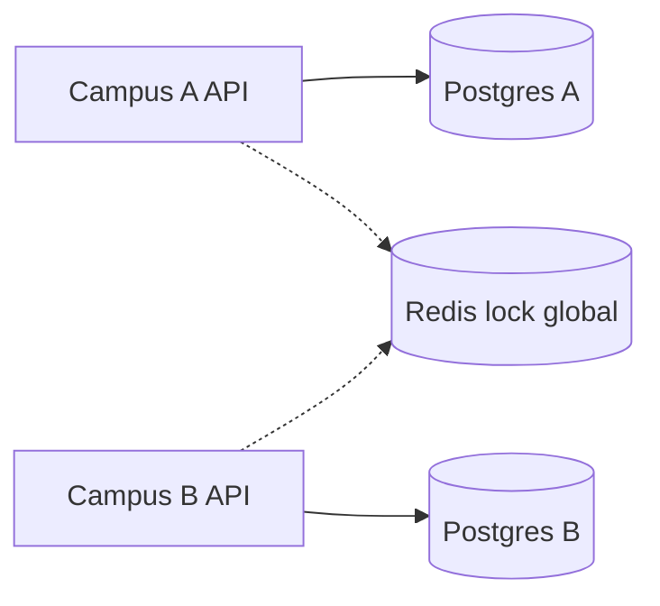

# Workshop de decisões — Onde coordenar?

**Módulo:** [04 — Coordenação/locks](README.md)  
**Faça depois** da [teoria](teoria.md) e, de preferência, do [lab Postgres](tutorial-concorrencia-postgres.md).  
**Objetivo:** treinar **escolher mecanismo de exclusão** — sem gabarito único.  
Termos: [glossario.md](glossario.md).

---

## Como usar

Para cada cenário:

1. Nomeie **mecanismo** (transação SQL, atomic doc, Redis lock, fila, saga).  
2. Liste **2 vantagens** e **2 custos/riscos**.  
3. Diga o que o usuário vê em **erro** ou **retry**.  
4. (Opcional) Compare com colega.

| Critério | Pergunta rápida |
|----------|-----------------|
| Writers | Quantas instâncias/serviços escrevem? |
| Store | Um primary ou vários bancos? |
| Duração | Operação rápida ou multi-etapa? |
| Falha | O que acontece se o holder morrer? |

---

## Cenário 1 — Matrícula multi-campus

Dois campi, **dois Postgres primaries** isolados. Disciplina SD-101 tem **1 vaga global** (não 1 por campus). Partição entre campi pode durar minutos.

> Prometido no [03 — decisões §1](../03-consistencia-cap/decisoes.md). **Não há lab com dois primaries** — o Redis lock do lab Mongo é a **analogia**: um coordenador externo visível aos dois lados. `FOR UPDATE` em cada campus **não** serializa a vaga global.

**Perguntas**

1. `FOR UPDATE` em cada campus resolve? Por quê?  
2. Redis lock global vs **primary centralizado** CP?  
3. O que mostrar ao aluno se o lock expirar no meio da matrícula?  
4. Relação com CAP: o fluxo pode **parar** ou **seguir** com risco?

---

## Cenário 2 — Três APIs, um Postgres, código legado

Equipe escala portal para **3 réplicas**. Código faz `SELECT vagas` → sleep → `UPDATE` **sem** transação (`mode=broken` no lab).

**Perguntas**

1. O módulo 03 “CP” impede overbooking aqui?  
2. Correção mínima: transação, advisory, ou redeploy single-instance?  
3. Depois do [lab Postgres Exp. 1–2](tutorial-concorrencia-postgres.md): o que você observou?

---

## Cenário 3 — Fechamento de semestre (job único)

Script batch **não pode** rodar em duplicata em 3 pods CronJob.

**Perguntas**

1. Lock Redis vs **fila com single consumer** ([01](../01-comunicacao/))?  
2. TTL do lock vs duração do job — renew?  
3. O que monitorar (lock preso, job duplicado)?

---

## Cenário 4 — Reserva Mongo + confirmação Postgres

Aluno **reserva** vaga no Mongo; **confirma** matrícula no Postgres em segundo passo.

> **Só teoria** no mínimo — lab Mongo simula com fencing. Leitura: [tecnologias §5](tecnologias-e-escolhas.md).

**Perguntas**

1. Lock Redis envolvendo os dois passos vs **saga** com compensação?  
2. Onde fica idempotência (`aluno_id`)?  
3. Atomic doc no Mongo basta para o passo 1?

---

## Cenário 5 — “Redis lock resolve tudo”

Colega propõe Redis lock em **toda** escrita do portal.

**Perguntas**

1. Quando lock é **overkill** (transação SQL local)?  
2. Riscos: SPOF Redis, hot key SD-101, lock órfão.  
3. Depois do Exp. 4 Mongo: papel do **fencing token**?

---

## Cenário 6 — Hot key na última vaga

10 mil alunos disputam **1 vaga**; lock global serializa tudo.

**Perguntas**

1. Lock global escala? Alternativas (fila justa, sorteio, shard)?  
2. CP vs UX: fila “sua posição: 8421”?  
3. Ponte para [05 — escalabilidade](../05-escalabilidade/).

---

## Rubrica (autoavaliação)

| Nível | O que esperamos |
|-------|-----------------|
| **Insuficiente** | Só “usar Redis” sem fluxo nem risco. |
| **Básico** | Nomeia um mecanismo por cenário. |
| **Bom** | RMW vs transação vs atomic; TTL/órfão; UI/erro. |
| **Ótimo** | Híbrido por fluxo; fencing; fila vs lock; liga labs 03+04. |
