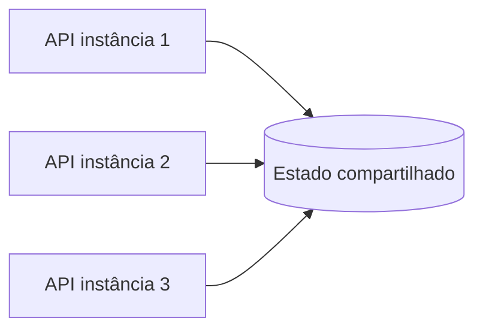
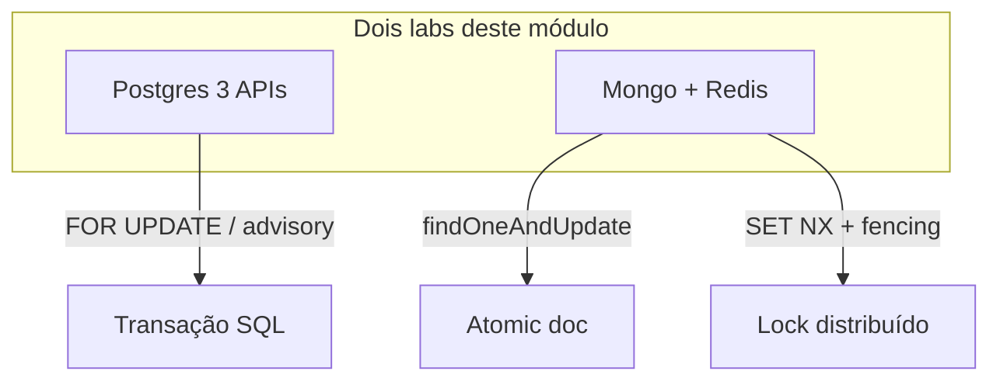

# Teoria — Coordenação e locks

**Módulo:** [04 — Coordenação/locks](README.md)  
**Leitura sugerida:** antes dos labs.  
**Objetivo:** montar o modelo mental; os labs *provocam* corrida e exclusão mútua nos bancos reais.

---

## 1. Ponte 03 → 04: o que CAP + transação local não cobrem

No [módulo 03](../03-consistencia-cap/) você viu:

- **`FOR UPDATE`** — evita overbooking **no mesmo primary**  
- **Sync commit** — não confirma escrita sem réplica  
- **Concerns Mongo** — consistência **por operação**

Isso responde: *“sob partição, priorizo C ou A?”*  
Este módulo responde: *“com **vários writers**, quem pode alterar o **mesmo recurso** agora?”*

| Situação | Módulo 03 | Módulo 04 |
|----------|-----------|-----------|
| 1 API, 1 Postgres, transação correta | ✅ | (já coberto) |
| **3 APIs** + código RMW quebrado | ❌ overbooking | ✅ lab Postgres |
| 2 campi, 2 bancos isolados | Fora do escopo 03 | Lock / saga |
| Reserva em Mongo + confirmação depois | — | Atomic doc / Redis |

> **Lock ≠ CAP.** Lock **serializa** acesso ao recurso; CAP fala de **garantias sob partição**. Um sistema pode ser CP na matrícula **e** precisar de lock quando há múltiplos serviços.

Referência: Ford et al., *The Hard Parts* — ownership de dados e fronteiras entre serviços.

---

## 2. Concorrência vs coordenação distribuída

Processos em máquinas diferentes **não compartilham memória**. Um `threading.Lock()` na API **não** protege outra instância do mesmo serviço.



**Coordenação** = acordar **quem** pode ler/escrever um recurso por vez (ou usar operação **atômica** no store).

Referência: van Steen & Tanenbaum — coordenação e mutual exclusion.

---

## 3. Read-modify-write e lost update

Anti-padrão clássico:

1. **Ler** `vagas = 1`  
2. *Pensar / processar* (outro writer também lê `1`)  
3. **Escrever** `vagas = 0` e inserir matrícula  

Dois writers → **duas matrículas** na última vaga (**lost update** / **overbooking**).

```mermaid
sequenceDiagram
    participant A as Writer A
    participant B as Writer B
    participant DB as Postgres

    A->>DB: READ vagas = 1
    B->>DB: READ vagas = 1
    Note over A,B: delay (RACE_DELAY_MS)
    A->>DB: INSERT mat A; SET vagas = 0
    B->>DB: INSERT mat B; SET vagas = 0
    Note over DB: 2 matrículas, 1 vaga — overbooking
```

O modo `broken` **grava o valor lido** (`SET vagas_restantes = vagas_lidas - 1`), não um `vagas_restantes - 1` no servidor. Decremento relativo + `CHECK (>= 0)` esconderia a corrida: o segundo writer falharia no constraint em vez de overbookar.

No [lab Postgres](tutorial-concorrencia-postgres.md), o modo `broken` reproduz isso de propósito.

---

## 4. Três camadas de solução

| Camada | Exemplo | Limite |
|--------|---------|--------|
| **In-process** | `Lock()` na thread | Só **uma** instância da API |
| **No store** | `FOR UPDATE`, `findOneAndUpdate` | Um **primary** / documento atômico |
| **Lock distribuído** | Redis `SET NX EX` | Vários serviços / passos / stores |

Escolha a camada **mais baixa que funciona** — lock global adiciona latência e ponto de contenção.

---

## 5. PostgreSQL: transação, advisory lock, optimistic

| Mecanismo | Ideia | Lab |
|-----------|-------|-----|
| **`FOR UPDATE`** | Row lock na transação | `mode=transaction` |
| **`pg_advisory_xact_lock`** | Lock lógico por recurso (hash da disciplina) | `mode=advisory` |
| **Optimistic (`version`)** | UPDATE só se versão não mudou | `mode=optimistic` |

Todos assumem **um primary** compartilhado. Multi-primary isolado → lock externo ou saga.

Referência: *migrating-to-microservice-databases* — padrões transacionais locais.

---

## 6. MongoDB: operação atômica no documento

`findOneAndUpdate` com filtro `{vagas_restantes: {$gt: 0}}` e `$inc` executa **uma** operação atômica no documento — compare-and-set no servidor.

| | RMW em app | `findOneAndUpdate` |
|--|------------|-------------------|
| Corrida | Possível | Prevenida (single doc) |
| Multi-documento | — | Precisa transação multi-doc ou lock |

`findOneAndUpdate` basta para **um passo** no mesmo documento. Redis lock entra quando há **vários passos/serviços** (reserva + confirmação) — o lab combina os dois de propósito. Ver [tutorial Mongo](tutorial-coordenacao-mongo-redis.md).

Referência: Alex Xu — consistência por operação em design de sistemas.

---

## 7. Lock distribuído com Redis

Padrão didático:

```text
SET lock:recurso token NX EX 10
… operação crítica …
DEL lock:recurso  (somente se token ainda é seu — Lua script)
```

| Tema | Por quê importa |
|------|-----------------|
| **TTL** | Holder morre → lock expira → sistema não trava para sempre |
| **Lock órfão** | Holder **revive** após TTL e escreve por cima — perigoso |
| **Fencing token** | Storage rejeita escrita com token **menor** que o último visto |
| **Contention** | Lock global vira gargalo — particionar por `disciplina_id` |

Referência: Xu vol. 2 — distributed lock; van Steen — exclusão mútua.

> **Redlock** (múltiplos Redis) fica fora do escopo ADS — cite como “produção avançada”.

---

## 8. Leader election e consensus (intuição)

**etcd**, **ZooKeeper**, **Raft** (Kubernetes): elegem **um líder** que executa writes ou adquire lock de forma segura.

Neste módulo: **conceito apenas** — labs usam Redis simples + fencing didático.

Referência: Tanenbaum — algoritmos de eleição; *Kubernetes in Action* — analogia opcional.

---

## 9. Trade-offs e alternativas

| Abordagem | Prós | Contras |
|-----------|------|---------|
| Transação SQL | Simples, forte no primary | Não cruza serviços/bancos |
| Atomic doc Mongo | Sem lock externo | Escopo do documento |
| Redis lock | Coordena N serviços | SPOF, contenção, órfão |
| **Fila single-consumer** ([01](../01-comunicacao/)) | Sem lock explícito no writer | Serializa todo o fluxo |

**Hot key:** lock global em “SD-101” no pico → fila ou shard por disciplina.

Referência: Bellemare — processamento serial por partição.

---

## 10. Mapa mental → labs



**Próximo módulo:** [05 — Escalabilidade](../05-escalabilidade/) — adicionar nós **sem** corromper estado compartilhado.

---

## Referências (`books/`)

- van Steen & Tanenbaum — coordenação, mutual exclusion, fault tolerance  
- Ford et al. — *Hard Parts* — ownership, fronteiras  
- Xu — distributed lock, idempotência  
- *migrating-to-microservice-databases* — transações e sagas  
- Richards & Ford — trade-offs operacionais
