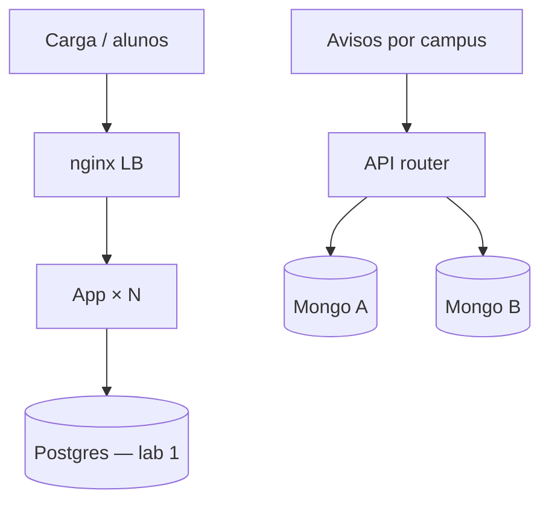

# 05 — Escalabilidade (por camadas)

**Conceito central:** capacidade de atender **mais carga** — e o fato de que escala se implementa em **várias camadas** (aplicação **e** dados/armazenamento), não só “subindo mais containers”.  
**Domínio âncora:** portal acadêmico — **dia do boletim** (tempestade de leituras) e **avisos por campus** (escrita particionada).  
**Stack:** Python 3 · Docker Compose · nginx · PostgreSQL · MongoDB (dois stores + router)

Pré-requisitos: [00 — Ambiente Docker](../00-ambiente-docker/) · ideal [02](../02-replicacao/) · [03](../03-consistencia-cap/) · [04](../04-coordenacao-locks/) (caminho mínimo: teoria 04 §1–4).  
Apoio: [glossario.md](glossario.md) · [troubleshooting.md](troubleshooting.md) · [Linux e Windows](../ferramentas/linux-e-windows.md)

---

## Objetivos de aprendizado

Ao final deste módulo, você deve ser capaz de:

1. **Explicar** escala **vertical** vs **horizontal** e o que significa escalar **uma camada**.
2. **Distinguir** escala na **aplicação** vs na **camada de dados/armazenamento**.
3. **Argumentar** que escalar só uma camada **desloca** o gargalo (não o elimina).
4. **Medir** RPS e latências (p50/p99) ao mudar a camada de app.
5. **Relacionar** réplica de leitura (02), CAP/eventual (03) e hot key/lock (04) às decisões de escala.
6. **Descrever** particionamento como técnica de escala de **dados** (escrita/isolamento).
7. **Decidir** qual camada atacar primeiro em cenários do portal.
8. **Experimentar** os dois labs (app + dados).

> Meta: *“Em qual camada está o gargalo — e o que eu pago ao escalar essa camada?”*

> **Escala ≠ só Kubernetes.** Escala = capacidade na **camada certa**. Cache (07) será uma terceira camada depois.

---

## Caminhos de estudo

### Caminho mínimo (~4–5 h; +30–45 min se for a 1ª build Docker)

Fecha objetivos **1–4** e **7** (parcial). **Exp. 4 (`aproximar-teto`) é recomendado** — sem ele o insight “gargalo móvel” fica só na teoria.

1. [teoria.md](teoria.md) §1–5  
2. [tutorial-escala-aplicacao.md](tutorial-escala-aplicacao.md) (Partes A–C, **Exp. 1–4**)  
3. [decisoes.md](decisoes.md) — cenários **1** e **2**  
4. Escala de dados (parcial): §5–6 de [teoria.md](teoria.md) + §3 de [tecnologias-e-escolhas.md](tecnologias-e-escolhas.md)  
5. Checklist **mínimo** abaixo  

**Pré-requisitos no host:** Docker Compose. Windows: `curl.exe` e `.\lab.ps1` — [Linux e Windows](../ferramentas/linux-e-windows.md).

### Caminho completo (~8–10 h) — recomendado

| Ordem | Material | Tempo | Para quê |
|-------|----------|-------|----------|
| 1 | [teoria.md](teoria.md) | ~50 min | Duas camadas |
| 2 | [tutorial-escala-aplicacao.md](tutorial-escala-aplicacao.md) | ~2 h | Escala de app + teto do banco |
| 3 | [tutorial-escala-dados.md](tutorial-escala-dados.md) | ~1,5–2 h | Partição / hot key / fan-out |
| 4 | [decisoes.md](decisoes.md) | ~45 min | Qual camada primeiro? |
| 5 | Releia §6–8 teoria + [tecnologias-e-escolhas.md](tecnologias-e-escolhas.md) | ~20 min | Consolidar |

Cada tutorial: **A** tecnologia → **B** contexto → **C** lab.

---

## Arco narrativo

1. **Dor** — dia do boletim; uma API + um banco.  
2. **Escala app** — N APIs atrás do LB; RPS sobe → [lab aplicação](tutorial-escala-aplicacao.md).  
3. **Insight** — com store limitado, o gargalo **muda de camada** (`aproximar-teto`).  
4. **Dois fluxos** — boletim (leitura) → réplica/cache; avisos (escrita) → partição.  
5. **Escala dados** — partir avisos por campus → [lab dados](tutorial-escala-dados.md).  
6. **Trade-offs** — hot key, fan-out, stale em réplica (02/03), lock global (04).  
7. **Fechamento** — [decisoes.md](decisoes.md) + ponte [06](../06-falhas-timeout/) / [07](../07-cache-distribuido/).



| Camada | Lab | O que prova |
|--------|-----|-------------|
| **Aplicação** | Postgres + N APIs | Mais instâncias ↑ RPS; teto didático do store |
| **Dados** | Mongo A/B por campus | Partição: hot vs spread; fan-out custa |

---

## Mapa dos 2 labs

| Lab | Pergunta central | Objetivos |
|-----|------------------|-----------|
| [lab-escala-aplicacao](lab-escala-aplicacao/) | Escalo só a app — o que sobe e o que trava? | 2, 3, 4, 8 |
| [lab-escala-dados](lab-escala-dados/) | Partição: hot vs spread e fan-out? | 2, 5, 6, 8 |

**Um lab por vez.** `docker compose down -v` antes de trocar. Ver [troubleshooting.md](troubleshooting.md).

```bash
cd sistemas-distribuidos/05-escalabilidade/lab-escala-aplicacao && docker compose up -d --build
# … depois:
cd ../lab-escala-dados && docker compose up -d --build
```

**Professor — piloto + Validação local:** `./scripts/piloto-validacao.sh` (a partir de `05-escalabilidade/`).

---

## Os labs

| Lab | Porta API | Store | Ideia |
|-----|-----------|-------|-------|
| **[lab-escala-aplicacao](lab-escala-aplicacao/)** | `8089` (nginx) · `8091` (api1) | Postgres `5439` | 1 vs 3 APIs · RPS · worker lento · `aproximar-teto` |
| **[lab-escala-dados](lab-escala-dados/)** | `8090` | Mongo `27119`/`27120` | Partição por campus · hot/spread · fan-out |

---

## Checklist — pronto para a próxima aula?

### Mínimo

- [ ] Explico vertical vs horizontal e “escalar uma camada”.  
- [ ] Medi RPS com 1 e 3 APIs e interpretei o ganho (`ganho_aprox`).  
- [ ] Rodei `aproximar-teto` (Exp. 4) e justifiquei gargalo móvel com A vs B.  

### Completo

- [ ] Comparei writes hot vs spread no lab Mongo (contagens).  
- [ ] Descrevo fan-out e o preço da partição na leitura global.  
- [ ] Relaciono réplica de leitura (02) com escala da **camada de dados** no fluxo boletim.  
- [ ] Sei o que fica para 06 (nó lento/falha) e 07 (cache).

---

## Ponte com outros módulos

| De onde veio | Para onde vai |
|--------------|---------------|
| [02 — réplicas](../02-replicacao/) | Escala de **leitura** na camada de dados |
| [03 — CAP](../03-consistencia-cap/) | Leitura escalada pode ser eventual |
| [04 — locks / hot key](../04-coordenacao-locks/) | Lock global **impede** escala de escrita |
| Este módulo | [06 — falhas](../06-falhas-timeout/) · [07 — cache](../07-cache-distribuido/) |

---

## Bibliografia (`books/`)

| Fonte | Uso neste módulo |
|-------|------------------|
| Alex Xu, *System Design Interview* | LB, sharding, métricas, hot key |
| Ford et al., *The Hard Parts* | Trade-offs e fronteiras de dados |
| van Steen & Tanenbaum | Distribuição de carga |
| Richards & Ford, *Fundamentals* | Decisões por camada |
| *migrating-to-microservice-databases* | Dados como unidade de escala |
| Observability Engineering (leve) | Por que p99 importa |
