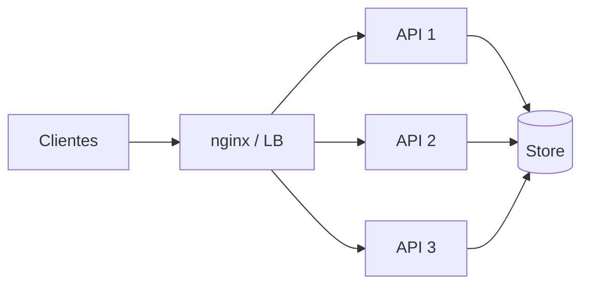
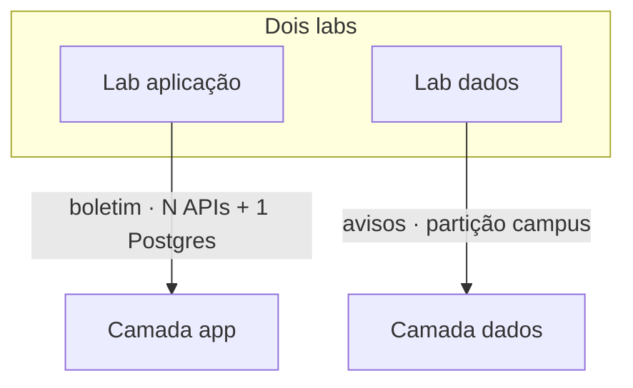

# Teoria — Escalabilidade por camadas

**Módulo:** [05 — Escalabilidade](README.md)  
**Leitura sugerida:** antes dos labs.  
**Objetivo:** modelo mental de **onde** escalar; os labs *medem* app e *particionam* dados.

---

## 1. Por que escala depois de CAP e locks

Nos módulos anteriores você viu:

- **02** — copiar estado (réplicas, lag)  
- **03** — sob partição de rede, C ou A  
- **04** — com N writers, quem serializa  

Este módulo pergunta: *“Chegou o dia do boletim / pico de avisos — **como aumento capacidade**?”*

Resposta curta: **em camadas**. Escalar só a aplicação ou só o banco costuma **mover o gargalo**.

**Mesmo portal, dois fluxos:**

| Fluxo | Pressão | Técnica típica |
|-------|---------|----------------|
| Boletim (`GET`) | Leitura | N APIs → depois réplica (02) / cache (07) |
| Avisos (`POST`) | Escrita | Partição por chave (lab dados) |

Referência: Xu — *System Design Interview*; Ford et al. — *The Hard Parts*.

---

## 2. Fundamentos: vertical × horizontal

| | Vertical | Horizontal |
|--|----------|------------|
| Ideia | Máquina maior (CPU/RAM) | Mais nós / instâncias |
| Prós | Simples no início | Cresce com a demanda |
| Contras | Teto caro; SPOF | Coordenação, rede, estado |

**Throughput** ≈ quantas operações por segundo (RPS).  
**Latência** ≈ tempo por operação (olhe **p50** e **p99**, não só a média).

> Intuição de Amdahl: se uma parte do trabalho é **serial** (um primary, um lock global, um hot shard), adicionar nós **não** lineariza o ganho.

Antes de “subir mais API”, confira **pool de conexões** e limites do store — às vezes o teto já é o banco com 1 réplica de app.

---

## 3. Camada de aplicação

Serviços (quase) **stateless** atrás de um **balanceador**:



| Técnica | Efeito |
|---------|--------|
| N réplicas da API | Mais CPU/concorrência de request |
| LB round-robin | Espalha carga (worker lento piora p99) |
| Health / depleção do upstream | Tira nó doente do LB — [06](../06-falhas-timeout/) |
| Filas / workers ([01](../01-comunicacao/)) | Desacopla pico de aceite vs processamento |

**Limites:** sessão sticky sem necessidade; **um** banco; lock global ([04](../04-coordenacao-locks/)).

Lab: [tutorial-escala-aplicacao.md](tutorial-escala-aplicacao.md) (`WORK_MS` = CPU sintética; `DB_SLOTS` = teto didático do store).

---

## 4. O gargalo se move

1. 1 API saturada → sobe para 3 → RPS sobe.  
2. 3 APIs + store no limite (conexões/CPU/pool) → RPS **estanca**.  
3. O problema **não sumiu** — mudou de **camada**.

```text
Camada app OK ──► gargalo no store ──► precisa escala de DADOS
     ▲                                      │
     └──────── medir RPS / p99 ─────────────┘
```

No lab, o Exp. `aproximar-teto` **simula** o passo 2 com `DB_SLOTS` (não é stress pleno de CPU do Postgres).

---

## 5. Camada de dados / armazenamento

Duas famílias (não misture):

| Família | Técnica | O que escala | Preço |
|---------|---------|--------------|-------|
| **Leitura** | Réplicas / secondaries ([02](../02-replicacao/)) | Consultas | Stale / eventual ([03](../03-consistencia-cap/)) |
| **Escrita / isolamento** | Partição / shard por chave | Writes independentes | Fan-out, sem ACID global fácil, rebalance se a key mudar |

**Hot key:** muita carga na mesma chave (um campus, uma disciplina) — o shard vira o novo primary único. Ponte [04](../04-coordenacao-locks/) cenário hot key.

**Shard key ruim** → hot shard, queries cross-shard, migração cara. Escolha a chave pela **unidade de isolamento** (campus, tenant), não pelo que “parece equilibrado” no dia 1.

Lab: [tutorial-escala-dados.md](tutorial-escala-dados.md) — partição por `campus_id` (dois Mongo + router).

> Réplica de leitura **não** é refeita do zero neste lab: use o que você mediu no 02. Aqui o foco novo é **particionar**.

---

## 6. CAP e coordenação na escala

| Decisão de escala | Ligação |
|-------------------|---------|
| Ler na réplica no boletim | Eventual / stale possível (AP-ish na leitura) |
| Partir dados por campus | Cada shard local; **sem** transação global barata |
| Lock Redis na última vaga | Serializa — **inimigo** de escala de escrita no pico |

**Partição de dados** ≠ **partição de rede** do CAP (03). Uma é desenho; a outra é falha.

---

## 7. Combinar camadas (evolução típica)

```text
1. Monólito + 1 banco
2. N APIs + 1 banco          ← lab aplicação
3. N APIs + réplica leitura  ← módulo 02 (fluxo boletim)
4. Particionar por chave     ← lab dados (fluxo avisos)
5. Cache                     ← módulo 07
```

Não pule para (4) se o problema é CPU da API. Não fique só em (2) se o primary derrete.  
Partição **prematura** dói (ops, fan-out, key errada); partição **tarde** demais também (primary único no fogo).

---

## 8. Fora deste módulo

| Tema | Módulo |
|------|--------|
| Timeout, retry, circuit breaker, health | [06](../06-falhas-timeout/) |
| Cache / invalidação | [07](../07-cache-distribuido/) |
| Mongo Shard Cluster / Citus oficiais | Operação avançada — fora do lab |

---

## 9. Mapa → labs



**Próximo:** [06 — Falhas/timeout](../06-falhas-timeout/) — o que fazer quando um nó da camada app fica lento ou cai.

---

## Referências (`books/`)

- Xu — load balancing, sharding, métricas  
- *Hard Parts* / *Fundamentals* — trade-offs  
- van Steen & Tanenbaum — distribuição de carga  
- *migrating-to-microservice-databases* — dados como eixo de escala
