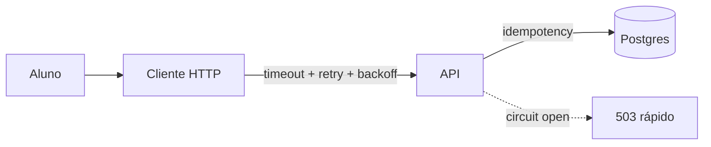

# 06 — Falhas, timeout e retries

**Conceito central:** falha parcial é o modo normal; **timeout**, **retry** e **idempotência** definem se o sistema degrada com controle ou satura / duplica efeitos.  
**Domínio âncora:** portal acadêmico — **matrícula** (escrita crítica) e **avisos** (escrita mais tolerante a retry).  
**Stack:** Python 3 · Docker Compose · PostgreSQL · MongoDB

**O que você vai *ver* hoje:** no lab Postgres, retry sem chave deixa **1 matrícula** e **várias linhas de auditoria** (cada uma ≈ um e-mail “matrícula confirmada”). Unique salva o negócio; não salva o side effect.

Pré-requisitos: [00 — Ambiente Docker](../00-ambiente-docker/). Ideal: [01](../01-comunicacao/) (falha de worker) · [03](../03-consistencia-cap/) (CAP / 503 honesto).  
Apoio: [glossario.md](glossario.md) · [troubleshooting.md](troubleshooting.md)

> **CAP não se repete aqui.** O [03](../03-consistencia-cap/) cobre partição e CP/AP. Este módulo ensina **como a borda reage** à falha (timeout/retry/CB) e o impacto em **consistência percebida** (efeito colateral duplicado vs 503).

> **Gabarito de decisões:** [decisoes-gabarito.md](decisoes-gabarito.md) — abra **só depois** de tentar o workshop em [decisoes.md](decisoes.md) (sozinho ou em grupo).

---

## Objetivos de aprendizado

Ao final deste módulo, você deve ser capaz de:

1. **Explicar** falha parcial e a incerteza “não sei se a operação commitou”.
2. **Distinguir** timeout de cliente vs servidor e o risco de falso negativo.
3. **Aplicar** retry com limite + **backoff/jitter** — e saber quando **não** retryar (ex.: 409).
4. **Usar** idempotência (chave / unique / upsert) para tornar retry seguro.
5. **Descrever** circuit breaker mínimo (fechado / aberto / meio-aberto com **sonda**) e por que evita cascata.
6. **Relacionar** os padrões a **Postgres** e **MongoDB** nos labs.
7. **Decidir** política de resiliência em cenários do portal (ponte com CAP do 03).
8. **Experimentar** os dois labs e justificar trade-offs.
9. **Relacionar** retry em massa à **amplificação de carga** (ponte [05](../05-escalabilidade/)).

> Meta: *“Sob falha, o que eu garanto ao usuário — e o que o retry pode estragar?”*

---

## Caminhos de estudo

### Caminho mínimo (~4–5 h; +1–2 h na 1ª vez com Docker frio)

Fecha objetivos **1–4** e **7** (parcial) com Postgres. Objetivo **5** (CB): só o modelo mental na [teoria §5](teoria.md) — lab do CB fica no caminho completo.

1. [teoria.md](teoria.md) §1–6 e §3.1 (amplificação)  
2. [tutorial-timeout-postgres.md](tutorial-timeout-postgres.md) (Partes A–C, Exp. 1–4)  
3. [decisoes.md](decisoes.md) — cenários **1** e **2**  
4. Checklist **mínimo** / critério de pronto abaixo  

**Pré-requisitos no host:** `curl`, `python3`, Docker Compose ([00](../00-ambiente-docker/)).

### Caminho completo (~8–10 h; +1–2 h na 1ª vez) — recomendado

| Ordem | Material | Tempo | Para quê |
|-------|----------|-------|----------|
| 1 | [teoria.md](teoria.md) | ~45 min | Modelo mental |
| 2 | [tutorial-timeout-postgres.md](tutorial-timeout-postgres.md) | ~2 h | Timeout · retry · idempotência · CB · amplificação |
| 3 | [tutorial-timeout-mongodb.md](tutorial-timeout-mongodb.md) | ~1,5–2 h | Mesmo padrão em documento |
| 4 | [decisoes.md](decisoes.md) | ~45 min | Trade-offs |
| 5 | [tecnologias-e-escolhas.md](tecnologias-e-escolhas.md) + releia §6–9 teoria | ~20 min | Consolidar |

Cada tutorial: **A** tecnologia → **B** contexto → **C** lab.

---

## Arco narrativo

1. **Dor** — dia da matrícula: o store atrasa; clientes **sem timeout** (ou timeout enorme) seguram conexões.  
2. **Alívio frágil** — timeout + retry → menos hang, mas **efeitos colaterais** (auditoria / e-mails) se repetem.  
3. **Correção** — `Idempotency-Key` + unique/upsert (negócio + resposta estável).  
4. **Proteção** — circuit breaker quando a taxa de erro sobe.  
5. **Contraste** — Mongo: sem índice, o **próprio documento** duplica.  
6. **Fechamento** — [decisoes.md](decisoes.md) + ponte CAP ([03](../03-consistencia-cap/)) e carga ([05](../05-escalabilidade/)).



---

## Mapa dos 2 labs

| Lab | Porta API | Store | Pergunta que responde |
|-----|-----------|-------|------------------------|
| [lab-timeout-postgres](lab-timeout-postgres/) | **8092** | Postgres **5440** | Retry sem chave: matrícula=1 e auditoria>1? Com chave, replay? |
| [lab-timeout-mongodb](lab-timeout-mongodb/) | **8093** | Mongo **27121** | Sem unique: N docs? Com unique/upsert: 1? |

Compose **separados**. Ao trocar:

```bash
cd sistemas-distribuidos/06-falhas-timeout/lab-timeout-postgres && docker compose down -v
cd ../lab-timeout-mongodb && ./scripts/up.sh
```

---

## Checklist

### Mínimo

- [ ] Li teoria §1–6  
- [ ] Lab Postgres Exp. 1–4  
- [ ] Anotei: unique → 1 matrícula; retry → auditoria (≈ e-mails) **> 1** sem chave  
- [ ] Li teoria §5 (CB em conceito; lab no completo)  
- [ ] Cenários 1–2 em [decisoes.md](decisoes.md)  

### Completo

- [ ] Exp. 5 circuit breaker (incl. meio-aberto / sonda)  
- [ ] Exp. 6 amplificação (`amplificar-carga.sh`, com e sem jitter)  
- [ ] Tutorial Mongo (Exp. 1–2; WC = revisão opcional do 03)  
- [ ] Todos os cenários de decisão  
- [ ] [tecnologias-e-escolhas.md](tecnologias-e-escolhas.md)  

---

## Critério de “pronto”

**Mínimo**

- [ ] Explico em uma frase: timeout ≠ “não commitou”.  
- [ ] Distingo **unique no efeito** vs **Idempotency-Key** (resposta + side effects).  
- [ ] No lab Postgres: vi **deste aluno** `matriculas=1` e `auditoria>1` (Exp. 3) e `idempotent_replay` no 4b.  
- [ ] Em **dois** cenários de [decisoes.md](decisoes.md), justifico timeout/retry/idempotência.

**Completo** (soma ao mínimo)

- [ ] CB: sei o que muda com circuito **aberto** vs **meio-aberto** (1 sonda).  
- [ ] Vi `requests >> N` e olhei `wall_clock` / `p95` no Exp. 6 (amplificação).  
- [ ] Mongo: unique=0 duplica docs; unique=1 deduplica.  
- [ ] Relaciono retry em massa a **mais carga** no gargalo ([05](../05-escalabilidade/)).

---

## Bibliografia de apoio

Use os **títulos** na biblioteca / material do curso (não dependem de pasta local no clone).

| Fonte | Uso neste módulo |
|-------|------------------|
| van Steen & Tanenbaum, *Distributed Systems* | Falha parcial, fault tolerance |
| Xu, *System Design Interview* | Timeout, retry, CB, idempotency keys |
| Ford et al., *Software Architecture: The Hard Parts* | Trade-offs de resiliência |
| Richards & Ford, *Fundamentals of Software Architecture* | Acoplamento sob falha |

Ponte CAP: [03 — Consistência/CAP](../03-consistencia-cap/).
