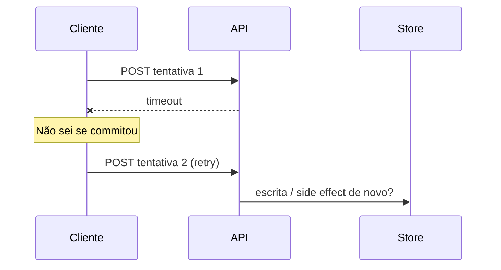

# Teoria — Falhas, timeout e retries

**Módulo:** [06 — Falhas/timeout](README.md)  
Termos: [glossario.md](glossario.md).  
CAP detalhado: [03 teoria](../03-consistencia-cap/teoria.md) — aqui só a **ponte**.

---

## 1. Falha parcial é o modo normal

Em sistema com vários nós, o cenário típico **não** é “tudo caiu”. É: um serviço atrasa, um link oscila, um commit demora — e o cliente **não sabe** se a operação no servidor já terminou.

Isso gera a pergunta central do módulo:

> O `POST` deu timeout. Devo **retryar**? Se sim, posso **gerar o mesmo efeito duas vezes** (matrícula, e-mail, cobrança, linha de auditoria)?

Tanenbaum/van Steen tratam falhas (crash, omissão, timing) como parte do modelo — não como exceção rara.

---

## 2. Timeout: curto demais vs longo demais

| Timeout | Risco |
|---------|--------|
| **Curto demais** | Falso negativo: operação **já commitou**, cliente acha que falhou e retrya (ou mostra erro injusto). |
| **Longo demais** | Threads/conexões **presas**; sob carga, o portal satura e “tudo fica lento”. |
| **Ausente** | Cliente pode esperar “para sempre” — pior para UX e para o pool de conexões. |

Há timeout no **cliente HTTP**, no **servidor de aplicação** e no **banco** (`statement_timeout`). Eles devem formar um **orçamento** (cliente ≥ um pouco maior que o pior caminho esperado, sem ser infinito).

### 2.1 Orçamento de latência (números do lab)

Regra didática: cada camada “gasta” parte do prazo; a de cima precisa ser **um pouco maior** que a soma do caminho saudável abaixo.

| Camada | Exemplo no lab | Papel |
|--------|----------------|--------|
| Cliente (`curl --max-time`) | Exp. 2/3: **1 s** (provoca falso negativo); saudável: **3–5 s** | Não prender a UI |
| API (`STORE_HOLD_MS`) | **2–5 s** injetados | Simula store lento |
| Banco | `statement_timeout` (não é o foco do experimento) | Limita query individual |

Anti-padrão do Exp. 3: cliente **1 s** + hold **3 s** → timeout certo, commit pode seguir no servidor. Em produção, alinhe o orçamento; aqui o descompasso é **proposital** para ver o falso negativo.

**Deadline propagation (lab):** o cliente envia `X-Deadline-Ms`; se `STORE_HOLD_MS` > deadline, a API responde **504 rápido** e libera o worker (`provar-deadline.sh`). Timeout só na borda sem deadline interno ainda deixa workers ocupados — o Exp. 2 mostra isso.

No lab, `statement_timeout` do Postgres **não** é o foco: o atraso é injetado na API (`STORE_HOLD_MS`). Em produção os dois existem; aqui isolamos a **política do cliente** (+ deadline opcional).

---

## 3. Retry: quando ajuda e quando piora

Retry faz sentido para erros **transientes** (rede, 503, timeout). Em geral **não** retryar:

- **400 / validação** — a mensagem não muda sozinha  
- **409 conflito de negócio** (“sem vagas” / “já matriculado”) — retry cego não cria vaga  
- **401 / 403** — credencial  

Os scripts do lab **param** em HTTP 409 e só repetem em timeout / 503 — alinhado a esta regra.

Boas práticas (Xu / Hard Parts):

1. **Limite** de tentativas (ex.: 3)  
2. **Backoff** (espera crescente) + **jitter** (aleatoriedade para não sincronizar thundering herd)  
3. Só em métodos/operações **seguras de repetir** — ou torne-as idempotentes  

Os scripts do lab usam backoff **0,2 → 0,5 → 1,0 s** (com jitter opcional) entre tentativas — o mesmo padrão em glossário e tutoriais.

### 3.1 Amplificação de carga (ponte com o 05)

Cada cliente que faz timeout e retry **multiplica** o trabalho no gargalo (API/store). Com centenas de alunos no mesmo segundo, retry sem jitter vira **thundering herd**: a recuperação fica mais difícil.

No caminho completo, o Exp. 6 (`amplificar-carga.sh`) deixa isso **visível**: `stats.requests >> N`, `wall_clock_lote_s` e `latencia` (p50/p95/max) em `/admin/config`; compare `JITTER=1` vs `JITTER=0`.

Resiliência (este módulo) e **escala** ([05](../05-escalabilidade/)) se encontram aqui: timeout/CB protegem capacidade compartilhada; retry sem limite a consome.

---

## 4. Idempotência: a condição para retry seguro

Operação **idempotente:** aplicá-la N vezes com o mesmo pedido produz o **mesmo efeito** que uma vez.

Padrões práticos:

| Técnica | Exemplo no portal | O que cobre |
|---------|-------------------|-------------|
| Chave de idempotência | Header `Idempotency-Key`; servidor guarda resposta | Mesmo HTTP 201 + evita reexecutar side effects |
| Unique constraint | `UNIQUE (disciplina_id, aluno_id)` | No máximo **uma** matrícula |
| Upsert | Mongo `updateOne(..., upsert=True)` | No máximo **um** aviso |

**Unique ≠ idempotência completa.** Unique salva o invariante de negócio; retries ainda podem disparar **auditoria, e-mail, métricas** (no lab: `auditoria_tentativas` ≈ e-mails “matrícula confirmada”).

Em produção, chaves de idempotência precisam de **TTL/limpeza**, escopo (rota + método + body) e rejeição se a mesma key chegar com **corpo diferente** (lab: HTTP **422** + `provar-idempotency-mismatch.sh`; TTL: `provar-idempotency-ttl.sh`). Detalhe em [tecnologias-e-escolhas.md](tecnologias-e-escolhas.md).

---

## 5. Circuit breaker (visão mínima)

Quando o store/API falha em sequência, continuar a martelar **piora** a sobrecarga.

Estados didáticos:

| Estado | Comportamento |
|--------|----------------|
| **Fechado** | Tráfego normal |
| **Aberto** | Falha **rápida** (503) sem chamar o store |
| **Meio-aberto** | Após a janela (`CB_OPEN_SEC`), deixa passar **1 sonda**; sucesso fecha, falha reabre |

Falhas contam numa **janela deslizante** (`CB_WINDOW_SEC`, padrão 60 s) — não é contador eterno. O lab ainda é CB **mínimo** (1 sonda no meio-aberto), não biblioteca de produção.

Não é magia: é **proteger o restante do sistema** (e dar tempo ao dependente se recuperar).

**Bulkhead (isolamento):** além do CB, separar pools/workers por rota (ex.: boletim lento não esgota threads do login). Não há lab dedicado; aparece em [decisoes.md](decisoes.md) cenário 4. Analogia mínima: o `ThreadingHTTPServer` do lab compartilha workers entre rotas — uma rota lenta contagia as outras.

---

## 6. Ponte com CAP (módulo 03)

| Situação | Leitura CAP / consistência |
|----------|----------------------------|
| Matrícula: 503 se store indisponível / CB aberto | Tendência **CP** na borda: preferir **não mentir “ok”** |
| Retry sem idempotência | Pode **violar** a intenção de “um efeito” mesmo com DB “consistente” no unique |
| Feed de avisos com retry + upsert | Aceita at-least-once na entrega; **efeito** único |
| Timeout no meio do commit sync (03) | Cliente deve tratar como **incerto** — retry só com chave |

O lab 03 mostrou **recusar escrita** sob partição sync. Aqui a mesma honestidade na **política de cliente**: timeout ≠ “pode retryar cego”.

---

## 7. Postgres no lab

- `STORE_HOLD_MS` / delay admin — simula store lento  
- `UNIQUE (disciplina, aluno)` + tabela de `idempotency_keys`  
- `auditoria_tentativas` — side effect **não** deduplicado (autocommit **antes** do commit da matrícula: anti-padrão proposital; em produção use outbox **após** commit)  
- Circuit breaker: janela `CB_WINDOW_SEC` + meio-aberto com **1 sonda**  
- `X-Deadline-Ms` — aborta se hold > deadline (504; `provar-deadline.sh`)  
- `stats.requests` + `latencia` (p50/p95/max) — Exp. 6 (amplificação)  
- `IDEM_TTL_SEC` / `idem_expired` — TTL da chave (demo `provar-idempotency-ttl.sh`)  

---

## 8. MongoDB no lab

- Aviso com `aviso_id` estável + índice único (ou upsert)  
- **Índice unique** = invariante (“no máximo um doc com este id”); **upsert** = padrão de escrita que evita insert cego  
- Sem unique: retry → **documentos duplicados**  
- `writeConcern` em **um** nó: pouco observável — use só como **revisão mental** do 03 (majority sob partição), fora do caminho obrigatório  

---

## 9. O que este módulo não é

| Tema | Onde está |
|------|-----------|
| Partição + CAP completo | [03](../03-consistencia-cap/) |
| Locks / overbooking multi-API | [04](../04-coordenacao-locks/) |
| Escala RPS / shards | [05](../05-escalabilidade/) — aqui a **ponte** retry→carga (Exp. 6) |
| Cache / stale | [07](../07-cache-distribuido/) |
| Tracing / métricas de plataforma | [09](../09-observabilidade/) (planejado) |

---

## Leitura sugerida nos livros

1. van Steen & Tanenbaum — fault tolerance / falhas  
2. Xu — timeout, retry, circuit breaker, idempotency keys  
3. Hard Parts — resiliência e trade-offs entre serviços  

Não precisa ler os livros inteiros: use-os para **ancorar** o vocabulário que os labs tornam visível.
