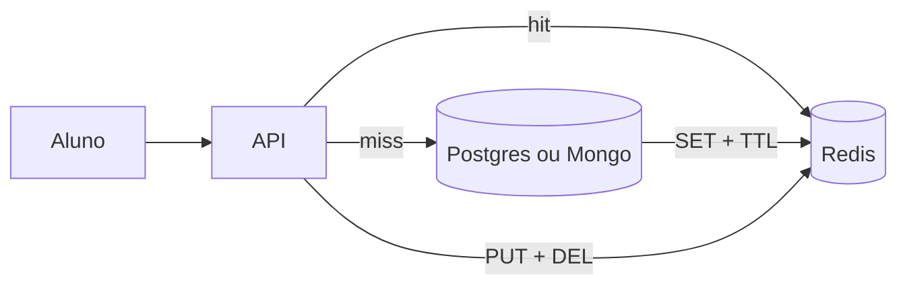

# 07 — Cache distribuído

**Conceito central:** acelerar leituras com cópia rápida — e pagar em **consistência** (stale) até invalidar ou expirar o TTL.  
**Domínio âncora:** portal acadêmico — **boletim** (invalidate) vs **feed de avisos** (TTL).  
**Stack:** Python 3 · Docker Compose · PostgreSQL · MongoDB · Redis

**O que você vai *ver* hoje:** com `INVALIDATE_ON_WRITE=0`, o `PUT` da nota **não** limpa o Redis — o próximo `GET` ainda devolve a nota antiga (`cache: hit`, `servido_de: redis`).

Pré-requisitos: [00 — Ambiente Docker](../00-ambiente-docker/). Ideal: [03](../03-consistencia-cap/) (CAP) · [05](../05-escalabilidade/) (gargalo no store).  
Apoio: [glossario.md](glossario.md) · [troubleshooting.md](troubleshooting.md) · [Linux e Windows](../ferramentas/linux-e-windows.md)

> **CAP não se repete do zero.** O [03](../03-consistencia-cap/) cobre o teorema sob partição. Aqui falamos de **prioridade na leitura** (responder rápido vs dado fresco) — analogia, não o teorema; ver [teoria §4](teoria.md).

> **Gabarito de decisões:** [decisoes-gabarito.md](decisoes-gabarito.md) — abra **só depois** de tentar [decisoes.md](decisoes.md).

---

## Objetivos de aprendizado

Ao final deste módulo, você deve ser capaz de:

1. **Explicar** cache local vs **compartilhado** (dict ≠ Redis) — *prova prática: lab Mongo (caminho completo)*; *conceito: teoria §2*.
2. **Descrever** cache-aside e o papel de hit/miss/TTL.
3. **Observar** ganho de latência **e** queda de `store_reads` (ponte [05](../05-escalabilidade/)) — e o custo: **stale read**.
4. **Comparar** TTL vs invalidação sob escrita.
5. **Relacionar** política de leitura a prioridade “responder rápido” vs “dado fresco” (analogia CAP; não o teorema).
6. **Identificar** stampede no expire e mitigações (lock; jitter no caminho completo).
7. **Experimentar** Postgres+Redis e Mongo+Redis (2 APIs).
8. **Decidir** quando cache ajuda (boletim/avisos) e quando atrapalha (vagas).

> Meta: *“Neste fluxo, aceito stale? Por quanto tempo? Quem invalida?”*

---

## Caminhos de estudo

### Caminho mínimo (~4–5 h)

Fecha objetivos **2–5** e **8** (parcial) + conceito do **1** (teoria §2). A **prova** local vs Redis (obj. 1) e stampede/jitter (obj. 6–7) ficam no completo.

1. [teoria.md](teoria.md) §1–5 e §7 (o que não cachear)  
2. [tutorial-cache-postgres.md](tutorial-cache-postgres.md) (Partes A–C, Exp. 1–4)  
3. [decisoes.md](decisoes.md) — cenários **1** e **2**  
4. Checklist **mínimo** abaixo  

**Pré-requisitos no host:** Docker Compose ([00](../00-ambiente-docker/)). Windows: `curl.exe` e `.\lab.ps1` — [Linux e Windows](../ferramentas/linux-e-windows.md).

### Caminho completo (~8–10 h) — recomendado

| Ordem | Material | Tempo | Para quê |
|-------|----------|-------|----------|
| 1 | [teoria.md](teoria.md) | ~40 min | Modelo mental (+ §6, §9) |
| 2 | [tutorial-cache-postgres.md](tutorial-cache-postgres.md) | ~2 h | Hit/miss · stale · invalidate · stampede · jitter · SPOF Redis (opc.) |
| 3 | [tutorial-cache-mongodb.md](tutorial-cache-mongodb.md) | ~1,5–2 h | **Local vs Redis** · TTL · invalidate |
| 4 | [decisoes.md](decisoes.md) | ~45 min | Trade-offs |
| 5 | [tecnologias-e-escolhas.md](tecnologias-e-escolhas.md) + releia teoria §8–11 | ~20 min | Consolidar |

Cada tutorial: **A** tecnologia → **B** contexto → **C** lab.

---

## Arco narrativo

1. **Dor** — dia do boletim; store lento sob leitura repetida ([05](../05-escalabilidade/)).  
2. **Alívio** — Redis cache-aside; latência e `store_reads` caem.  
3. **Nova dor** — nota atualizada, aluno ainda vê valor antigo (**stale**).  
4. **Remédio** — invalidate-on-write (read-your-writes).  
5. **Distribuído** — duas APIs: dict local diverge; Redis compartilha.  
6. **Contraste** — avisos: TTL “bom o bastante”.  
7. **Armadilha** — expire no pico → stampede.  
8. **Fechamento** — [decisoes.md](decisoes.md).



---

## Mapa dos 2 labs

| Lab | Portas | Store | Pergunta que responde |
|-----|--------|-------|------------------------|
| [lab-cache-postgres](lab-cache-postgres/) | API **8094** · PG **5441** · Redis **6381** | Postgres | Hit/miss, stale, invalidate, stampede? |
| [lab-cache-mongodb](lab-cache-mongodb/) | API **8095/8096** · Mongo **27122** · Redis **6382** | Mongo | Local ≠ compartilhado? TTL vs invalidate? |

Compose **separados**. Ao trocar:

```bash
cd sistemas-distribuidos/07-cache-distribuido/lab-cache-postgres && docker compose down -v
cd ../lab-cache-mongodb && ./scripts/up.sh
```

---

## Checklist

### Mínimo

- [ ] Li teoria §1–5 e §7  
- [ ] Lab Postgres Exp. 1–4  
- [ ] Anotei: `store_reads` cai com Redis; sem invalidate → stale; com invalidate → miss + valor novo  
- [ ] Olhei `servido_de` (redis vs postgres) — não confundi com `fonte_dados`  
- [ ] Cenários 1–2 em [decisoes.md](decisoes.md)  

### Completo

- [ ] Exp. 5 stampede (`store_reads_na_rajada`) ± lock; Exp. 5b jitter; Exp. 5c SPOF Redis (opcional)  
- [ ] Tutorial Mongo: **primeiro** local vs Redis; depois TTL/invalidate  
- [ ] Todos os cenários de decisão  
- [ ] [tecnologias-e-escolhas.md](tecnologias-e-escolhas.md)  

---

## Critério de “pronto”

**Mínimo**

- [ ] Distingo TTL e invalidação.  
- [ ] Explico (conceito) local vs Redis; sei que a prova prática é o lab Mongo.  
- [ ] No lab Postgres: vi `cache: hit` + `servido_de: redis` com nota **antiga** (Exp. 3) e miss após invalidate (Exp. 4).  
- [ ] Relaciono queda de `store_reads` à escala do store ([05](../05-escalabilidade/)).  
- [ ] Em **dois** cenários de [decisoes.md](decisoes.md), justifico política de cache.

**Completo** (soma ao mínimo)

- [ ] Stampede: `store_reads_na_rajada` alto sem lock; menor com lock.  
- [ ] Mongo: api2 dá **hit** no Redis e **miss** no local.  
- [ ] Sei que jitter **espalha** expires e lock **protege** o miss quente (combine no pico).  
- [ ] (Opcional) Vi 503 com Redis parado (`provar-redis-spof.sh`).  
- [ ] Separo analogia CAP (política de leitura) do teorema do [03](../03-consistencia-cap/).

---

## Bibliografia de apoio

Use os **títulos** na biblioteca / material do curso (não dependem de pasta local no clone).

| Fonte | Uso neste módulo |
|-------|------------------|
| Xu, *System Design Interview* | Cache como camada de escala; trade-offs |
| van Steen & Tanenbaum, *Distributed Systems* | Cópias, consistência, stale |
| Ford et al., *Software Architecture: The Hard Parts* | Performance × consistência |
| Richards & Ford, *Fundamentals of Software Architecture* | Onde colocar o cache |

Ponte CAP: [03 — Consistência/CAP](../03-consistencia-cap/).  
**Próximo módulo →** [08 — Armazenamento de arquivos](../08-armazenamento-arquivos/)
