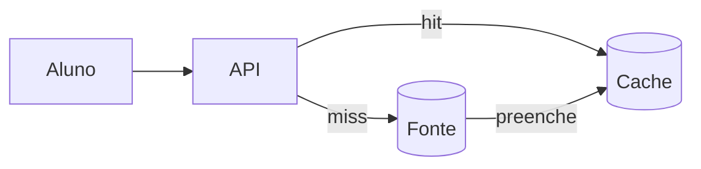
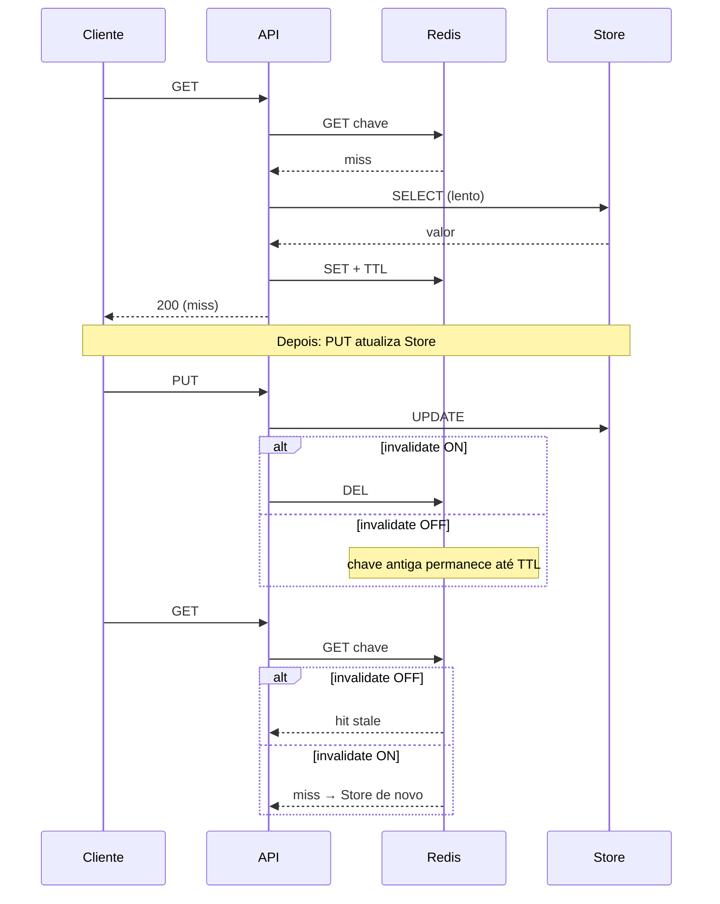

# Teoria — Cache distribuído

**Módulo:** [07 — Cache distribuído](README.md)  
Termos: [glossario.md](glossario.md).  
CAP detalhado: [03 teoria](../03-consistencia-cap/teoria.md) — aqui a **aplicação** na leitura.  
Escala: [05](../05-escalabilidade/) — cache como **terceira camada**.

---

## 1. Por que cache depois de escala

No [módulo 05](../05-escalabilidade/) você viu: escalar só a app **desloca** o gargalo para o banco. No dia do boletim, N APIs ainda martelam o Postgres/Mongo com a **mesma** leitura quente.

Cache responde a pergunta:

> Posso servir uma **cópia rápida** da resposta e poupar a fonte da verdade?

Sim — pagando em **consistência**: a cópia pode ficar **atrasada** (stale) em relação ao store.



Xu (*System Design Interview*) trata cache/CDN como etapa clássica de escala; van Steen/Tanenbaum tratam cópias e consistência como o mesmo núcleo teórico da replicação — o cache é uma **réplica de leitura** com política de expiração/invalidação.

**Ponte com o 05:** no lab, compare `store_reads` com cache `off` vs `redis` no mesmo `benchmark.sh` — menos idas ao store = alívio de **capacidade**, não só latência “bonita”.

---

## 2. Local vs compartilhado

| Tipo | Onde mora | Entre N APIs |
|------|-----------|--------------|
| **Cache local** | Dict / memória do processo | Cada instância tem a **sua** cópia — divergem |
| **Cache distribuído / compartilhado** | Redis (neste módulo) | Todas as APIs veem a **mesma** chave |

No lab Postgres você liga/desliga Redis (e pode testar `local` numa API só). No lab Mongo, **duas APIs** mostram o ponto distribuído: dict local ≠ Redis compartilhado.

> Cache local acelera **um** processo. Cache compartilhado acelera o **cluster** — e concentra um novo ponto de falha/contenção (hot key / Redis como SPOF).

---

## 3. Padrões de leitura/escrita

| Padrão | Ideia | Neste módulo |
|--------|-------|--------------|
| **Cache-aside** (lazy) | App lê cache; no miss, lê store e **preenche** o cache | Labs (padrão principal) |
| **Write-through** | Escreve store **e** cache na mesma operação | Só conceito (+ diagrama abaixo) |
| **Write-behind** | Escreve cache e propaga ao store depois | Fora de escopo ADS |

```text
GET (cache-aside)
  1. GET chave no Redis
  2. hit  → responde (pode estar stale)
  3. miss → lê store (lento) → SET Redis + TTL → responde
```



Na escrita, a decisão crítica é: **invalidar** (`DEL`), **atualizar** o cache (write-through), ou **deixar** o TTL limpar.

```text
Write-through (conceito)     Cache-aside + invalidate (lab)
  PUT → Store + SET cache      PUT → Store + DEL cache
  GET → costuma hit fresco     GET → miss → Store → SET
```

---

## 4. Consistência do cache ≈ analogia CAP na leitura

O [03](../03-consistencia-cap/) falou de CP/AP sob **partição entre réplicas** (teorema CAP: sob P, priorizar C ou A).

**Aqui não há partição forçando a escolha.** A “divergência” é **fonte vs cache**. Usamos linguagem **AP-ish / mais C** só como *analogia de prioridade* na política de leitura — não como “cache é AP”.

| Política de leitura | Intuição (analogia) | Exemplo portal |
|---------------------|---------------------|----------------|
| Sempre na fonte | Prioriza correção; paga latência/carga | Matrícula / vagas |
| Cache + TTL generoso | Prioriza responder rápido; C relaxada (eventual) | Feed de avisos |
| Cache + invalidate-on-write | Aproxima **read-your-writes** após PUT | Boletim após lançar nota |

- **Stale hit** ≈ leitura **eventual** (eco do lag no 02/03).  
- **Invalidar na escrita** ≈ priorizar consistência **percebida** por quem gravou — **não** é linearizabilidade do cluster.  
- **Não cachear** fluxo crítico ≈ recusar o atalho (eco “prefiro custo a mentir”).

> Mito a evitar: “Redis é AP, Postgres é CP”. O **fluxo** (TTL vs invalidate vs bypass) define o trade-off.

---

## 5. TTL vs invalidação

| Estratégia | Prós | Contras |
|------------|------|---------|
| **TTL** só | Simples; auto-limpa | Janela stale até expirar; stampede no expire |
| **Invalidação** no write (`DEL`) | Leitura seguinte vê valor novo | Precisa lembrar de invalidar **todas** as chaves derivadas |
| **TTL + invalidate** | Comum em produção | Duas alavancas para calibrar |

Regra didática do portal:

| Fluxo | Preferência |
|-------|-------------|
| Boletim / nota | Invalidate (ou TTL bem curto) |
| Avisos / cardápio | TTL “bom o bastante” (ex.: 30 s) |
| Vagas / matrícula | **Sem** cache de contagem |

---

## 6. Stampede (thundering herd no miss)

Quando uma chave quente **expira** (ou é invalidada) no pico, muitos `GET` simultâneos fazem **miss** e martelam o store — o cache “protege” até o momento em que todos descobrem que não há cache.

Mitigações mínimas (lab completo):

| Técnica | Ideia | Lab |
|---------|--------|-----|
| **Single-flight / lock curto** | Só **um** miss busca no store; os outros esperam o fill | `provar-stampede.sh` |
| **TTL jitter** | Cada SET usa TTL ± aleatório — expires não sincronizam; **não substitui** single-flight no miss quente | `set-jitter.sh` (Exp. opcional) |
| Soft TTL / stale-while-revalidate | Servir stale enquanto um revalida | Só conceito |

Ponte com [06](../06-falhas-timeout/): retries sincronizados também geram herd — jitter é o mesmo remédio mental.

---

## 7. O que **não** cachear

| Dado | Por quê |
|------|---------|
| Vagas restantes / última vaga | Stale → overbooking ([03](../03-consistencia-cap/), [04](../04-coordenacao-locks/)) |
| Saldo / pagamento | Custo de inconsistência alto |
| Resultado de escrita crítica sem invalidate | UX “salvei e ainda vejo o antigo” |

Cache brilha em **leitura repetida, escrita rara, stale tolerável**.

---

## 8. Postgres vs Mongo neste módulo

| | Lab Postgres | Lab Mongo |
|--|--------------|-----------|
| Domínio | Boletim / nota | Feed de avisos |
| Política didática | Invalidate-on-write (read-your-writes) | TTL generoso (eventual) |
| Extra | Stampede + jitter | Duas APIs: local vs Redis |

O padrão de código (cache-aside) é o **mesmo**; muda o **requisito de negócio** e o que você observa.

---

## 9. Simplificações do lab (anti-padrão consciente)

O lab **isola** um conceito por vez. Em produção você ainda enfrentaria:

| Lab (simples) | Produção (mais difícil) |
|---------------|-------------------------|
| **1 chave** (`boletim:{aluno}` / `avisos:feed`) | Várias chaves derivadas (item + listas + agregados) |
| `DEL` após write | Invalidar o grafo de chaves / tags |
| Lock `SET NX` didático | Libs / single-flight / soft TTL |
| Redis sempre no ar | SPOF: lab opcional `provar-redis-spof.sh`; produção = fallback/CB |
| Sem política de eviction explícita | LRU / maxmemory / cold start |

---

## 10. Ponte com outros módulos

| Módulo | Ligação |
|--------|---------|
| [02](../02-replicacao/) | Stale em réplica ≈ stale em cache |
| [03](../03-consistencia-cap/) | CAP (teorema) vs analogia na política de leitura |
| [05](../05-escalabilidade/) | Terceira camada; `store_reads` / hit rate = capacidade |
| [06](../06-falhas-timeout/) | TTL de **idempotency key** ≠ TTL de **cache de leitura** |
| [09](../09-observabilidade/) (planejado) | Métricas hit/miss, latência p95 |

---

## 11. Frase para levar

> Cache responde rápido porque **pode mentir um pouco**. A pergunta de arquitetura é: *neste fluxo, mentir por quanto tempo — e quem corrige (TTL ou invalidate)?*
