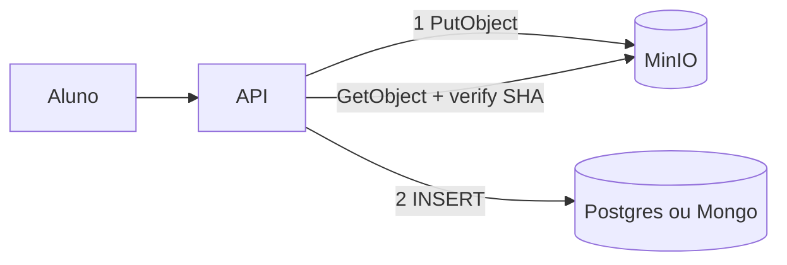

# 08 — Object storage e metadados (arquivos no sistema distribuído)

**Conceito central:** **object storage + metadado** — bytes num serviço compartilhado (MinIO/S3), catálogo no DB; a app **não** guarda arquivo no disco local com N réplicas.  
**Domínio âncora:** portal acadêmico — **entrega de trabalhos** (PDF/zip): upload, listagem, deduplicação, falha no meio do caminho.  
**Stack:** Python 3 · Docker Compose · MinIO (S3) · PostgreSQL · MongoDB  

> **Nome da pasta ≠ escopo.** A pasta chama-se `08-armazenamento-arquivos` (histórico). O módulo é **object storage + metadados** — não DFS clássico (HDFS) nem “só NFS”; NFS/HDFS entram só como contraste.  
> **Portas:** tabela completa em [troubleshooting.md](troubleshooting.md) · resumo no [mapa dos labs](#mapa-dos-2-labs) abaixo.
**O que você vai *ver* hoje:** com `STORAGE_BACKEND=local` e duas APIs, o download na réplica “errada” falha; com MinIO, o mesmo `object_key` funciona nas duas. Com falha após o PutObject, surge **blob órfão** — e a API **não** marca `entregue` se o metadado não gravou. No download, `X-Integridade` confere o SHA-256 (soft; opcional: **409** com `REJECT_ON_INTEGRITY_FAIL=1`).

Pré-requisitos: [00 — Ambiente Docker](../00-ambiente-docker/). Ideal: [02](../02-replicacao/) · [03](../03-consistencia-cap/) · [05](../05-escalabilidade/) (N APIs só com storage compartilhado).  
Apoio: [glossario.md](glossario.md) · [troubleshooting.md](troubleshooting.md)

> **CAP não se repete do zero.** O [03](../03-consistencia-cap/) cobre o teorema sob partição. Aqui: *metadado confirmado × bytes gravados* — [teoria §6](teoria.md).

> **Desacoplamento ≠ durabilidade.** Recreate da API (Exp. 4) mostra que o arquivo não mora no pod; a **prova** de RPO (volume apagado) é o lab Mongo — o conceito está na [teoria §4](teoria.md).

> **Gabarito de decisões:** [decisoes-gabarito.md](decisoes-gabarito.md) — abra **só depois** de tentar [decisoes.md](decisoes.md).

> **Material paralelo (web/upload):** [`infra/storage/`](../../infra/storage/). Este módulo enfatiza o ângulo de **sistema distribuído**.

---

## Objetivos de aprendizado

Ao final deste módulo, você deve ser capaz de:

1. **Explicar** por que disco local da app (`./uploads`) quebra com N réplicas — e por que sticky session não resolve de verdade.
2. **Descrever** object storage (bucket, key, metadados vs bytes) e contrastar com filesystem/NFS em alto nível.
3. **Distinguir** desacoplamento (API recreate, objeto permanece no MinIO) de durabilidade do blob (RPO se o volume do storage some).
4. **Relacionar** metadados (Postgres) vs catálogo + CAS (Mongo) ao **mesmo** portal de entregas.
5. **Demonstrar deduplicação na aplicação** (SHA-256 → um objeto, N registros; MinIO não deduplica sozinho).
6. **Experimentar** falhas: MinIO parado, blob órfão + reconciliação, política “só `entregue` se bytes + metadado ok”; verify de integridade no download.
7. **Decidir** trade-offs: onde colocar bytes, versionar, deduplicar, aceitar perder (RPO); quando **cluster/erasure**, **pre-signed** e **multipart** entram ([teoria §9](teoria.md) — conceito, sem lab).

> Meta: *“Onde mora o arquivo? O que falha no meio do caminho? O que sobrevive se a API cair — e se o volume do storage sumir?”*

---

## Caminhos de estudo

### Caminho mínimo (~4–5 h; +30–45 min se for a 1ª build Docker do módulo)

Fecha objetivos **1–4** e **6–7** (parcial). Dedup/CAS (obj. 5) e o Exp. RPO (volume) ficam no completo — no mínimo você **explica** durabilidade pela [teoria §4](teoria.md) e pelo aviso do Exp. 4.

1. [teoria.md](teoria.md) §1–6 ([glossario](glossario.md) sob demanda; **pule §9** no mínimo)  
2. [tutorial-entrega-postgres.md](tutorial-entrega-postgres.md) (Partes A–C, **Exp. 1–6**)  
3. [decisoes.md](decisoes.md) — cenários **1** e **2**  
4. Checklist **mínimo** abaixo  

**Pré-requisitos no host:** `curl`, `python3`, Docker Compose ([00](../00-ambiente-docker/)).

### Caminho completo (~8–10 h) — recomendado

| Ordem | Material | Tempo | Para quê |
|-------|----------|-------|----------|
| 1 | [teoria.md](teoria.md) | ~50–60 min | Modelo mental (+ §7–11; §9 = cluster / pre-signed / multipart) |
| 2 | [tutorial-entrega-postgres.md](tutorial-entrega-postgres.md) | ~2 h | Local vs objeto · falha · órfão |
| 3 | [tutorial-catalogo-mongodb.md](tutorial-catalogo-mongodb.md) | ~1,5–2 h | Dedup · refcount · RPO · backup/restore |
| 4 | [decisoes.md](decisoes.md) | ~45 min | Trade-offs |
| 5 | [tecnologias-e-escolhas.md](tecnologias-e-escolhas.md) | ~15 min | Consolidar |

Cada tutorial: **A** tecnologia → **B** contexto → **C** lab.

---

## Arco narrativo

1. **Dor** — N APIs + `./uploads` → “arquivo sumiu” (escala de app exige storage compartilhado — [05](../05-escalabilidade/)).  
2. **Alívio** — MinIO + metadado no DB.  
3. **Nova dor** — metade gravou (órfão / mentira).  
4. **Política** — blob → meta → 201; reconciliar órfãos; verify SHA.  
5. **Mesmo portal, novo problema** — turma manda o mesmo PDF → dedup/refcount.  
6. **Perda e proteção** — volume sem backup (RPO); backup/restore como prova positiva leve.  
7. **Além do lab** — cluster/erasure, pre-signed, multipart ([teoria §9](teoria.md)).  
8. **Fechamento** — [decisoes.md](decisoes.md).



---

## Mapa dos 2 labs

| Lab | Portas | Store | Pergunta que responde |
|-----|--------|-------|------------------------|
| [lab-entrega-postgres](lab-entrega-postgres/) | API **8090/8091** · PG **5442** · MinIO **9010/9011** | Postgres + MinIO | Local vs objeto? Órfão? Desacoplamento? |
| [lab-catalogo-mongodb](lab-catalogo-mongodb/) | API **8092** · Mongo **27123** · MinIO **9020/9021** | Mongo + MinIO | Dedup na app? Refcount? RPO do volume? |

> **Um Compose por vez.** Portas conflitam se os dois labs (ou módulos 02–07) estiverem no ar — ver [troubleshooting](troubleshooting.md#portas-deste-módulo).

Compose **separados**. Ao trocar:

```bash
cd sistemas-distribuidos/08-armazenamento-arquivos/lab-entrega-postgres && docker compose down -v
cd ../lab-catalogo-mongodb && ./scripts/up.sh
```

---

## Checklist

### Mínimo

- [ ] Li teoria §1–6  
- [ ] Lab Postgres Exp. 1–6 (inclui órfãos)  
- [ ] Vi local → 404 na outra API; MinIO → 200  
- [ ] Vi objeto sobreviver ao recreate da API (**desacoplamento**)  
- [ ] Vi MinIO parado **sem** marcar `entregue`  
- [ ] Vi órfão + reconciliação  
- [ ] Cenários 1–2 em [decisoes.md](decisoes.md)  

### Completo

- [ ] Tutorial Mongo: dedup + refcount + stale  
- [ ] Exp. perda de volume (RPO) **e** Exp. backup/restore (prova positiva)  
- [ ] (Opcional) Exp. integridade: soft (`X-Integridade: falha`) **e** 409 com `REJECT_ON_INTEGRITY_FAIL=1`  
- [ ] Li [teoria §9](teoria.md) (cluster / pre-signed / multipart — conceito)  
- [ ] Todos os cenários de decisão  
- [ ] [tecnologias-e-escolhas.md](tecnologias-e-escolhas.md)  

---

## Critério de “pronto”

**Mínimo**

- [ ] Explico `./uploads` + N APIs; sei que sticky session é falso remédio.  
- [ ] Distingo bytes (objeto) de metadado (DB).  
- [ ] Distingo desacoplamento (API recreate) de durabilidade do blob (**conceito** na teoria §4 / aviso do Exp. 4 — prova prática do volume no caminho completo).  
- [ ] Política: só `entregue` com blob **e** meta; órfão é recuperável.  
- [ ] Em **dois** cenários de [decisoes.md](decisoes.md), justifico onde guardar e a falha parcial.

**Completo** (soma ao mínimo)

- [ ] Dedup na **app** (CAS); sei que o MinIO do lab não deduplica sozinho.  
- [ ] Refcount: apagar entrega ≠ apagar blob se ainda houver referência.  
- [ ] **Provei** RPO sem backup **e** recuperação com backup/restore do bucket.  
- [ ] (Opcional) Vi soft verify **e** rejeição 409 na integridade.  
- [ ] Nomeio o que o lab **não** monta: cluster/erasure, pre-signed, multipart — e sei *por que* ainda importam.  
- [ ] Separo ponte CAP do teorema do [03](../03-consistencia-cap/).

---

## Bibliografia de apoio

| Fonte | Uso neste módulo |
|-------|------------------|
| van Steen & Tanenbaum, *Distributed Systems* | Replicação, falha, consistência de cópias |
| Tanenbaum & van Steen (2ª, PT) | Cap.7 — leitura em português |
| Xu, *System Design Interview* Vol.1 | Ch.15 (meta vs file); Ch.14 (pre-signed, conceito) |
| Ford et al., *Software Architecture: The Hard Parts* | Consistência entre dois stores (Ch.9) |
| [`infra/storage`](../../infra/storage/) | Fundamentação MinIO/S3 (web) |

Ponte CAP: [03 — Consistência/CAP](../03-consistencia-cap/).  
**Próximo módulo →** [09 — Observabilidade](../09-observabilidade/) (planejado)
