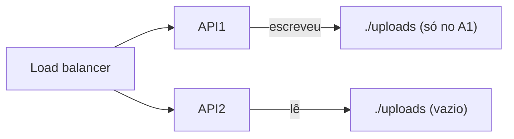
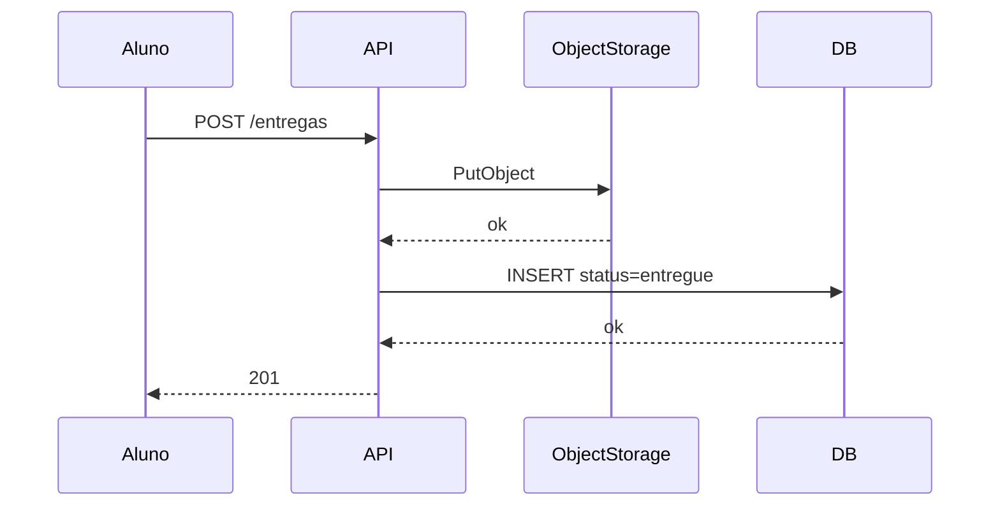
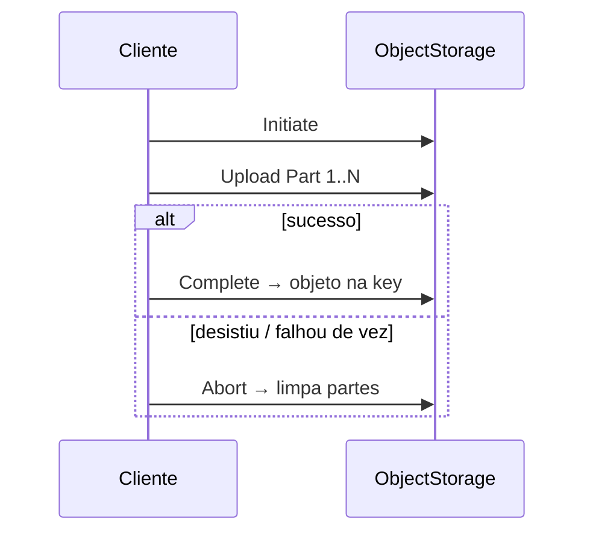

# Teoria — Armazenamento de arquivos distribuídos

**Módulo:** [08 — Object storage e metadados](README.md)  
Termos: [glossario.md](glossario.md).  
CAP detalhado: [03 teoria](../03-consistencia-cap/teoria.md) — aqui só a **ponte** (não mentir “entregue”).  
Replicação de banco: [02](../02-replicacao/) — aqui a ênfase é **onde moram os bytes**.

> **Posicionamento:** este módulo trata de **object storage + metadado de aplicação** (padrão S3/MinIO + DB).  
> **DFS clássico** (NFS, “pasta na rede”, inode/blocos estilo HDFS) aparece só como **contraste** — não é o lab.  
> **Escala ([05](../05-escalabilidade/)):** subir N réplicas da API de upload **só funciona** se os bytes não morarem no disco de cada réplica.

---

## 1. Dor: upload em `./uploads` com N APIs

Portal com load balancer e **3 réplicas** da API. Aluno faz `POST /entregas` na api1; o arquivo vai para `/app/uploads` **dentro do container**. Professor abre o painel; o balanceador manda o `GET` para a api2 — **arquivo não existe**.



Isso **não** é bug de HTTP: é estado local em sistema que já é multi-nó. O mesmo padrão quebra em restart/recreate do pod (ephemeral disk).

**Falso remédio:** sticky session (“mandar o aluno sempre para o mesmo pod”). Escala mal, falha no recreate e esconde o problema — o remédio certo é **storage compartilhado**.

---

## 2. Modelo mental: blob + metadado

Xu (*System Design Interview*, desenho tipo Google Drive) separa:

| Camada | O que guarda | Exemplos |
|--------|--------------|----------|
| **Bytes (blob / objeto)** | Conteúdo do arquivo | MinIO, S3 |
| **Metadado** | Quem enviou, disciplina, nome, hash, chave do objeto, status | Postgres, Mongo |

A API orquestra os dois. O aluno vê “entrega”; por baixo há **dois stores**.

Ordem do caminho feliz (igual ao lab):



Object storage (modelo S3): **bucket** + **key** → objeto. Não é “pasta no servidor web”; é um namespace endereçável compartilhado entre clientes.

**Consistência típica (S3-like, intuição):** depois de um PutObject bem-sucedido, um **GET dessa key** costuma ver o objeto (*read-after-write* da key). Já a **listagem** do bucket (ou um catálogo em outro store) pode atrasar ou divergir — por isso o portal lista entregas pelo **DB**, não por “listar o MinIO”.

---

## 3. Object storage vs disco local vs NFS

| Abordagem | Prós | Contras (ângulo SD) |
|-----------|------|---------------------|
| Disco local da app | Simples | Não escala com N réplicas; some no recreate |
| NFS / volume compartilhado (DFS “parece pasta”) | Várias apps veem o mesmo FS | Locking, latência, SPOF do filer; esconde que é rede |
| Object storage (S3/MinIO) | API estável, desacopla da app, escala horizontal típica | Consistência entre **meta + blob**; semântica ≠ POSIX |

Neste módulo o lab usa **MinIO** (API S3-compatível). Fundamentação web/upload: [`infra/storage`](../../infra/storage/).

---

## 4. Desacoplamento vs durabilidade do objeto

Dois insights diferentes — não misture:

| Ideia | O que o lab mostra | O que *não* prova |
|-------|--------------------|-------------------|
| **Desacoplamento** | Bytes fora da API; recreate da API e o download continua | Que o blob sobrevive se o **MinIO/volume** morrer |
| **Durabilidade do blob** | Exp. perda de volume → metadado fica, arquivo some (RPO ruim); Exp. **backup/restore** → após wipe, download volta | Réplicas/erasure coding reais (fora de escopo) |

```text
“API caiu” ≠ “arquivo sumiu”     → desacoplamento (Exp. recreate)
“Volume MinIO apagado” → arquivo sumiu  → falta de durabilidade/backup (Exp. RPO)
“Havia backup do bucket” → restore → arquivo volta  → proteção positiva leve (lab Mongo)
```

Produção (detalhe): [§9](#9-além-do-lab-cluster-pre-signed-multipart-conceito) — cluster/erasure, backup agendado, multi-AZ. O Exp. de backup/restore é o proxy didático; o lab **não** monta cluster MinIO.

---

## 5. Deduplicação content-addressable (na aplicação)

Mesmo PDF enviado por 40 alunos = 40× o mesmo blob se a key for `aluno/uuid.pdf`.

**Content-addressable (CAS):** key = `sha256(conteúdo)`. Blob **imutável** por construção (mesmo conteúdo → mesma key). Upload idêntico → **PutObject uma vez**; catálogo aponta para a mesma key; **refcount** decide quando apagar.

```text
entrega A ──┐
             ├──► objeto sha256:abc… (1 cópia no MinIO)
entrega B ──┘
```

> No lab, a **dedup é feita pela app** (hash + coleção `blobs`). O MinIO single-node **não** deduplica sozinho — só guarda bytes no endereço que a app pedir.

Trade-off: economiza espaço; complica “apaguei minha entrega” e auditoria.  
**Simplificações:** refcount sem GC atrasado; sem corrida de dois DELETEs concorrentes; sem corrida de dois primeiros uploads do mesmo hash (ambos podem PutObject). Produção costuma “marcar e varrer” e serializar a criação do blob.

---

## 6. Tolerância a falha no caminho de upload

Dois stores ⇒ falha **parcial** possível:

```text
Ordem segura (lab):
  1. PutObject (bytes)
  2. INSERT metadado status=entregue
  3. Responder 201

Se (1) ok e (2) falha → blob órfão (existe no MinIO, ninguém referencia).
Se (2) antes de (1) e (1) falha → metadado mentiroso (“entregue” sem arquivo).
```

Política deste módulo: **só confirma `entregue` se bytes e metadado ok**. Órfãos: job/script de reconciliação (listar bucket × tabela/coleção).

**Ponte [06](../06-falhas-timeout/):** key com UUID + retry após timeout pode **reenviar** PutObject → outro órfão ou segunda entrega. Idempotência = key estável, dedup por hash (lab Mongo) ou Idempotency-Key.

**Ponte CAP ([03](../03-consistencia-cap/)):** sob falha parcial API↔MinIO↔DB, priorizar **não mentir** o status (eco CP no fluxo de confirmação) vs manter listagem disponível com possível atraso (eco AP no catálogo). Não é o teorema de novo — é a **mesma pergunta de produto** em outro domínio.

Hard Parts (consistência entre stores): upload em dois sistemas exige política explícita, não “transaction mágica” entre S3 e Postgres.

---

## 7. Durabilidade e recuperação (RPO/RTO didático)

| Mecanismo | O que protege |
|-----------|----------------|
| Checksum (SHA-256) + **verify no download** | Integridade ponta a ponta (além de dedup) |
| Versionamento de objeto (conceito) | Sobrescrita acidental; auditoria |
| Backup / réplica do volume de objetos | Perda do storage (RPO) |
| Metadado só após blob ok | “Entregue” falso |

**RPO** (quanto dado pode se perder): se o único volume MinIO for apagado sem backup, RPO = tudo desde o último backup (no lab: desde o último `up`).  
**RTO**: quanto tempo até o serviço voltar a servir downloads.

**Disponibilidade de leitura** (CDN / mais réplicas na frente do objeto) ≠ **durabilidade** (o dado ainda existe após falha de disco). São eixos diferentes.

---

## 8. Postgres vs Mongo neste domínio

| | Postgres (lab A) | Mongo (lab B) |
|--|------------------|---------------|
| Papel | Metadado ACID da entrega | Catálogo + índice de hashes / refcount |
| Ênfase | Local vs objeto; órfão; confirmação | Dedup; apagar lógico; listagem |
| Bytes | Sempre MinIO (ou local no contraste) | MinIO content-addressable |

**Mesmo portal acadêmico:** lab A fecha “onde mora o arquivo e como não mentir”; lab B continua com “turma manda o mesmo PDF — espaço e refcount”.

Não é “Mongo = arquivos”. Ambos guardam **metadado**; os bytes ficam no object storage (GridFS seria alternativa — fora do lab principal).

---

## 9. Além do lab: cluster, pre-signed, multipart (conceito)

> **Caminho mínimo:** pode **pular** esta seção — volte no completo / workshop (cenário 7).  
> O Compose usa **um** MinIO single-node. Em produção o mesmo *modelo* (bucket + key + metadado) ganha peças extras. O lab **não** monta isso — mas no completo você precisa **nomear** o que falta.

### 9.1 Cluster MinIO / S3 e durabilidade
| Ideia | Em uma frase |
|-------|----------------|
| **Vários nós** | Bytes e metadados internos do storage espalhados; a API da app ainda fala “PutObject / GetObject”. |
| **Replicação de objeto** | N cópias cheias — sobrevive a falha de disco/nó; mais espaço. |
| **Erasure coding** | Fragmentos com redundância — sobrevive a perda de alguns discos com **menos** espaço que N cópias. |
| **Multi-AZ / multi-DC** | Sobrevive a falha de zona ou região (RPO/RTO de *infra* do storage). |

```text
Lab:  1 MinIO + 1 volume  →  wipe = perda (salvo backup didático)
Prod: cluster + erasure/réplica + backup agendado  →  RPO baixo por desenho
```

**O que o lab prova vs o que só discute:** recreate da API = desacoplamento; wipe + mirror = “backup ajuda”; **não** prova erasure nem quorum de nós.

### 9.2 Pre-signed URL (upload/download direto)

Fluxo do lab: `browser → API → MinIO` (bytes passam pela API).

```text
Pre-signed (conceito):
  1. API autentica o aluno e gera URL temporária assinada (TTL curto)
  2. Browser faz PUT/GET **direto** no MinIO/S3
  3. API só grava metadado depois (callback, complete, ou “confirmei o ETag”)
```

| Quando ajuda | O que muda na falha parcial |
|--------------|-----------------------------|
| PDF grande; API não quer bufferar 200 MB | Blob pode existir **antes** do metadado — mesmo risco de órfão; política de confirmação muda de lugar |
| Offload de CPU/rede da API | “201 entregue” **não** pode sair só porque a URL foi emitida |

Detalhe operacional / exemplos web: [`infra/storage`](../../infra/storage/) · Xu Ch.14.

### 9.3 Multipart upload

Arquivo enorme: cliente divide em **partes**, envia em paralelo ou com retry por parte, depois **CompleteMultipartUpload**.

```text
InitiateMultipartUpload
        │
        ▼
   Upload Part 1..N   ← timeout? reenvia só a parte que falhou
        │
        ▼
CompleteMultipartUpload  →  objeto final visível na key
        │
        └─ (se desistir) AbortMultipartUpload  →  limpa partes órfãs
```



| Sem multipart | Com multipart ||---------------|---------------|
| Um PutObject de 2 GB; timeout = recomeçar tudo | Falhou a parte 7 → reenvia só a 7 |
| API/proxy com limite de body | Limites por parte (ex.: 5–100 MB) |

**Abort:** upload abandonado sem `Complete` deixa partes no storage — em produção há **lifecycle** (expirar multipart incompleto) ou `AbortMultipartUpload` explícito; senão vira lixo cobrado.

No portal: útil para vídeo/zip grande; o PDF “normal” do lab cabe num POST. Multipart + pre-signed costumam andar juntos (URL por parte ou fluxo S3 oficial).

### 9.4 Outros (só nomear)

| Peça | Papel |
|------|--------|
| **CDN** | Cache na borda = **disponibilidade/latência de leitura**, não durabilidade do blob |
| **Versionamento** | Sobrescrita acidental / auditoria (cenário 4) |
| **Criptografia at-rest / KMS** | Disco ou chave gerenciada — compliance; fora do lab |
| **GC atrasado / locks em refcount** | Produção evita corrida no DELETE/Put do mesmo hash |

---

## 10. Ponte com outros módulos

| Módulo | Ligação |
|--------|---------|
| [02](../02-replicacao/) | Replicação/durabilidade **do banco**; aqui, desacoplamento e RPO do **objeto** |
| [03](../03-consistencia-cap/) | Não mentir status sob falha parcial |
| [05](../05-escalabilidade/) | App horizontal exige storage compartilhado |
| [06](../06-falhas-timeout/) | Timeout/retry no PutObject; órfãos se não for idempotente |
| [07](../07-cache-distribuido/) | CDN/cache na frente de objetos (menção) |
| [`infra/storage`](../../infra/storage/) | Como operar MinIO/S3 no dia a dia web |

---

## 11. Frase para levar

> Em sistema multi-nó, o arquivo **não mora na API** — mora num storage compartilhado; a entrega só é verdade quando **bytes e metadado** concordam. Desacoplar da API não substitui **backup/durabilidade** do blob. Cluster, pre-signed e multipart mudam *como* os bytes chegam e *como* sobrevivem — não eliminam a política de metadado.

### Referências (biblioteca do curso)

- van Steen & Tanenbaum, *Distributed Systems* (3rd) — Ch.7 (cópias/consistência), Ch.8 (falha)  
- Tanenbaum & van Steen, *Sistemas Distribuídos* (2ª) — Cap.7  
- Xu, *System Design Interview* Vol.1 — Ch.15 (meta vs file storage), Ch.14 (URLs)  
- Ford et al., *Software Architecture: The Hard Parts* — Ch.9 (dois stores / eventual patterns)
