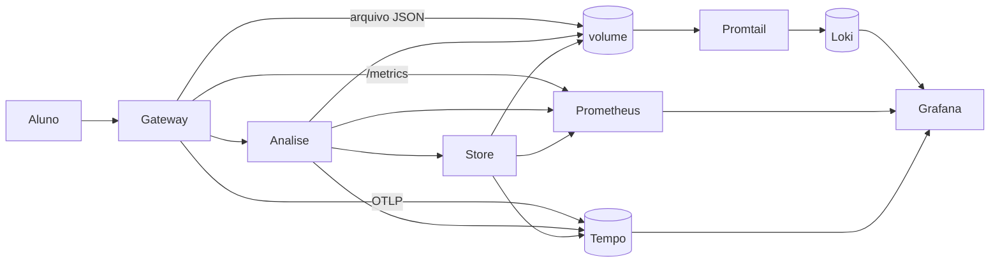

# 09 — Observabilidade (logs, métricas, tracing, APM)

**Conceito central:** em sistema com vários nós, “olhar o log de um processo” não basta — é preciso **agregar**, **correlacionar** e **medir** (métricas + traces) para diagnosticar latência e erro entre serviços.  
**Domínio âncora:** portal acadêmico — aluno envia prova → **gateway** → **análise** → **store** (mesmo arco do [01](../01-comunicacao/)).  
**Stack:** Python 3 · Docker Compose · OpenTelemetry · **Loki** (logs) · **Prometheus** (métricas) · **Tempo** (traces) · **Grafana** (console APM didático)

> **Portas:** [troubleshooting.md](troubleshooting.md) · resumo no [mapa dos labs](#mapa-dos-2-labs).  
> **O que você vai *ver*:** mesmo `trace_id` nos três hops no Loki; delay no miolo = span longo no Tempo; Grafana junta métrica → trace → log.  
> **Recursos:** lab B é mais pesado — reserve ~**4–6 GB RAM** livres; **um Compose por vez**; 1ª build pode levar vários minutos (imagens Grafana/Loki/Tempo).

Pré-requisitos: [00 — Ambiente Docker](../00-ambiente-docker/). Ideal: [01](../01-comunicacao/) · [06](../06-falhas-timeout/).  
Apoio: [glossario.md](glossario.md) · [troubleshooting.md](troubleshooting.md) · [Linux e Windows](../ferramentas/linux-e-windows.md)

> **Gabarito:** [decisoes-gabarito.md](decisoes-gabarito.md) — só **depois** de [decisoes.md](decisoes.md).  
> **Paralelo:** [`devops/08-observabilidade/`](../../devops/08-observabilidade/) — aqui: *expor e diagnosticar*; lá: *operar a plataforma*.

---

## Objetivos de aprendizado

1. **Distinguir** monitoramento de **observabilidade** (inclui “health verde + negócio vermelho”).
2. **Explicar** métricas, logs e traces — pergunta e custo de cada um (não “pilares iguais”).
3. **Justificar** logs **estruturados** + propagação de contexto (`X-Trace-Id` no lab A; `traceparent`/OTel no lab B — mesmo conceito).
4. **Usar Loki** para remontar um request por `trace_id` / `service`.
5. **Ler** um trace (span, duração, erro) e apontar o hop lento/falho.
6. **Aplicar RED** (Rate, Errors, Duration) na prática; **conhecer** Golden Signals / saturação na [teoria §9](teoria.md) (saturação aprofunda no devops).
7. **Navegar** o console APM didático (Grafana): métrica → trace → log.
8. **Experimentar** falha injetada e diagnosticar só com painéis.
9. **Decidir** trade-offs: instrumentação, amostragem, cardinalidade, APM open source vs comercial.

> Meta: *“Onde o tempo foi gasto? Qual hop falhou? Como achar o mesmo request sem SSH?”*

---

## Caminhos de estudo

### Caminho mínimo (~4–5 h; +30–45 min na 1ª build)

Fecha objetivos **1–4**, **8** (parcial) e **9** (parcial). APM completo fica no caminho completo — explique o papel pela [teoria §10](teoria.md).

1. [teoria.md](teoria.md) §1–6 e §9–10  
2. [tutorial-logs-agregados.md](tutorial-logs-agregados.md) (Exp. 1–5)  
3. [decisoes.md](decisoes.md) — cenários **1** e **2**  
4. Checklist **mínimo**  

### Caminho completo (~8–10 h) — recomendado

| Ordem | Material | Tempo | Para quê |
|-------|----------|-------|----------|
| 1 | [teoria.md](teoria.md) | ~50–60 min | Modelo mental |
| 2 | [tutorial-logs-agregados.md](tutorial-logs-agregados.md) | ~1,5–2 h | Logs · Loki |
| 3 | [tutorial-apm-metricas-tracing.md](tutorial-apm-metricas-tracing.md) **núcleo** Exp. 1–4 | ~1,5 h | RED · delay · erro · drill-down |
| 4 | Mesmo tutorial **aprofundamento** Exp. 5–7 (+ sampling OTel) | ~45–60 min | Cardinalidade · sampling · retry/06 |
| 5 | [decisoes.md](decisoes.md) | ~45 min | Trade-offs |
| 6 | [tecnologias-e-escolhas.md](tecnologias-e-escolhas.md) | ~15 min | Consolidar |

> Semana apertada no caminho completo: feche o **núcleo** do lab B (Exp. 1–4); deixe 5–7 para casa ou a próxima aula.

---

## Arco narrativo ↔ experimentos

| Passo da história | Onde praticar |
|-------------------|---------------|
| 1. Dor — ninguém acha o request | Teoria §1 · contexto dos tutoriais |
| 2. Alívio — mesmo `trace_id` | Lab A **Exp. 1** |
| 3. Sem propagação = história quebrada | Lab A **Exp. 2** |
| 4. Erro no miolo + health ainda verde | Lab A **Exp. 3** |
| 5. Log texto vs JSON | Lab A **Exp. 4** |
| 6. SSH vs agregador | Lab A **Exp. 5** |
| 7. “Está piorando?” → RED | Lab B **Exp. 1** |
| 8. Delay → span culpado | Lab B **Exp. 2** |
| 9. Erro → métrica + span ERROR | Lab B **Exp. 3** |
| 10. Drill-down APM | Lab B **Exp. 4** |
| 11. Cardinalidade | Lab B **Exp. 5** (aprofundamento) |
| 12. Amostragem (papel + OTel) | Lab B **Exp. 6a/6b** |
| 13. Retry no trace (ponte 06) | Lab B **Exp. 7** |
| 14. Fechamento | [decisoes.md](decisoes.md) |



> Pipeline de log no lab: **app → arquivo → Promtail → Loki** (não “JSON mágico direto no Loki”). Em produção, prefira stdout + agente — [teoria §6](teoria.md).

---

## Mapa dos 2 labs

| Lab | Portas | Stack | Pergunta |
|-----|--------|-------|----------|
| [lab-logs-agregados](lab-logs-agregados/) | Gateway **8100** · Grafana **3100** · Loki **3101** | 3 serviços + Loki | Sem `trace_id` + agregador, logs são ruído? |
| [lab-apm-metricas-tracing](lab-apm-metricas-tracing/) | Gateway **8110** · Grafana **3110** · Prom **9091** · Tempo **3200** · Loki **3102** | + Prom + Tempo + OTel | Métrica → trace → log: onde foi o tempo/erro? |

```bash
cd sistemas-distribuidos/09-observabilidade/lab-logs-agregados && docker compose down -v
cd ../lab-apm-metricas-tracing && ./scripts/up.sh
```

---

## Checklist

### Mínimo

- [ ] Teoria §1–6 e §9–10  
- [ ] Lab A Exp. 1–5 (inclui log texto + health verde no erro)  
- [ ] Cenários 1–2 em [decisoes.md](decisoes.md)  

### Completo

- [ ] Lab B **núcleo** Exp. 1–4  
- [ ] Lab B **aprofundamento** Exp. 5–7 + `provar-sampling-otel.sh`  
- [ ] Drill-down métrica → trace → log  
- [ ] [tecnologias-e-escolhas.md](tecnologias-e-escolhas.md)  
- [ ] Todos os cenários de decisão  

---

## Critério de “pronto”

**Mínimo**

- [ ] Explico monitoramento vs observabilidade (e health mentiroso).  
- [ ] Acho um request pelo `trace_id` no Loki (incl. script SSH vs Loki).  
- [ ] Dou um exemplo de pergunta para métrica, log e trace.  
- [ ] Relaciono `X-Trace-Id` (lab A) com `traceparent` (lab B).  
- [ ] Justifico dois cenários em [decisoes.md](decisoes.md).

**Completo**

- [ ] Delay injetado → aponto o span culpado (waterfall).  
- [ ] Drill-down APM completo.  
- [ ] Explico cardinalidade (rubrica) e sampling (papel **e** OTel 6b).  
- [ ] No Exp. 7, explico por que retry aparece como **dois** spans (ponte 06).  
- [ ] Cito diferença APM do lab vs APM comercial.  
- [ ] Sei quando SLO entra (sem Alertmanager no lab).

---

## Bibliografia de apoio

| Fonte | Uso |
|-------|-----|
| Majors et al. — *Observability Engineering* | Definição, eventos, traces, OTel, SLO |
| Beyer et al. — *SRE Book* | Golden Signals, SLOs |
| van Steen & Tanenbaum | Falhas parciais |
| Ford et al. — *Hard Parts* / *Fundamentals* | Decisão de arquitetura |
| [`devops/08`](../../devops/08-observabilidade/) | Plataforma |

**Anterior →** [08 — Object storage](../08-armazenamento-arquivos/)
