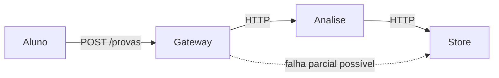
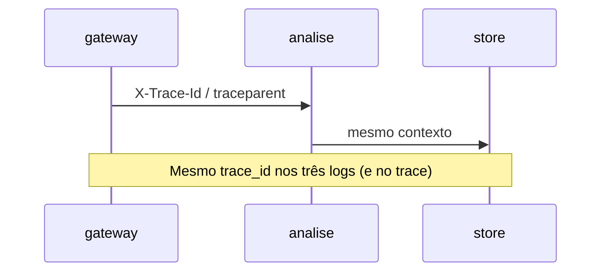

# Teoria — Observabilidade em sistemas distribuídos

**Módulo:** [09 — Observabilidade](README.md)  
**Leitura sugerida:** antes do lab.  
**Objetivo:** montar o modelo mental; o lab *confirma* o modelo, não o substitui.

---

## 1. O ponto de partida

Em um sistema distribuído, os componentes são **processos** em máquinas (ou containers) diferentes que:

- **não** compartilham a memória da aplicação;
- só se coordenam **trocando mensagens**;
- podem falhar **parcialmente** (um hop cai, os outros continuam).

Quando o aluno reclama “minha prova ficou travada”, o sintoma aparece na borda (gateway), mas a causa pode estar no miolo (análise) ou no store. Olhar o log de **um** container é como diagnosticar um acidente olhando só um cruzamento.



> **Para lembrar:** observabilidade em SD ≈ transformar o comportamento interno em **sinais** que permitem responder *está bem? onde quebrou? por quê?* sem SSH em cada nó.

---

## 2. Monitoramento ≠ observabilidade

| | **Monitoramento** | **Observabilidade** |
|--|-------------------|---------------------|
| Pergunta típica | O disco passou de 80%? O `/health` está 200? | Por que *este* request do aluno X demorou 12s? |
| Dados | Séries e limiares definidos **antes** | Exploração com alta dimensionalidade |
| Escopo típico | Condições que você **já imaginou** medir (capacidade, “está no ar?”) | Também o que você **ainda não previu** (“só o campus B?”, “só este PDF?”) |
| Ação típica | Dashboard + alerta | Investigar a partir de um evento |

> **Vocabulário:** em textos de SRE fala-se em *known unknowns* (sei que pode falhar, mas não o detalhe) vs *unknown unknowns* (não tinha nem o painel). O ponto prático: monitoramento cuida do previsto; observabilidade ajuda no imprevisto.

Monitoramento continua essencial. Observabilidade entra quando o sistema é **complexo demais** para prever todo painel — típico de microserviços.

> **Pare e pense:** o `GET /health` do gateway pode estar 200 enquanto o `POST /provas` falha no miolo. Isso é monitoramento “verde” com negócio quebrado — o lab de erro injetado mostra exatamente isso.

Fonte: *Observability Engineering* (caps. 1–2, 9).

---

## 3. Três sinais (e três perguntas)

| Sinal | Pergunta que responde bem | Limite |
|-------|---------------------------|--------|
| **Métrica** | A tendência está piorando? (RPS, p95, taxa de erro) | Pouco contexto por request; cardinalidade alta dói |
| **Log** | O que aconteceu *neste* evento, com detalhe? | Sem ID comum = ruído em N nós |
| **Trace** | Por quais hops o request passou e onde o tempo foi? | Custo de armazenamento; amostragem |

Não trate como “três pilares iguais”: são ferramentas com **custos e perguntas diferentes**. Fluxo maduro: métrica indica anomalia → trace localiza o hop → log explica o detalhe.

---

## 4. Eventos estruturados

Log em texto livre (`Erro ao gravar prova`) é legível para humanos e **ruim** para máquina. Evento estruturado (JSON) carrega campos estáveis:

```json
{
  "ts": "2026-08-25T12:00:01Z",
  "level": "INFO",
  "service": "gateway",
  "trace_id": "a1b2c3…",
  "msg": "prova aceita",
  "submission_id": "42",
  "aluno": "aluno-01"
}
```

Campos úteis no debug: `trace_id`, `service`, `route`, `status_code`, `duration_ms`, IDs de negócio (`submission_id`).

> **PII / LGPD:** no lab, `aluno` aparece no JSON só para filtrar. Em produção, evite PII em log (ou tokenize/mascare). Observabilidade não autoriza vazar dado pessoal.

Fonte: *Observability Engineering* cap. 5.

---

## 5. Correlação entre hops

Cada request que atravessa gateway → análise → store precisa de um **mesmo identificador** propagado (header HTTP).

| Lab | Como propaga | O que você busca |
|-----|--------------|------------------|
| **A** (logs) | Header didático `X-Trace-Id` | Campo `trace_id` no JSON / Loki |
| **B** (APM) | **W3C Trace Context** (`traceparent`) via OpenTelemetry | Mesmo `trace_id` hex no JSON **e** no Tempo |

É o **mesmo conceito** (contexto atravessa hops). O lab A simplifica o header; o lab B usa o padrão da indústria. Sem propagação, cada serviço gera IDs próprios — três histórias que não se encaixam.



> **Pare e pense:** se só o gateway propaga e a análise “esquece”, o store vira órfão de correlação — igual ao Exp. sem propagação.

---

## 6. Agregador de logs

Com N réplicas e N serviços, `docker logs` em cada container **não escala**. Pipeline **neste lab** (didático):

```text
App → arquivo JSON no volume  →  Promtail  →  Loki  →  Grafana Explore
       (também imprime no stdout)
```

Em **produção**, o padrão mais comum é **stdout** → agente/driver (ou Collector) → agregador — sem depender de volume compartilhado entre pods. O volume aqui só facilita o Compose.

| Opção | Quando citar |
|-------|----------------|
| Loki | Lab e stacks Grafana |
| ELK / OpenSearch | Muito volume, busca full-text pesada |
| CloudWatch / etc. | Cloud managed |

O agregador **não substitui** estrutura + correlação: lixo padronizado continua lixo, só que centralizado.

---

## 7. Tracing distribuído

Um **trace** é a história de um request. Cada unidade de trabalho é um **span** (nome, início/fim, pai, atributos, status).

```text
POST /provas                    (gateway)     820ms
 └─ analisar                    (analise)     780ms   ← culpado
     └─ persistir               (store)        15ms
```

**Amostragem:** guardar 100% dos traces é caro em produção; amostrar (ex.: 1–10%) reduz custo e ainda permite investigações, com o risco de perder traces raros. No lab usamos ~100% de propósito (QPS baixo). Em produção, logs com `trace_id` ajudam a recuperar casos quentes mesmo com sampling.

Fonte: *Observability Engineering* caps. 6–7.

---

## 8. Métricas e cardinalidade

Métricas são séries temporais com **labels** (`service=gateway`, `route=/provas`, `status=500`).

**Cardinalidade** = quantas combinações de labels existem. Label com `aluno_id` ou `trace_id` em métrica explode memória/custo do Prometheus.

> **Pare e pense:** 10 mil alunos × 5 rotas × 4 status ≈ dezenas de milhares de séries só nessa métrica. O Prometheus não foi feito para “gráfico por aluno”.

Regra prática:

- métrica → labels de **baixa** cardinalidade (serviço, rota, código);
- detalhe por usuário/request → **log** ou **trace**.

---

## 9. Golden Signals e RED

**Golden Signals** (SRE): latência, tráfego, erros, **saturação**.  
**RED** (microserviços): Rate, Errors, Duration — encaixa bem em APIs HTTP.

| No lab B | Na teoria / devops |
|----------|-------------------|
| Dashboard **RED** (RPS, erros, p95) | Saturação (fila, CPU, conexões) — citar; aprofundar em [`devops/08`](../../devops/08-observabilidade/) |

**USE** (Utilization, Saturation, Errors) foca recursos do host — complementar ao RED da app.

---

## 10. APM (Application Performance Monitoring)

**APM** é a disciplina/produto de acompanhar **performance e erros da aplicação**: throughput, latência, taxa de erro, dependências, traces por transação.

| No lab (open source) | Em produção (mapa mental) |
|----------------------|---------------------------|
| Grafana + Prometheus + Tempo (+ Loki) | Datadog, New Relic, Elastic APM, Dynatrace |
| Instrumentação **OpenTelemetry** | Mesmo padrão; o *backend* muda |

> **Disclaimer:** o Grafana do lab B é um **console APM didático** — fatia do que produtos comerciais empacotam (UX, service map rico, RUM no browser, profiling contínuo, retenção, IA). Não é “falso APM”; é APM enxuto o bastante para o Compose da faculdade.

---

## 11. SLI / SLO (conceito)

- **SLI** — indicador (ex.: % de `POST /provas` < 2s).  
- **SLO** — meta (ex.: 99% no mês).  
- **Error budget** — quanto de falha ainda “cabe” antes de frear features.

Alertar só em CPU costuma gerar fadiga; alertar em **quebra de experiência do usuário** (SLO) é o caminho maduro. Este módulo **não** monta Alertmanager — isso aprofunda em [`devops/08`](../../devops/08-observabilidade/).

---

## 12. OpenTelemetry

**OpenTelemetry (OTel)** padroniza *como* a app emite métricas, logs e traces (**OTLP**). O backend (Tempo, Jaeger, Datadog…) é plugável.

**Neste lab B (simplificação explícita):**

- **Traces** → SDK OTel → OTLP HTTP → Tempo  
- **Métricas** → `prometheus_client` em `/metrics` (Prometheus faz pull) — *não* via OTLP  
- **Sampling** → `OTEL_SAMPLE_RATIO` (`ParentBasedTraceIdRatio`); padrão `1.0` no lab; Exp. de sampling baixa para `0.2`

**Auto-instrumentation (produção):** bibliotecas OTel “embrulham” frameworks (Flask/FastAPI, HTTP clients, DB) e criam spans **sem** você escrever cada `start_as_current_span`. No lab os spans são **manuais** de propósito — você enxerga o contrato. Em produto: comece com auto + acrescente spans de negócio.

Ponte com [06](../06-falhas-timeout/): retries geram **vários spans** no mesmo trace (lab B Exp. 7 — `chamar_analise_tentativa_N`). A correlação mostra o **custo** do retry; idempotência evita efeito colateral.

---

## 13. Ponte com a trilha

| Módulo | Ligação |
|--------|---------|
| [01](../01-comunicacao/) | Vários hops — sem correlação, debug impossível |
| [05](../05-escalabilidade/) | N réplicas multiplicam fontes de log |
| [06](../06-falhas-timeout/) | Timeout/retry: traces mostram tentativas e latência |
| [08](../08-armazenamento-arquivos/) | Falha parcial blob/meta — logs/traces mostram *em qual passo* parou |

---

## 14. O que este módulo *não* cobre

| Tópico | Onde vai |
|--------|----------|
| kube-prometheus-stack, Helm, Alertmanager | [`devops/08`](../../devops/08-observabilidade/) |
| PromQL / LogQL avançados, burn alerts, saturação em profundidade | devops |
| Postmortem e cultura on-call | devops |
| Profiling contínuo (Pyroscope), eBPF, RUM | fora de escopo |

---

## Para levar ao lab

1. Sem `trace_id` comum, agregador só centraliza confusão.  
2. Métrica vê tendência; trace vê caminho; log vê detalhe.  
3. APM no lab = Grafana unificando os três sinais (fatia didática).  
4. Cardinalidade alta em métrica é armadilha clássica.  
5. `/health` verde ≠ negócio ok.  
6. Observabilidade é requisito de SD — não “extra de DevOps”.
