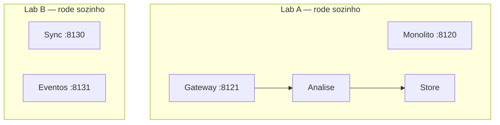

# 10 — Arquitetura de sistemas distribuídos

**Conceito central:** escolher (e justificar) um **estilo de arquitetura** — e o que se paga por ele — em vez de só encaixar um mecanismo (fila, réplica, cache…).  
**Domínio âncora:** portal acadêmico — aluno envia prova → análise → persistência (mesmo arco do [01](../01-comunicacao/) / [09](../09-observabilidade/)).  
**Stack:** Python 3 · Docker Compose · Redis (lab B)

> **Contrato com o [01](../01-comunicacao/):** lá você aprende *como* fila/RPC funcionam; aqui você decide *se* a topologia sync ou a eventos (e com monólito ou serviços) cabe no problema.

Pré-requisitos: [00 — Ambiente Docker](../00-ambiente-docker/). Mínimo: [01](../01-comunicacao/) · [03](../03-consistencia-cap/) · [05](../05-escalabilidade/). Completo: 01–07 (+ [09](../09-observabilidade/) se o workshop pedir diagnóstico).  
Apoio: [glossario.md](glossario.md) · [troubleshooting.md](troubleshooting.md)

> **Gabarito:** [decisoes-gabarito.md](decisoes-gabarito.md) — só **depois** de [decisoes.md](decisoes.md).

---

## Objetivos de aprendizado

1. **Reconhecer** estilos de referência: cliente–servidor/n-tier, monólito em camadas, SOA, microsserviços, orientada a eventos, peer-to-peer (contraste).
2. **Distinguir** cliente–servidor, n-tier e monólito layered (perguntas diferentes).
3. **Comparar** vantagens, desvantagens e complexidade operacional (incl. escala seletiva e dados).
4. **Indicar** cenários de uso (quando sim / quando não) no domínio do portal.
5. **Relacionar** estilos aos módulos 01–09.
6. **Observar** isolamento de **processo**: monólito vs pipeline de serviços (lab A) — sem confundir com MS completo.
7. **Observar** acoplamento temporal: cadeia síncrona vs eventos (lab B).
8. **Decidir** estilo (ou híbrido) com evidência — e esboçar uma síntese capstone.

> Meta: *“Qual arquitetura cabe neste problema — e o que eu pago por ela?”*

---

## Caminhos de estudo

### Caminho mínimo (~5 h; +20–30 min na 1ª build)

Fecha objetivos **1–6** e **8** (parcial: cenários 1, 2, 6). Lab B e síntese completa ficam para o caminho completo.

1. [teoria.md](teoria.md) — **sumário (1 linha/estilo)** + **§1–6** (~35 min)  
2. [teoria.md](teoria.md) **§7** — **cola rápida** (~3 min): só o quadro *Quando sim / Quando não* (P2P como contraste)  
3. [teoria.md](teoria.md) **§9** — **cola rápida** (~5 min): matriz para revisar *depois* do lab A; não decore  
4. [tutorial-monolito-vs-servicos.md](tutorial-monolito-vs-servicos.md) (Partes A–C; Exp. 3 opcional)  
5. [decisoes.md](decisoes.md) — cenários **1**, **2** e **6** (+ modelo de resposta)  
6. Checklist **mínimo** abaixo  

> §8 (Hard Parts) e leitura integral de §7/§9: **caminho completo** ou consulta no workshop.

**Pré-requisitos no host:** `curl`, `python3`, Docker Compose ([00](../00-ambiente-docker/)).

### Caminho completo (~9–11 h) — recomendado

| Ordem | Material | Tempo | Para quê |
|-------|----------|-------|----------|
| 1 | [teoria.md](teoria.md) | ~50–60 min | Vinheta, escada, seis estilos, Hard Parts |
| 2 | [tutorial-monolito-vs-servicos.md](tutorial-monolito-vs-servicos.md) | ~2 h | Isolamento de processo |
| 3 | [tutorial-sync-vs-eventos.md](tutorial-sync-vs-eventos.md) | ~2 h | Topologia sync vs EDA (+ fan-out) |
| 4 | [decisoes.md](decisoes.md) | ~45–60 min | Seis cenários |
| 5 | Exercício de síntese em [decisoes.md](decisoes.md) | ~20 min | Estilo + 2 mecanismos da trilha |
| 6 | [tecnologias-e-escolhas.md](tecnologias-e-escolhas.md) | ~15 min | Cola estilo ↔ curso |

Cada tutorial: **A** tecnologia → **B** contexto → **C** lab.

---

## Arco narrativo

1. **Dor** — “vamos de microsserviços?” sem critério; ou monólito que cresceu demais.  
2. **Mapa** — vinheta do portal + escada de evolução + estilos.  
3. **Lab A** — monólito modular vs pipeline de 3 processos; **kill** da análise.  
4. **Lab B** — mesma borda: cadeia sync vs fila; worker parado + fan-out.  
5. **Trade-offs** — granularidade, dados, orquestração/coreografia.  
6. **Fechamento** — [decisoes.md](decisoes.md) + síntese.

Os labs são **Compose separados** (não um único sistema com quatro bordas):



---

## Mapa dos 2 labs

| Lab | Pergunta central | Objetivos |
|-----|------------------|-----------|
| [lab-monolito-vs-servicos](lab-monolito-vs-servicos/) | Se a análise cair, o portal inteiro some? | 1, 5, 6, 8 |
| [lab-sync-vs-eventos](lab-sync-vs-eventos/) | Worker parado: a borda ainda aceita? | 1, 5, 7, 8 |

**Um lab por vez.** `docker compose down -v` antes de trocar. Ver [troubleshooting.md](troubleshooting.md).

```bash
cd sistemas-distribuidos/10-arquitetura/lab-monolito-vs-servicos && ./scripts/up.sh
# … depois:
cd ../lab-sync-vs-eventos && ./scripts/up.sh
```

| Lab | Portas | Ideia |
|-----|--------|-------|
| **A** | monólito `8120` · gateway `8121` · análise `8122` | Kill análise; health na borda |
| **B** | sync `8130` · eventos `8131` · Redis `6381` | Sync falha na borda; eventos aceitam + fan-out |

---

## Checklist — pronto?

### Mínimo

- [ ] Distingo C–S, n-tier e monólito; cito 1 vantagem + 1 custo dos estilos do caminho mínimo (incl. P2P em 1 linha: quando *não*).  
- [ ] Explico por que o lab A **não** é MS completo.  
- [ ] Rodei lab A: monólito parado ≠ gateway vivo com análise down.  
- [ ] Justifiquei MVP (cenário 1) vs times (cenário 2) vs moda (cenário 6).  

### Completo

- [ ] Lab B: medi latência sync vs eventos; vi fan-out; sei o limite do pub/sub Redis.  
- [ ] Relaciono EDA ao [01](../01-comunicacao/) e consistência eventual ao [03](../03-consistencia-cap/).  
- [ ] Completei os 6 cenários + **exercício de síntese** ([decisoes.md](decisoes.md#exercício-de-síntese-caminho-completo)).

---

## Ponte com outros módulos

| De onde veio | Para onde vai |
|--------------|---------------|
| [01](../01-comunicacao/) mecanismos sync/async | Estilo EDA e híbridos (escolha) |
| [03](../03-consistencia-cap/) / [05](../05-escalabilidade/) | Dados e camadas sob MS |
| [06](../06-falhas-timeout/) / [09](../09-observabilidade/) | Taxa distribuída |
| Este módulo | Capstone — compõe a trilha |

---

## Bibliografia (`books/`)

| Fonte | Uso neste módulo |
|-------|------------------|
| Richards & Ford, *Fundamentals of Software Architecture* | Estilos (Part II) + escolha (Ch. 18) |
| Richards, *Software Architecture Patterns* (report) | Ratings lado a lado |
| van Steen & Tanenbaum, *Distributed Systems* | Ch. 2 — centralizado, P2P, híbridos |
| Ingeno, *Software Architect’s Handbook* | Ch. 7–8 — adv/desadv |
| Ford et al., *The Hard Parts* | Granularidade, dados, orquestração/coreografia |
| Bellemare, *Building Event-Driven Microservices* | Taxa sync MS vs EDM |
| Alex Xu, *System Design Interview* | Escada de evolução (Ch. 1) |
