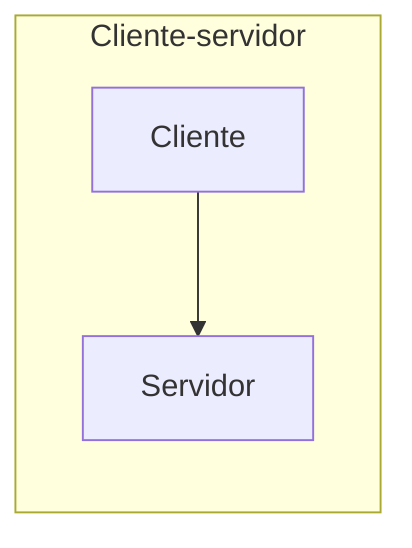
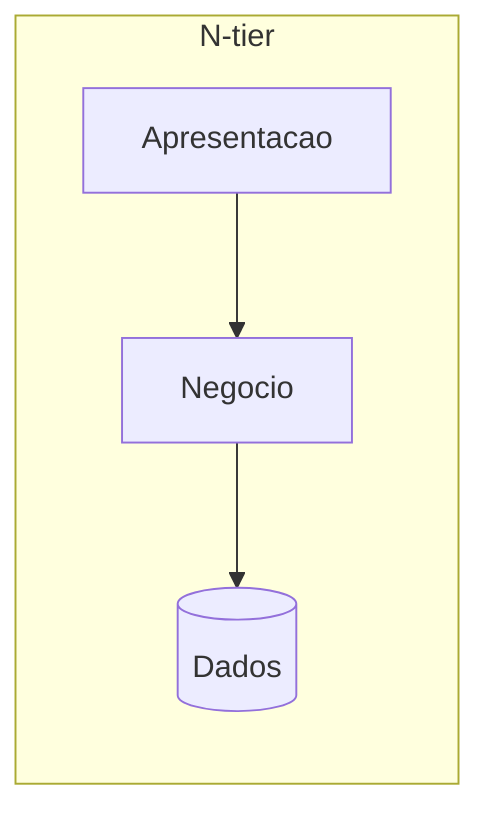
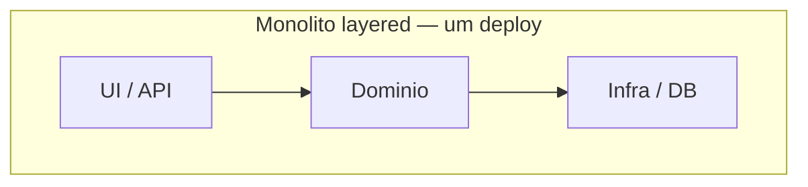
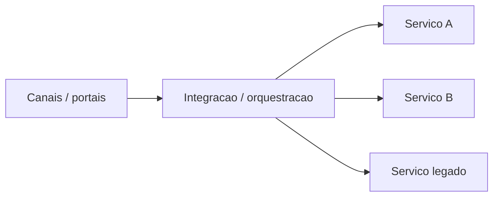
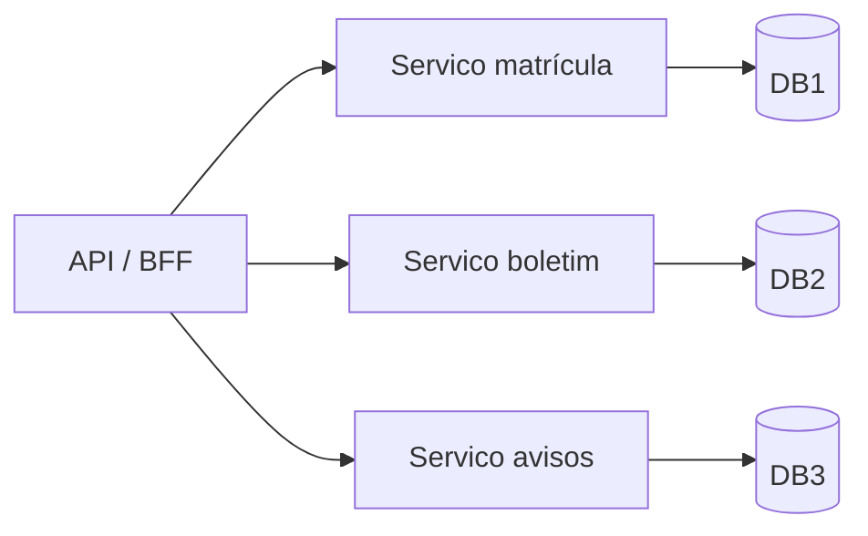
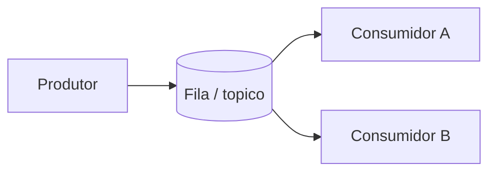
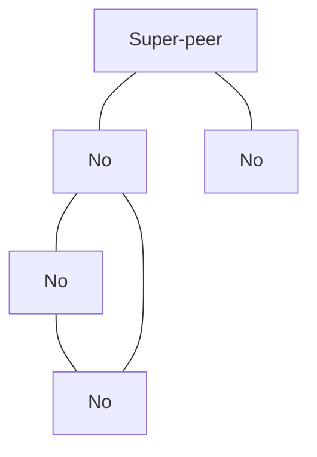
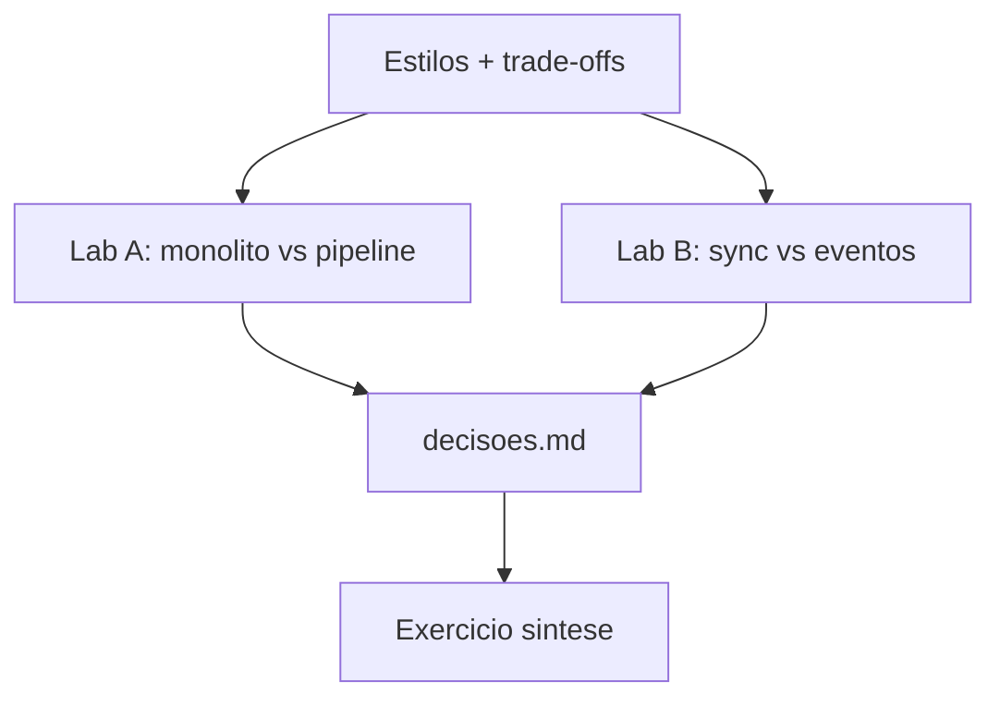

# Teoria — Arquitetura de sistemas distribuídos

**Módulo:** [10 — Arquitetura](README.md)  
**Leitura:** ~50–60 min · depois vá aos labs

> Arquitetura aqui = **estilo de composição** (como se cortam e conectam as partes), não a lista de ferramentas.  
> **01 ensina o mecanismo** (fila, gRPC…); **este módulo pergunta qual desenho** e *por quê*.

### Sumário — 1 linha por estilo

| Estilo | Em uma frase |
|--------|----------------|
| **Cliente–servidor / n-tier** | Quem pede / quem atende; camadas podem morar em processos distintos. |
| **Monólito layered** | Um deployável; camadas *internas*; bom para MVP. |
| **SOA / integração** | Reuso + contratos entre sistemas (legado); ESB é opcional. |
| **Microsserviços** | Deploy e dados independentes — não “N containers”. |
| **EDA** | Reagir a fatos (fila/tópico); desacopla no *tempo*. |
| **P2P** | Nós iguais / pouco centro; raro como núcleo de notas. |
| **Service-based** | Poucos serviços “grossos” — degrau na escada (§1). |

---

## 1. Por que um capítulo de arquitetura no fim — vinheta do portal

Nos módulos anteriores você praticou **mecanismos**: fila, réplica, CAP, lock, escala por camada, timeout, cache, object storage, traces.

Imagine o **portal acadêmico** em três momentos:

1. **MVP** — um time, entrega de trabalhos, domínio muda toda semana.  
2. **Crescimento** — quatro times (matrícula, boletim, avisos, biblioteca) querem soltar versão sem esperar uns aos outros; no fim do bimestre o boletim explode.  
3. **Prazo** — 23h59, centenas de envios; a análise antplágio leva segundos; o aluno precisa de **recibo**, não do parecer na hora.

A pergunta deste módulo:

> *Como organizo as partes — e o que isso implica em falha, deploy, consistência e operação?*

Não existe estilo “certo”. Existe estilo **adequado ao contexto** (tamanho do time, carga, maturidade ops, necessidade de deploy independente). Fontes em `books/` tratam isso como **trade-off analysis**, não como moda.

### Escada de evolução (cola mental)

Suba o degrau quando **time, deploy ou dados** pedirem — não porque o slide da consultoria pediu (cenário 6). Xu Ch. 1 e FSA Ch. 18 descrevem a mesma ideia: evoluir sob pressão mensurável.

---

## 2. Três ideias que o aluno mistura: C–S, n-tier, monólito

| Conceito | Pergunta que responde | Exemplo no portal |
|----------|----------------------|-------------------|
| **Cliente–servidor** | Quem pede / quem atende? | Browser → API |
| **N-tier** | Em quantos *processos/máquinas* corto apresentação / negócio / dados? | UI · API · banco em hosts distintos |
| **Monólito layered** | Quantos *deployáveis*? (aqui: **um**) | Um artefato com camadas *internas* API→domínio→DB |

- Quase todo portal web **é** cliente–servidor.  
- Pode ser monólito **ou** vários serviços e ainda assim ser C–S na borda.  
- N-tier descreve *onde rodam* as camadas; monólito descreve *quantos artefatos você publica*.

| | Cliente–servidor / n-tier |
|--|--|
| **Vantagens** | Modelo mental simples; contratos HTTP claros; base de APIs e CRUD |
| **Desvantagens** | Servidor (ou uma camada) vira gargalo/SPOF se não escalar; request síncrona acopla no tempo |
| **Quando sim** | APIs, portais, MVP |
| **Quando não** | Precisa descentralização forte (sem “servidor dono”) → §7 P2P |
| **Ponte** | Toda a trilha; escala da app em [05](../05-escalabilidade/) |

---

## 3. Monólito em camadas (layered)

**Ideia:** um **deployável** coeso com camadas internas. Ponto de partida natural (Richards; Handbook).

| | |
|--|--|
| **Vantagens** | Desenvolvimento e teste simples; transações locais; um pipeline de deploy; baixa **taxa distribuída** (rede/ops) |
| **Desvantagens** | Escala e falha são do **conjunto**; deploy acoplado; risco de “bola de lama” se os limites internos sumirem |
| **Quando sim** | Time pequeno, domínio instável, carga moderada, ops enxuta — vinheta **MVP** |
| **Quando não** | Times com ritmos de deploy muito diferentes **e** fronteiras já estáveis |
| **Ponte** | Lab A — um processo com arquivos `app.py` + `analise_mod.py` + `store_mod.py` |

**Monólito ≠ código ruim.** Monólito *modular* (limites claros no código) é válido; o problema é o monólito *acidental* sem fronteiras.

---

## 4. SOA (orientação a serviços)

**Ideia:** serviços de negócio reutilizáveis e **integração explícita** entre sistemas (FSA Ch. 16; Handbook). Histórico: integração empresarial antes da onda de microsserviços.

**Implementação ≠ estilo.** SOA pode usar um ESB clássico — ou contratos + API gateway / adaptadores. O estilo é *reuso e integração*; o ESB é *uma* forma (e pode virar SPOF / “SOA theater”: slides de SOA sem fronteiras reais).

**Anti-corruption layer (ACL):** ao falar com legado (ERP), isole o modelo do portal atrás de um adaptador — o legado não dita a linguagem interna do portal.

| | |
|--|--|
| **Vantagens** | Reuso entre canais; integração de legados; contratos compartilhados |
| **Desvantagens** | Orquestração central pode virar gargalo; governança pesada; ESB como SPOF |
| **Quando sim** | Vinheta **institucional**: ERP + secretaria + biblioteca |
| **Quando não** | Time pequeno sem legado; só quer “quebrar o monólito” — MS ou service-based bastam |
| **Ponte** | Cenário 4 do workshop; orquestração vs coreografia no §8 |

---

## 5. Microsserviços

**Ideia:** serviços **pequenos o suficiente** para serem implantados de forma independente, em geral com **dados próprios** (FSA Ch. 17; Hard Parts). Não é “muitos containers”: é **independência de mudança**.

| | |
|--|--|
| **Vantagens** | Deploy e escala seletivos; isolamento de falha (se bem desenhado); times alinhados a *bounded contexts* (fronteira de modelo/linguagem — ex.: “matrícula” ≠ “boletim”) |
| **Desvantagens** | Rede, timeouts, dados distribuídos, observabilidade, granularidade errada — a **taxa distribuída** (Bellemare; Hard Parts) |
| **Quando sim** | Vinheta **quatro times** / deploys desacoplados / cargas muito diferentes |
| **Quando não** | MVP, um time, domínio líquido, ops sem capacidade de operar N serviços ([cenário 6](decisoes.md)) |
| **Ponte** | Lab A mostra só **isolamento de processo** (aproximação didática) — ver box no tutorial; [06](../06-falhas-timeout/) · [09](../09-observabilidade/) |

**Service-based (callout):** FSA Ch. 13 — poucos serviços **grossos**. Meio-termo na escada (§1).

> **Lab A ≠ microsserviço completo.** Três containers HTTP **sem** DB próprio nem deploy/CI por serviço demonstram fronteira de *processo* e falha parcial — não ownership de dados nem independência de release.

---

## 6. Orientada a eventos (EDA)

**Ideia:** componentes reagem a **fatos** (mensagens/eventos), não só a RPC síncrono. Ver [01](../01-comunicacao/).

| | |
|--|--|
| **Vantagens** | Desacoplamento temporal; absorver pico; fan-out sem mudar o produtor; escala de consumidores |
| **Desvantagens** | Status eventual; ordem/idempotência; depuração e rastreio mais difíceis; consistência entre vistas |
| **Quando sim** | Vinheta **prazo** — recibo rápido, análise depois; vários interessados no mesmo fato |
| **Quando não** | Usuário precisa do resultado completo na mesma request; time não opera broker |
| **Ponte** | Lab B; filas/Kafka no 01; CAP/eventual no 03 |

EDA **combina** com monólito (monólito + fila) ou com microsserviços (coreografia). Estilo de *interação*, não só de *particionamento*.

---

## 7. Peer-to-peer (contraste — sem lab)

> **Caminho mínimo:** leia só o quadro *Quando sim / Quando não* abaixo (~3 min). DHT/super-peer são contexto para o cenário 5.

**Ideia (Tanenbaum Ch. 2):** nós são clientes **e** servidores; pouco ou nenhum centro obrigatório.

- **Não estruturado:** busca por flooding / random walk (barato de implementar, caro em tráfego).  
- **Estruturado (DHT):** cada chave tem “dono” lógico na rede (melhor busca; mais estado).  
- **Híbrido:** *super-peers* concentram índice/roteamento (diagrama acima).

| | |
|--|--|
| **Vantagens** | Sem SPOF clássico de um único servidor; escala de participantes |
| **Desvantagens** | Churn, confiança, segurança e UX; instituição costuma querer centro auditável |
| **Quando sim** | Compartilhamento descentralizado de arquivos / alguns designs edge |
| **Quando não** | Núcleo de notas/matrícula — você **quer** autoridade central |
| **Ponte** | Workshop cenário 5; arquivos no curso → [08](../08-armazenamento-arquivos/) (object storage), não P2P |

---

## 8. Decisões transversais (Hard Parts)

| Decisão | Pergunta | Se errar… |
|---------|----------|-----------|
| **Granularidade** | Cortar por time? por dado? por mudança frequente? | Serviços chatty ou monólito disfarçado |
| **Ownership de dados** | Quem é dono da escrita? | “MS” com um DB compartilhado = monólito distribuído |
| **Orquestração vs coreografia** | Um maestro chama os passos, ou cada um reage a eventos? | Orquestrador SPOF / coreografia opaca sem observabilidade |
| **Sync vs async** | A borda precisa esperar o fim? | Travamento no pico (sync) ou status confuso (async) |
| **ACL / legado** | O modelo externo invade o portal? | Acoplamento ao ERP eterno |

**Serverless (callout):** FaaS/BaaS — escala por evento; cold start, vendor lock-in, observabilidade. Menção, não lab.

---

## 9. Matriz rápida (cola de sala)

> **Caminho mínimo:** use como **cola** após o lab A — compare com sua escolha nos cenários 1/2/6. Ratings são **qualitativos para discussão em sala**, não métricas formais (SAP/FSA usam eixos parecidos, mas com critérios do produto).

Ratings: **B** baixo · **M** médio · **A** alto (complexidade ou capacidade — leia a coluna).

| Estilo | Deploy indep. | Isolamento falha | Escala seletiva | Complexidade dados | Ops | Caso típico portal |
|--------|---------------|------------------|-----------------|--------------------|-----|--------------------|
| Cliente–servidor / n-tier | B–M | M | M | B | B–M | API + DB |
| Monólito layered | B | B entre módulos | B | B | B | MVP entrega |
| SOA / integração | M | M (orquestrador crítico) | M | M–A | A | Legados |
| Microsserviços | A | A *se* fronteiras boas | A | A | A | Vários times |
| EDA | M–A | Bom no *tempo* | A (consumidores) | M–A | M–A | Pico de envio |
| P2P | Nós iguais | Sem centro único | A participantes | Especial | Especial | Raro como núcleo |

---

## 10. Mapa mental → labs + síntese

| Lab | O que prova | O que **não** prova |
|-----|-------------|---------------------|
| **A** | Isolamento: análise down — monólito some; nos serviços a borda ainda tem health | Deploy independente, DB por serviço, CI por time |
| **B** | Acoplamento temporal + fan-out | Broker maduro (Kafka/SQS), DLQ, ordering garantido |

Leia [tecnologias-e-escolhas.md](tecnologias-e-escolhas.md) no workshop. Próximo: [tutorial-monolito-vs-servicos.md](tutorial-monolito-vs-servicos.md).

---

## Referências (para aprofundar)

- Richards & Ford — *Fundamentals of Software Architecture*, Part II + Ch. 18  
- Richards — *Software Architecture Patterns* (O’Reilly report)  
- van Steen & Tanenbaum — *Distributed Systems*, Ch. 2  
- Ingeno — *Software Architect’s Handbook*, Ch. 7–8  
- Ford et al. — *Software Architecture: The Hard Parts*  
- Bellemare — *Building Event-Driven Microservices*, Ch. 1  
- Xu — *System Design Interview*, Ch. 1  
