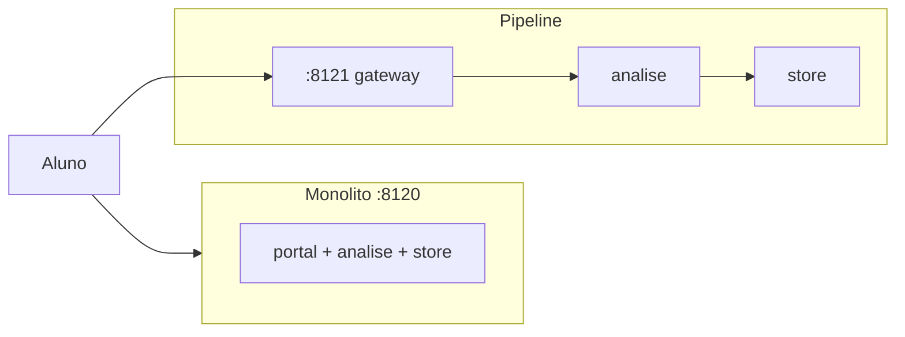

# Tutorial — Lab A: monólito vs pipeline de serviços

**Módulo:** [10 — Arquitetura](README.md) · **Lab:** [lab-monolito-vs-servicos/](lab-monolito-vs-servicos/)  
**Tempo sugerido:** tecnologia 10–15 min + lab 90–120 min  
**Pré-requisito:** [teoria.md](teoria.md) §1–5 · [00](../00-ambiente-docker/)  
**Apoio:** [glossario.md](glossario.md) · [troubleshooting.md](troubleshooting.md)  
**SO:** Linux, macOS e Windows — [como rodar os comandos](../ferramentas/linux-e-windows.md).  
**Próximo:** [tutorial-sync-vs-eventos.md](tutorial-sync-vs-eventos.md)

> Leia A e B *antes* do Compose. No lab: rode → observe → anote.

**Protagonista:** o **aluno** envia a prova; a coordenação precisa que a **borda** continue pelo menos *respondendo* (health / erro claro) se a análise falhar.

---

## Parte A — A tecnologia: um deployável vs vários processos

### Em uma frase

**Monólito:** um processo com módulos em arquivos distintos (`app.py` / portal, `analise_mod.py`, `store_mod.py`) — fronteira de *código*, um deployável.  
**Pipeline de serviços:** cada hop é um container; a borda chama o miolo por HTTP.

### Box — o que falta para ser microsserviço “de verdade”

| Já vemos no lab A | Ainda **não** (MS completo) |
|-------------------|-----------------------------|
| Fronteira de **processo** | DB/schema **próprio** por serviço |
| Isolamento de **falha** (kill de um hop) | **Deploy/CI** independente por time |
| Custo de rede entre hops | Ownership de dados / sagas |

Use o termo **pipeline de serviços** (ou “serviços didáticos”). Na teoria §5, microsserviços = independência de *mudança* + dados — não “N containers”.

### Vantagens / custos (lembrete)

| | Monólito | Pipeline de serviços |
|--|----------|----------------------|
| **Ganha** | Simplicidade, transação local, um health | Isolar falha/escala do hop; reparar análise sem derrubar a borda |
| **Paga** | Queda de um módulo = queda do processo | Rede, timeouts, mais ops — **taxa distribuída** ([06](../06-falhas-timeout/), [09](../09-observabilidade/)) |

### Quando usar (neste lab)

- Monólito: MVP, um time, domínio ainda mudando.  
- Pipeline: quando **precisar** que a borda sobreviva à falha do miolo — degrau na escada (§1 teoria), ainda sem MS completo.

---

## Parte B — Contexto de uso



**Pergunta-guia:** se alguém “derrubar a análise”, o que o aluno ainda consegue obter (health, recibo, erro claro)?

---

## Parte C — Lab

### Subir

```bash
cd sistemas-distribuidos/10-arquitetura/lab-monolito-vs-servicos
./scripts/up.sh
./scripts/status.sh
```

### Exp. 1 — Request feliz nos dois modos

```bash
./scripts/enviar.sh mono
./scripts/enviar.sh servicos
```

**Observe:** ambos retornam `201` com `submission_id` e `modo` diferente.  
**Interprete:** o *contrato na borda* pode ser o mesmo; a *topologia* por trás muda.

### Exp. 2 — Isolamento de falha (o insight do lab)

```bash
./scripts/provar-isolamento.sh
```

Ou manualmente:

```bash
./scripts/kill-analise.sh
curl -s http://127.0.0.1:8121/health | python3 -m json.tool   # ainda 200
./scripts/enviar.sh servicos                                   # POST falha
curl -s http://127.0.0.1:8120/health | python3 -m json.tool   # monólito ok

./scripts/up.sh   # restaura
./scripts/kill-monolito.sh
curl -s -o /dev/null -w "%{http_code}\n" http://127.0.0.1:8120/health  # 000
curl -s http://127.0.0.1:8121/health | python3 -m json.tool            # pipeline ok
./scripts/up.sh
```

**Observe:** com análise down, o **gateway ainda tem health**; com monólito down, **some tudo** daquele modo.  
**Interprete:** isolamento ≠ “nunca falha o POST” — o POST ainda depende da análise. O ganho é **não perder a borda** (e poder reparar o hop). No monólito, “matar a análise” = matar o processo (mesmo com módulos nomeados no código).

### Exp. 3 — Delay na análise (opcional)

Útil se quiser amarrar ao [09](../09-observabilidade/) (hop explícito). Não é necessário para o checklist mínimo.

```bash
./scripts/provar-delay-borda.sh 3000
```

**Observe:** no pipeline, `health` do gateway responde **enquanto** o POST espera a análise; no monólito o mesmo processo atende tudo — o health pode esperar junto.  
**Interprete:** o tempo “mora” no hop análise; deploy/escala do monólito ainda são do **conjunto**.

### Exercício rápido — ownership (2 min, papel)

Sem Compose: para **matrícula** e **boletim**, anote quem **escreve** e quem **só lê** em:

1. Monólito com um Postgres.  
2. Pipeline do lab A (store compartilhado).  
3. Microsserviços “de verdade” (teoria §5 box).

Compare com o cenário 2 de [decisoes.md](decisoes.md).

### Fechamento

Anote 3 linhas para [decisoes.md](decisoes.md):

1. Quando o monólito ainda é a escolha certa?  
2. O que você **paga** ao abrir 3 processos?  
3. Isolamento de processo resolve sozinho ownership de dados? (teoria §5 box + §8)

```bash
docker compose down -v
```

---

## Fora deste lab

DB por serviço, saga, service mesh, CI independente — ver teoria. Aqui o alvo é **ver** o contraste monólito × pipeline.
