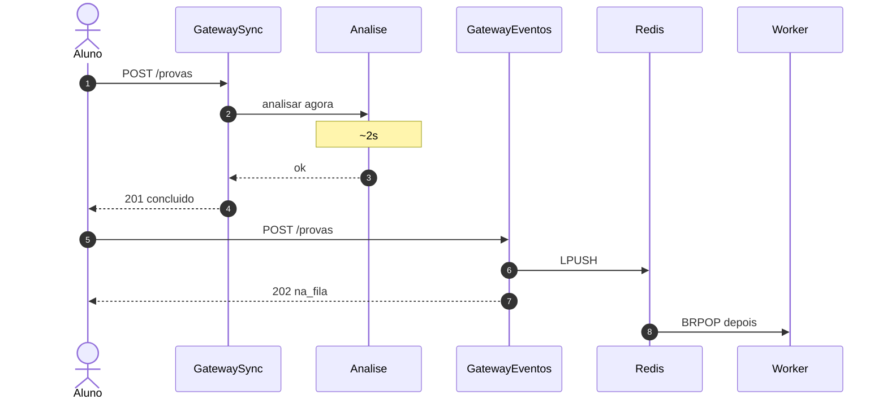

# Tutorial — Lab B: sync vs eventos (escolha de topologia)

**Módulo:** [10 — Arquitetura](README.md) · **Lab:** [lab-sync-vs-eventos/](lab-sync-vs-eventos/)  
**Tempo sugerido:** tecnologia 10–15 min + lab 90–120 min  
**Pré-requisito:** [teoria.md](teoria.md) §6 · ideal [01 — filas](../01-comunicacao/tutorial-filas.md)  
**Apoio:** [glossario.md](glossario.md) · [troubleshooting.md](troubleshooting.md)

> Leia A e B *antes* do Compose. No lab: rode → observe → anote.

**Protagonista:** no prazo, o aluno precisa de **recibo rápido**; a análise pode levar segundos.

### Contrato com o módulo 01

No [01](../01-comunicacao/) você **viu a fila funcionar**. Aqui o foco é de **arquitetura**: colocar a topologia **síncrona** e a **a eventos** lado a lado e decidir *qual desenho* cabe (e se precisa de microsserviços — spoiler: muitas vezes monólito + fila basta).

---

## Parte A — A tecnologia: acoplamento temporal

### Em uma frase

**Sync:** a borda só responde quando a cadeia (análise → store) termina.  
**Eventos:** a borda **enfileira** e responde `202`; workers processam depois; outros consumidores reagem ao fato (fan-out).

### Vantagens / custos

| | Sync | Eventos |
|--|------|---------|
| **Ganha** | Resultado na mesma request; fluxo fácil de seguir | Pico, desacoplamento, fan-out sem mudar o gateway |
| **Paga** | Borda trava se o miolo cair/lentificar | Status eventual; ordem/idempotência; mais peças |

### Broker neste lab

- **Fila:** Redis lista (`LPUSH`/`BRPOP`) — jobs de análise (como no 01).  
- **Fan-out:** Redis **pub/sub** para o notificador.

> **Limite didático do pub/sub:** mensagem só chega a quem está **inscrito na hora**. Se o `notificador` subir *depois* do `POST`, pode **perder** o evento. Em produção costuma-se log/tópico com retenção (Kafka) ou outbox. Se `/notificacoes` vier vazio, confirme que o notificador já estava up (`provar-fanout.sh` faz isso) — ver [troubleshooting](troubleshooting.md).

---

## Parte B — Contexto



**Pergunta-guia (arquitetura):** nos próximos 3 segundos após “Enviar”, o que precisa estar **garantido** — e o que pode ser eventual?

---

## Parte C — Lab

### Subir

```bash
cd sistemas-distribuidos/10-arquitetura/lab-sync-vs-eventos
./scripts/up.sh
./scripts/status.sh
```

### Exp. 1 — Latência na borda

```bash
./scripts/enviar.sh sync
./scripts/enviar.sh eventos
```

**Observe:** sync `time_total` ≈ `ANALISE_SEGUNDOS` (~2s) e status `concluido`; eventos responde em milissegundos com `na_fila`.  
**Interprete:** o trabalho total não sumiu — só saiu do caminho crítico do aluno. Isso é escolha de **topologia**, não “magia de microsserviços”.

### Exp. 2 — Miolo parado (acoplamento temporal)

```bash
./scripts/provar-acoplamento.sh
```

**Observe:** com `analise-sync` e `worker` parados, sync **falha** no POST; eventos ainda devolve `202` e o status fica `na_fila` até o worker voltar.  
**Interprete:** EDA remove o acoplamento *temporal*; não remove a necessidade de processar depois (nem a consistência eventual — [03](../03-consistencia-cap/)).

### Exp. 3 — Fan-out sem mudar o gateway

```bash
./scripts/provar-fanout.sh
```

**Observe:** `/notificacoes` mostra eventos (`prova_enfileirada` / `prova_concluida`) sem o gateway chamar o notificador.  
**Interprete:** coreografia leve — novos interessados assinam o fato; orquestração seria o gateway chamar cada um (teoria §8). Lembre o limite do pub/sub acima.

### Fechamento

Para [decisoes.md](decisoes.md):

1. Em qual cenário do portal você **exige** sync na borda?  
2. Monólito + fila é híbrido válido? (sim — estilo de interação ≠ só partição)  
3. O que a observabilidade ([09](../09-observabilidade/)) precisa quando o fluxo é async?

**Caminho completo:** faça em seguida o [exercício de síntese](decisoes.md#exercício-de-síntese-caminho-completo) em `decisoes.md` (estilo + 2 mecanismos da trilha).

```bash
docker compose down -v
```
